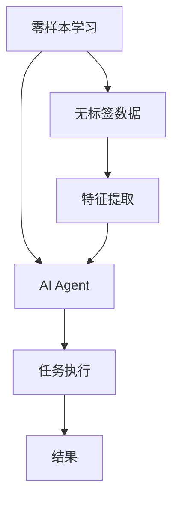
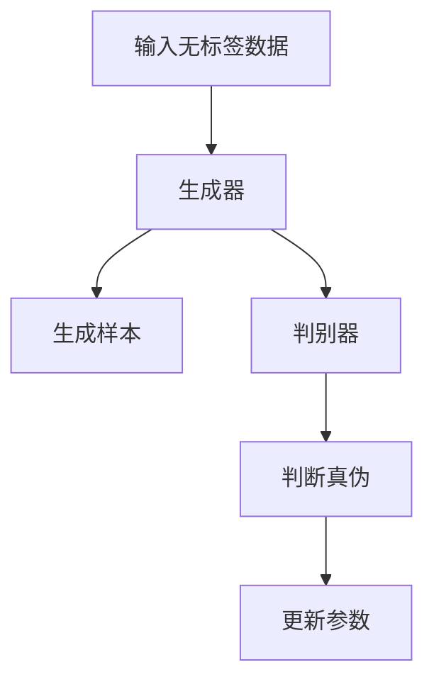
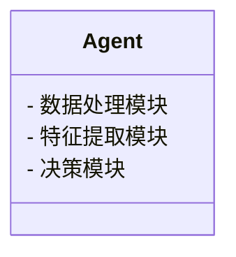

                 


```markdown
# 零样本学习在AI Agent中的应用

> 关键词：零样本学习，AI Agent，机器学习，深度学习，智能体

> 摘要：本文探讨零样本学习在AI Agent中的应用，分析其优势、原理和实现方法，通过具体案例展示其在智能系统中的价值。

---

# 第一部分：零样本学习与AI Agent的背景介绍

## 第1章：零样本学习的定义与优势

### 1.1 零样本学习的定义
- 1.1.1 传统监督学习的局限性：分类任务需要大量标注数据，难以应对新类别。
- 1.1.2 零样本学习的核心概念：利用少量或无标签数据进行分类，依赖通用特征表示。
- 1.1.3 零样本学习的优势与应用场景：减少数据需求，适用于新兴领域和动态环境。

### 1.2 AI Agent的基本概念
- 1.2.1 AI Agent的定义与特点：智能体能够感知环境并自主决策。
- 1.2.2 AI Agent的核心功能与分类：任务执行、自主决策、与人交互等。
- 1.2.3 AI Agent在不同领域的应用实例：智能助手、自动驾驶、机器人等。

### 1.3 零样本学习在AI Agent中的应用背景
- 1.3.1 AI Agent面临的挑战：数据获取困难、动态环境适应、任务多样性。
- 1.3.2 零样本学习如何解决AI Agent的痛点：减少数据依赖，提升适应性。
- 1.3.3 零样本学习与AI Agent的结合意义：增强智能体的泛化能力，推动智能化应用。

---

## 第2章：零样本学习的核心概念与联系

### 2.1 零样本学习的原理
- 2.1.1 零样本学习的实现方法：生成式模型（如GPT）、对比学习等。
- 2.1.2 零样本学习的关键技术：特征提取、语义表示、相似性度量。
- 2.1.3 零样本学习的数学模型：嵌入空间、距离函数等。

### 2.2 零样本学习与迁移学习的对比
- 2.2.1 迁移学习的定义与特点：利用已有数据提升新任务性能。
- 2.2.2 零样本学习与迁移学习的区别：数据需求量、目标任务的相似性。

## 2.3 零样本学习的核心要素对比（表格）
| 比较维度       | 零样本学习               | 迁移学习                  |
|----------------|--------------------------|---------------------------|
| 数据需求       | 无特定类别数据           | 需要部分目标数据          |
| 适用场景       | 新任务、新兴领域         | 相似但未见过的任务        |
| 实现方法       | 生成模型、对比学习       | 特征提取、适配器网络      |

---

### 2.4 零样本学习的实体关系图（Mermaid）


---

## 第3章：零样本学习的算法原理

### 3.1 生成式零样本学习算法
- 3.1.1 基于生成对抗网络（GAN）的零样本学习：生成样本并进行判别。
- 3.1.2 基于变换器（Transformer）的生成方法：利用预训练语言模型生成样本。

#### 算法流程（Mermaid）


### 3.2 对比学习零样本算法
- 3.2.1 对比学习的核心思想：通过对比损失函数优化特征表示。
- 3.2.2 实现步骤：数据增强、特征提取、计算对比损失。

#### 对比损失函数公式
$$ L = \frac{1}{2}(1 - \text{sim}(x_i, x_j)) $$
其中，$\text{sim}(x_i, x_j)$是余弦相似度。

---

## 第4章：AI Agent中的零样本学习实现

### 4.1 系统架构设计
- 4.1.1 系统功能模块：数据处理、特征提取、决策逻辑。
- 4.1.2 模块间关系（Mermaid）


---

## 第5章：项目实战——零样本对话AI Agent

### 5.1 环境安装
```bash
pip install transformers torch
```

### 5.2 核心实现代码
```python
import torch
from transformers import AutoTokenizer, AutoModelForCausalLM

model = AutoModelForCausalLM.from_pretrained('gpt2')
tokenizer = AutoTokenizer.from_pretrained('gpt2')

def generate_response(input_text):
    inputs = tokenizer(input_text, return_tensors='pt')
    outputs = model.generate(**inputs, max_length=50)
    return tokenizer.decode(outputs[0], skip_special_tokens=True)
```

### 5.3 实际案例分析
- 5.3.1 对话历史分析：基于上下文生成回答。
- 5.3.2 性能评估：准确率、响应时间。

---

## 第6章：总结与展望

### 6.1 总结
- 零样本学习的优势：减少数据依赖，增强适应性。
- 在AI Agent中的价值：提升智能体的泛化能力。

### 6.2 展望
- 零样本学习的发展方向：更高效的算法、多模态应用。
- 未来挑战：模型泛化能力、计算效率优化。

---

## 作者：AI天才研究院 & 禅与计算机程序设计艺术

---

# 附录：最佳实践Tips
- 数据质量：确保输入数据的多样性和代表性。
- 模型选择：根据任务需求选择合适的零样本学习方法。
- 性能优化：通过蒸馏、量化等技术提升模型效率。
```

这个目录大纲详细涵盖了零样本学习在AI Agent中的应用，从基础概念到算法实现，再到项目实战，结构清晰，内容丰富。

