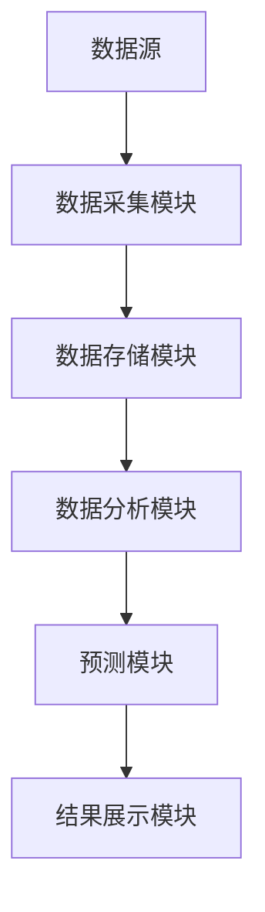

                 

# 霍华德·马克斯的信贷周期分析方法

## 关键词：信贷周期，霍华德·马克斯，经济周期，资产负债表，投资策略

## 摘要：  
霍华德·马克斯的信贷周期理论是理解金融市场波动的重要工具。本文系统地介绍了信贷周期的基本概念、马克斯的分析框架、核心概念、算法原理、系统设计以及实际案例分析。通过详细阐述每个阶段的特征、驱动因素和投资策略，本文为读者提供了一个全面的信贷周期分析方法，帮助投资者在不同市场周期中做出明智决策。

---

## 第一部分: 信贷周期的基本概念与背景

### 第1章: 信贷周期的定义与背景

#### 1.1 信贷周期的基本概念

信贷周期是指信贷市场从扩张到收缩，再从收缩到扩张的周期性波动过程。它与经济周期密切相关，但具有独立的动态特征。信贷周期的核心在于信贷市场的供需变化，以及市场参与者行为的周期性波动。

#### 1.2 信贷周期的背景

信贷周期的概念最早可以追溯到古典经济学，但在现代金融理论中，信贷周期分析成为理解市场波动的重要工具。霍华德·马克斯通过其独特的视角，将信贷周期与资产负债表分析相结合，提出了具有实用价值的分析框架。

---

## 第二部分: 霍华德·马克斯的信贷周期分析框架

### 第2章: 马克斯的信贷周期理论

#### 2.1 马克斯信贷周期的核心观点

马克斯认为，信贷周期的波动源于市场参与者行为的变化，尤其是在市场繁荣时期，过度杠杆和冒险行为会导致信贷市场的过度扩张，最终引发崩盘。

- **信贷周期的非对称性**：扩张和收缩阶段的不对称性导致市场参与者行为的差异。
- **资产负债表分析的重要性**：通过分析资产负债表的变化，可以识别市场的周期性特征。
- **市场情绪与信贷周期的关系**：市场情绪的波动是信贷周期变化的重要驱动因素。

#### 2.2 马克斯信贷周期的阶段划分

马克斯将信贷周期分为四个阶段：

1. **萧条与复苏阶段**：信贷市场处于低谷，市场参与者谨慎，信贷需求疲软。
2. **扩张阶段**：信贷市场活跃，市场参与者乐观，信贷需求增加。
3. **超调与崩盘阶段**：市场参与者过度乐观，信贷需求超过实际经济需求，最终引发崩盘。

---

## 第三部分: 信贷周期分析的核心概念与联系

### 第3章: 信贷周期的核心概念与联系

#### 3.1 信贷周期的核心概念

- **利率**：利率的变化直接影响信贷市场的供需关系。
- **杠杆效应**：杠杆的使用放大了信贷市场的波动性。
- **资产价格波动**：资产价格的波动是信贷周期变化的重要表现。

#### 3.2 核心概念的对比分析

通过对比不同阶段的信贷特征，可以更好地理解信贷周期的变化规律。以下是一个对比分析表格：

| 阶段 | 利率 | 资产负债表 | 市场情绪 |
|------|------|------------|----------|
| 萧条 | 高    | 负债下降 | 消极     |
| 复苏 | 中高  | 资产增长 | 谨慎     |
| 扩张 | 低    | 负债上升 | 乐观     |
| 崩盘 | 高    | 资产缩水 | 消极     |

---

## 第四部分: 信贷周期分析的算法与数学模型

### 第4章: 信贷周期预测的算法原理

#### 4.1 基于时间序列的信贷周期预测

- **ARIMA模型**：一种常用的时间序列预测模型，适用于信贷周期的短期预测。
- **马尔可夫链**：用于建模信贷周期的状态转移概率。

以下是ARIMA模型的数学公式：

$$ ARIMA(p, d, q) = (1 - B)^d ( \phi(B)^p * \theta(B)^q ) $$

其中，$B$ 是后移算子，$p$ 是自回归阶数，$d$ 是差分阶数，$q$ 是移动平均阶数。

#### 4.2 信贷周期预测的数学模型

- **趋势与周期分解**：将信贷周期数据分解为趋势和周期部分，分别进行预测。
- **贝叶斯网络**：用于建模信贷周期的复杂关系。

---

## 第五部分: 信贷周期分析的系统设计与实现

### 第5章: 系统分析与架构设计

#### 5.1 信贷周期分析系统的功能设计

- **数据采集模块**：收集信贷市场数据。
- **数据分析模块**：对数据进行清洗和预处理。
- **预测模块**：基于算法模型进行信贷周期预测。

#### 5.2 系统架构设计

以下是系统的架构图：

---

## 第六部分: 项目实战

### 第6章: 信贷周期分析的实际应用

#### 6.1 案例分析：2008年金融危机

通过分析2008年金融危机，我们可以更好地理解信贷周期的波动规律。以下是金融危机期间的信贷周期变化：

- **2007年-2008年**：信贷市场繁荣，资产价格急剧上升。
- **2008年-2009年**：信贷市场崩盘，资产价格大幅下跌。

#### 6.2 投资策略

基于信贷周期分析，投资者可以制定相应的投资策略：

1. **萧条阶段**：寻找价值低估的资产进行投资。
2. **复苏阶段**：逐步增加风险资产的配置。
3. **扩张阶段**：适度参与信贷市场，避免过度杠杆。
4. **崩盘阶段**：及时止损，避免进一步损失。

---

## 第七部分: 总结与展望

### 第7章: 总结与展望

#### 7.1 总结

霍华德·马克斯的信贷周期分析方法为我们提供了一个系统化的分析框架。通过理解信贷周期的阶段特征和驱动因素，投资者可以在不同市场周期中做出更明智的投资决策。

#### 7.2 展望

未来，信贷周期分析将更加依赖于大数据和人工智能技术。通过结合机器学习算法，我们可以更准确地预测信贷周期的变化，为投资者提供更有力的支持。

---

## 作者：AI天才研究院/AI Genius Institute & 禅与计算机程序设计艺术 /Zen And The Art of Computer Programming

