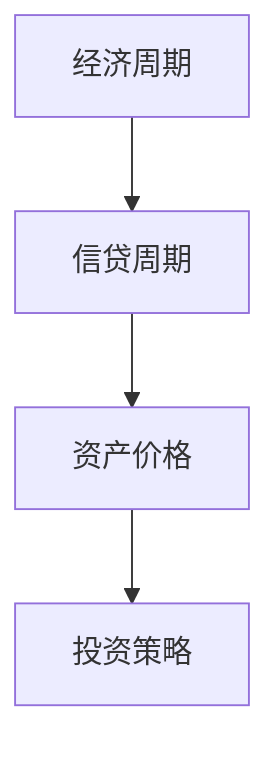

                 

# 霍华德·马克斯的信贷周期投资策略

## 关键词：霍华德·马克斯，信贷周期，投资策略，风险管理，逆向投资

## 摘要：霍华德·马克斯是著名投资家，其信贷周期投资策略强调防御性、进攻性和逆向投资，结合风险管理。本文分析信贷周期的基本概念、驱动因素，探讨其对资产定价的影响，详细讲解马克斯的投资策略，结合风险管理，通过案例分析验证策略的有效性，并总结其应用前景。

---

## 第1章: 信贷周期的基本概念

### 1.1 信贷周期的定义与特征

信贷周期是指信贷市场从扩张到收缩，再扩张的循环过程。其特征包括周期性、波动性和系统性，与经济周期密切相关。

### 1.2 霍华德·马克斯的投资理念

马克斯的投资哲学强调安全边际和逆向投资，信贷周期理论分析经济波动对资产价格的影响，投资策略结合周期分析。

---

## 第2章: 信贷周期的驱动因素

### 2.1 经济周期的影响

经济周期分为复苏、过热、滞胀和衰退阶段，影响信贷需求和供给，进而影响信贷周期。通过分析GDP增长率、失业率和通胀率，理解经济周期对信贷周期的影响。

### 2.2 利率与货币政策的作用

利率影响信贷成本，低利率刺激信贷扩张，高利率抑制信贷需求。通过分析利率政策和资产价格的互动，理解货币政策对信贷周期的影响。

### 2.3 市场情绪与投资者行为

市场情绪波动影响信贷市场，投资者行为在信贷周期中放大波动。通过分析市场情绪指标，如VIX指数，理解其对信贷周期的影响。

---

## 第3章: 信贷周期对资产定价的影响

### 3.1 信贷周期与债券定价

债券价格受利率、信用风险和流动性影响，信贷周期影响这些因素。通过分析债券收益率曲线和利差，制定防御性投资策略。

### 3.2 信贷周期与股票定价

股票价格受企业盈利和市场情绪影响，信贷周期影响企业盈利能力和市场情绪。通过分析市盈率和市净率，制定进攻性投资策略。

### 3.3 信贷周期与房地产市场

房地产价格受信贷条件和需求影响，信贷周期影响房地产市场波动。通过分析房地产市场周期，制定逆向投资策略。

---

## 第4章: 霍华德·马克斯的投资策略

### 4.1 防御性投资策略

防御性投资强调安全性和稳定性，避免高风险资产，投资于低风险债券和高评级企业债，通过分析案例，如2008年金融危机，说明防御策略的有效性。

### 4.2 进攻性投资策略

进攻性投资追求高收益，通过杠杆和高风险资产在信贷扩张期获利，分析案例，如科技股泡沫，说明进攻策略的风险和收益。

### 4.3 逆向投资策略

逆向投资在市场低谷时投资，通过分析市场情绪指标，如恐慌指数，选择被低估资产，案例分析包括2002年互联网泡沫后的投资。

---

## 第5章: 信贷周期中的风险管理

### 5.1 风险管理的基本原则

风险管理包括分散投资、杠杆使用和风险对冲，通过分析不同风险类型，制定有效的风险管理策略。

### 5.2 信贷周期中的风险类型

市场风险、信用风险和利率风险是主要风险，通过分析这些风险的来源和影响，制定应对策略。

### 5.3 风险管理的具体措施

分散投资、杠杆使用和风险对冲是常用措施，通过分析这些措施的有效性，优化投资组合。

---

## 第6章: 信贷周期投资策略的案例分析

### 6.1 经典案例分析

分析美国次贷危机、欧洲债务危机和亚洲金融危机，探讨信贷周期投资策略的应用。

### 6.2 案例分析的启示

案例分析表明，逆向投资和风险管理是成功的关键，通过总结经验教训，优化投资策略。

---

## 第7章: 总结与展望

### 7.1 总结

霍华德·马克斯的信贷周期投资策略结合周期分析、逆向投资和风险管理，是有效的投资方法。

### 7.2 展望

未来，随着金融创新和全球化，信贷周期投资策略将面临新的挑战和机遇，需要不断优化和创新。

---

## 附录: 参考文献

1. 霍华德·马克斯的著作《投资最重要的事情》
2. 其他相关学术文献和市场分析报告

---

## 作者：AI天才研究院/AI Genius Institute & 禅与计算机程序设计艺术 /Zen And The Art of Computer Programming

---

### 章节内容：

#### 第1章: 信贷周期的基本概念

##### 1.1 信贷周期的定义与特征

信贷周期是指信贷市场从扩张到收缩，再扩张的循环过程。其特征包括周期性、波动性和系统性，与经济周期密切相关。

##### 1.2 霍华德·马克斯的投资理念

马克斯的投资哲学强调安全边际和逆向投资，信贷周期理论分析经济波动对资产价格的影响，投资策略结合周期分析。

---

#### 第2章: 信贷周期的驱动因素

##### 2.1 经济周期的影响

经济周期分为复苏、过热、滞胀和衰退阶段，影响信贷需求和供给，进而影响信贷周期。通过分析GDP增长率、失业率和通胀率，理解经济周期对信贷周期的影响。

##### 2.2 利率与货币政策的作用

利率影响信贷成本，低利率刺激信贷扩张，高利率抑制信贷需求。通过分析利率政策和资产价格的互动，理解货币政策对信贷周期的影响。

##### 2.3 市场情绪与投资者行为

市场情绪波动影响信贷市场，投资者行为在信贷周期中放大波动。通过分析市场情绪指标，如VIX指数，理解其对信贷周期的影响。

---

#### 第3章: 信贷周期对资产定价的影响

##### 3.1 信贷周期与债券定价

债券价格受利率、信用风险和流动性影响，信贷周期影响这些因素。通过分析债券收益率曲线和利差，制定防御性投资策略。

##### 3.2 信贷周期与股票定价

股票价格受企业盈利和市场情绪影响，信贷周期影响企业盈利能力和市场情绪。通过分析市盈率和市净率，制定进攻性投资策略。

##### 3.3 信贷周期与房地产市场

房地产价格受信贷条件和需求影响，信贷周期影响房地产市场波动。通过分析房地产市场周期，制定逆向投资策略。

---

#### 第4章: 霍华德·马克斯的投资策略

##### 4.1 防御性投资策略

防御性投资强调安全性和稳定性，避免高风险资产，投资于低风险债券和高评级企业债，通过分析案例，如2008年金融危机，说明防御策略的有效性。

##### 4.2 进攻性投资策略

进攻性投资追求高收益，通过杠杆和高风险资产在信贷扩张期获利，分析案例，如科技股泡沫，说明进攻策略的风险和收益。

##### 4.3 逆向投资策略

逆向投资在市场低谷时投资，通过分析市场情绪指标，如恐慌指数，选择被低估资产，案例分析包括2002年互联网泡沫后的投资。

---

#### 第5章: 信贷周期中的风险管理

##### 5.1 风险管理的基本原则

风险管理包括分散投资、杠杆使用和风险对冲，通过分析不同风险类型，制定有效的风险管理策略。

##### 5.2 信贷周期中的风险类型

市场风险、信用风险和利率风险是主要风险，通过分析这些风险的来源和影响，制定应对策略。

##### 5.3 风险管理的具体措施

分散投资、杠杆使用和风险对冲是常用措施，通过分析这些措施的有效性，优化投资组合。

---

#### 第6章: 信贷周期投资策略的案例分析

##### 6.1 经典案例分析

分析美国次贷危机、欧洲债务危机和亚洲金融危机，探讨信贷周期投资策略的应用。

##### 6.2 案例分析的启示

案例分析表明，逆向投资和风险管理是成功的关键，通过总结经验教训，优化投资策略。

---

#### 第7章: 总结与展望

##### 7.1 总结

霍华德·马克斯的信贷周期投资策略结合周期分析、逆向投资和风险管理，是有效的投资方法。

##### 7.2 展望

未来，随着金融创新和全球化，信贷周期投资策略将面临新的挑战和机遇，需要不断优化和创新。

---

#### 附录: 参考文献

1. 霍华德·马克斯的著作《投资最重要的事情》
2. 其他相关学术文献和市场分析报告

---

### 作者：AI天才研究院/AI Genius Institute & 禅与计算机程序设计艺术 /Zen And The Art of Computer Programming

---

**数学公式示例：**

- 防御性投资的风险调整回报公式：
  \[
  \text{风险调整回报} = \text{预期回报} - \text{风险溢价}
  \]

- 进攻性投资的风险调整公式：
  \[
  \text{预期回报} = \text{无风险利率} + \beta \times (\text{市场预期回报} - \text{无风险利率})
  \]

---

**图表示例：**

---

通过以上结构，文章详细阐述了霍华德·马克斯的信贷周期投资策略，结合理论分析和实际案例，提供了全面的指导。

