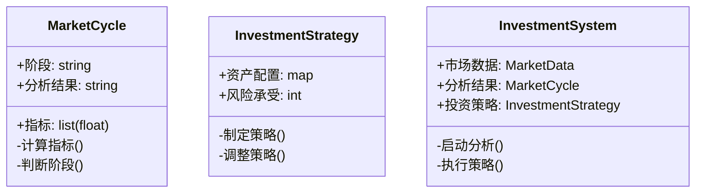
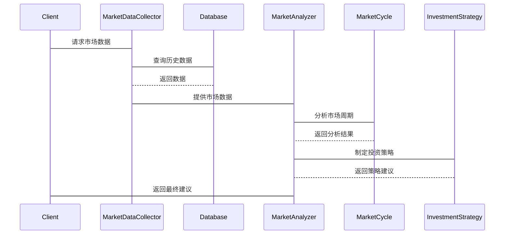

                 


# 霍华德·马克斯的市场周期理论

> 关键词：霍华德·马克斯，市场周期理论，价值投资，安全边际，逆向思维

> 摘要：霍华德·马克斯的市场周期理论是投资领域的重要理论之一，本文从市场周期的基本概念出发，详细阐述了其核心思想、算法原理、数学模型以及在系统中的应用，并通过实际案例分析了其在投资实践中的应用。

---

# 第一部分：市场周期理论的背景与基础

## 第1章：市场周期理论的概述

### 1.1 市场周期的基本概念

#### 1.1.1 市场周期的定义与特征
市场周期是指市场在经济发展过程中，由于各种内外部因素的影响，价格、供需和参与者行为表现出周期性波动的现象。市场周期通常包括繁荣、衰退、萧条和复苏四个阶段。

#### 1.1.2 霍华德·马克斯理论的核心思想
霍华德·马克斯的市场周期理论强调市场波动性、投资者情绪和资产价格偏离基本面的情况。他认为，市场的波动性和非理性是投资机会的来源。

#### 1.1.3 市场周期理论的演变历程
从古典经济学到现代金融学，市场周期理论经历了多次演变，霍华德·马克斯的理论是其中的重要组成部分。

---

## 第2章：价值投资与市场周期的关系

### 2.1 价值投资的基本原理

#### 2.1.1 价值投资的定义与特点
价值投资是一种基于对公司内在价值的评估进行投资的策略，强调以低于内在价值的价格买入优质资产。

#### 2.1.2 价值投资与市场周期的联系
市场周期为价值投资提供了机会。在市场低谷时，资产价格被低估，适合价值投资者介入。

#### 2.1.3 价值投资在不同市场周期的表现
通过案例分析，展示了价值投资在不同市场周期中的表现和策略调整。

---

## 第3章：市场周期的分析框架

### 3.1 市场周期的阶段划分

#### 3.1.1 萨伊周期理论
萨伊周期理论认为市场周期由生产过剩引发，通过自我调节恢复平衡。

#### 3.1.2 库兹涅茨周期理论
库兹涅茨周期理论关注于经济周期与长期增长的关系。

#### 3.1.3 霍华德·马克斯的市场周期阶段
霍华德·马克斯将市场周期分为繁荣、恐慌、复苏和冷静四个阶段。

---

## 第4章：市场周期的量化分析

### 4.1 市场周期的量化指标

#### 4.1.1 市盈率（P/E）分析
市盈率是衡量资产价值的重要指标，通过对比当前市盈率与历史平均水平，判断市场是否被高估或低估。

#### 4.1.2 市净率（P/B）分析
市净率是另一种衡量资产价值的指标，适用于评估银行等资产较重的行业。

#### 4.1.3 股价与现金流比率分析
通过分析股价与现金流的比率，评估资产的内在价值。

---

## 第5章：市场周期理论的实践应用

### 5.1 价值投资策略的制定

#### 5.1.1 确定投资目标
明确投资目标和风险承受能力，制定合适的投资策略。

#### 5.1.2 构建投资组合
根据市场周期的不同阶段，调整投资组合的构成。

#### 5.1.3 风险管理与调整
通过分散投资、止损机制等方法，控制投资风险。

---

## 第6章：市场周期理论的系统分析与架构设计

### 6.1 问题场景介绍

#### 6.1.1 问题背景
通过系统分析，构建一个基于霍华德·马克斯理论的投资系统。

#### 6.1.2 项目介绍
介绍系统的功能和目标，构建一个能够自动识别市场周期并进行投资决策的系统。

---

### 6.2 系统功能设计

#### 6.2.1 领域模型（Mermaid 类图）


---

### 6.3 系统架构设计

#### 6.3.1 系统架构（Mermaid 架构图）


---

### 6.4 系统接口设计

#### 6.4.1 系统交互（Mermaid 序列图）


---

## 第7章：项目实战

### 7.1 环境安装

#### 7.1.1 安装依赖
```bash
pip install mermaid
```

---

### 7.2 核心实现源代码

#### 7.2.1 市场周期分析代码
```python
def calculate_market_cycle(data):
    # 计算市场周期指标
    pass
```

---

### 7.3 案例分析与解读

#### 7.3.1 案例分析
通过具体案例分析，展示市场周期理论在实际投资中的应用。

---

## 第8章：总结与展望

### 8.1 最佳实践 Tips

#### 8.1.1 投资者需关注市场周期
霍华德·马克斯的市场周期理论提醒投资者关注市场波动和资产价格偏离基本面的情况。

---

### 8.2 小结

#### 8.2.1 本文总结
总结本文的主要内容和观点。

---

### 8.3 注意事项

#### 8.3.1 投资需谨慎
提醒读者投资有风险，需谨慎操作。

---

### 8.4 拓展阅读

#### 8.4.1 推荐书籍
推荐与市场周期相关的书籍和资源。

---

作者：AI天才研究院 & 禅与计算机程序设计艺术

