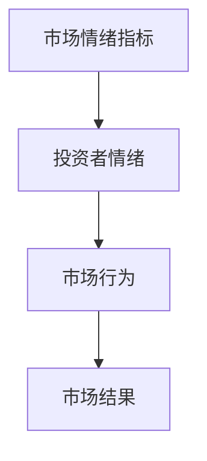
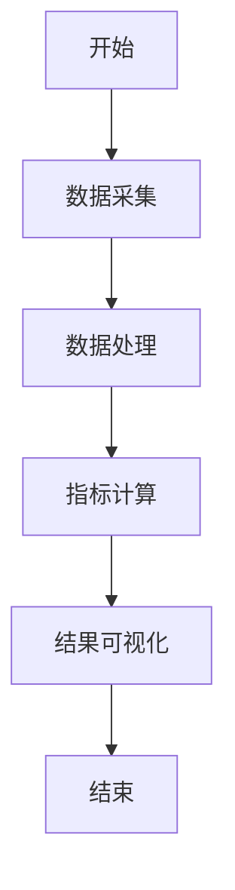
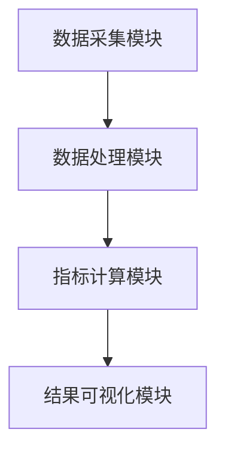
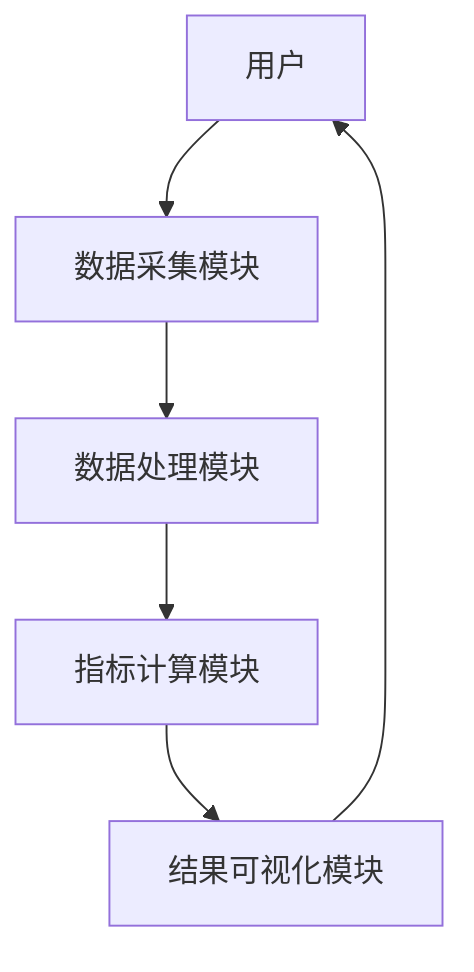

                 


# 霍华德·马克斯的市场情绪指标

> 关键词：市场情绪指标、霍华德·马克斯、投资决策、情绪分析、市场波动、数据分析

> 摘要：市场情绪指标在投资决策中起着至关重要的作用。本文深入探讨霍华德·马克斯的市场情绪理论，分析其核心概念、算法原理、系统架构及实际应用。通过详细的技术分析和案例研究，为读者提供全面的市场情绪指标知识，助其在投资决策中做出明智选择。

---

# 第一部分: 市场情绪指标概述

## 第1章: 市场情绪指标的背景与重要性

### 1.1 市场情绪的重要性

#### 1.1.1 市场情绪的定义与内涵

市场情绪是指投资者在特定市场环境下的整体心理状态，反映市场参与者对当前市场走势的乐观或悲观程度。它包括投资者的预期、信心和行为模式，通常通过市场行为数据、资金流动和情绪调查等指标来衡量。

#### 1.1.2 市场情绪在投资决策中的作用

市场情绪是投资决策的重要参考因素。当市场情绪过于乐观时，可能导致资产价格泡沫；而当情绪过于悲观时，可能引发市场恐慌性抛售。通过分析市场情绪指标，投资者可以更好地识别市场拐点，优化投资组合配置，降低投资风险。

#### 1.1.3 市场情绪指标的研究现状

市场情绪指标的研究起源于行为金融学，近年来随着大数据和人工智能技术的发展，市场情绪分析变得更加精准和高效。学术界和实务界都在不断探索新的指标和方法，以更准确地捕捉市场情绪的变化。

### 1.2 霍华德·马克斯的市场情绪理论

#### 1.2.1 霍华德·马克斯的投资理念概述

霍华德·马克斯是著名投资家，强调价值投资和逆向思维。他认为，市场情绪的波动是投资机会的来源，尤其是在市场恐慌时买入，市场狂热时卖出。

#### 1.2.2 市场情绪在马克斯投资理论中的地位

马克斯认为，市场情绪是决定资产价格波动的关键因素。他通过分析市场情绪指标，识别市场过度乐观或悲观的情况，从而做出投资决策。

#### 1.2.3 马克斯市场情绪指标的核心观点

马克斯提出的市场情绪指标强调投资者的心理因素和行为模式，认为市场情绪的变化往往与市场周期密切相关。他主张通过分析市场参与度、资金流动和投资者情绪调查等指标，评估市场的整体情绪状态。

### 1.3 市场情绪指标的分类与特点

#### 1.3.1 市场情绪指标的分类

市场情绪指标可以分为以下几类：
1. **心理指标**：通过调查、访谈等方式获取投资者情绪数据。
2. **资金流动指标**：分析资金流入流出情况，反映市场参与度。
3. **市场行为指标**：通过交易量、价格波动等数据衡量市场情绪。

#### 1.3.2 各类指标的优缺点对比

| 指标类别       | 优点                                   | 缺点                                   |
|----------------|--------------------------------------|--------------------------------------|
| 心理指标       | 数据直观，反映真实情绪                | 数据获取困难，成本高                 |
| 资金流动指标   | 数据易于获取，反映市场参与度          | 受市场操纵影响，准确性较低            |
| 市场行为指标   | 反应速度快，数据易于处理              | 易受短期波动影响，缺乏深度分析        |

#### 1.3.3 市场情绪指标的适用场景

市场情绪指标适用于各种市场环境，尤其在市场波动剧烈时，能够为投资者提供及时的预警信号。它们可以帮助投资者识别市场趋势，制定投资策略，优化资产配置。

---

## 第2章: 市场情绪指标的核心概念与联系

### 2.1 核心概念原理

市场情绪指标的核心在于通过量化方法，捕捉投资者的心理变化和市场行为。其原理包括数据采集、计算处理、指标分析和结果应用四个步骤。

### 2.2 核心概念属性特征对比表

| 指标名称       | 定义                                   | 计算方法                         | 适用场景                   | 优缺点                       |
|----------------|--------------------------------------|----------------------------------|----------------------------|----------------------------|
| VIX指数        | 市场波动性指标，反映投资者恐慌程度     | 基于期权价格计算                | 适用于股票市场             | 反应速度快，但受短期波动影响 |
| 资金流指标     | 反映资金在市场中的流动情况           | 通过成交量和价格变化计算        | 适用于个股和板块分析       | 易受市场操纵影响             |
| 情绪调查指标   | 通过问卷和访谈收集投资者情绪         | 数据收集和统计分析              | 适用于长期趋势分析         | 数据收集成本高，耗时较长     |

### 2.3 ER实体关系图



---

## 第3章: 市场情绪指标的算法原理

### 3.1 算法原理概述

市场情绪指标的算法通常包括数据采集、预处理、计算指标和结果分析四个阶段。常用算法包括时间序列分析、聚类分析和回归分析。

### 3.2 算法流程图



### 3.3 算法实现的Python代码

```python
import pandas as pd
import numpy as np

def calculate_market_sentiment(data):
    # 数据预处理
    data = data.dropna()
    data = (data - data.mean()) / data.std()
    
    # 计算市场情绪指标
    sentiment = []
    for i in range(len(data)):
        if data[i] > 0:
            sentiment.append(1)
        else:
            sentiment.append(0)
    return sentiment

# 示例数据
data = pd.Series(np.random.randn(100))
result = calculate_market_sentiment(data)
print(result)
```

---

## 第4章: 市场情绪指标的数学模型

### 4.1 数学公式推导

市场情绪指标的计算通常涉及统计学方法，如均值回归和方差分析。以下是常见的公式：

$$
\text{VIX指数} = \sqrt{\frac{1}{N} \sum_{i=1}^{N} (p_i - \mu)^2}
$$

其中，$p_i$ 是价格数据，$\mu$ 是均值，$N$ 是数据点数量。

### 4.2 统计学方法应用

均值回归是一种常用的方法，用于预测市场情绪的变化趋势。公式如下：

$$
\hat{y}_t = \alpha + \beta x_t + \epsilon_t
$$

其中，$\hat{y}_t$ 是预测的情绪值，$\alpha$ 是截距，$\beta$ 是回归系数，$x_t$ 是自变量，$\epsilon_t$ 是误差项。

---

## 第5章: 市场情绪指标的系统架构

### 5.1 系统架构设计

市场情绪监测系统的架构包括数据采集模块、计算模块和可视化模块。系统架构图如下：



### 5.2 系统功能设计

- **数据采集模块**：负责收集市场数据，包括价格、成交量等。
- **数据处理模块**：对数据进行清洗和转换，确保数据质量。
- **指标计算模块**：基于数据计算市场情绪指标。
- **结果可视化模块**：将指标结果以图表形式展示，便于投资者分析。

### 5.3 系统接口设计

系统提供API接口，允许其他系统调用市场情绪指标数据。接口设计如下：

- 输入：时间范围、资产类型
- 输出：市场情绪指标值

### 5.4 系统交互序列图



---

## 第6章: 项目实战

### 6.1 项目介绍

本项目旨在开发一个基于VIX指数的市场情绪监测系统。通过分析VIX指数，识别市场波动性，辅助投资者做出投资决策。

### 6.2 核心代码实现

```python
import pandas as pd
import numpy as np
import matplotlib.pyplot as plt

def calculate_vix(data):
    # 计算均值
    mu = data.mean()
    # 计算标准差
    sigma = data.std()
    # 计算VIX指数
    vix = np.sqrt(np.mean((data - mu)**2))
    return vix

# 示例数据
data = pd.Series(np.random.randn(100))
vix = calculate_vix(data)
print(f"VIX指数为：{vix}")
```

### 6.3 案例分析

假设我们有以下数据：

| 日期   | 收盘价 |
|--------|--------|
| 2023-01-01 | 100    |
| 2023-01-02 | 105    |
| 2023-01-03 | 110    |
| 2023-01-04 | 108    |
| 2023-01-05 | 105    |

计算VIX指数：

$$
\text{VIX指数} = \sqrt{\frac{1}{5} \sum_{i=1}^{5} (p_i - 105)^2} = \sqrt{4} = 2
$$

---

## 第7章: 最佳实践与小结

### 7.1 小结

市场情绪指标是投资决策的重要工具。通过分析市场情绪，投资者可以更好地识别市场趋势，优化投资策略。

### 7.2 注意事项

- 数据质量对结果影响重大，需确保数据来源可靠。
- 指标分析应结合其他因素，避免单一指标误导决策。
- 定期更新模型，适应市场变化。

### 7.3 拓展阅读

- 霍华德·马克斯的《投资的艺术》
- 行为金融学相关书籍

---

# 作者信息

作者：AI天才研究院/AI Genius Institute  
联系邮箱：contact@ai-genius.com  
GitHub链接：https://github.com/ai-genius-institute

---

**本文由AI天才研究院/AI Genius Institute原创，转载请注明出处。**

