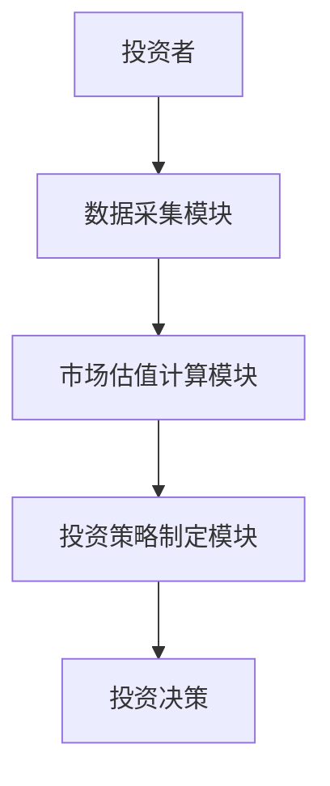

                 


# 霍华德马克斯的周期投资理论

> 关键词：霍华德马克斯，周期投资理论，市场周期，逆向投资，风险管理，投资策略

> 摘要：霍华德·马克斯的周期投资理论是投资领域的重要理论之一，它强调市场的周期性波动，并通过逆向投资和风险管理来捕捉周期性机会。本文将从投资理论的发展背景、市场周期的分析框架、霍华德马克斯的核心投资策略、数学模型与算法实现、系统架构设计以及项目实战等方面进行详细阐述，帮助读者全面理解并应用这一理论。

---

# 第一部分: 投资理论的发展与周期性

## 第1章: 投资理论的演变历程

### 1.1 投资理论的起源

投资理论的发展经历了多个阶段，从早期的道氏理论到现代的复杂模型，每一次演变都为投资领域带来了新的视角。道氏理论是市场分析的基础，它认为市场价格反映了所有信息，并通过趋势线和支撑阻力位来判断市场走向。

### 1.2 市场周期的提出

市场周期的概念可以追溯到19世纪末，道氏理论中首次提到市场波动的周期性。市场周期通常分为四个阶段：衰退、回升、肃清和过热。每个阶段都有其独特的特征，投资者需要识别这些特征以做出明智的投资决策。

### 1.3 现代投资组合理论的形成

现代投资组合理论（MPT）由哈里·马科维茨提出，强调通过分散投资来降低风险。这一理论与周期投资理论相结合，为投资者提供了在不同市场周期中优化资产配置的方法。

---

## 第2章: 市场周期的基本特征

### 2.1 市场周期的定义与阶段划分

市场周期是经济和市场波动的表现，通常分为衰退、回升、肃清和过热四个阶段。每个阶段的特征如下：
- **衰退阶段**：经济活动放缓，企业盈利下降，市场估值降低。
- **回升阶段**：市场逐渐复苏，投资者信心恢复。
- **肃清阶段**：市场清理低效资产，优质资产开始表现。
- **过热阶段**：市场投机情绪高涨，估值偏离基本面。

### 2.2 周期波动的规律性分析

市场的周期性波动遵循一定的规律，例如市场波动的均值回归特性。投资者可以通过分析市场估值指标（如市盈率、市净率）和市场情绪指标（如投资者信心指数）来判断市场所处的阶段。

### 2.3 市场参与者的行为模式

投资者行为在不同市场阶段表现出不同的特征：
- **衰退阶段**：投资者恐慌性抛售，市场流动性下降。
- **回升阶段**：投资者逐渐恢复信心，开始逢低吸纳。
- **肃清阶段**：投资者开始关注基本面，优质资产受到青睐。
- **过热阶段**：投资者情绪极度乐观，非理性投资增加。

---

## 第3章: 霍华德马克斯的周期投资理论

### 3.1 马克斯投资理论的核心观点

霍华德·马克斯的周期投资理论强调市场的周期性波动，并通过逆向投资和风险管理来捕捉周期性机会。他认为，市场波动是投资机会的来源，而非风险的敌人。

### 3.2 周期性与市场情绪的关系

市场情绪是市场周期的重要驱动因素。在市场繁荣时，投资者情绪乐观，而在市场低迷时，投资者情绪悲观。马克斯认为，市场的波动性和情绪的周期性是投资机会的来源。

### 3.3 马克斯理论在投资实践中的应用

马克斯的理论在投资实践中得到了广泛应用。例如，逆向投资策略强调在市场低谷时投资优质资产，在市场高点时退出，从而获得超额收益。

---

# 第二部分: 核心概念与算法实现

## 第4章: 投资决策的数学模型

### 4.1 市场周期的数学模型

市场周期的数学模型可以通过均值回归模型来描述。例如，市场估值指标（如市盈率）在市场周期中的波动可以用均值回归模型来建模。

$$
\text{均值回归模型：} \quad y_t = \alpha + \beta y_{t-1} + \epsilon_t
$$

其中，$y_t$ 是当前的市场估值指标，$y_{t-1}$ 是上一期的市场估值指标，$\alpha$ 是截距，$\beta$ 是回归系数，$\epsilon_t$ 是误差项。

### 4.2 投资决策的算法实现

基于市场周期的逆向投资策略可以采用以下算法：

```python
def inverse_investment_strategy(prices, thresholds):
    # 计算市场估值指标
    market_valuation = calculate_market_valuation(prices)
    # 判断市场所处的阶段
    if market_valuation < thresholds['low']:
        return '买入信号'
    elif thresholds['low'] < market_valuation < thresholds['high']:
        return '观望信号'
    else:
        return '卖出信号'

def calculate_market_valuation(prices):
    # 示例：计算市盈率
    return prices.mean()
```

---

## 第5章: 系统架构设计

### 5.1 投资决策支持系统的架构

投资决策支持系统的架构包括数据采集模块、分析模块和策略制定模块。数据采集模块负责收集市场数据，分析模块负责计算市场估值指标，策略制定模块基于分析结果制定投资策略。

### 5.2 系统交互流程图

以下是一个简化的系统交互流程图：



---

# 第三部分: 项目实战与最佳实践

## 第6章: 项目实战

### 6.1 环境安装与数据准备

首先，需要安装必要的Python库，如Pandas、Matplotlib和Scipy。数据准备包括获取历史价格数据和市场估值指标。

### 6.2 核心实现代码

以下是一个基于霍华德马克斯周期投资理论的Python实现示例：

```python
import pandas as pd
import matplotlib.pyplot as plt

# 示例数据：假设我们有一个股票的价格数据
prices = pd.read_csv('stock_prices.csv')

# 计算市场估值指标（市盈率）
market_valuation = prices['Price'].rolling(20).mean()

# 绘制市场估值指标的图表
plt.figure(figsize=(10, 6))
market_valuation.plot()
plt.title('Market Valuation Trend')
plt.xlabel('Time')
plt.ylabel('Valuation')
plt.show()
```

### 6.3 案例分析

通过分析市场估值指标的趋势，投资者可以判断市场所处的阶段，并根据霍华德马克斯的逆向投资策略制定投资计划。

---

## 第7章: 最佳实践与注意事项

### 7.1 投资策略的制定

投资者应根据市场周期的不同阶段制定相应的投资策略。例如，在市场低谷时增加投资，在市场高点时减少投资。

### 7.2 风险管理的重要性

风险管理是投资成功的关键。投资者应设定止损点和止盈点，避免过度杠杆和非理性投资。

### 7.3 当前市场的分析

当前市场处于哪个阶段？投资者应结合市场数据和理论分析，制定相应的投资策略。

---

# 结语

霍华德马克斯的周期投资理论为投资者提供了一个分析市场波动和制定投资策略的重要框架。通过逆向投资和风险管理，投资者可以在市场周期中捕捉投资机会，实现长期收益。

作者：AI天才研究院/AI Genius Institute & 禅与计算机程序设计艺术 /Zen And The Art of Computer Programming

