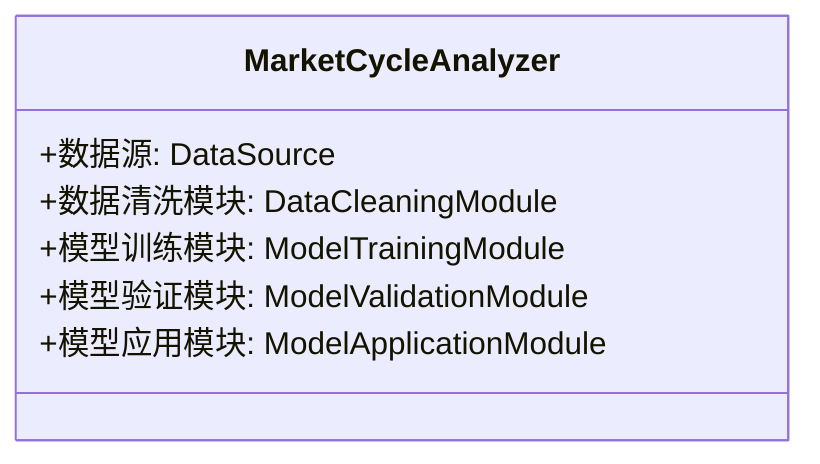
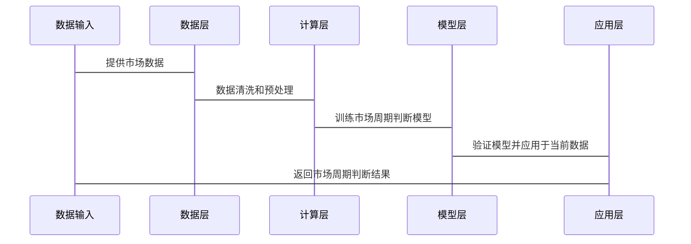

                 


# 霍华德马克斯的市场周期判断

> 关键词：霍华德·马克斯、市场周期、投资策略、价值投资、经济波动

> 摘要：霍华德·马克斯是投资界的重要人物，他提出了独特的市场周期理论，帮助投资者在不同市场阶段做出明智决策。本文深入分析了市场周期的核心概念、判断方法和系统架构，结合实际案例和代码实现，为投资者提供了实用的指导。

---

## 第一部分: 市场周期的基本概念

### 第1章: 市场周期的定义与特征

#### 1.1 市场周期的基本概念
市场周期是指经济和市场活动的波动性模式，通常包括繁荣、衰退、萧条和复苏四个阶段。这些阶段的变化由多种因素驱动，包括经济政策、市场情绪和外部事件等。市场周期的核心在于理解其波动性，从而在投资中抓住机会或规避风险。

霍华德·马克斯强调，市场周期是价值投资的重要工具。他认为，市场在不同阶段的价格波动反映了投资者情绪的变化，而这种情绪变化往往会导致市场的非理性波动。通过分析市场周期，投资者可以更好地识别低估或高估的资产，从而做出更明智的投资决策。

#### 1.2 霍华德·马克斯的投资理念
霍华德·马克斯是价值投资的倡导者，他认为市场的价格波动往往偏离其内在价值。他提出，市场周期的波动性为投资者提供了以低于内在价值的价格买入优质资产的机会。他的投资策略强调长期视角和逆向思维，即在市场低迷时买入，在市场繁荣时保持谨慎。

马克斯的市场周期理论强调了以下几个关键点：
1. **市场情绪的影响**：市场的波动性主要由投资者情绪驱动，而非基本面因素。
2. **周期性思维**：市场周期是不可预测的，但可以通过分析历史周期来识别模式。
3. **逆向投资**：在市场低迷时寻找机会，避免在市场繁荣时过度投资。

#### 1.3 市场周期与其他经济理论的联系
市场周期理论与凯恩斯主义、现代金融理论和行为金融学有着密切的联系。凯恩斯主义强调政府干预对经济周期的影响，而现代金融理论则关注资产定价和风险调整回报。行为金融学则从投资者心理角度解释市场波动。

市场周期理论的独特之处在于它结合了这些理论的核心思想，强调了市场情绪和周期性波动对投资决策的影响。通过分析市场周期，投资者可以更好地理解市场的波动性，并在不同阶段做出更明智的投资决策。

---

### 第2章: 市场周期的核心概念与联系

#### 2.1 市场周期的核心概念
市场周期的核心概念包括以下几个方面：
1. **周期性**：市场的波动性是周期性的，而不是随机的。
2. **市场情绪**：投资者情绪是市场波动的主要驱动力。
3. **价值与价格**：市场的价格波动反映了资产的内在价值与市场价格之间的差异。

市场周期的核心要素包括：
1. **时间维度**：市场的波动性随时间变化。
2. **资产类别**：不同资产类别的市场周期可能不同。
3. **经济指标**：GDP、利率、就业数据等经济指标对市场周期有重要影响。

#### 2.2 市场周期与经济指标的关系
市场周期的波动性与经济指标密切相关。例如，GDP增长率可以反映经济的繁荣或衰退，利率水平影响市场的资金成本，就业数据反映经济的健康状况。通过分析这些经济指标，投资者可以更好地理解市场周期的变化。

不同市场周期阶段的经济指标特征如下：
- **繁荣阶段**：GDP增长快，利率上升，就业率高。
- **衰退阶段**：GDP增长放缓，利率下降，就业率下降。
- **萧条阶段**：GDP负增长，利率最低，就业率最低。
- **复苏阶段**：GDP逐渐恢复增长，利率上升，就业率回升。

#### 2.3 市场周期的阶段划分与特征对比
市场周期的阶段划分通常包括以下几个阶段：
1. **繁荣阶段**：市场价格高，投资者情绪乐观。
2. **衰退阶段**：市场价格下跌，投资者情绪悲观。
3. **萧条阶段**：市场价格最低，投资者情绪极度悲观。
4. **复苏阶段**：市场价格逐渐回升，投资者情绪逐渐恢复。

通过对比不同阶段的特征，投资者可以更好地识别市场周期的变化。例如，繁荣阶段适合卖出资产，而萧条阶段适合买入资产。

---

## 第二部分: 市场周期的判断方法

### 第3章: 市场周期判断的核心原理

#### 3.1 市场周期判断的基本原理
市场周期判断的核心在于识别市场波动的模式。通过分析历史数据和当前市场指标，投资者可以识别市场周期的变化。马克斯的市场周期理论强调了以下几个关键点：
1. **市场情绪分析**：通过分析投资者情绪的变化，识别市场的波动性。
2. **资产价格分析**：通过分析资产价格与内在价值的差异，判断市场的高低点。
3. **经济指标分析**：通过分析GDP、利率、就业数据等经济指标，判断经济周期的变化。

#### 3.2 市场周期判断的算法原理
市场周期判断的算法原理包括以下几个步骤：
1. **数据收集**：收集历史市场数据和经济指标。
2. **数据清洗**：对数据进行清洗和预处理。
3. **模型训练**：使用机器学习算法训练市场周期判断模型。
4. **模型验证**：通过历史数据验证模型的准确性。
5. **模型应用**：将模型应用于当前市场数据，判断市场周期的变化。

以下是一个简单的Python代码示例，用于判断市场周期的变化：

```python
import numpy as np
import pandas as pd
from sklearn.linear_model import LinearRegression

# 数据预处理
data = pd.read_csv('market_data.csv')
data = data.dropna()

# 特征工程
X = data[['GDP', '利率', '就业率']]
y = data['市场周期阶段']

# 模型训练
model = LinearRegression()
model.fit(X, y)

# 模型预测
new_data = pd.DataFrame({'GDP': [5], '利率': [3], '就业率': [7]})
predicted_stage = model.predict(new_data)
print(predicted_stage)
```

#### 3.3 市场周期判断的数学模型
市场周期判断的数学模型可以基于回归分析、时间序列分析和聚类分析等方法。以下是一个简单的回归模型示例：

$$ y = \beta_0 + \beta_1 x_1 + \beta_2 x_2 + \epsilon $$

其中，$y$ 是市场周期阶段，$x_1$ 是GDP增长率，$x_2$ 是利率水平，$\beta_0$ 是截距，$\beta_1$ 和 $\beta_2$ 是回归系数，$\epsilon$ 是误差项。

通过回归分析，投资者可以识别经济指标对市场周期的影响。

---

### 第4章: 系统分析与架构设计

#### 4.1 问题场景介绍
市场周期判断是一个复杂的系统工程，需要结合多种因素进行分析。为了更好地理解市场周期的变化，我们需要构建一个完整的分析框架。

#### 4.2 系统功能设计
系统功能设计包括以下几个方面：
1. **数据收集**：从多种数据源收集市场数据。
2. **数据清洗**：对数据进行清洗和预处理。
3. **模型训练**：训练市场周期判断模型。
4. **模型验证**：验证模型的准确性。
5. **模型应用**：将模型应用于当前市场数据，判断市场周期的变化。

以下是一个系统功能设计的类图：



#### 4.3 系统架构设计
系统架构设计包括以下几个方面：
1. **数据层**：存储市场数据和经济指标。
2. **计算层**：对数据进行清洗和预处理。
3. **模型层**：训练和验证市场周期判断模型。
4. **应用层**：将模型应用于当前市场数据，判断市场周期的变化。

以下是一个系统架构设计的架构图：


#### 4.4 系统接口设计
系统接口设计包括以下几个方面：
1. **数据接口**：从数据源获取市场数据。
2. **模型接口**：训练和验证市场周期判断模型。
3. **应用接口**：将模型应用于当前市场数据，判断市场周期的变化。

以下是一个系统接口设计的序列图：



---

## 第三部分: 项目实战

### 第5章: 项目实战

#### 5.1 环境安装
为了进行市场周期判断，我们需要安装以下工具和库：
1. Python 3.8+
2. NumPy
3. Pandas
4. Scikit-learn
5. Matplotlib

安装命令：
```bash
pip install numpy pandas scikit-learn matplotlib
```

#### 5.2 系统核心实现源代码
以下是一个简单的Python代码示例，用于判断市场周期的变化：

```python
import numpy as np
import pandas as pd
from sklearn.linear_model import LinearRegression

# 数据预处理
data = pd.read_csv('market_data.csv')
data = data.dropna()

# 特征工程
X = data[['GDP', '利率', '就业率']]
y = data['市场周期阶段']

# 模型训练
model = LinearRegression()
model.fit(X, y)

# 模型预测
new_data = pd.DataFrame({'GDP': [5], '利率': [3], '就业率': [7]})
predicted_stage = model.predict(new_data)
print(predicted_stage)
```

#### 5.3 代码应用解读与分析
上述代码示例展示了如何使用线性回归模型进行市场周期判断。通过训练模型，我们可以预测当前市场周期阶段，并做出相应的投资决策。

#### 5.4 案例分析和详细讲解剖析
以下是一个实际案例分析：

假设我们有一个包含GDP增长率、利率和就业率的市场数据集。我们可以通过训练线性回归模型来预测市场周期阶段。通过分析模型的预测结果，我们可以判断当前市场所处的阶段，并做出相应的投资决策。

---

## 第四部分: 最佳实践与小结

### 第6章: 最佳实践

#### 6.1 投资建议
- 在市场繁荣阶段，保持谨慎，避免过度投资。
- 在市场衰退阶段，寻找低估资产，进行逆向投资。
- 在市场萧条阶段，买入优质资产，长期持有。
- 在市场复苏阶段，逐步增加投资，抓住市场回升的机会。

#### 6.2 注意事项
- 市场周期判断具有不确定性，投资者需要结合多种因素进行综合分析。
- 市场周期判断需要长期关注和学习，投资者需要不断更新自己的知识和技能。
- 市场周期判断需要结合实际市场情况，投资者需要灵活调整自己的投资策略。

#### 6.3 拓展阅读
- 《投资最重要的事情》——霍华德·马克斯
- 《价值投资：从理念到实践》——张海鹏
- 《市场周期与投资策略》——约翰·博恩

---

## 作者：AI天才研究院/AI Genius Institute & 禅与计算机程序设计艺术 /Zen And The Art of Computer Programming

