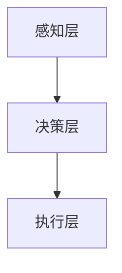
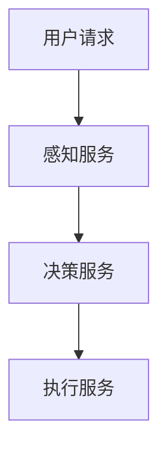
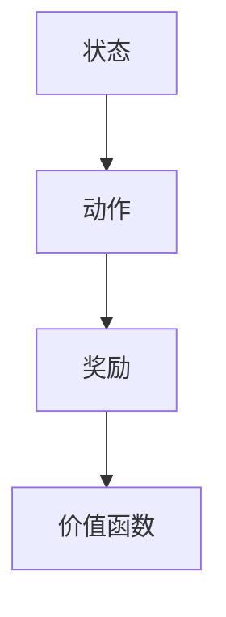
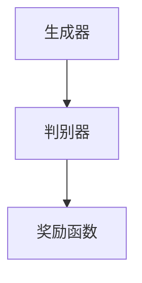
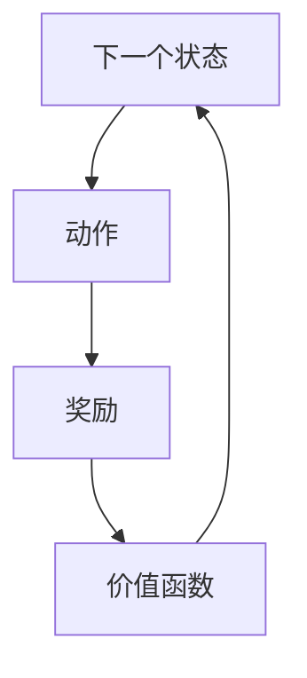
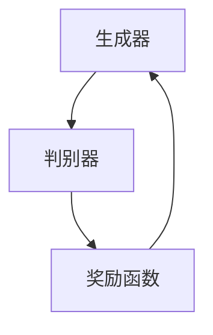

                 


# 预测2025年AI Agent技术的发展方向

## 关键词：AI Agent, 人工智能, 技术预测, 算法发展, 应用场景, 系统架构

## 摘要：随着人工智能技术的迅速发展，AI Agent（智能体）作为一种能够自主决策、执行任务的智能系统，正在逐步改变我们的生活方式和工作方式。本文将深入分析AI Agent的核心概念、技术原理、当前发展趋势，并预测其在2025年的发展方向。通过详细的技术分析和应用场景探讨，本文旨在为读者提供对未来AI Agent技术的清晰认识和深刻理解。

---

## 第1章: AI Agent技术概述

### 1.1 AI Agent的基本概念

#### 1.1.1 什么是AI Agent
AI Agent（智能体）是指能够在环境中感知并自主决策，以实现特定目标的智能系统。它可以看作是一个能够与环境交互的实体，通过传感器获取信息，利用推理和学习能力做出决策，并通过执行器与环境互动。

#### 1.1.2 AI Agent的核心特征
- **自主性**：能够在没有外部干预的情况下自主运行。
- **反应性**：能够实时感知环境并做出反应。
- **目标导向**：以实现特定目标为导向。
- **学习能力**：能够通过经验改进自身性能。

#### 1.1.3 AI Agent与传统AI的区别
| 特性 | 传统AI | AI Agent |
|------|---------|----------|
| 决策方式 | 基于规则或预设程序 | 基于实时感知和动态决策 |
| 交互能力 | 单向输入输出 | 具备双向互动能力 |
| 环境适应性 | 静态环境 | 动态环境 |

### 1.2 AI Agent的应用场景

#### 1.2.1 智能客服
AI Agent可以作为智能客服，通过自然语言处理技术与用户进行交互，解决用户的问题并提供服务。

#### 1.2.2 智能助手
AI Agent可以作为个人智能助手，帮助用户完成日程管理、信息检索、任务提醒等任务。

#### 1.2.3 自动交易系统
AI Agent可以应用于金融领域，通过算法交易实现自动化的投资决策。

### 1.3 AI Agent技术的现状

#### 1.3.1 当前技术瓶颈
- **环境感知能力**：在复杂动态环境中，AI Agent的感知能力有限。
- **决策不确定性**：在面对模糊或不完整信息时，决策的准确性有待提高。
- **可解释性**：AI Agent的决策过程往往缺乏透明性，难以解释。

#### 1.3.2 主流技术路线
- **强化学习**：通过奖励机制优化决策策略。
- **生成对抗网络（GAN）**：用于生成多样化的行为策略。
- **多智能体协作**：通过多个AI Agent协作完成复杂任务。

#### 1.3.3 市场应用情况
当前，AI Agent技术已经在智能客服、智能家居、自动驾驶等领域得到了广泛应用，但其性能和适应性仍有提升空间。

### 1.4 本章小结
本章介绍了AI Agent的基本概念、核心特征以及应用场景，并分析了当前技术的瓶颈和主流技术路线。这为后续章节的技术分析和预测奠定了基础。

---

## 第2章: AI Agent的核心技术分析

### 2.1 AI Agent的技术架构

#### 2.1.1 分层架构
分层架构将AI Agent划分为感知层、决策层和执行层，每一层负责不同的功能模块。



#### 2.1.2 微服务架构
微服务架构将AI Agent的功能模块化，每个模块独立运行，便于扩展和维护。



#### 2.1.3 混合架构
混合架构结合了分层和微服务架构的优势，适用于复杂的AI Agent系统。

### 2.2 AI Agent的核心算法

#### 2.2.1 强化学习算法
强化学习是一种通过试错机制优化决策策略的算法。其核心思想是通过与环境的交互，获得奖励或惩罚，并根据这些反馈调整行为策略。



数学公式：
$$ Q(s, a) = Q(s, a) + \alpha (r + \gamma \max Q(s', a) - Q(s, a)) $$

#### 2.2.2 生成对抗网络
生成对抗网络（GAN）由生成器和判别器组成，通过对抗训练生成多样化的策略。



数学公式：
$$ \min_{G} \max_{D} \mathbb{E}_{x \sim p_{\text{data}}}[ \log D(x)] + \mathbb{E}_{z \sim p_z}[ \log (1 - D(G(z)))] $$

#### 2.2.3 聚类算法
聚类算法用于将相似的行为模式分组，帮助AI Agent更好地理解和分类任务。

### 2.3 AI Agent与相关技术的对比

#### 2.3.1 与传统机器学习的对比
| 技术 | 传统机器学习 | AI Agent |
|------|---------------|----------|
| 任务 | 预测和分类 | 自主决策和交互 |
| 数据需求 | 需大量标注数据 | 适应动态数据 |

#### 2.3.2 与深度学习的对比
| 技术 | 深度学习 | AI Agent |
|------|-----------|----------|
| 架构 | 单一模型 | 多智能体协作 |
| 应用 | 静态任务 | 动态任务 |

#### 2.3.3 与自然语言处理的对比
| 技术 | 自然语言处理 | AI Agent |
|------|--------------|----------|
| 核心任务 | 文本理解 | 自然语言交互 |

### 2.4 本章小结
本章详细分析了AI Agent的技术架构和核心算法，并将其与其他技术进行了对比，揭示了AI Agent的独特优势和挑战。

---

## 第3章: AI Agent技术的未来发展方向

### 3.1 技术底层的优化

#### 3.1.1 算法优化
通过改进强化学习和生成对抗网络的算法，提高AI Agent的决策效率和准确性。

#### 3.1.2 计算能力的提升
随着计算能力的增强，AI Agent可以处理更复杂的数据和任务。

#### 3.1.3 数据处理能力的增强
通过引入更高效的数据处理技术，如分布式计算和边缘计算，提升AI Agent的数据处理能力。

### 3.2 应用领域的扩展

#### 3.2.1 智能医疗
AI Agent可以在智能医疗领域发挥重要作用，如辅助诊断和个性化治疗。

#### 3.2.2 智能教育
AI Agent可以作为个性化学习助手，根据学生的学习情况提供定制化的教学方案。

#### 3.2.3 智能交通
AI Agent可以应用于自动驾驶和智能交通管理，提高交通效率和安全性。

### 3.3 AI Agent的伦理与安全

#### 3.3.1 数据隐私问题
AI Agent需要处理大量的用户数据，数据隐私问题将成为一个重要挑战。

#### 3.3.2 技术滥用风险
AI Agent技术可能被滥用，如用于非法监控和虚假信息传播。

#### 3.3.3 伦理规范的制定
需要制定明确的伦理规范，指导AI Agent技术的合理使用和发展。

### 3.4 本章小结
本章预测了AI Agent技术在2025年的发展方向，包括技术底层优化、应用领域的扩展以及伦理与安全问题。这些预测为AI Agent技术的未来发展提供了重要参考。

---

## 第4章: AI Agent技术的算法原理

### 4.1 强化学习算法的实现

#### 4.1.1 算法流程


#### 4.1.2 代码实现
```python
import numpy as np

class Agent:
    def __init__(self, state_space, action_space):
        self.state_space = state_space
        self.action_space = action_space
        self.Q = np.zeros((state_space, action_space))

    def take_action(self, state):
        return np.argmax(self.Q[state, :])

    def update_Q(self, state, action, reward, next_state):
        self.Q[state, action] += 0.1 * (reward + 0.9 * max(self.Q[next_state, :]) - self.Q[state, action])
```

### 4.2 生成对抗网络的实现

#### 4.2.1 算法流程


#### 4.2.2 代码实现
```python
import torch

class Generator(torch.nn.Module):
    def __init__(self, input_dim, output_dim):
        super(Generator, self).__init__()
        self.net = torch.nn.Linear(input_dim, output_dim)

    def forward(self, x):
        return self.net(x)

class Discriminator(torch.nn.Module):
    def __init__(self, input_dim, output_dim):
        super(Discriminator, self).__init__()
        self.net = torch.nn.Linear(input_dim, output_dim)

    def forward(self, x):
        return self.net(x)
```

### 4.3 本章小结
本章通过详细讲解强化学习和生成对抗网络的算法原理，并提供代码实现，帮助读者更好地理解AI Agent的核心技术。

---

## 附录

### 附录A: 术语表
- AI Agent：人工智能智能体
- 强化学习：Reinforcement Learning
- 生成对抗网络：Generative Adversarial Network (GAN)

### 附录B: 工具推荐
- Python编程语言
- TensorFlow和PyTorch深度学习框架
- Mermaid图表工具

### 附录C: 参考文献
1. Russell, S., & Norvig, P. (2010). Artificial Intelligence: A Modern Approach.
2. Goodfellow, I., Bengio, Y., & Courville, A. (2016). Deep Learning.

---

## 作者：AI天才研究院/AI Genius Institute & 禅与计算机程序设计艺术 /Zen And The Art of Computer Programming

---

以上是本书的详细目录和内容框架，涵盖了AI Agent技术的各个方面，从基础概念到算法实现，再到未来发展方向，内容丰富且逻辑清晰。

