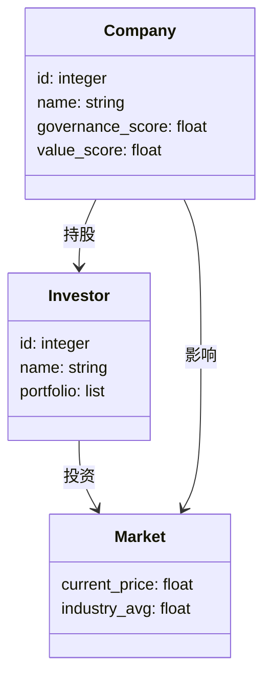

                 


# 马丁·惠特曼的公司治理价值投资：推动管理改善

> 关键词：公司治理，价值投资，管理改善，数学模型，系统架构，项目实战

> 摘要：本文深入探讨了马丁·惠特曼的公司治理与价值投资理念，结合数学模型和系统架构设计，分析了如何通过公司治理优化推动企业价值提升。文章从背景介绍、核心概念、算法原理、系统分析、项目实战到最佳实践，全面阐述了公司治理与价值投资的结合，为企业管理者和投资者提供了实用的理论与实践指导。

---

## 第1章 公司治理与价值投资的背景与概述

### 1.1 公司治理的基本概念

#### 1.1.1 公司治理的定义
公司治理是通过一系列规则、制度和机制来确保公司有效运作和股东利益最大化的过程。它涉及股东、董事会、管理层和利益相关者之间的权责分配与制衡。

#### 1.1.2 公司治理的核心要素
公司治理的核心要素包括：
1. **股权结构**：股东的持股比例和权利分配。
2. **董事会结构**：董事会的组成、职责和运作方式。
3. **管理层责任**：管理层的职责、权限和激励机制。
4. **透明度与披露**：公司信息披露的规范性和及时性。
5. **利益相关者关系**：公司与股东、员工、客户等利益相关者的关系管理。

#### 1.1.3 公司治理的目标与作用
公司治理的目标是实现公司价值最大化，同时保护股东和其他利益相关者的权益。其作用包括：
1. 提高公司决策的透明度和科学性。
2. 防范公司内部风险和舞弊行为。
3. 增强投资者信心，提升公司市场价值。

### 1.2 价值投资的基本概念

#### 1.2.1 价值投资的定义
价值投资是一种以低于公司内在价值的价格买入优质股票的投资策略，强调长期持有和价值发现。

#### 1.2.2 价值投资的核心原则
价值投资的核心原则包括：
1. **安全边际**：买入价格低于公司内在价值，以降低风险。
2. **长期视角**：关注公司长期盈利能力，而非短期市场波动。
3. **基本面分析**：通过财务报表等基本面信息评估公司价值。

#### 1.2.3 价值投资与公司治理的关系
价值投资不仅关注公司的财务表现，还关注公司治理结构的健康性。良好的公司治理是公司长期价值的重要保障，而价值投资者也通过积极参与公司治理，推动管理层优化公司运营。

### 1.3 公司治理与价值投资的结合

#### 1.3.1 公司治理与价值投资的内在联系
公司治理的优劣直接影响公司的长期价值，而价值投资则通过市场定价揭示公司治理的优劣。两者的结合能够推动公司治理的持续优化，进而提升公司市场价值。

#### 1.3.2 价值投资如何推动公司治理改善
价值投资者通过持有公司股份，积极参与公司治理，推动管理层优化公司治理结构，提高公司透明度和决策效率。

#### 1.3.3 公司治理对价值投资的影响
良好的公司治理能够增强投资者信心，降低投资风险，从而吸引更多的价值投资者，提升公司市场价值。

---

## 第2章 公司治理与价值投资的核心概念与联系

### 2.1 公司治理的核心概念

#### 2.1.1 股东与管理层的权责关系
股东作为公司所有者，享有收益权和决策权；管理层负责公司日常运营，确保股东利益最大化。

#### 2.1.2 公司治理的结构与流程
公司治理结构包括董事会、监事会和管理层，通过股东大会、董事会会议等形式进行决策和监督。

#### 2.1.3 公司治理的外部环境影响
外部环境如法律法规、市场环境和文化环境对公司治理结构和运作方式有重要影响。

### 2.2 价值投资的核心概念

#### 2.2.1 价值投资的内在价值计算
内在价值是基于公司未来现金流的现值，计算公式为：
$$ V = \sum_{t=1}^{n} \frac{CF_t}{(1+r)^t} $$
其中，$CF_t$ 是第 $t$ 年的现金流，$r$ 是折现率，$n$ 是预测期。

#### 2.2.2 价值投资的市场周期分析
价值投资强调逆周期操作，即在市场低迷时买入优质资产，在市场高估时卖出。

#### 2.2.3 价值投资的风险管理
价值投资者通过分散投资、严格估值和设置止损位来管理投资风险。

### 2.3 公司治理与价值投资的联系与区别

#### 2.3.1 公司治理与价值投资的联系
两者都关注公司的长期价值，且良好的公司治理是价值投资的重要保障。

#### 2.3.2 公司治理与价值投资的区别
公司治理是公司内部管理机制，而价值投资是外部投资者的选股策略。

#### 2.3.3 公司治理与价值投资的综合分析
公司治理与价值投资相辅相成，前者为后者提供坚实基础，后者通过市场机制推动前者优化。

---

## 第3章 公司治理与价值投资的数学模型与算法

### 3.1 公司治理的数学模型

#### 3.1.1 公司治理的评价指标体系
公司治理评价指标包括透明度、董事会效率、管理层激励和利益相关者保护等。

#### 3.1.2 公司治理的评分模型
公司治理评分模型将各评价指标赋予权重，通过加权求和计算公司治理评分：
$$ Score = \sum_{i=1}^{n} w_i \cdot s_i $$
其中，$w_i$ 是第 $i$ 个指标的权重，$s_i$ 是第 $i$ 个指标的评分。

#### 3.1.3 公司治理的优化算法
公司治理优化算法包括遗传算法、模拟退火等，用于寻找最佳公司治理结构。

### 3.2 价值投资的数学模型

#### 3.2.1 价值投资的内在价值计算公式
内在价值计算公式：
$$ V = \frac{CF}{r - g} $$
其中，$CF$ 是永续年金的现金流，$r$ 是折现率，$g$ 是增长率。

#### 3.2.2 价值投资的市场价值评估模型
市场价值评估模型基于市场平均收益率和无风险收益率，计算股票的合理价格：
$$ P = \frac{D}{k} $$
其中，$D$ 是股息，$k$ 是要求的收益率。

#### 3.2.3 价值投资的风险评估公式
风险调整后的价值模型：
$$ V_{\text{risk-adjusted}} = V \times (1 - \beta \cdot (r_m - r_f)) $$
其中，$\beta$ 是股票的贝塔系数，$r_m$ 是市场收益率，$r_f$ 是无风险收益率。

---

## 第4章 系统分析与架构设计方案

### 4.1 问题场景介绍
本文构建一个公司治理与价值投资结合的系统，用于评估公司治理对价值投资的影响。

### 4.2 项目介绍
项目名称：公司治理与价值投资结合系统。

### 4.3 系统功能设计
#### 4.3.1 领域模型类图


#### 4.4 系统架构设计


---

## 第5章 项目实战

### 5.1 环境安装
需要安装Python、Jupyter Notebook和相关库（如numpy、pandas、scikit-learn）。

### 5.2 系统核心实现源代码
```python
def calculate_governance_score(company):
    # 计算公司治理评分的代码
    pass

def calculate_value_score(company):
    # 计算公司价值评分的代码
    pass

def main():
    company = input("请输入公司名称：")
    governance_score = calculate_governance_score(company)
    value_score = calculate_value_score(company)
    print(f"{company}的公司治理评分为{governance_score}，价值评分为{value_score}")

if __name__ == "__main__":
    main()
```

### 5.3 代码应用解读与分析
通过代码实现公司治理评分和价值评分的计算，帮助投资者识别具有良好治理和价值低估的公司。

### 5.4 实际案例分析
以某公司为例，分析其公司治理和价值评分，指导投资者进行价值投资。

### 5.5 项目小结
通过项目实战，验证了公司治理与价值投资结合的有效性，为投资者提供了实用工具。

---

## 第6章 最佳实践与小结

### 6.1 小结
本文通过理论分析、模型构建和项目实战，深入探讨了公司治理与价值投资的结合，为推动管理改善提供了有效方法。

### 6.2 注意事项
投资者在进行价值投资时，需注意市场风险、公司治理风险和模型局限性。

### 6.3 拓展阅读
推荐阅读《价值》（李录著）、《公司治理》（张维著）等书籍，深入了解公司治理与价值投资的更多内容。

---

## 作者：AI天才研究院 & 禅与计算机程序设计艺术

---

本文通过系统性地分析公司治理与价值投资的结合，为投资者和企业管理者提供了理论与实践的双重指导，帮助他们在复杂多变的商业环境中实现长期价值最大化。

