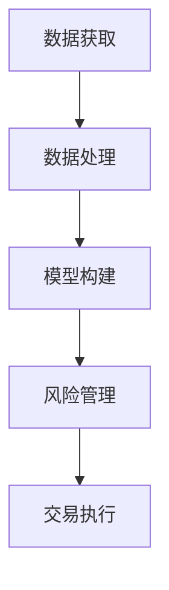

                 


# 马丁·惠特曼的资产负债表套利方法

## 关键词：套利，资产负债表，金融策略，风险管理，模型构建

## 摘要

马丁·惠特曼的资产负债表套利方法是一种利用金融市场中资产定价差异进行套利的策略，通过分析资产负债表中的各项数据，识别潜在的套利机会。本文详细介绍了该方法的理论基础、核心策略、风险分析以及实际应用，帮助读者理解并掌握这种高效的金融套利方法。

---

## 目录大纲

1. 套利的基本概念与背景
   - 1.1 套利的定义与原理
   - 1.2 资产负债表套利的背景
   - 1.3 马丁·惠特曼的套利方法概述

2. 套利的理论基础
   - 2.1 套利的经济学原理
   - 2.2 资产负债表分析的基本原理
   - 2.3 套利的风险与收益

3. 马丁·惠特曼套利方法的核心策略
   - 3.1 确定套利机会
   - 3.2 构建套利组合
   - 3.3 套利方法的数学模型

4. 套利策略的分析与优化
   - 4.1 套利机会的选择与评估
   - 4.2 套利策略的风险管理
   - 4.3 套利模型的优化与改进

5. 套利系统的分析与架构设计
   - 5.1 套利系统的组成模块
   - 5.2 系统功能设计与实现
   - 5.3 系统架构设计与优化

6. 套利项目实战
   - 6.1 环境配置与工具安装
   - 6.2 核心代码实现与解读
   - 6.3 实际案例分析与结果解读

---

## 正文内容

### 第1章: 套利的基本概念与背景

#### 1.1 套利的定义与原理

套利是指在不同的市场或资产之间利用价格差异进行买卖，以获取无风险收益的行为。其核心原理是利用市场中的价格不一致，通过同时买入低估资产和卖出高估资产，最终在价格收敛时获利。

#### 1.2 资产负债表套利的背景

资产负债表套利是通过分析公司的资产负债表，识别资产和负债的市场价值与账面价值之间的差异，寻找套利机会。这种方法尤其适用于市场定价效率较低的资产类别。

#### 1.3 马丁·惠特曼的套利方法概述

马丁·惠特曼以其独特的套利策略闻名，他主要关注于通过分析资产负债表中的各项数据，寻找市场定价错误的机会。他的方法结合了基本面分析和量化分析，能够在复杂市场环境中找到套利机会。

---

### 第2章: 套利的理论基础

#### 2.1 套利的经济学原理

套利是市场中价格差异的自然消除机制，通过套利者的行为，市场会趋于均衡。无套利定价理论指出，如果存在无套利机会，资产的理论价格应等于其市场价。

#### 2.2 资产负债表分析的基本原理

资产负债表分析是套利的重要工具，通过分析公司的资产、负债和所有者权益，识别其市场价值与账面价值的差异，从而找到套利机会。

#### 2.3 套利的风险与收益

套利的潜在收益取决于市场中的价格差异，而风险则主要来自市场波动、流动性风险和模型风险。合理的风险管理是套利成功的关键。

---

### 第3章: 马丁·惠特曼套利方法的核心策略

#### 3.1 确定套利机会

通过分析市场数据和公司财务报表，识别资产定价错误的机会。这需要对市场趋势、公司基本面和市场流动性有深刻的理解。

#### 3.2 构建套利组合

根据套利机会，构建相应的投资组合，确保组合在市场中具有对冲风险的能力。这通常涉及到多资产组合的构建和风险对冲。

#### 3.3 套利方法的数学模型

套利的数学模型是通过量化方法，计算资产的理论价格与实际市场价格之间的差异，从而确定套利机会。以下是一个简单的套利模型示例：

$$ \text{套利收益} = \text{资产市场价} - \text{资产理论价} $$

---

### 第4章: 套利策略的分析与优化

#### 4.1 套利机会的选择与评估

选择套利机会时，需考虑市场的流动性、波动性和套利空间的大小。评估套利机会的关键在于对市场趋势和资产价格波动的准确判断。

#### 4.2 套利策略的风险管理

有效的风险管理是套利成功的关键。马丁·惠特曼的套利方法通常采用对冲策略，降低市场波动带来的风险。

#### 4.3 套利模型的优化与改进

通过不断优化套利模型，提高模型的准确性和稳定性。这包括对市场数据的实时跟踪和模型参数的动态调整。

---

### 第5章: 套利系统的分析与架构设计

#### 5.1 套利系统的组成模块

套利系统通常包括数据获取模块、模型构建模块和风险管理模块。数据获取模块负责收集市场数据，模型构建模块进行套利机会的识别，风险管理模块控制投资风险。

#### 5.2 系统功能设计与实现

套利系统的功能设计需要涵盖数据处理、模型构建、风险管理和交易执行等模块。以下是一个简化的系统架构图：



#### 5.3 系统架构设计与优化

系统架构设计需要考虑系统的可扩展性、稳定性和高效性。通过模块化设计和分布式架构，可以提高系统的运行效率和稳定性。

---

### 第6章: 套利项目实战

#### 6.1 环境配置与工具安装

套利项目需要安装必要的工具和环境，如编程语言（Python）、数据分析库（Pandas）和可视化库（Matplotlib）。

#### 6.2 核心代码实现与解读

以下是马丁·惠特曼套利方法的核心代码示例：

```python
import pandas as pd

def calculate_arbitrage_opportunity(data):
    # 计算理论价格
    theoretical_price = data['理论价格']
    # 计算实际市场价格
    market_price = data['市场价格']
    # 计算套利机会
    arbitrage_opportunity = market_price - theoretical_price
    return arbitrage_opportunity

# 示例数据
data = {
    '理论价格': [100, 105, 110],
    '市场价格': [98, 103, 108]
}

# 调用函数计算套利机会
opportunity = calculate_arbitrage_opportunity(data)
print(opportunity)
```

#### 6.3 实际案例分析与结果解读

通过实际案例分析，验证套利方法的有效性和可行性。案例分析应包括数据收集、模型构建和结果解读等步骤，确保套利策略的实际应用价值。

---

## 结语

马丁·惠特曼的资产负债表套利方法是一种高效的风险管理策略，通过分析市场数据和公司财务报表，识别套利机会，实现无风险收益。本文详细介绍了该方法的理论基础、核心策略、系统设计和实际应用，为读者提供了全面的指导。

---

## 作者：AI天才研究院 & 禅与计算机程序设计艺术

---

### 注意事项

1. 本文内容仅供参考，不构成投资建议。
2. 套利交易存在风险，请根据自身风险承受能力谨慎操作。
3. 如需进一步了解，可参考相关金融文献和专业书籍。

