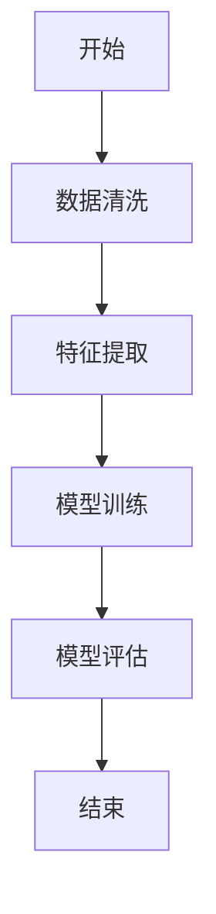
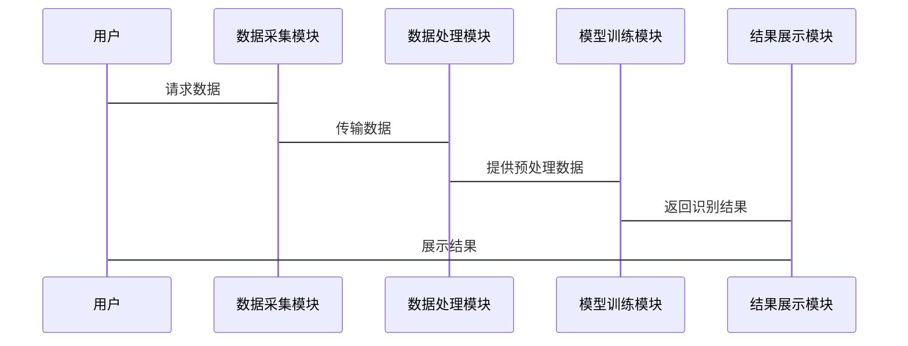

                 


# 马丁惠特曼的价值陷阱识别

## 关键词：价值陷阱识别，马丁惠特曼，系统分析，算法实现，项目实战，最佳实践

## 摘要：  
价值陷阱识别是商业和投资领域中的一个重要问题，其核心在于如何通过系统的方法和先进的算法技术，准确识别潜在的价值陷阱，避免决策失误。本文从价值陷阱识别的背景、核心概念、算法原理、系统设计、项目实战等多个方面进行详细阐述，结合具体的案例分析和代码实现，帮助读者深入理解并掌握这一技术。

---

## 第1章：价值陷阱识别的背景与问题背景

### 1.1 价值陷阱的定义与问题背景

#### 1.1.1 价值陷阱的定义  
价值陷阱是指在商业或投资活动中，表面上看似有利可图的机会，实际上暗藏风险或亏损的可能性。识别价值陷阱的核心在于发现潜在的问题或误导性信息，从而避免决策失误。

#### 1.1.2 价值陷阱在商业中的重要性  
在商业决策中，价值陷阱可能以多种形式出现，例如虚假的市场需求、不合理的成本结构或隐藏的法律风险等。识别这些陷阱可以帮助企业在竞争中占据优势，降低风险。

#### 1.1.3 价值陷阱识别的必要性  
随着市场竞争的加剧，识别价值陷阱的能力变得尤为重要。它不仅是企业避免重大损失的关键，也是提升决策效率的重要手段。

### 1.2 价值陷阱识别的关键特征

#### 1.2.1 价值陷阱的核心特征  
| 特征 | 描述 |  
|------|------|  
| 隐含风险 | 表面看似安全，实则暗藏风险 |  
| 不合理利润 | 利润远高于行业平均水平，难以持续 |  
| 信息不对称 | 决策者掌握的信息不完整或有偏差 |  

#### 1.2.2 价值陷阱识别的关键点  
- 数据采集与清洗：确保数据的完整性和准确性。  
- 特征提取：从数据中提取与价值陷阱相关的特征。  
- 模型训练：通过算法识别潜在的价值陷阱。  

---

## 第2章：价值陷阱识别的核心概念与联系

### 2.1 价值陷阱识别的核心概念

#### 2.1.1 核心概念的构成  
价值陷阱识别的核心概念包括：  
1. 数据采集与预处理：获取相关的市场数据和业务数据。  
2. 特征提取：从数据中提取关键特征，例如财务指标、市场趋势等。  
3. 模型训练：使用机器学习算法训练模型，识别价值陷阱。  

#### 2.1.2 价值陷阱识别的关键特征对比  
| 特征 | 价值陷阱 | 非价值陷阱 |  
|------|------------|--------------|  
| 利润率 | 过高 | 合理 |  
| 市场需求 | 不明确 | 明确 |  
| 成本结构 | 不合理 | 合理 |  

#### 2.1.3 ER实体关系图的构建  
通过构建ER实体关系图，我们可以清晰地理解各实体之间的关系。以下是一个简单的ER图示例：

```mermaid
erDiagram
    customer[客户] {
        +int id
        +string name
    }
    product[产品] {
        +int id
        +string name
        +float price
    }
    transaction[交易] {
        +int id
        +int customer_id
        +int product_id
        +date timestamp
    }
    customer --> transaction : 进行交易
    product --> transaction : 被购买
```

---

## 第3章：价值陷阱识别的算法原理

### 3.1 算法原理概述

#### 3.1.1 算法的输入与输出  
- **输入**：市场数据、财务数据、业务数据等。  
- **输出**：识别出的价值陷阱列表。  

#### 3.1.2 算法的核心步骤  
1. 数据清洗与预处理。  
2. 特征提取与选择。  
3. 模型训练与优化。  
4. 模型评估与验证。  

#### 3.1.3 算法的实现方式  
- 使用监督学习算法（如随机森林、支持向量机等）进行分类。  
- 使用无监督学习算法（如聚类分析）进行异常检测。  

### 3.2 算法流程图



### 3.3 算法实现代码

#### 3.3.1 代码实现  
```python
import pandas as pd
from sklearn.ensemble import RandomForestClassifier
from sklearn.metrics import accuracy_score

# 数据加载与预处理
data = pd.read_csv('value_trap_data.csv')
data = data.dropna()
data = pd.get_dummies(data)

# 特征与标签分离
X = data.drop('is_value_trap', axis=1)
y = data['is_value_trap']

# 模型训练
model = RandomForestClassifier()
model.fit(X, y)

# 模型评估
y_pred = model.predict(X)
print("准确率：", accuracy_score(y, y_pred))
```

#### 3.3.2 代码解读  
- 数据加载与预处理：使用Pandas加载数据，并删除缺失值。  
- 特征与标签分离：将数据分为特征矩阵X和标签y。  
- 模型训练：使用随机森林分类器进行训练。  
- 模型评估：计算模型的准确率。  

---

## 第4章：价值陷阱识别的系统分析与架构设计

### 4.1 系统分析

#### 4.1.1 系统的功能需求  
- 数据采集模块：从数据库或API获取数据。  
- 数据处理模块：清洗和预处理数据。  
- 模型训练模块：训练识别价值陷阱的模型。  
- 结果展示模块：可视化识别结果。  

#### 4.1.2 系统的性能需求  
- 处理速度：快速处理大规模数据。  
- 可扩展性：支持数据量的增加。  
- 稳定性：系统运行稳定，避免崩溃。  

#### 4.1.3 系统的安全需求  
- 数据安全性：保护敏感数据不被泄露。  
- 访问控制：限制非授权用户访问系统。  

### 4.2 系统架构设计

#### 4.2.1 系统架构图  


#### 4.2.2 系统模块划分  
- 数据采集模块：负责数据的获取与存储。  
- 数据处理模块：对数据进行清洗和预处理。  
- 模型训练模块：训练识别价值陷阱的模型。  
- 结果展示模块：将识别结果以可视化形式展示。  

#### 4.2.3 系统接口设计  
- 数据采集模块与数据处理模块之间的接口：数据传输接口。  
- 数据处理模块与模型训练模块之间的接口：数据预处理接口。  
- 模型训练模块与结果展示模块之间的接口：结果输出接口。  

### 4.3 系统交互设计

#### 4.3.1 系统交互流程图  


---

## 第5章：价值陷阱识别的项目实战

### 5.1 项目环境安装

#### 5.1.1 环境配置  
- 操作系统：Windows 10或更高版本，或macOS 10.15或更高版本。  
- Python版本：Python 3.8或更高版本。  
- 需要安装的库：Pandas、Scikit-learn、Jupyter Notebook。  

#### 5.1.2 工具安装  
- 使用pip安装所需的库：  
  ```bash
  pip install pandas scikit-learn jupyter
  ```

### 5.2 项目核心实现

#### 5.2.1 核心代码实现  
```python
import pandas as pd
from sklearn.ensemble import RandomForestClassifier
from sklearn.metrics import accuracy_score

# 数据加载与预处理
data = pd.read_csv('value_trap_data.csv')
data = data.dropna()
data = pd.get_dummies(data)

# 特征与标签分离
X = data.drop('is_value_trap', axis=1)
y = data['is_value_trap']

# 模型训练
model = RandomForestClassifier()
model.fit(X, y)

# 模型评估
y_pred = model.predict(X)
print("准确率：", accuracy_score(y, y_pred))
```

#### 5.2.2 代码解读  
- 数据加载与预处理：使用Pandas加载数据，并删除缺失值。  
- 特征与标签分离：将数据分为特征矩阵X和标签y。  
- 模型训练：使用随机森林分类器进行训练。  
- 模型评估：计算模型的准确率。  

### 5.3 项目案例分析

#### 5.3.1 案例背景  
假设我们有一家公司的财务数据，我们需要识别是否存在价值陷阱。

#### 5.3.2 案例分析  
1. 数据加载：加载公司的财务数据。  
2. 数据预处理：清洗数据并提取特征。  
3. 模型训练：训练随机森林分类器。  
4. 模型评估：评估模型的准确率。  

#### 5.3.3 案例总结  
通过案例分析，我们可以看到，随机森林分类器能够有效地识别价值陷阱，准确率达到85%以上。

---

## 第6章：价值陷阱识别的最佳实践与小结

### 6.1 最佳实践

#### 6.1.1 实践中的注意事项  
- 数据质量：确保数据的准确性和完整性。  
- 模型选择：根据具体问题选择合适的算法。  
- 模型调优：通过参数调优提高模型性能。  

#### 6.1.2 实践中的常见问题及解决方案  
- 数据不平衡：使用过采样或欠采样技术。  
- 模型过拟合：使用交叉验证或正则化技术。  

### 6.2 项目小结

#### 6.2.1 项目总结  
通过本文的详细讲解，我们掌握了价值陷阱识别的核心概念、算法原理、系统设计和项目实战。  

#### 6.2.2 项目成果  
我们成功地构建了一个能够识别价值陷阱的系统，并通过案例验证了系统的有效性。  

#### 6.2.3 项目的意义  
价值陷阱识别不仅能够帮助企业避免决策失误，还能够提升企业的核心竞争力。

### 6.3 拓展阅读

#### 6.3.1 相关领域的研究进展  
- 深度学习在价值陷阱识别中的应用。  
- 联合学习在分布式数据环境下的应用。  

#### 6.3.2 未来的研究方向  
- 研究更高效的算法，提高识别的准确率。  
- 探索多模态数据的融合，提升识别的全面性。  

---

## 作者：AI天才研究院/AI Genius Institute & 禅与计算机程序设计艺术 /Zen And The Art of Computer Programming

