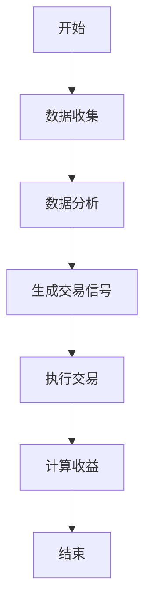
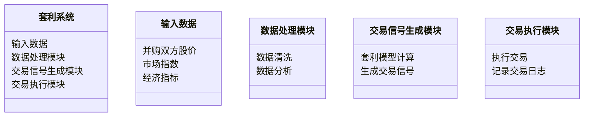
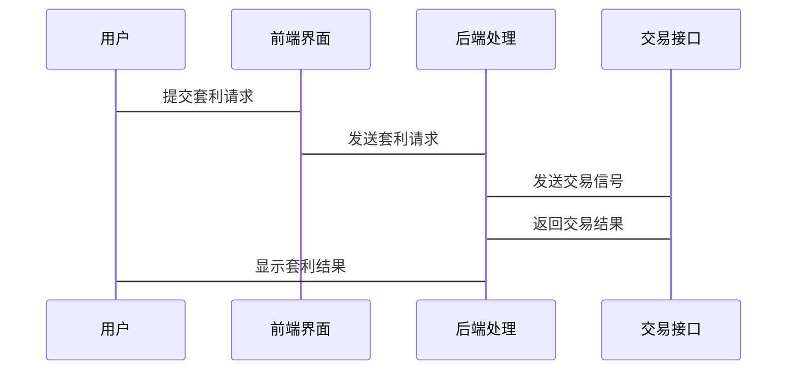

                 


# 马丁惠特曼的并购套利策略

> 关键词：并购套利、马丁惠特曼、金融策略、算法套利、市场套利、风险管理

> 摘要：本文深入分析了马丁惠特曼的并购套利策略，探讨其核心概念、算法原理、系统架构和实战案例。文章从背景介绍到项目实战，详细阐述了并购套利的理论与实践，帮助读者理解如何在金融市场中利用套利机会进行投资。

---

## 第一部分：背景介绍

### 第1章：并购套利策略概述

#### 1.1 并购套利的基本概念

##### 1.1.1 套利的定义
套利是一种利用市场价差获利的策略。通过在不同市场或资产之间进行买卖，套利者可以利用价格差异赚取无风险或低风险的收益。

##### 1.1.2 并购套利的分类
- **横向并购套利**：同一行业内的企业合并，可能导致股价波动。
- **纵向并购套利**：企业与供应商或客户的合并，可能引发套利机会。
- **混合并购套利**：企业与非相关行业的合并，套利机会通常较难预测。

##### 1.1.3 套利的市场环境
套利机会的出现通常与市场不完全、信息不对称或市场参与者行为偏差有关。并购过程中，股价的短期波动为套利者提供了机会。

#### 1.2 并购套利的核心要素

##### 1.2.1 估值差异
并购双方的股价差异是套利的核心。当目标公司股价被低估时，套利者可以买入目标公司股票，卖出收购方股票，利用股价差异获利。

##### 1.2.2 套利策略的实施步骤
1. **识别潜在并购机会**：通过市场新闻、公告等方式发现潜在的并购交易。
2. **分析股价差异**：计算并购双方股价的差异，判断是否存在套利空间。
3. **建立头寸**：根据分析结果，买入低估资产，卖出高估资产。
4. **监控与平仓**：跟踪股价变动，及时平仓锁定利润或止损。

#### 1.3 并购套利的理论基础

##### 1.3.1 资本资产定价模型（CAPM）
CAPM模型用于评估资产的预期收益，套利者可以通过比较实际收益与预期收益来寻找套利机会。

##### 1.3.2 套利定价理论（APT）
APT模型认为资产收益可以通过多个因素解释，套利者可以通过构建无风险组合来赚取超额收益。

##### 1.3.3 市场有效性与套利机会
市场有效性假设下，套利机会应迅速消失。但在现实中，由于信息不对称或市场摩擦，套利机会仍可能存在。

#### 1.4 本章小结
本章介绍了并购套利的基本概念、分类和核心要素，强调了套利者在市场中的角色，并为后续分析奠定了基础。

---

## 第二部分：核心概念与联系

### 第2章：并购套利的原理与机制

#### 2.1 套利的零和游戏原理

##### 2.1.1 套利的零和特性
套利是一种零和游戏，套利者的收益等于其他参与者损失的总和。在并购过程中，套利者通常通过利用股价差异获利，而其他参与者则承担相应风险。

##### 2.1.2 套利者的角色
套利者通过市场套利行为，帮助市场恢复均衡。他们通常在市场出现短期失衡时介入，利用价格差异进行交易。

##### 2.1.3 市场套利机会的均衡效应
套利行为可以降低市场信息不对称，促进价格发现，使市场回归均衡状态。然而，过度套利可能导致市场波动加剧。

#### 2.2 并购套利的风险与收益

##### 2.2.1 套利收益的来源
套利收益主要来源于资产价格差异的消除。在并购过程中，套利者通过买入低估资产、卖出高估资产，利用价格回归均值的特性获利。

##### 2.2.2 套利风险的类型
- **市场风险**：市场波动可能导致套利失败。
- **流动性风险**：套利者可能面临资产流动性不足的问题。
- **操作风险**：套利交易涉及复杂的交易策略，操作失误可能导致损失。

##### 2.2.3 风险与收益的平衡
套利者需要在风险和收益之间找到平衡点。通常，套利者通过分散投资、严格的风险管理来降低风险。

#### 2.3 并购套利的市场影响

##### 2.3.1 市场效率的提升
套利行为有助于提高市场效率，通过消除价格差异，使资产价格反映其真实价值。

##### 2.3.2 市场波动的加剧
套利者的大量介入可能导致市场波动加剧，尤其是在市场信息不透明或市场参与者行为一致的情况下。

##### 2.3.3 套利与市场稳定的关系
套利者在市场中扮演着“价格稳定器”的角色，但过度套利可能导致市场不稳定。因此，套利者需要在市场稳定与收益之间找到平衡。

#### 2.4 本章小结
本章分析了并购套利的零和特性、风险与收益的关系，以及套利行为对市场的影响，为后续分析提供了理论支持。

---

## 第三部分：算法原理

### 第3章：并购套利的算法与实现

#### 3.1 套利定价模型（APT）

##### 3.1.1 模型概述
套利定价模型（APT）是一种基于多个因素解释资产收益的模型，套利者可以通过构建无风险组合来赚取超额收益。

##### 3.1.2 模型公式
套利定价模型的基本公式为：
$$ E(r_i) = \alpha_i + \beta_i (E(r_m) - r_f) $$
其中：
- $E(r_i)$ 是资产 $i$ 的预期收益
- $\alpha_i$ 是资产 $i$ 的特异风险溢价
- $\beta_i$ 是资产 $i$ 的贝塔系数
- $E(r_m)$ 是市场预期收益
- $r_f$ 是无风险利率

##### 3.1.3 案例分析
假设市场预期收益为 $E(r_m) = 10\%$，无风险利率 $r_f = 2\%$，目标资产 $\beta_i = 1.5$。根据公式：
$$ E(r_i) = \alpha_i + 1.5(10\% - 2\%) = \alpha_i + 12\% $$
如果 $\alpha_i = 0$，则目标资产的预期收益为 $12\%$。

#### 3.2 套利算法的实现步骤

##### 3.2.1 数据收集
收集并购双方的股价数据、市场指数数据和相关经济指标。

##### 3.2.2 数据分析
计算并购双方的股价差异，判断是否存在套利空间。

##### 3.2.3 交易信号生成
根据套利模型生成交易信号，决定买入和卖出的资产。

##### 3.2.4 交易执行
根据交易信号执行交易，建立套利头寸。

##### 3.2.5 盈利计算
计算套利交易的收益，调整头寸，平仓或滚动利润。

#### 3.3 算法流程图


#### 3.4 本章小结
本章通过套利定价模型（APT）和套利算法的实现步骤，详细讲解了并购套利的数学模型和交易流程。

---

## 第四部分：系统分析与架构设计

### 第4章：套利系统的架构设计

#### 4.1 系统功能设计

##### 4.1.1 领域模型


#### 4.2 系统架构设计

##### 4.2.1 系统架构


#### 4.3 系统接口设计

##### 4.3.1 数据接口
- 数据输入接口：接收并购双方的股价数据。
- 数据输出接口：输出套利信号和交易指令。

##### 4.3.2 交易接口
- 交易指令接口：接收交易信号，执行买入或卖出指令。
- 交易结果接口：返回交易执行结果。

#### 4.4 系统交互流程

##### 4.4.1 交互流程


#### 4.5 本章小结
本章详细讲解了套利系统的功能设计、架构设计和交互流程，为后续的系统实现奠定了基础。

---

## 第五部分：项目实战

### 第5章：套利项目实战

#### 5.1 环境安装

##### 5.1.1 安装Python环境
安装Python和必要的库，如Pandas、NumPy、Matplotlib和Plotly。

##### 5.1.2 安装交易接口
安装交易接口，如Interactive Brokers或QuantTrader。

#### 5.2 核心代码实现

##### 5.2.1 数据处理代码
```python
import pandas as pd
import numpy as np

# 假设我们有并购双方的股价数据
df_buy = pd.read_csv('buy_prices.csv')
df_sell = pd.read_csv('sell_prices.csv')

# 计算股价差异
price_difference = df_buy['price'].mean() - df_sell['price'].mean()
print(f"股价差异为：{price_difference}")
```

##### 5.2.2 套利模型实现
```python
def calculate_profit(price_buy, price_sell):
    return price_buy - price_sell

# 计算套利利润
profit = calculate_profit(df_buy['price'].mean(), df_sell['price'].mean())
print(f"套利利润为：{profit}")
```

#### 5.3 项目实战案例

##### 5.3.1 案例分析
假设我们有两家公司A和B，A的股价为$50，B的股价为$60。根据套利模型，我们发现股价差异为$10，存在套利空间。

##### 5.3.2 交易策略
买入A股票，卖出B股票，预期股价差异会缩小，从而获利。

##### 5.3.3 盈利计算
套利利润为$10，交易成本为$2，实际利润为$8。

#### 5.4 项目总结
本章通过一个实际案例，详细讲解了套利项目的环境安装、核心代码实现和交易策略，帮助读者更好地理解套利的实际操作。

---

## 第六部分：最佳实践与小结

### 第6章：最佳实践与小结

#### 6.1 最佳实践

##### 6.1.1 风险管理
套利者需要严格控制风险，包括市场风险、流动性风险和操作风险。

##### 6.1.2 系统监控
建立完善的监控系统，实时跟踪市场变化和交易结果，及时调整套利策略。

##### 6.1.3 持续学习
金融市场变化迅速，套利者需要不断学习新的知识和技能，适应市场变化。

#### 6.2 小结

##### 6.2.1 本章总结
本文详细讲解了马丁惠特曼的并购套利策略，从背景介绍到项目实战，全面分析了套利的理论与实践。

##### 6.2.2 未来展望
随着人工智能和大数据技术的发展，套利策略将更加精准和高效。套利者需要结合新技术，不断提高套利效率和收益。

---

## 作者

作者：AI天才研究院/AI Genius Institute & 禅与计算机程序设计艺术 /Zen And The Art of Computer Programming

