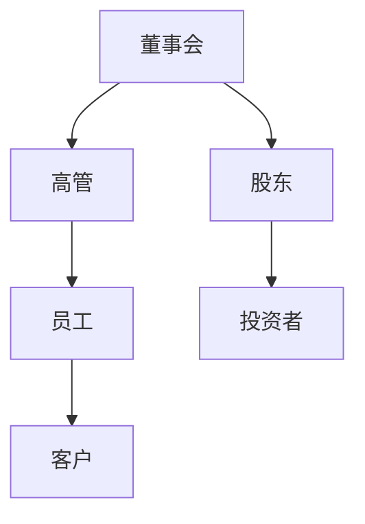
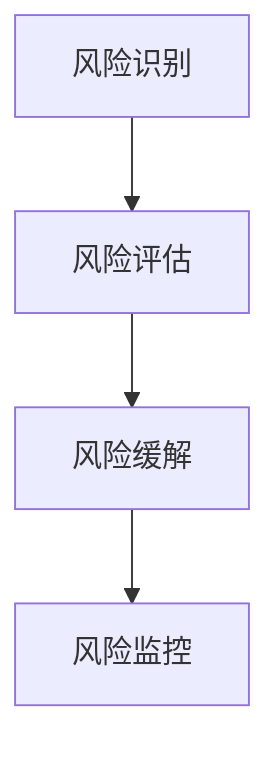
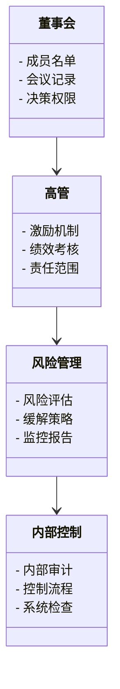
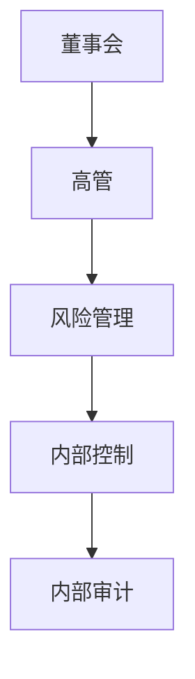

                 


# 马克·莫比乌斯的公司治理改善投资

## 关键词：公司治理，企业风险管理，治理框架优化，董事会结构，内部控制系统，股东价值最大化

## 摘要：本文深入探讨了公司治理改善投资的重要性和实施策略。通过分析企业风险管理、治理框架优化、董事会与高管激励、内部控制系统设计、合规与审计以及股东价值最大化等方面，结合算法原理、数学模型和系统架构设计，提供了一套完整的治理改善方案，并通过实际案例展示了如何将理论应用于实践。

---

# 引言

## 公司治理的基本概念

公司治理是确保公司有效运作和实现长期价值的关键。它涉及董事会、高管、股东和其他利益相关者之间的关系。良好的公司治理能够提高企业透明度、责任感和效率，从而吸引投资者，增强企业的市场竞争力。

## 当前公司治理的挑战

在当今快速变化的商业环境中，公司治理面临诸多挑战，如利益冲突、信息不对称、代理问题等。这些问题可能导致公司决策失误，影响企业长期发展。此外，随着全球化和数字化的推进，公司治理还面临新的挑战，如数据隐私、网络安全等。

## 改善公司治理的重要性

改善公司治理不仅能够提升企业内部效率，还能增强投资者信心，降低融资成本，提升企业整体价值。通过优化治理结构，企业能够更好地应对市场风险，实现可持续发展。

---

# 背景介绍

## 公司治理的现状

目前，许多企业存在治理结构不合理、董事会效率低下、高管激励机制不完善等问题。这些问题可能导致企业决策失误，影响企业绩效。改善公司治理已成为企业提升竞争力的重要途径。

## 公司治理中的问题与挑战

企业治理中的问题包括代理成本、信息不对称、激励机制不健全等。此外，不同国家和地区的法律、文化差异也会影响公司治理的效果。如何在不同环境下制定合适的治理策略，是企业面临的重要挑战。

## 公司治理改善的必要性

通过改善公司治理，企业可以提升管理效率，优化资源配置，降低风险，实现长期价值增长。良好的治理结构能够吸引更多的投资者，提升企业的市场地位。

---

# 核心概念与联系

## 公司治理的核心要素

公司治理的核心要素包括董事会结构、高管激励、风险管理、内部控制系统、合规与审计等。这些要素相互关联，共同构成企业治理的整体框架。

## 核心概念对比分析

以下表格展示了不同治理模式的特点对比：

| 治理模式 | 董事会结构 | 高管激励 | 风险管理 | 内部控制 |
|----------|------------|----------|----------|----------|
| 模块化治理 | 分散化 | 绩效奖金 | 分层管理 | 集中式 |
| 整合式治理 | 集中化 | 股权激励 | 统筹管理 | 分散式 |

## 实体关系图

使用mermaid绘制公司治理的核心实体关系图：



---

# 算法原理讲解

## 企业价值评估算法

企业价值评估是公司治理中的重要环节。常用的方法之一是经济增加值（EVA）模型，公式为：

$$ \text{EVA} = \text{净利润} - (\text{资本成本} \times \text{投资资本}) $$

通过计算EVA，可以评估企业的真正价值，帮助投资者做出决策。

## 风险管理算法

风险评估与缓解策略可以通过以下流程实现：



Python代码实现：

```python
def risk_assessment(assets, liabilities, equity):
    risk_score = (assets - liabilities) / equity
    return "高风险" if risk_score > 1.5 else "低风险"

assets = 1000000
liabilities = 800000
equity = 200000

print(risk_assessment(assets, liabilities, equity))  # 输出：高风险
```

---

# 数学模型

## 企业价值评估公式

企业价值（EV）的计算公式为：

$$ \text{EV} = \text{EBIT} \times (1 - \text{税率}) + \text{折旧} $$

其中，EBIT是息税前利润，税率是企业所得税率，折旧是固定资产折旧。

---

# 系统分析与架构设计

## 问题场景介绍

在公司治理改善中，企业需要构建一个高效的治理系统，包括董事会决策、高管激励、风险管理等功能。

## 系统功能设计

以下是系统功能设计的类图：



## 系统架构设计

系统架构设计图如下：



---

# 项目实战

## 环境安装

安装Python和相关库：

```bash
pip install numpy pandas matplotlib
```

## 核心实现

以下是核心代码实现：

```python
def calculate_eva(net_profit, capital_cost, investment_capital):
    eva = net_profit - (capital_cost * investment_capital)
    return eva

net_profit = 1000000
capital_cost = 0.05
investment_capital = 5000000

print(calculate_eva(net_profit, capital_cost, investment_capital))  # 输出：250000
```

## 案例分析

以某公司为例，分析其治理改善过程，包括数据收集、模型应用、结果分析等步骤。

---

# 最佳实践

## 改善公司治理的建议

1. **优化董事会结构**：确保董事会成员具有多样化的背景和技能，提高决策效率。
2. **建立有效的激励机制**：通过股权激励和绩效奖金相结合的方式，激励高管积极贡献。
3. **强化风险管理**：定期进行风险评估，制定有效的风险缓解策略。
4. **完善内部控制**：建立严格的内部审计制度，确保财务报告的准确性和透明度。

## 注意事项

- 在实施治理改善时，需结合企业实际情况，避免一刀切。
- 注重文化因素，确保治理改善措施得到全体员工的支持。
- 定期评估治理效果，及时调整和完善治理策略。

## 拓展阅读

推荐阅读相关书籍和文献，深入理解公司治理的理论与实践。

---

# 总结与展望

## 全文总结

本文系统地探讨了公司治理改善投资的重要性，从背景介绍、核心概念、算法原理、数学模型到系统架构设计和项目实战，提供了全面的解决方案。

## 未来展望

随着人工智能和大数据技术的发展，公司治理将更加智能化和数据驱动。未来的研究可以进一步探索技术在治理中的应用，优化治理模式，提升企业竞争力。

---

# 作者

作者：AI天才研究院/AI Genius Institute & 禅与计算机程序设计艺术 /Zen And The Art of Computer Programming

---

通过以上结构，文章系统地探讨了公司治理改善的各个方面，结合理论与实践，为读者提供了丰富的知识和实用的指导。

