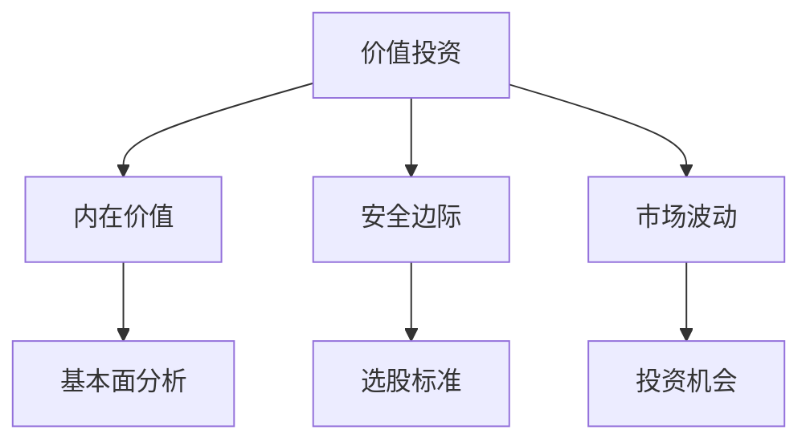
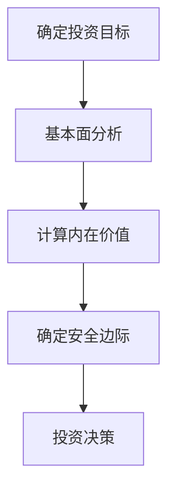
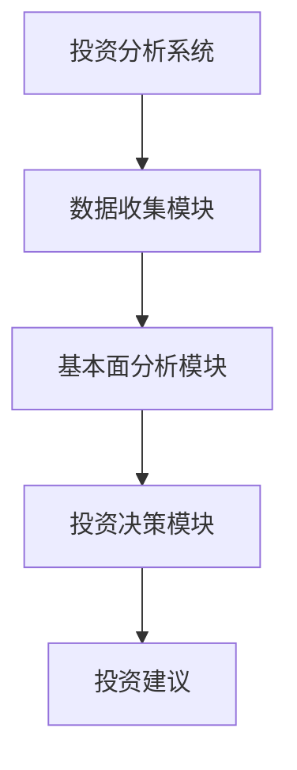
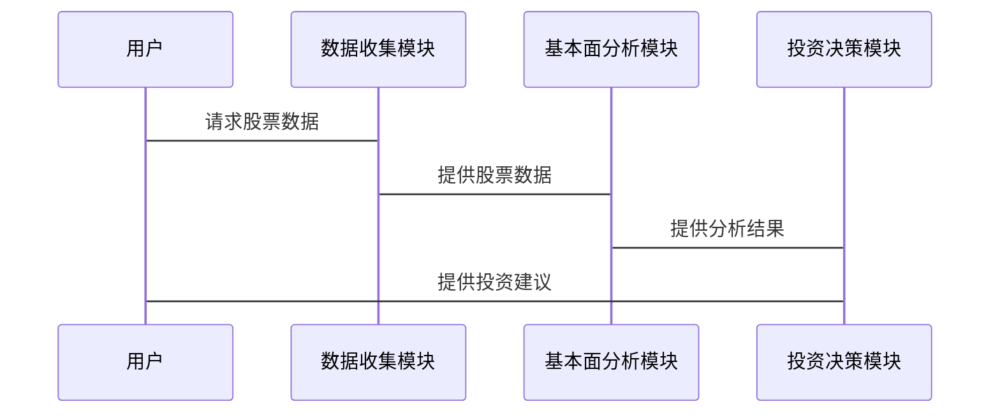

                 


# 马克·莫比乌斯的新兴市场价值投资策略

## 关键词：价值投资、新兴市场、马克·莫比乌斯、内在价值、安全边际、基本面分析、投资策略

## 摘要：本文详细探讨马克·莫比乌斯的价值投资策略在新兴市场中的应用，分析其核心理念和方法，包括内在价值计算、安全边际确定、基本面分析等关键步骤，结合实际案例和系统架构设计，提供深入的理论支持和实践指导。

---

# 第一部分: 背景介绍与核心概念

## 第1章: 价值投资的基本概念

### 1.1 价值投资的定义与特点

#### 1.1.1 价值投资的基本定义
价值投资是一种基于对公司内在价值评估的投资策略，强调以低于内在价值的价格买入优质资产。

#### 1.1.2 价值投资的核心特点
- 长期导向：关注企业的长期价值而非短期波动。
- 低估寻找：寻找市场价格低于内在价值的股票。
- 安全边际：在价格与价值之间留有安全边际，降低投资风险。

#### 1.1.3 价值投资与其它投资策略的区别
- 与成长投资的区别：成长投资关注高增长企业，而价值投资关注低估企业。
- 与技术分析的区别：技术分析依赖价格走势，而价值投资依赖基本面分析。
- 与指数投资的区别：指数投资追求市场平均收益，而价值投资追求超额收益。

### 1.2 马克·莫比乌斯的价值投资方法

#### 1.2.1 马克·莫比乌斯的背景介绍
马克·莫比乌斯是新兴市场投资领域的权威，强调在新兴市场中寻找低估的优质企业。

#### 1.2.2 马克·莫比乌斯的投资理念
- 专注于新兴市场：认为新兴市场具有更大的增长潜力。
- 重视基本面分析：通过分析企业财务状况和行业前景寻找低估股票。
- 长期持有：坚持买入并持有优质资产，等待市场重新评估其价值。

#### 1.2.3 马克·莫比乌斯的选股标准
- 低市盈率（PE）：寻找市盈率低于行业平均水平的股票。
- 低市净率（PB）：寻找市净率低于行业平均水平的股票。
- 高股息率：选择股息收益率高的企业。

### 1.3 新兴市场的特点与投资机会

#### 1.3.1 新兴市场的定义与范围
新兴市场指经济快速发展、市场规模较小但增长潜力大的国家，如中国、印度等。

#### 1.3.2 新兴市场的投资特点
- 市场波动性大：新兴市场受经济周期和政策影响较大。
- 市场流动性有限：部分新兴市场的流动性较低，可能影响交易效率。
- 市场效率低：新兴市场可能存在信息不对称和定价扭曲。

#### 1.3.3 新兴市场的投资机会与风险
- 投资机会：新兴市场企业增长快，可能带来超额收益。
- 投资风险：新兴市场波动性大，政策风险和经济风险较高。

### 1.4 价值投资在新兴市场的优势

#### 1.4.1 价值投资在新兴市场的适用性
- 新兴市场中存在大量低估企业，适合价值投资。
- 新兴市场波动性大，价值投资者可以在市场下跌时买入优质资产。

#### 1.4.2 新兴市场中的低估股票
- 新兴市场中许多企业由于信息不对称或市场关注不足，可能被低估。
- 通过基本面分析，可以发现这些低估股票，带来超额收益。

#### 1.4.3 新兴市场的周期性与投资机会
- 新兴市场具有周期性，当市场低迷时，可能是买入低估股票的好时机。
- 在新兴市场中，价值投资者可以通过长期持有优质资产，获得市场复苏带来的收益。

## 第2章: 核心概念与联系

### 2.1 价值投资的核心原理

#### 2.1.1 价值投资的内在价值计算
内在价值是企业未来现金流的现值，计算公式如下：
$$ V = \frac{CF}{r - g} $$
其中，CF为现金流，r为折现率，g为增长率。

#### 2.1.2 市场先生的概念
市场先生是格雷厄姆提出的概念，指市场的波动性和不可预测性，投资者应避免被市场情绪左右。

#### 2.1.3 安全边际的重要性
安全边际是指买入价格低于内在价值的部分，用于降低投资风险。

### 2.2 核心概念对比分析

#### 2.2.1 价值投资与成长投资的对比
| 对比维度 | 价值投资 | 成长投资 |
|----------|----------|----------|
| 核心目标 | 寻找低估股票 | 寻找高增长企业 |
| 风险承受 | 较低 | 较高 |
| 投资期限 | 长期 | 长期 |

#### 2.2.2 价值投资与技术分析的对比
| 对比维度 | 价值投资 | 技术分析 |
|----------|----------|----------|
| 分析基础 | 公司基本面 | 市场价格和技术指标 |
| 投资决策 | 基于价值评估 | 基于价格走势和成交量 |
| 适用场景 | 长期投资 | 短期交易 |

#### 2.2.3 价值投资与指数投资的对比
| 对比维度 | 价值投资 | 指数投资 |
|----------|----------|----------|
| 投资策略 | 选择个别股票 | 按比例投资市场指数 |
| 成本 | 较高（需研究个股） | 较低（跟踪指数） |
| 风险 | 较高（个股风险） | 较低（分散风险） |

### 2.3 实体关系图


## 第3章: 算法原理与数学模型

### 3.1 价值投资的分析流程

#### 3.1.1 确定投资目标
明确投资目标，如寻找新兴市场的低估股票。

#### 3.1.2 基本面分析
分析企业的财务状况、行业前景和管理团队。

#### 3.1.3 安全边际计算
计算买入价格与内在价值之间的安全边际。

#### 3.1.4 投资决策
根据分析结果决定是否买入股票。

### 3.2 数学模型与公式

#### 3.2.1 内在价值公式
$$ V = \frac{CF}{r - g} $$
其中，CF为现金流，r为折现率，g为增长率。

#### 3.2.2 安全边际计算
安全边际 = 内在价值 - 市场价格

### 3.3 价值投资的流程图


### 3.4 价值投资的Python实现

```python
def calculate_intrinsic_value(cf, r, g):
    return cf / (r - g)

def calculate_margin_of_safety(iv, price):
    return iv - price

# 示例
cf = 100
r = 0.08
g = 0.05
iv = calculate_intrinsic_value(cf, r, g)
price = 50
mos = calculate_margin_of_safety(iv, price)
print(f"内在价值: {iv}, 市场价格: {price}, 安全边际: {mos}")
```

### 3.5 投资决策案例分析

#### 3.5.1 案例背景
假设我们关注一家新兴市场的信息技术公司，预计未来现金流为100，折现率为8%，增长率为5%。

#### 3.5.2 计算内在价值
$$ V = \frac{100}{0.08 - 0.05} = \frac{100}{0.03} = 3333.33 $$

#### 3.5.3 确定市场价格
假设市场价格为3000元。

#### 3.5.4 计算安全边际
$$ MOS = 3333.33 - 3000 = 333.33 $$

#### 3.5.5 投资决策
由于市场价格低于内在价值且安全边际为333.33，决定买入该股票。

## 第4章: 系统分析与架构设计

### 4.1 问题场景介绍

#### 4.1.1 投资分析系统的目标
开发一个能够分析新兴市场股票的价值，辅助投资决策的系统。

#### 4.1.2 系统功能需求
- 数据收集：收集新兴市场的股票数据。
- 基本面分析：计算内在价值和安全边际。
- 投资决策：根据分析结果生成投资建议。

### 4.2 系统架构设计

#### 4.2.1 系统模块划分
- 数据收集模块：负责收集股票数据。
- 基本面分析模块：计算内在价值和安全边际。
- 投资决策模块：生成投资建议。

#### 4.2.2 系统架构图


#### 4.2.3 系统接口设计
- 数据接口：从数据库或API获取股票数据。
- 分析接口：调用基本面分析模块的函数。
- 决策接口：生成投资建议并输出。

### 4.3 系统交互流程

#### 4.3.1 系统交互序列图


## 第5章: 项目实战

### 5.1 环境安装

#### 5.1.1 安装Python
下载并安装Python 3.8或更高版本。

#### 5.1.2 安装必要的库
使用pip安装numpy、pandas和matplotlib。

### 5.2 系统核心实现源代码

#### 5.2.1 数据收集模块
```python
import pandas as pd
import requests

def get_stock_data(ticker):
    url = f"https://api.example.com/stock/{ticker}"
    response = requests.get(url)
    return pd.DataFrame(response.json())
```

#### 5.2.2 基本面分析模块
```python
def calculate_intrinsic_value(cf, r, g):
    return cf / (r - g)

def calculate_margin_of_safety(iv, price):
    return iv - price
```

#### 5.2.3 投资决策模块
```python
def make_investment_decision(mos):
    if mos > 0:
        return "买入"
    elif mos == 0:
        return "观望"
    else:
        return "卖出"
```

### 5.3 代码应用解读与分析

#### 5.3.1 数据收集模块
从API获取股票数据，处理数据并返回DataFrame。

#### 5.3.2 基本面分析模块
计算内在价值和安全边际，辅助投资决策。

#### 5.3.3 投资决策模块
根据安全边际值，决定是否买入、卖出或观望。

### 5.4 实际案例分析

#### 5.4.1 案例背景
分析印度的信息技术产业，选择一家信息技术公司进行分析。

#### 5.4.2 数据收集
收集该公司的股票数据，包括历史价格、财务数据等。

#### 5.4.3 基本面分析
计算该公司的内在价值和安全边际，评估其投资价值。

#### 5.4.4 投资决策
根据分析结果，决定是否买入该公司的股票。

### 5.5 项目小结

#### 5.5.1 项目成果
成功开发了一个能够分析新兴市场股票的价值，辅助投资决策的系统。

#### 5.5.2 经验总结
- 数据收集是关键，确保数据的准确性和完整性。
- 基本面分析需要结合行业和市场情况，灵活调整参数。
- 投资决策需要综合考虑市场环境和企业具体情况。

## 第6章: 最佳实践与总结

### 6.1 最佳实践

#### 6.1.1 投资策略
- 长期持有优质资产，避免频繁交易。
- 选择具有强大财务状况和良好管理团队的企业。

#### 6.1.2 风险管理
- 设置止损点，避免重大损失。
- 分散投资，降低市场风险。

#### 6.1.3 持续学习
- 关注市场动态和企业新闻，及时调整投资策略。
- 不断学习和更新投资知识，提高分析能力。

### 6.2 小结

#### 6.2.1 价值投资的核心理念
价值投资强调寻找低估股票，注重基本面分析，长期持有优质资产。

#### 6.2.2 新兴市场的投资机会
新兴市场中存在大量低估股票，适合价值投资者寻找投资机会。

#### 6.2.3 投资系统的重要性
开发一个高效的分析系统，能够帮助投资者快速准确地进行基本面分析，提高投资决策的科学性。

### 6.3 注意事项

#### 6.3.1 市场风险
新兴市场波动性大，投资者需注意市场风险。

#### 6.3.2 信息不对称
新兴市场可能存在信息不对称，投资者需谨慎选择投资标的。

#### 6.3.3 政策风险
新兴市场的政策变化可能对投资产生重大影响，投资者需关注政策动态。

### 6.4 拓展阅读

#### 6.4.1 推荐书籍
- 《价值》—— 查理·芒格
- 《新兴市场的投资策略》—— 马克·莫比乌斯

#### 6.4.2 推荐博客与网站
- 巴菲特股东大会直播
- 芮小果断股博客
- 邓普斯特网

## 作者：AI天才研究院/AI Genius Institute & 禅与计算机程序设计艺术 /Zen And The Art of Computer Programming

