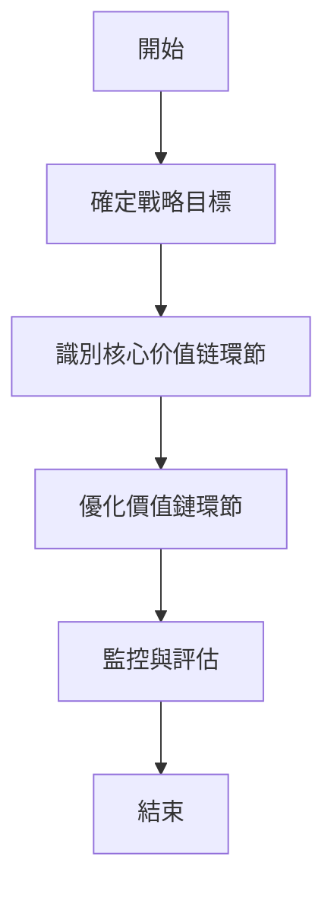
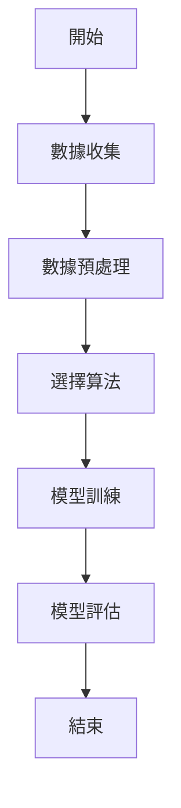
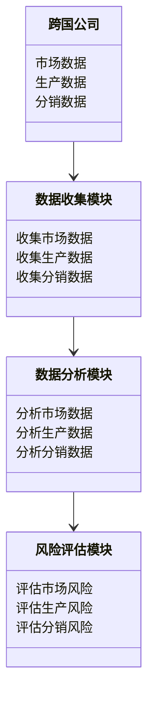

                 


# 马克·莫比乌斯的跨国公司价值链分析

> 关键词：跨国公司，价值链分析，成本效益分析，系统架构设计，Python算法实现

> 摘要：本文从跨国公司的定义与特点出发，深入分析其在全球价值链中的位置与核心要素。通过成本效益分析模型和Python算法实现，结合系统架构设计与实际案例，全面探讨如何优化跨国公司的价值链。

---

## 第一部分: 跨国公司价值链分析的背景与核心概念

### 第1章: 跨国公司价值链分析的背景与问题背景

#### 1.1 跨国公司的定义与特点

跨国公司（Transnational Corporations，TNCs）是指在全球范围内进行生产和销售的企业，其特点是跨越国界经营，具有全球化的战略和本地化的运营。以下是跨国公司的核心特点：

- **全球性**：跨国公司通常在全球范围内配置资源，而非局限于单一国家。
- **多元化**：跨国公司通常涉及多个行业和产品线，以分散风险并抓住不同市场的机会。
- **本地化**：尽管是全球性企业，但跨国公司通常会根据当地市场调整产品和服务。
- **复杂性**：跨国公司的管理结构复杂，涉及多个部门和团队的协作。

#### 1.2 全球化背景下的价值链分析

价值链（Value Chain）是指企业创造价值的系列活动。在全球化背景下，跨国公司的价值链通常跨越多个国家，涉及供应商、制造商、分销商和消费者等多个环节。以下是跨国公司在全球价值链中的主要位置和意义：

- **优化资源配置**：通过全球化布局，跨国公司可以更高效地利用全球资源，降低生产成本。
- **风险分散**：跨国公司在不同市场经营，可以分散单一市场的风险。
- **竞争优势**：通过在全球范围内寻找成本最低、效率最高的生产环节，跨国公司可以获得竞争优势。

#### 1.3 问题背景与问题描述

在跨国公司价值链分析中，主要问题包括：

- **成本控制**：如何在全球范围内优化成本，同时保持产品质量。
- **风险管理**：如何应对不同国家的政治、经济和法律风险。
- **协同效应**：如何在全球范围内实现不同部门的协同，提高整体效率。

这些问题的解决需要从价值链的各个环节入手，进行全面分析和优化。

---

### 第2章: 跨国公司价值链的核心概念与联系

#### 2.1 价值链的定义与核心要素

价值链是指企业从原材料采购、生产、分销到最终交付给消费者的系列活动。以下是价值链的核心要素：

- **供应商管理**：选择合适的供应商，确保原材料质量和价格。
- **生产过程**：优化生产流程，提高效率和质量。
- **分销网络**：建立高效的分销渠道，覆盖目标市场。
- **客户关系**：建立与客户的长期关系，提高客户满意度。

#### 2.2 跨国公司价值链的实体关系图

以下是跨国公司价值链的实体关系图（ER图）：

```mermaid
er
  actor 跨国公司
  actor 供应商
  actor 客户
  actor 合规机构
  entity 产品
  entity 服务
  entity 成本
  entity 收益
  entity 风险
  relation 跨国公司与供应商的关系
  relation 跨国公司与客户的关系
  relation 跨国公司与产品/服务的关系
  relation 产品/服务与成本/收益的关系
```

#### 2.3 跨国公司价值链的流程图

以下是跨国公司价值链的流程图：



---

## 第3章: 跨国公司价值链的算法原理

### 3.1 价值链分析的算法模型

#### 3.1.1 成本效益分析模型

成本效益分析模型是一种常用的评估价值链优化方法。以下是模型的数学公式：

$$ \text{成本效益} = \frac{\text{收益} - \text{成本}}{\text{成本}} $$

#### 3.1.2 价值链优化算法

以下是一个简单的价值链优化算法流程图：



#### 3.1.3 预测模型与风险評估

以下是风险評估的数学模型：

$$ \text{风险評估} = \sum_{i=1}^{n} (\text{风险因素}_i \times \text{权重}_i) $$

---

## 第4章: 跨国公司价值链的系统分析与架构设计

### 4.1 问题场景介绍

跨国公司需要在全球范围内优化其价值链，涉及多个部门和团队的协作。以下是系统功能设计：

- **数据收集模块**：收集全球市场数据。
- **数据分析模块**：分析数据，优化价值链。
- **风险评估模块**：评估不同市场的风险。

### 4.2 系统功能设计

以下是系统功能的类图：



---

## 第5章: 跨国公司价值链的项目实战

### 5.1 环境安装

以下是Python环境安装步骤：

1. 安装Python：`pip install python`
2. 安装依赖库：`pip install numpy pandas matplotlib`

### 5.2 核心代码实现

以下是成本效益分析的核心代码：

```python
import numpy as np
import pandas as pd

def cost_benefit_analysis(revenue, cost):
    cost_benefit = (revenue - cost) / cost
    return cost_benefit

revenue = np.array([100, 200, 300])
cost = np.array([50, 100, 150])

result = cost_benefit_analysis(revenue, cost)
print(result)
```

### 5.3 代码解读与分析

以上代码实现了成本效益分析模型，计算不同方案的成本效益比。结果表明，成本效益比越高，方案越优。

---

## 第6章: 跨国公司价值链的最佳实践

### 6.1 小结

跨国公司价值链分析是优化企业全球竞争力的关键。通过成本效益分析和系统架构设计，可以有效优化价值链。

### 6.2 注意事项

- 数据收集要全面准确。
- 算法选择要根据实际需求。
- 系统设计要注重模块化和可扩展性。

### 6.3 拓展阅读

- 《全球化的挑战与机遇》
- 《企业架构设计实战》

---

作者：AI天才研究院/AI Genius Institute & 禅与计算机程序设计艺术 /Zen And The Art of Computer Programming

