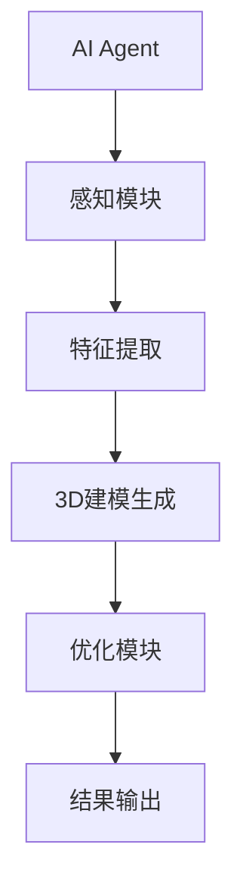
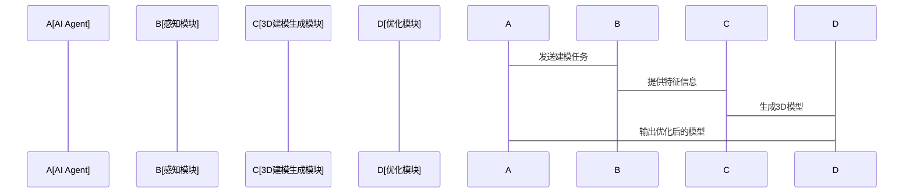

                 


# AI Agent在3D建模中的应用：自动生成与优化

> 关键词：AI Agent，3D建模，自动生成，优化算法，深度学习，强化学习

> 摘要：本文探讨了AI Agent在3D建模中的应用，重点介绍了基于深度学习和强化学习的3D建模生成与优化方法。文章从AI Agent的基本原理出发，结合3D建模的数学基础，详细分析了生成模型和优化算法，并通过实际案例展示了AI Agent在3D建模中的强大能力。

---

## 第1章: AI Agent与3D建模概述

### 1.1 AI Agent的基本概念

#### 1.1.1 AI Agent的定义与特点
- **定义**：AI Agent（智能体）是指能够感知环境、做出决策并执行动作的智能实体。它通过传感器获取信息，利用算法处理信息，并通过执行器与环境交互。
- **特点**：
  - **自主性**：能够自主决策，无需外部干预。
  - **反应性**：能够实时感知环境并做出反应。
  - **目标导向**：具备明确的目标，并根据目标优化行为。
  - **学习能力**：能够通过经验改进性能。

#### 1.1.2 3D建模的基本概念与技术
- **3D建模**：通过计算机图形学技术，创建三维对象的数字表示。
- **关键技术**：
  - **点云处理**：处理三维空间中的点云数据。
  - **网格建模**：使用三角形或四边形网格表示物体表面。
  - **体素建模**：使用三维格子表示物体的体积信息。
  - **基于物理的建模**：结合物理规律进行建模。

#### 1.1.3 AI Agent在3D建模中的应用背景
- **需求背景**：3D建模需要大量的人工干预，效率低下且成本高昂。AI Agent可以通过自动化方式提高建模效率。
- **技术优势**：AI Agent能够通过深度学习和强化学习技术，实现3D建模的自动生成与优化。

### 1.2 AI Agent与3D建模的结合

#### 1.2.1 AI Agent在3D建模中的作用
- **数据采集**：通过传感器或图像识别技术获取建模数据。
- **特征提取**：从数据中提取有用的特征信息。
- **模型生成**：基于特征信息生成3D模型。
- **优化与调整**：根据目标函数优化模型的几何形状和属性。

#### 1.2.2 3D建模的自动化需求
- **效率提升**：通过自动化减少人工建模的时间和成本。
- **复杂场景处理**：AI Agent能够处理复杂的几何结构和场景。
- **实时性要求**：在实时应用中，AI Agent需要快速生成和优化模型。

#### 1.2.3 AI Agent在3D建模中的优势
- **高效性**：AI Agent能够快速处理大量数据并生成模型。
- **适应性**：能够根据不同的场景和需求调整建模策略。
- **创新性**：通过学习和优化，生成创新的3D模型。

### 1.3 本书内容概述

#### 1.3.1 本书的核心目标
- 探讨AI Agent在3D建模中的应用，重点介绍生成与优化算法。

#### 1.3.2 本书的主要内容结构
- 第一部分：AI Agent与3D建模概述。
- 第二部分：AI Agent的基本原理与技术基础。
- 第三部分：基于AI Agent的3D建模生成算法。
- 第四部分：3D建模优化算法。
- 第五部分：AI Agent在3D建模中的系统设计。
- 第六部分：项目实战与案例分析。
- 第七部分：扩展阅读与未来展望。

#### 1.3.3 本书的读者对象
- 计算机视觉、人工智能、3D建模领域的研究人员和开发者。
- 对AI Agent和3D建模感兴趣的学生和爱好者。

---

## 第2章: AI Agent的基本原理

### 2.1 AI Agent的感知与决策机制

#### 2.1.1 感知模块：数据采集与特征提取
- **数据采集**：通过摄像头、激光雷达等设备获取三维数据。
- **特征提取**：使用深度学习模型提取物体的特征信息。

#### 2.1.2 决策模块：基于规则与基于学习的决策
- **基于规则的决策**：根据预定义的规则进行决策。
- **基于学习的决策**：通过机器学习模型学习决策策略。

#### 2.1.3 执行模块：动作规划与优化
- **动作规划**：规划AI Agent的动作路径。
- **优化策略**：通过优化算法提高动作的效率和效果。

#### 2.1.4 感知、决策、执行的协同工作
- 感知模块获取环境信息，决策模块制定决策，执行模块执行动作，三者协同完成任务。

#### 2.1.5 感知与决策的数学模型
- 感知模块：通过传感器获取数据，使用概率模型进行特征提取。
- 决策模块：基于马尔可夫决策过程（MDP）进行决策。
- 执行模块：通过优化算法（如强化学习）进行动作规划。

### 2.2 3D建模的数学基础

#### 2.2.1 3D空间中的点、线、面表示
- **点**：3D空间中的点由三个坐标$(x, y, z)$表示。
- **线**：由两个点定义，可以用向量表示。
- **面**：由三个点定义，可以用平面方程表示。

#### 2.2.2 变换矩阵与坐标系转换
- **变换矩阵**：用于坐标系的旋转、缩放和平移。
- **齐次坐标**：用于表示点和平移变换。
  $$ \begin{bmatrix}
  R & t \\
  0 & 1
  \end{bmatrix} $$
  其中$R$是旋转矩阵，$t$是平移向量。

#### 2.2.3 3D建模中的几何算法
- **凸包计算**：计算点集的最小凸包。
- **三角剖分**：将点集分解为三角形。
- **网格简化**：减少网格的多边形数量，降低计算复杂度。

---

## 第3章: 3D建模生成算法概述

### 3.1 基于深度学习的3D建模生成

#### 3.1.1 基于GAN的3D建模生成
- **GAN原理**：生成器和判别器通过对抗训练生成高质量的3D模型。
  $$ G \text{和} D \text{的损失函数} = -\log(D(G(x))) - \log(1 - D(y)) $$
  其中$G$是生成器，$D$是判别器，$x$是输入，$y$是真实样本。

#### 3.1.2 基于VAE的3D建模生成
- **VAE原理**：通过变分推断生成3D模型。
  $$ \text{损失函数} = \mathbb{E}_x [\log p(x)] + \text{KL}(q(x) \parallel p(x)) $$
  其中$q(x)$是后验分布，$p(x)$是先验分布。

#### 3.1.3 基于Transformer的3D建模生成
- **Transformer原理**：通过自注意力机制生成3D模型的序列表示。
  $$ \text{注意力机制} = \text{softmax}\left(\frac{QK^T}{\sqrt{d_k}}\right)V $$
  其中$Q$是查询向量，$K$是键向量，$V$是值向量，$d_k$是向量维度。

### 3.2 基于AI Agent的3D建模生成

#### 3.2.1 AI Agent在3D建模生成中的角色
- **数据采集**：通过传感器获取建模数据。
- **特征提取**：提取物体的特征信息。
- **模型生成**：基于特征信息生成3D模型。

#### 3.2.2 基于强化学习的3D建模生成
- **强化学习原理**：通过奖励机制优化生成过程。
  $$ R = \sum_{t=1}^T r_t $$
  其中$R$是总奖励，$r_t$是第$t$步的奖励。

---

## 第4章: 3D建模优化算法

### 4.1 优化算法概述

#### 4.1.1 粒子群优化（PSO）
- **算法原理**：通过粒子群的运动优化目标函数。
  $$ v_i^{t+1} = v_i^t + \alpha (p_i^t - x_i^t) + \beta (p_g^t - x_i^t) $$
  其中$v_i^t$是第$i$个粒子在第$t$步的速度，$p_i^t$是第$i$个粒子的全局最优位置，$x_i^t$是第$i$个粒子的当前位置，$\alpha$和$\beta$是学习因子。

#### 4.1.2 模拟退火（SA）
- **算法原理**：通过模拟退火过程优化目标函数。
  $$ P(\text{接受} \Delta E) = \exp\left(-\frac{\Delta E}{k T}\right) $$
  其中$\Delta E$是能量变化，$k$是玻耳兹曼常数，$T$是当前温度。

#### 4.1.3 强化学习优化
- **算法原理**：通过强化学习优化3D建模的几何形状。
  $$ Q(s, a) = Q(s, a) + \alpha (r + \gamma \max_a Q(s', a) - Q(s, a)) $$
  其中$Q(s, a)$是状态-动作值函数，$\alpha$是学习率，$\gamma$是折扣因子，$r$是奖励。

### 4.2 优化算法在3D建模中的应用

#### 4.2.1 基于PSO的3D建模优化
- **应用场景**：优化3D模型的几何形状，使其满足特定的约束条件。
- **优化目标**：最小化模型的体积，同时满足强度和刚度要求。

#### 4.2.2 基于SA的3D建模优化
- **应用场景**：优化3D模型的表面光滑度，减少模型的尖锐角。
- **优化目标**：最小化模型的表面不平滑度。

#### 4.2.3 基于强化学习的3D建模优化
- **应用场景**：优化3D模型的拓扑结构，使其符合特定的设计要求。
- **优化目标**：最大化模型的美观性和实用性。

---

## 第5章: AI Agent在3D建模中的系统设计

### 5.1 系统架构设计

#### 5.1.1 系统架构图


#### 5.1.2 系统功能模块
- **感知模块**：负责数据的采集和特征的提取。
- **3D建模生成模块**：负责基于特征生成3D模型。
- **优化模块**：负责对生成的模型进行优化。

### 5.2 系统交互设计

#### 5.2.1 系统交互流程


---

## 第6章: 项目实战与案例分析

### 6.1 项目实战

#### 6.1.1 环境安装
- **安装Python**：Python 3.8或更高版本。
- **安装深度学习框架**：如TensorFlow、PyTorch。
- **安装3D建模库**：如Open3D、PyTorch3D。

#### 6.1.2 核心代码实现

##### 6.1.2.1 基于GAN的3D建模生成
```python
import torch
import torch.nn as nn

class Generator(nn.Module):
    def __init__(self):
        super(Generator, self).__init__()
        self.fc = nn.Linear(100, 256)
        self.conv = nn.Conv3d(1, 32, 3, padding=1)
        self.bn = nn.BatchNorm3d(32)
        self.relu = nn.ReLU()
        self.pool = nn.MaxPool3d(2, 2)

    def forward(self, x):
        x = self.fc(x)
        x = x.view(-1, 32, 4, 4, 4)
        x = self.conv(x)
        x = self.bn(x)
        x = self.relu(x)
        x = self.pool(x)
        return x

class Discriminator(nn.Module):
    def __init__(self):
        super(Discriminator, self).__init__()
        self.conv = nn.Conv3d(32, 16, 3, padding=1)
        self.bn = nn.BatchNorm3d(16)
        self.relu = nn.ReLU()
        self.pool = nn.MaxPool3d(2, 2)
        self.fc = nn.Linear(16 * 2 * 2 * 2, 1)

    def forward(self, x):
        x = self.conv(x)
        x = self.bn(x)
        x = self.relu(x)
        x = self.pool(x)
        x = x.view(-1, 16 * 2 * 2 * 2)
        x = self.fc(x)
        return x
```

##### 6.1.2.2 基于强化学习的3D建模优化
```python
import numpy as np

def reward_function(current_model, target_model):
    # 计算模型与目标模型的相似度
    similarity = np.sum(np.minimum(current_model, target_model))
    return similarity

# 初始化参数
state = initial_state
alpha = 0.1
gamma = 0.9

# 强化学习循环
for _ in range(1000):
    # 选择动作
    action = choose_action(state)
    # 执行动作
    next_state = take_action(state, action)
    # 计算奖励
    reward = reward_function(state, next_state)
    # 更新Q值
    Q(state, action) = Q(state, action) + alpha * (reward + gamma * max(Q(next_state, action)))
    state = next_state
```

---

## 第7章: 扩展阅读与未来展望

### 7.1 研究热点与未来趋势

#### 7.1.1 当前研究热点
- **实时3D建模**：如何在实时应用中高效生成和优化3D模型。
- **多模态建模**：结合图像、点云等多种数据源进行建模。
- **自适应建模**：根据环境动态调整建模策略。

#### 7.1.2 未来发展趋势
- **更加智能化**：AI Agent将更加智能化，能够自主学习和优化建模过程。
- **多任务建模**：结合其他任务（如姿态估计、语义分割）进行3D建模。
- **分布式建模**：利用分布式计算提升建模效率。

### 7.2 应用案例分享

#### 7.2.1 建筑设计中的应用
- **案例描述**：利用AI Agent生成和优化建筑模型，提高设计效率。
- **具体应用**：通过AI Agent生成建筑的三维模型，并优化其结构和外观。

#### 7.2.2 游戏开发中的应用
- **案例描述**：利用AI Agent生成游戏中的3D角色和场景。
- **具体应用**：通过AI Agent生成游戏角色的模型，并优化其动作和交互。

### 7.3 工具推荐

#### 7.3.1 3D建模工具
- **Blender**：开源的3D建模和渲染工具。
- **Maya**：专业的3D建模和动画制作工具。
- **SketchUp**：易于使用的3D建模工具。

#### 7.3.2 AI工具
- **TensorFlow**：Google的深度学习框架。
- **PyTorch**：Facebook的深度学习框架。
- **Open3D**：用于3D数据处理的开源库。

---

## 作者：AI天才研究院/AI Genius Institute & 禅与计算机程序设计艺术 /Zen And The Art of Computer Programming

---

这篇文章详细介绍了AI Agent在3D建模中的应用，从基本原理到生成算法，再到优化策略，最后通过项目实战和案例分析展示了AI Agent的强大能力。希望对读者在AI Agent与3D建模的结合应用中有所帮助。

