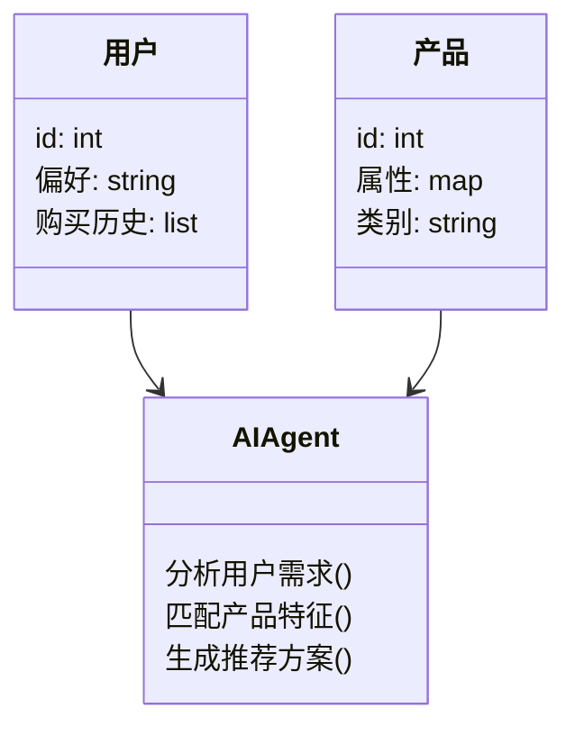

                 


# AI Agent在产品个性化定制中的创新应用

> 关键词：AI Agent，产品个性化定制，创新应用，推荐系统，机器学习，用户需求分析，系统架构设计

> 摘要：本文深入探讨AI Agent在产品个性化定制中的创新应用，从背景、概念、算法原理、系统架构到项目实战，全面解析其如何通过智能决策和自适应学习，实现精准需求匹配与高效定制流程优化。

---

# 第一部分：AI Agent与产品个性化定制的背景与概念

## 第1章：AI Agent与产品个性化定制的背景

### 1.1 AI Agent的基本概念

#### 1.1.1 AI Agent的定义与特点
AI Agent（人工智能代理）是指能够感知环境、自主决策并执行任务的智能实体。其特点包括：
- **智能性**：基于数据和模型进行学习和推理。
- **自主性**：无需外部干预，自动完成任务。
- **交互性**：通过接口与用户或其他系统交互。
- **适应性**：根据环境变化调整行为。

#### 1.1.2 AI Agent的核心功能与应用场景
AI Agent的核心功能包括：
- 数据采集与分析
- 智能决策与推荐
- 任务执行与反馈

应用场景广泛，如电子商务推荐、智能家居控制、自动驾驶等。

#### 1.1.3 AI Agent与传统自动化系统的区别
| 特性 | AI Agent | 传统自动化系统 |
|------|----------|----------------|
| 智能性 | 高       | 低             |
| 学习能力 | 强       | 无             |
| 自主性 | 高       | 低             |

### 1.2 产品个性化定制的背景与需求

#### 1.2.1 个性化定制的定义与发展趋势
个性化定制是根据用户需求，量身定制产品或服务的过程。随着用户需求的多样化，个性化定制成为市场趋势。

#### 1.2.2 个性化定制在不同领域的应用案例
- **服装行业**：定制化服装。
- **汽车行业**：定制化汽车配置。
- **电子产品**：定制化功能模块。

#### 1.2.3 个性化定制的核心挑战与技术需求
- **挑战**：需求多样性、数据复杂性、实时性要求。
- **技术需求**：高效的需求匹配算法、智能推荐系统。

### 1.3 AI Agent在产品个性化定制中的创新价值

#### 1.3.1 AI Agent如何提升个性化定制的效率
通过智能学习和数据挖掘，AI Agent能够快速匹配用户需求，优化定制流程。

#### 1.3.2 AI Agent在个性化定制中的独特优势
- **精准匹配**：基于用户数据进行深度学习。
- **实时反馈**：根据用户反馈动态调整方案。

#### 1.3.3 创新应用的潜力与未来展望
AI Agent将在个性化定制中发挥更大作用，推动智能化定制服务的发展。

### 1.4 本章小结
本章介绍了AI Agent的基本概念及其在个性化定制中的创新价值，为后续内容奠定了基础。

---

# 第二部分：AI Agent的核心概念与原理

## 第2章：AI Agent的核心概念与原理

### 2.1 AI Agent的核心概念

#### 2.1.1 AI Agent的组成与功能模块
AI Agent通常包括感知模块、推理模块、决策模块和执行模块。

#### 2.1.2 AI Agent的决策机制与执行流程
- **感知环境**：通过传感器或数据接口获取信息。
- **推理分析**：基于知识库进行推理。
- **制定策略**：生成最优决策方案。
- **执行任务**：通过接口执行操作。

#### 2.1.3 AI Agent的智能性与学习能力
AI Agent通过机器学习模型不断优化自身的决策能力。

### 2.2 个性化定制的核心要素

#### 2.2.1 用户需求分析与建模
- **需求分析**：通过问卷调查或数据分析提取用户需求。
- **需求建模**：将需求转化为数学模型，用于后续匹配。

#### 2.2.2 产品特征提取与匹配
- **特征提取**：提取产品的关键特征。
- **特征匹配**：基于相似度算法匹配用户需求与产品特征。

#### 2.2.3 定制化方案生成与优化
- **方案生成**：基于匹配结果生成定制方案。
- **方案优化**：通过反馈不断优化方案。

### 2.3 AI Agent与个性化定制的关系

#### 2.3.1 AI Agent在个性化定制中的角色定位
AI Agent作为智能决策系统，负责需求匹配和方案生成。

#### 2.3.2 AI Agent如何实现个性化定制的目标
通过深度学习和数据挖掘，AI Agent能够精准匹配用户需求。

#### 2.3.3 AI Agent与个性化定制的协同工作模式
AI Agent与用户、产品数据库协同，形成闭环反馈系统。

### 2.4 核心概念对比分析

#### 2.4.1 AI Agent与传统推荐系统的对比
- **推荐依据**：传统推荐基于历史数据，AI Agent基于实时数据。
- **推荐效率**：AI Agent更高效且个性化。

---

# 第三部分：AI Agent的算法原理与系统架构

## 第3章：AI Agent的算法原理

### 3.1 基于协同过滤的推荐算法

#### 3.1.1 协同过滤算法的基本原理
协同过滤通过相似用户或相似产品推荐目标用户可能感兴趣的产品。

#### 3.1.2 基于用户的协同过滤算法
- **相似度计算**：使用余弦相似度。
- **推荐生成**：基于相似用户的偏好生成推荐。

#### 3.1.3 基于物品的协同过滤算法
- **相似度计算**：基于产品特征的相似度。
- **推荐生成**：基于相似产品的特征生成推荐。

#### 3.1.4 混合推荐算法
结合用户和物品的特征，生成更精准的推荐。

### 3.2 基于深度学习的推荐算法

#### 3.2.1 神经网络在推荐系统中的应用
- **神经网络结构**：如DNN、CNN、RNN等。
- **训练目标**：最小化预测误差。

#### 3.2.2 基于注意力机制的推荐算法
- **注意力机制**：通过加权方式突出重要特征。
- **实现流程**：提取特征、计算权重、生成推荐。

#### 3.2.3 基于强化学习的推荐算法
- **强化学习框架**：通过奖励机制优化推荐策略。
- **应用场景**：动态环境下的推荐优化。

### 3.3 推荐算法的数学模型与公式

#### 3.3.1 协同过滤的相似度计算
$$ \text{相似度}(u, v) = \frac{\sum_{i=1}^{n} (r_{u,i} - \bar{r}_u)(r_{v,i} - \bar{r}_v)}{\sqrt{\sum_{i=1}^{n} (r_{u,i} - \bar{r}_u)^2} \cdot \sqrt{\sum_{i=1}^{n} (r_{v,i} - \bar{r}_v)^2}}} $$

#### 3.3.2 深度学习模型的损失函数
$$ \mathcal{L} = \sum_{i=1}^{n} (\hat{y}_i - y_i)^2 $$

---

## 第4章：AI Agent的系统架构设计

### 4.1 个性化定制系统的应用场景

#### 4.1.1 电商领域的个性化推荐
- **用户画像**：基于购买历史和偏好生成用户画像。
- **推荐场景**：首页推荐、商品详情页推荐等。

#### 4.1.2 智能家居的个性化配置
- **设备互联**：通过AI Agent实现设备间的协同。
- **场景推荐**：基于用户习惯推荐智能家居场景。

### 4.2 系统功能设计

#### 4.2.1 领域模型类图


#### 4.2.2 系统架构设计


---

## 第5章：项目实战与代码实现

### 5.1 环境安装与配置

#### 5.1.1 安装依赖
```bash
pip install numpy
pip install scikit-learn
pip install matplotlib
```

### 5.2 核心代码实现

#### 5.2.1 协同过滤算法实现

```python
import numpy as np
from sklearn.metrics.pairwise import cosine_similarity

# 示例数据：用户-产品评分矩阵
X = np.array([[4, 3, 0],
              [5, 2, 1],
              [3, 4, 2],
              [0, 0, 5]])

# 计算余弦相似度
similarity = cosine_similarity(X)
print(similarity)
```

#### 5.2.2 基于深度学习的推荐模型

```python
import tensorflow as tf
from tensorflow.keras import layers

model = tf.keras.Sequential()
model.add(layers.Dense(64, activation='relu'))
model.add(layers.Dense(1, activation='sigmoid'))
model.compile(optimizer='adam', loss='binary_crossentropy')
```

### 5.3 代码解读与分析

#### 5.3.1 协同过滤算法
协同过滤算法通过计算用户之间的相似度，推荐相似用户喜欢的产品。

#### 5.3.2 深度学习模型
深度学习模型通过神经网络提取用户和产品的特征，生成推荐结果。

### 5.4 实际案例分析与优化

#### 5.4.1 案例分析
以电商为例，通过协同过滤算法为用户推荐商品。

#### 5.4.2 性能优化
通过模型调参和分布式计算优化推荐效率。

### 5.5 项目小结
本章通过实战案例详细讲解了AI Agent的实现过程，从数据处理到模型训练，再到结果输出，为读者提供了完整的参考。

---

# 第六部分：总结与展望

## 第6章：总结与展望

### 6.1 本章小结
本文详细探讨了AI Agent在产品个性化定制中的创新应用，从背景、算法到系统架构，全面解析了其技术实现。

### 6.2 最佳实践 tips
- **数据质量**：确保数据的准确性和完整性。
- **模型优化**：定期更新模型，提升推荐精度。
- **用户体验**：注重反馈机制，提升用户体验。

### 6.3 未来展望
随着技术的发展，AI Agent在个性化定制中的应用将更加广泛，智能化水平也将进一步提升。

---

# 作者：AI天才研究院 & 禅与计算机程序设计艺术

---

通过以上内容，您可以根据实际需求进一步扩展和优化各部分的详细内容，确保文章的完整性和深度。

