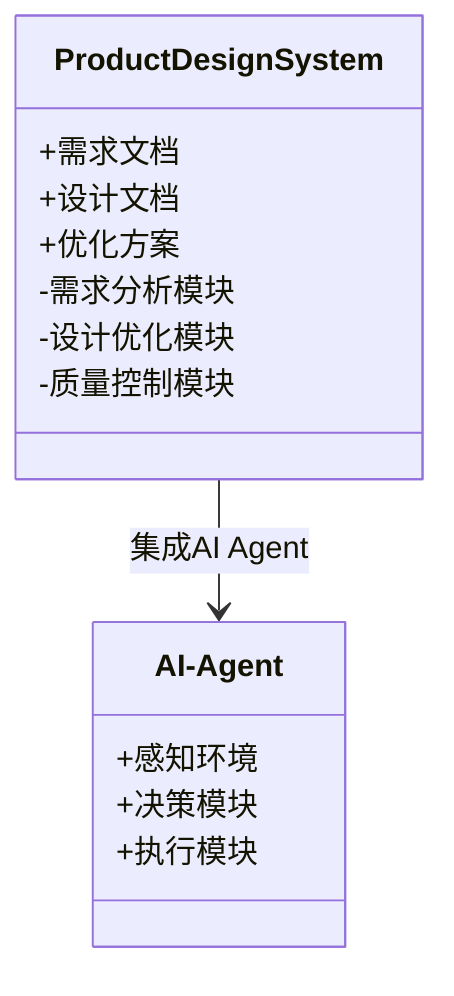
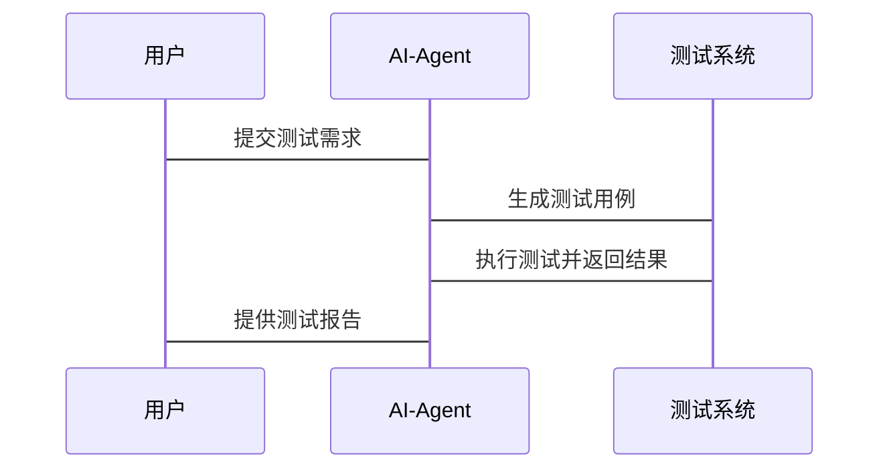
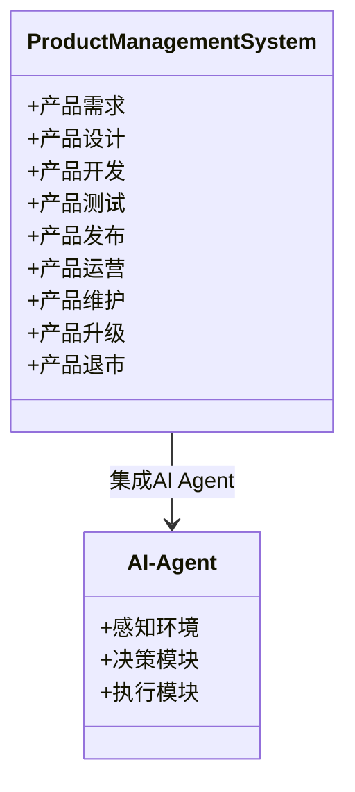

                 


# AI Agent在企业产品全生命周期管理中的应用

## 关键词
AI Agent, 企业产品管理, 全生命周期管理, 强化学习, 系统架构, 项目实战

## 摘要
本文深入探讨了AI Agent在企业产品全生命周期管理中的应用，从基本概念到实际项目，系统阐述了AI Agent的工作原理、核心算法、系统架构，并通过具体案例展示了其在产品管理中的实际应用。文章内容涵盖背景介绍、算法原理、系统架构设计、项目实战等多个方面，帮助读者全面理解并掌握AI Agent在企业产品管理中的应用。

---

## 第一部分：AI Agent与企业产品全生命周期管理概述

### 第1章：AI Agent的基本概念与企业产品全生命周期管理

#### 1.1 AI Agent的定义与核心特征
AI Agent，即人工智能代理，是指能够感知环境、自主决策并执行任务的智能实体。其核心特征包括：

- **智能性**：能够理解和处理复杂信息。
- **自主性**：无需外部干预，自主完成任务。
- **反应性**：能实时感知环境变化并做出反应。
- **社交能力**：能够与人类或其他系统进行有效交互。

AI Agent与传统软件代理的区别在于其具备自主决策和学习能力，能够适应复杂多变的环境。

#### 1.2 企业产品全生命周期管理
企业产品全生命周期管理（Product Lifecycle Management, PLM）涵盖了从产品规划到退市的整个过程，包括：

1. **产品规划**：市场需求分析、产品定位。
2. **产品设计**：功能设计、原型设计。
3. **产品开发**：编码实现、集成测试。
4. **产品测试**：单元测试、集成测试、用户测试。
5. **产品发布**：发布计划、版本控制。
6. **产品运营**：监控运行状态、收集反馈。
7. **产品维护**：bug修复、功能优化。
8. **产品升级**：版本迭代、功能扩展。
9. **产品退市**：计划制定、资源回收。

#### 1.3 AI Agent在企业产品管理中的作用
AI Agent在企业产品管理中的作用主要体现在以下几个方面：

- **提高效率**：通过自动化处理重复性任务，减少人工干预。
- **增强决策**：利用数据驱动的方法提供精准的决策支持。
- **实时监控**：动态调整和优化产品管理流程。
- **智能协作**：实现跨部门的高效协同工作。

---

## 第二部分：AI Agent的核心原理与算法

### 第2章：AI Agent的核心原理

#### 2.1 AI Agent的工作原理
AI Agent的工作流程包括三个主要环节：

1. **感知环境**：通过传感器或数据接口获取环境信息。
2. **制定决策**：基于感知到的信息，利用算法制定决策。
3. **执行操作**：通过执行器或接口完成决策操作。

AI Agent的核心在于其决策机制，即如何从感知信息中提取有用特征，并基于这些特征制定最优决策。

#### 2.2 AI Agent的类型与应用场景
AI Agent可以根据其智能水平和应用场景分为以下几类：

- **基于规则的AI Agent**：通过预定义的规则进行决策，适用于规则明确的场景。
- **基于模型的AI Agent**：利用预定义的模型进行推理和决策，适用于复杂问题。
- **基于机器学习的AI Agent**：通过机器学习算法从数据中学习决策策略。
- **基于强化学习的AI Agent**：通过与环境的交互，学习最优决策策略，适用于动态环境。

---

### 第3章：AI Agent的核心算法与实现

#### 3.1 强化学习算法
强化学习是一种通过试错方法来学习最优策略的算法。常见的强化学习算法包括：

##### 3.1.1 Q-learning算法
Q-learning是一种基于值函数的强化学习算法，适用于离散动作空间和状态空间。

**算法步骤：**
1. 初始化Q表，所有状态-动作对的值初始化为0。
2. 在每个时间步，选择当前状态下的动作，并执行该动作。
3. 记录环境的奖励，并更新Q表中的值：Q(s, a) = Q(s, a) + α(r + γ * max Q(s', a'))，其中α是学习率，γ是折扣因子。

**代码示例：**
```python
import numpy as np

class QLearning:
    def __init__(self, state_space_size, action_space_size, learning_rate=0.1, gamma=0.9):
        self.q_table = np.zeros((state_space_size, action_space_size))
        self.alpha = learning_rate
        self.gamma = gamma

    def choose_action(self, state):
        return np.argmax(self.q_table[state])

    def update_q_table(self, state, action, reward, next_state):
        self.q_table[state, action] = self.q_table[state, action] + self.alpha * (reward + self.gamma * np.max(self.q_table[next_state]) - self.q_table[state, action])

# 示例使用
ql = QLearning(5, 3)
state = 0
action = ql.choose_action(state)
reward = 1
next_state = 1
ql.update_q_table(state, action, reward, next_state)
```

##### 3.1.2 Deep Q-Network（DQN）算法
DQN是一种基于深度学习的强化学习算法，适用于连续动作空间和高维状态空间。

**算法步骤：**
1. 使用经验回放机制存储经验。
2. 使用两个深度神经网络，主网络和目标网络，分别用于策略评估和目标评估。
3. 在每个时间步，选择当前状态下的动作，执行该动作，并记录经验。
4. 随机采样经验，更新主网络的参数，使得预测的Q值与目标Q值接近。

**代码示例：**
```python
import torch
import torch.nn as nn
import torch.optim as optim
import numpy as np

class DQN(nn.Module):
    def __init__(self, input_dim, output_dim):
        super(DQN, self).__init__()
        self.fc1 = nn.Linear(input_dim, 64)
        self.fc2 = nn.Linear(64, 64)
        self.fc3 = nn.Linear(64, output_dim)
    
    def forward(self, x):
        x = torch.relu(self.fc1(x))
        x = torch.relu(self.fc2(x))
        x = self.fc3(x)
        return x

# 示例使用
input_dim = 4
output_dim = 2
dqn = DQN(input_dim, output_dim)
optimizer = optim.Adam(dqn.parameters(), lr=0.001)
criterion = nn.MSELoss()

# 假设有一个经验元组：(state, action, reward, next_state)
# 这里简化处理，假设state和next_state是张量
state = torch.randn(1, input_dim)
action = torch.randint(0, output_dim, (1,))
reward = torch.tensor([1.0])
next_state = torch.randn(1, input_dim)

# 前向传播
q_values = dqn(state)
q_value = q_values[0][action]

# 计算目标Q值
target_q_values = dqn(next_state)
target_q_value = torch.max(target_q_values, 1)[0]
target = target_q_value * 0.9 + reward

# 计算损失并反向传播
loss = criterion(q_value.unsqueeze(0), target.unsqueeze(0))
loss.backward()
optimizer.step()
```

---

## 第三部分：AI Agent在企业产品全生命周期管理中的应用

### 第4章：AI Agent在企业产品管理中的应用案例

#### 4.1 智能产品设计优化系统
**系统功能设计：**
- 需求分析模块：通过自然语言处理技术分析用户需求，生成产品设计文档。
- 设计优化模块：利用强化学习算法优化产品设计方案，提高设计效率。
- 质量控制模块：实时监控设计过程中的质量问题，并提供改进建议。

**系统架构设计：**


#### 4.2 AI Agent在产品测试中的应用
**系统功能设计：**
- 测试用例生成模块：根据产品需求自动生成测试用例。
- 测试执行模块：自动化执行测试用例，并生成测试报告。

**系统架构设计：**


---

## 第四部分：系统架构与项目实战

### 第5章：AI Agent的系统架构设计

#### 5.1 系统架构设计
AI Agent在企业产品管理中的系统架构设计需要考虑以下几个方面：

- **模块化设计**：将系统划分为多个功能模块，如需求分析模块、设计优化模块等。
- **数据流设计**：确保各个模块之间的数据流畅通且高效。
- **接口设计**：定义模块之间的接口，确保模块之间的通信和协作。

**系统架构图：**


---

### 第6章：项目实战

#### 6.1 智能产品设计优化系统的实现

##### 6.1.1 环境搭建
- 安装必要的软件和工具，如Python、TensorFlow、Keras等。
- 配置开发环境，如Jupyter Notebook或IDE。

##### 6.1.2 核心代码实现
```python
# 示例代码：需求分析模块
import nltk
from sklearn.feature_extraction.text import TfidfVectorizer

def analyze_demand(text):
    # 分词处理
    tokens = nltk.word_tokenize(text)
    # 提取关键词
    vectorizer = TfidfVectorizer()
    X = vectorizer.fit_transform([" ".join(tokens)])
    keywords = vectorizer.get_feature_names()[0]
    return keywords

# 示例使用
demand_text = "我们需要一款能够在线协作的笔记软件，要求界面简洁，功能强大。"
keywords = analyze_demand(demand_text)
print(keywords)
```

##### 6.1.3 系统功能实现
- 需求分析模块：通过自然语言处理技术分析用户需求，生成产品设计文档。
- 设计优化模块：利用强化学习算法优化产品设计方案，提高设计效率。
- 质量控制模块：实时监控设计过程中的质量问题，并提供改进建议。

---

## 第五部分：总结与展望

### 第7章：总结与展望

#### 7.1 总结
本文系统地探讨了AI Agent在企业产品全生命周期管理中的应用，从基本概念到实际项目，详细阐述了AI Agent的工作原理、核心算法、系统架构，并通过具体案例展示了其在产品管理中的实际应用。

#### 7.2 展望
未来，AI Agent在企业产品管理中的应用将更加广泛和深入。随着技术的进步，AI Agent将具备更强的智能性和自主性，能够处理更复杂的问题。同时，多智能体协作、人机协作创新等新技术也将进一步推动AI Agent在企业产品管理中的应用。

---

## 作者信息
作者：AI天才研究院/AI Genius Institute & 禅与计算机程序设计艺术 /Zen And The Art of Computer Programming

