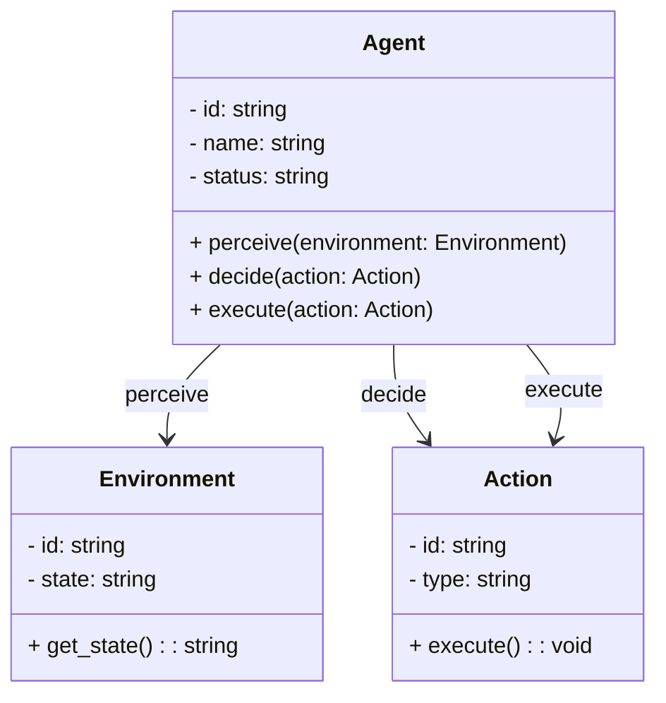

                 


# AI Agent 在企业产品创新与概念验证中的角色

> 关键词：AI Agent，企业创新，概念验证，人工智能，产品设计

> 摘要：本文深入探讨了AI Agent在企业产品创新与概念验证中的核心角色，分析了其技术原理、系统架构设计、应用场景及实际案例。通过详细的技术分析和实战指导，帮助读者理解如何在企业中有效应用AI Agent，推动产品创新和概念验证。

---

# 第一部分: AI Agent 的背景与概念

## 第1章: AI Agent 的基本概念与背景

### 1.1 AI Agent 的定义与特点

AI Agent（人工智能代理）是指能够感知环境、自主决策并执行任务的智能实体。它通过与外部环境交互，利用数据和算法实现特定目标。AI Agent 的核心特点包括：

1. **自主性**：能够独立运行，无需人工干预。
2. **反应性**：能够实时感知环境变化并做出响应。
3. **目标导向性**：基于目标驱动行为，优化决策过程。
4. **学习能力**：通过数据和反馈不断优化自身能力。

AI Agent 与传统 AI 的区别在于其具备更强的自主性和适应性，能够在动态环境中完成复杂任务。

---

### 1.2 AI Agent 在企业中的角色

#### 1.2.1 企业创新中的 AI Agent

在企业产品创新中，AI Agent 可以通过以下方式发挥作用：
- **需求分析**：基于用户数据和市场趋势，生成产品需求洞察。
- **设计优化**：协助产品设计团队优化原型和功能模块。
- **创新建议**：提供基于数据的创新方向和技术实现建议。

#### 1.2.2 概念验证中的 AI Agent

在概念验证阶段，AI Agent 的作用包括：
- **快速验证**：通过模拟用户行为和市场反馈，验证概念的可行性。
- **数据支持**：提供实时数据支持，优化概念模型。
- **风险降低**：通过预测和分析潜在风险，降低概念验证的失败率。

#### 1.2.3 AI Agent 的优势与局限性

**优势**：
- 提高效率：通过自动化处理数据和任务，节省时间和成本。
- 强大的数据分析能力：能够快速处理海量数据，提取有价值的信息。
- 持续优化：通过反馈机制不断优化自身性能。

**局限性**：
- 依赖数据质量：AI Agent 的表现高度依赖输入数据的质量和完整性。
- 黑箱问题：复杂的算法可能导致决策过程难以解释。
- 道德与伦理问题：AI Agent 的决策可能引发伦理争议。

---

### 1.3 AI Agent 的应用场景

#### 1.3.1 产品创新中的 AI Agent 应用

- **需求挖掘**：通过分析用户行为和反馈，发现潜在需求。
- **设计辅助**：利用生成式 AI 提供设计灵感和优化建议。
- **测试与验证**：在产品开发阶段，AI Agent 可以模拟用户行为进行测试。

#### 1.3.2 概念验证中的 AI Agent 应用

- **市场分析**：预测目标市场的反应，评估概念的可行性。
- **竞争分析**：分析竞争对手的策略，优化概念模型。
- **风险评估**：通过模拟不同场景，评估潜在风险。

#### 1.3.3 典型案例分析

以某科技公司为例，AI Agent 在产品创新中的应用包括：
- 基于用户数据分析，预测下一个季度的产品需求。
- 通过生成式 AI 提供产品设计的优化建议。
- 在概念验证阶段，模拟用户行为，评估产品的市场接受度。

---

### 1.4 AI Agent 的技术趋势

#### 1.4.1 大模型技术的发展

大模型技术（如 GPT、BERT 等）的快速发展为 AI Agent 提供了强大的自然语言处理和理解能力，使其能够更好地与人类交互并完成复杂任务。

#### 1.4.2 AI Agent 的未来发展方向

- **多模态能力**：结合视觉、听觉等多种感官数据，提升交互体验。
- **实时性优化**：通过边缘计算和分布式架构，提升实时响应能力。
- **人机协作**：增强人机协作能力，使其更高效地与人类团队合作。

#### 1.4.3 企业级应用的挑战与机遇

- **挑战**：数据隐私、模型解释性、跨系统集成等。
- **机遇**：通过 AI Agent 提升企业效率、降低运营成本、增强创新能力。

---

## 第2章: AI Agent 的核心概念与联系

### 2.1 AI Agent 的核心概念

#### 2.1.1 感知模块

感知模块是 AI Agent 的“眼睛和耳朵”，负责接收外部环境的数据并进行初步处理。常见的感知方式包括：
- **自然语言处理**：通过文本数据提取信息。
- **计算机视觉**：通过图像数据识别物体和场景。
- **语音识别**：通过音频数据识别语音内容。

#### 2.1.2 决策模块

决策模块是 AI Agent 的“大脑”，负责根据感知到的信息做出决策。常见的决策算法包括：
- **强化学习**：通过试错和奖励机制优化决策。
- **监督学习**：基于标注数据进行分类和预测。
- **无监督学习**：通过聚类和降维发现数据中的隐含模式。

#### 2.1.3 执行模块

执行模块是 AI Agent 的“手和脚”，负责将决策转化为实际操作。常见的执行方式包括：
- **自动化操作**：通过 API 或脚本实现自动化任务。
- **用户交互**：通过自然语言对话或图形界面与用户互动。
- **反馈机制**：根据执行结果调整后续行为。

---

### 2.2 AI Agent 的核心属性对比

下表对比了不同 AI Agent 的核心属性：

| 属性                | 基于规则的 AI Agent       | 基于强化学习的 AI Agent      | 基于生成模型的 AI Agent       |
|---------------------|---------------------------|-----------------------------|-----------------------------|
| 决策方式            | 预定义规则                | 基于奖励机制优化决策         | 基于生成模型生成新策略       |
| 适应性              | 较低                      | 较高                        | 较高                        |
| 应用场景            | 简单任务（如流程自动化）   | 复杂任务（如游戏 AI）        | 创意性任务（如内容生成）      |
| 优点                | 实现简单，易于部署         | 能够应对动态变化的环境        | 具备创造力，适合创新场景      |
| 局限性              | 无法处理未预见的情况       | 训练时间长，可能需要大量数据   | 创新性可能不可控             |

---

### 2.3 用 Mermaid 图展示 AI Agent 实体关系

以下是 AI Agent 实体关系的 Mermaid 图：

```mermaid
er
    actor(Agent, [用户, 系统])
    entity(Agent, 
        - id: string
        - name: string
        - goal: string
        - status: string
    )
    entity(Environment,
        - id: string
        - state: string
        - condition: string
    )
    entity(Action,
        - id: string
        - type: string
        - result: string
    )
    relation(Agent, Environment, 参与, 1..n)
    relation(Agent, Action, 执行, 1..n)
```

---

## 第3章: AI Agent 的算法原理与数学模型

### 3.1 强化学习算法原理

#### 3.1.1 强化学习的基本原理

强化学习是一种通过试错机制来优化决策的算法。其核心在于通过与环境交互，获得奖励或惩罚，从而调整策略以最大化累计奖励。

#### 3.1.2 Q-learning 算法

Q-learning 是一种经典的强化学习算法，其数学模型如下：

$$ Q(s, a) = Q(s, a) + \alpha (r + \gamma \max Q(s', a') - Q(s, a)) $$

其中：
- \( Q(s, a) \)：状态 \( s \) 下采取动作 \( a \) 的价值。
- \( \alpha \)：学习率。
- \( r \)：奖励。
- \( \gamma \)：折扣因子。
- \( s' \)：下一步状态。

#### 3.1.3 实现 Q-learning 的 Python 代码

以下是一个简单的 Q-learning 实现示例：

```python
import numpy as np

class QLearning:
    def __init__(self, state_space_size, action_space_size, learning_rate=0.1, gamma=0.9):
        self.Q = np.zeros((state_space_size, action_space_size))
        self.alpha = learning_rate
        self.gamma = gamma

    def choose_action(self, state, epsilon=0.1):
        if np.random.random() < epsilon:
            return np.random.randint(0, action_space_size)
        return np.argmax(self.Q[state, :])

    def update_Q(self, state, action, reward, next_state):
        self.Q[state, action] += self.alpha * (reward + self.gamma * np.max(self.Q[next_state, :]) - self.Q[state, action])
```

---

### 3.2 图神经网络与 AI Agent

#### 3.2.1 图神经网络的基本原理

图神经网络是一种处理图结构数据的深度学习算法。其核心思想是将节点之间的关系建模为边，并通过聚合邻居信息来表示节点特征。

#### 3.2.2 图神经网络在 AI Agent 中的应用

图神经网络可以用于社交网络分析、推荐系统等场景，帮助 AI Agent 更好地理解复杂关系。

---

## 第4章: AI Agent 的系统架构设计与实现

### 4.1 系统分析与设计

#### 4.1.1 问题场景介绍

以智能客服系统为例，AI Agent 的目标是通过自然语言处理技术，自动响应用户咨询并解决问题。

#### 4.1.2 系统功能设计

以下是系统的领域模型 Mermaid 类图：



---

### 4.2 系统架构设计

以下是系统的架构 Mermaid 图：

```mermaid
archi
    component Web前端 {
        - 用户界面
        - 前端逻辑
    }
    component 后端服务 {
        - 接口 API
        - 业务逻辑
    }
    component AI Agent {
        - 感知模块
        - 决策模块
        - 执行模块
    }
    component 数据存储 {
        - 用户数据
        - 状态数据
    }
    Web前端 --> 后端服务: 请求
    后端服务 --> AI Agent: 调用
    AI Agent --> 数据存储: 读取/写入
```

---

## 第5章: 项目实战与案例分析

### 5.1 环境安装与配置

以下是一个 AI Agent 项目所需的环境配置：

```bash
pip install numpy
pip install matplotlib
pip install scikit-learn
pip install transformers
pip install mermaid
```

---

### 5.2 系统核心实现

以下是 AI Agent 的核心实现代码：

```python
class Agent:
    def __init__(self, perception, decision, execution):
        self.perception = perception
        self.decision = decision
        self.execution = execution
        self.status = "idle"

    def process_request(self, request):
        state = self.perception.analyze(request)
        action = self.decision.make_decision(state)
        self.execution.execute_action(action)
```

---

### 5.3 实际案例分析

以智能客服系统为例，AI Agent 的实现包括：
- **感知模块**：通过 NLP 技术解析用户的问题。
- **决策模块**：基于规则或机器学习模型选择合适的回答。
- **执行模块**：通过 API 调用生成回答并返回给用户。

---

## 第6章: 最佳实践、小结与扩展阅读

### 6.1 最佳实践 tips

- **数据质量**：确保输入数据的准确性和完整性。
- **模型解释性**：选择可解释性更强的算法，便于调试和优化。
- **安全性**：确保 AI Agent 的决策过程符合伦理和法律法规。

---

### 6.2 小结

AI Agent 在企业产品创新与概念验证中扮演着越来越重要的角色。通过合理设计和优化，AI Agent 可以显著提升企业的效率和创新能力，同时降低创新过程中的风险。

---

### 6.3 注意事项

- 在实际应用中，需注意数据隐私和模型的可解释性问题。
- 定期更新和优化 AI Agent 的模型和算法，以应对环境的变化。

---

### 6.4 拓展阅读

- 《强化学习入门：从零到精通》
- 《图神经网络：理论与实践》
- 《人工智能系统设计：方法与案例》

---

作者：AI天才研究院/AI Genius Institute & 禅与计算机程序设计艺术 /Zen And The Art of Computer Programming

