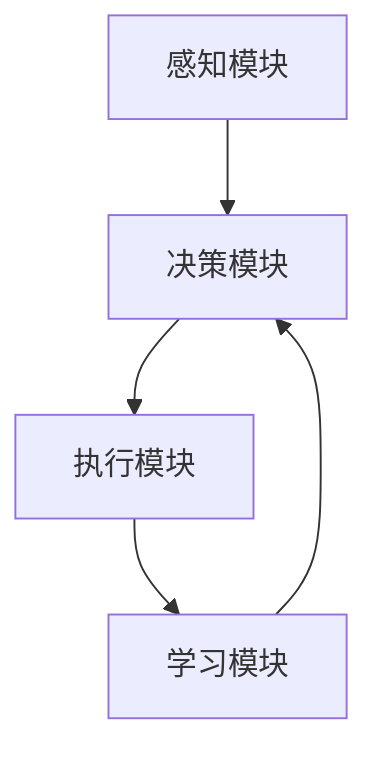

                 


# AI Agent在企业产品开发与创新中的角色

## 关键词：
AI Agent, 企业产品开发, 创新, 人工智能技术, 智能化决策

## 摘要：
AI Agent（人工智能代理）作为一种新兴的技术，正在逐步改变企业产品开发与创新的模式。通过智能感知、自主决策和持续优化，AI Agent能够显著提升企业的研发效率、降低开发成本，并推动创新成果的快速落地。本文将深入探讨AI Agent的核心原理、应用场景、系统架构以及实际案例，为企业在产品开发与创新中应用AI Agent提供有价值的参考。

---

## 第1章 AI Agent的基本概念与问题背景

### 1.1 AI Agent的基本概念
AI Agent是一种能够感知环境、自主决策并执行任务的智能体。它结合了人工智能、机器学习和自然语言处理等技术，具备以下核心特征：
- **自主性**：能够独立完成任务，无需人工干预。
- **反应性**：能够实时感知环境变化并做出响应。
- **学习能力**：通过数据反馈不断优化自身行为。
- **目标导向**：以特定目标为导向，持续改进任务完成效果。

### 1.2 企业产品开发中的问题背景
传统企业产品开发过程中存在以下痛点：
1. **需求不确定性**：市场需求变化快，产品开发周期长，难以快速响应。
2. **资源浪费**：开发过程中试错成本高，资源利用率低。
3. **创新不足**：依赖传统经验，缺乏创新性解决方案。

AI Agent通过智能化决策和自动化执行，能够有效解决这些问题，推动企业产品开发向高效、创新的方向发展。

---

## 第2章 AI Agent的核心原理

### 2.1 核心原理概述
AI Agent的工作流程包括以下几个关键步骤：
1. **感知环境**：通过传感器或数据接口获取环境信息。
2. **状态分析**：基于感知信息，分析当前状态并识别问题。
3. **决策制定**：结合历史数据和目标函数，生成最优决策方案。
4. **行动执行**：根据决策结果，驱动执行机构完成任务。

### 2.2 AI Agent的核心算法
AI Agent的决策过程通常采用强化学习（Reinforcement Learning）算法。以下是一个典型的Q-learning算法示例：

```python
# Q-learning算法实现
class QLearning:
    def __init__(self, state_space, action_space):
        self.state_space = state_space
        self.action_space = action_space
        self.Q = np.zeros((state_space, action_space))
    
    def choose_action(self, state, epsilon=0.1):
        if np.random.random() < epsilon:
            return np.random.randint(self.action_space)
        else:
            return np.argmax(self.Q[state])
    
    def update_Q(self, state, action, reward, next_state, alpha=0.1):
        self.Q[state, action] = (1 - alpha) * self.Q[state, action] + alpha * (reward + np.max(self.Q[next_state]))
```

数学公式如下：
$$ Q(s, a) = (1-\alpha)Q(s,a) + \alpha(r + \max Q(s', a')) $$

---

## 第3章 AI Agent在企业中的应用场景

### 3.1 产品需求分析
AI Agent可以通过分析市场数据和用户反馈，生成精准的需求分析报告，帮助企业快速确定产品方向。

### 3.2 开发过程优化
在产品开发阶段，AI Agent可以自动分配任务、监控进度，并根据实时数据优化开发流程。

### 3.3 创新方案生成
AI Agent结合自然语言处理和知识图谱技术，可以为企业提供创新的产品设计方案。

---

## 第4章 AI Agent的系统架构设计

### 4.1 系统功能设计
AI Agent系统主要包括以下几个模块：
1. **感知模块**：负责收集环境数据。
2. **决策模块**：基于数据进行分析和决策。
3. **执行模块**：驱动系统完成任务。
4. **学习模块**：通过反馈优化自身行为。

### 4.2 系统架构图


---

## 第5章 项目实战：AI Agent在产品开发中的应用

### 5.1 环境安装
需要安装以下工具和库：
- Python 3.8+
- TensorFlow、Keras、Scikit-learn
- Mermaid、PlantUML

### 5.2 核心代码实现
以下是一个简单的AI Agent实现示例：

```python
import numpy as np

class AI-Agent:
    def __init__(self, state_space, action_space):
        self.state_space = state_space
        self.action_space = action_space
        self.Q = np.zeros((state_space, action_space))
    
    def perceive(self, environment):
        # 获取环境数据
        return environment
    
    def decide(self, state):
        # 根据状态选择动作
        return np.argmax(self.Q[state])
    
    def learn(self, state, action, reward, next_state):
        # 更新Q值
        self.Q[state, action] = self.Q[state, action] + 0.1 * (reward + np.max(self.Q[next_state]) - self.Q[state, action])
```

### 5.3 案例分析
以一个智能推荐系统为例，AI Agent可以根据用户行为数据，实时优化推荐策略，提高用户满意度。

---

## 第6章 总结与展望

### 6.1 本章小结
AI Agent作为一种智能化工具，正在逐步改变企业产品开发与创新的方式。通过自动化决策和持续优化，AI Agent能够显著提升企业的研发效率和创新能力。

### 6.2 注意事项
在实际应用中，需要注意数据隐私、算法透明性和系统可解释性等问题。

### 6.3 扩展阅读
建议进一步研究强化学习、知识图谱和人机协作等技术，深入了解AI Agent在企业中的深度应用。

---

## 作者：AI天才研究院/AI Genius Institute & 禅与计算机程序设计艺术 /Zen And The Art of Computer Programming

