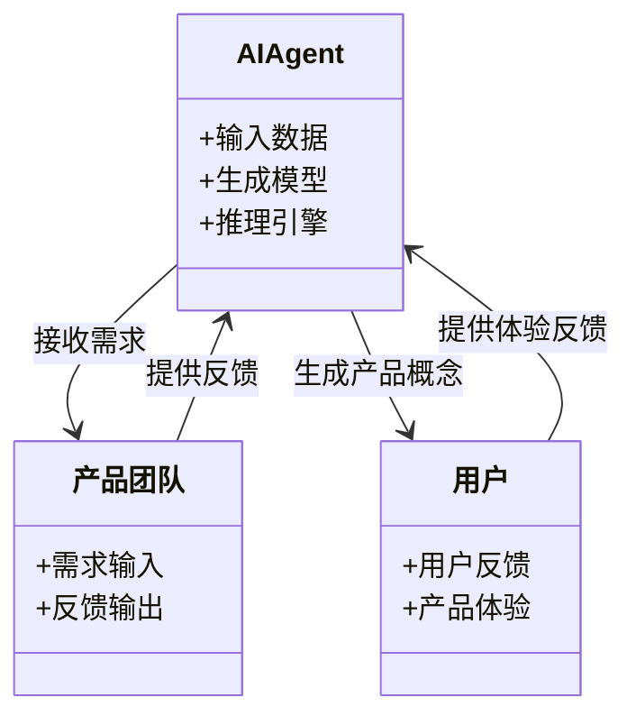
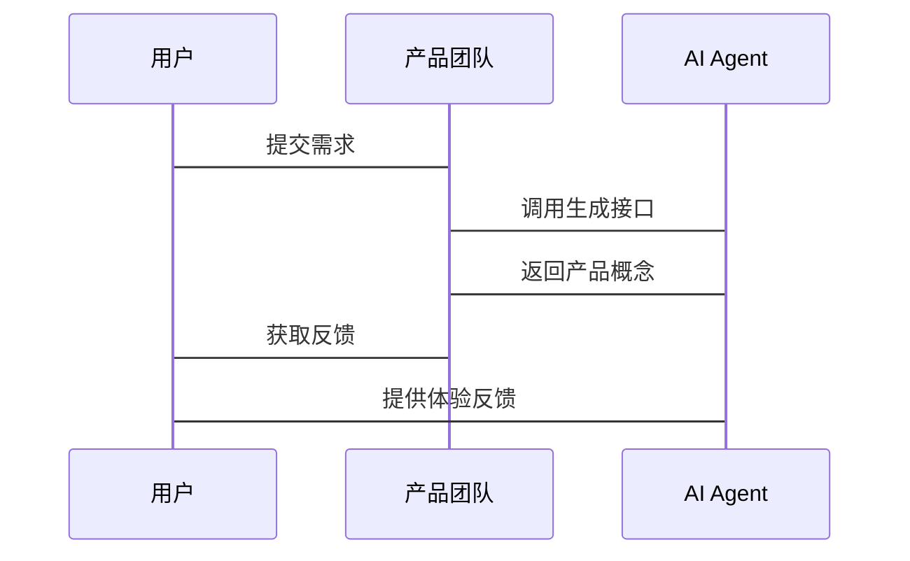

                 


# AI Agent在企业产品概念生成与评估中的角色

## 关键词：AI Agent, 产品概念生成, 评估系统, 生成式 AI, 强化学习

## 摘要：  
本文深入探讨了AI Agent在企业产品概念生成与评估中的角色和应用。通过分析生成式AI和强化学习的原理，结合实际案例，展示了AI Agent如何通过自动化、智能化的方式优化企业产品的开发流程。文章详细阐述了AI Agent的核心概念、算法原理、系统架构，并通过项目实战和最佳实践，为企业技术决策者和产品经理提供了实用的指导和启示。

---

# 第一部分: AI Agent 的基础与概念

## 第1章: AI Agent 的定义与背景

### 1.1 AI Agent 的基本概念

#### 1.1.1 什么是 AI Agent  
AI Agent（人工智能代理）是指能够感知环境、自主决策并执行任务的智能实体。它可以是一个软件系统，通过数据驱动和算法模型，模拟人类的思维方式，帮助企业在产品开发中实现自动化和智能化。

#### 1.1.2 AI Agent 的发展历程  
AI Agent 的概念起源于人工智能领域，经历了从简单规则驱动到复杂深度学习模型的演变。近年来，随着生成式AI和强化学习技术的突破，AI Agent 在企业应用中的潜力得到了充分释放。

#### 1.1.3 AI Agent 的核心特征  
- **自主性**：能够自主决策，无需人工干预。  
- **反应性**：能够实时感知环境变化并调整行为。  
- **学习能力**：通过数据和经验不断优化性能。  
- **可扩展性**：能够处理不同规模和复杂度的任务。

### 1.2 AI Agent 的应用场景

#### 1.2.1 企业级应用的场景  
- **产品概念生成**：通过AI Agent快速生成创新的产品想法。  
- **市场分析**：利用AI Agent进行市场趋势预测和竞争分析。  
- **用户行为预测**：基于用户数据，预测用户需求和偏好。  

#### 1.2.2 AI Agent 在产品开发中的角色  
- **辅助设计**：帮助设计师生成产品原型和交互逻辑。  
- **风险评估**：预测产品开发中的潜在风险并提出解决方案。  
- **迭代优化**：通过实时反馈优化产品功能和用户体验。  

#### 1.2.3 AI Agent 的优势与挑战  
- **优势**：提高效率、降低成本、提升创新性。  
- **挑战**：数据依赖性、模型可解释性、伦理问题。  

## 第2章: AI Agent 的核心概念与联系

### 2.1 核心概念原理

#### 2.1.1 AI Agent 的基本原理  
AI Agent 的核心是通过数据输入生成输出，其工作流程包括数据预处理、模型训练、推理和反馈优化四个阶段。

#### 2.1.2 生成式 AI 的工作流程  
生成式 AI 通过编码器和解码器的组合，将输入数据映射为输出结果。编码器负责提取数据特征，解码器负责生成目标输出。

#### 2.1.3 强化学习在 AI Agent 中的应用  
强化学习通过定义状态、动作和奖励，训练AI Agent在复杂环境中做出最优决策。

### 2.2 核心概念对比表

| 概念       | 描述                                   | 优缺点                           |
|------------|--------------------------------------|---------------------------------|
| 生成式 AI  | 通过概率模型生成新的数据             | 高效、创新，但需要大量数据       |
| 强化学习    | 基于奖励机制优化决策策略             | 灵活、适应性强，但训练时间长       |

### 2.3 ER 实体关系图

```mermaid
er
    actor(AI Agent)
    actor(用户)
    actor(产品团队)
    entity(产品概念)
    entity(市场数据)
    entity(用户反馈)
    relationship(AI Agent与用户)
    relationship(AI Agent与产品团队)
    relationship(产品概念与市场数据)
    relationship(用户反馈与产品团队)
```

---

# 第二部分: AI Agent 的算法原理

## 第3章: 生成式 AI 的原理与实现

### 3.1 生成式 AI 的基本原理

#### 3.1.1 概率分布与生成模型  
生成式 AI 通过学习数据的分布特性，生成符合该分布的新数据。

#### 3.1.2 损失函数与优化目标  
生成式 AI 的损失函数通常包括生成器损失和判别器损失，目标是最小化生成样本与真实样本的差异。

#### 3.1.3 解码器结构的详细分析  
解码器负责将潜在空间的向量映射到目标空间，通常采用多层感知机（MLP）或卷积神经网络（CNN）结构。

### 3.2 生成式 AI 的数学模型

#### 3.2.1 概率生成模型的公式推导  
生成模型的目标是最小化生成样本的似然函数：

$$ \mathcal{L}(G, D) = \mathbb{E}_{x \sim p_{data}}[\log D(x)] + \mathbb{E}_{z \sim p_z}[\log (1 - D(G(z)))] $$

#### 3.2.2 变分自编码器的数学表达  
变分自编码器的推断网络和生成网络分别由编码器和解码器组成：

$$ q_{\phi}(z|x) = \mathcal{N}(z|\mu_\phi(x), \sigma_\phi(x)^2) $$  
$$ p_{\theta}(x|z) = \mathcal{N}(x|\mu_\theta(z), \sigma_\theta(z)^2) $$  

#### 3.2.3 GAN 的损失函数与优化  
GAN 的生成器和判别器的损失函数分别为：

$$ \mathcal{L}_G = -\mathbb{E}_{z \sim p_z}[\log D(G(z))] $$  
$$ \mathcal{L}_D = -\mathbb{E}_{x \sim p_{data}}[\log D(x)] - \mathbb{E}_{z \sim p_z}[\log (1 - D(G(z)))] $$  

### 3.3 生成式 AI 的实现步骤

#### 3.3.1 数据预处理与特征提取  
对输入数据进行归一化、降维等预处理操作，提取关键特征。

#### 3.3.2 模型训练与参数调整  
通过梯度下降优化生成器和判别器的参数，通常使用Adam优化器。

#### 3.3.3 模型评估与优化  
通过生成样本的质量和判别器的准确率评估模型性能，调整超参数以优化表现。

## 第4章: 强化学习在 AI Agent 中的应用

### 4.1 强化学习的基本原理

#### 4.1.1 状态、动作与奖励的定义  
- **状态**：环境中的当前情况。  
- **动作**：AI Agent 的决策行为。  
- **奖励**：对AI Agent 行为的反馈，用于优化决策策略。  

#### 4.1.2 Q-learning 的算法流程  
Q-learning 算法通过更新Q表中的值，找到最优策略：

$$ Q(s, a) = Q(s, a) + \alpha \left( r + \gamma \max_{a'} Q(s', a') - Q(s, a) \right) $$  

#### 4.1.3 深度强化学习的实现方式  
深度强化学习通过神经网络近似Q值函数，提高模型的表达能力和泛化能力。

### 4.2 强化学习的数学模型

#### 4.2.1 Q-learning 的数学表达  
Q-learning 的目标是通过迭代更新Q值，逼近最优策略：

$$ Q(s, a) = \mathbb{E}[r + \gamma \max_a Q(s', a)] $$  

#### 4.2.2 深度 Q 网络  
深度 Q 网络通过神经网络结构近似Q值函数：

$$ Q(s) = \phi(s; \theta) $$  

---

# 第三部分: 系统分析与架构设计

## 第5章: 企业级 AI Agent 系统分析

### 5.1 系统功能设计

#### 5.1.1 领域模型设计  
领域模型描述系统的核心功能和实体关系：



### 5.2 系统架构设计


### 5.3 系统接口设计

#### 5.3.1 API 接口定义  
- `/generate/concept`：生成产品概念  
- `/train/model`：训练AI Agent 模型  
- `/evaluate/feedback`：评估用户反馈  

#### 5.3.2 交互流程图  


---

# 第四部分: 项目实战

## 第6章: 项目实战与代码实现

### 6.1 环境安装与配置

#### 6.1.1 安装依赖  
安装 Python 和必要的库：

```bash
pip install numpy matplotlib tensorflow-gpu
```

#### 6.1.2 环境配置  
配置GPU加速和并行计算参数。

### 6.2 核心实现代码

#### 6.2.1 生成式 AI 的实现  
实现一个简单的生成模型：

```python
import numpy as np

class Generator:
    def __init__(self, input_dim, output_dim):
        self.weights = np.random.randn(input_dim, output_dim)
        
    def generate(self, input_data):
        return np.dot(input_data, self.weights)
```

#### 6.2.2 强化学习的实现  
实现Q-learning算法：

```python
class QLearning:
    def __init__(self, state_space_size, action_space_size):
        self.q_table = np.zeros((state_space_size, action_space_size))
        
    def update(self, state, action, reward, next_state, alpha=0.1, gamma=0.9):
        self.q_table[state, action] += alpha * (reward + gamma * np.max(self.q_table[next_state, :]) - self.q_table[state, action])
```

### 6.3 案例分析与总结

#### 6.3.1 案例分析  
通过实际项目案例，展示AI Agent 在产品概念生成中的应用。

#### 6.3.2 总结与优化  
总结项目的成果和经验，提出优化建议。

---

# 第五部分: 最佳实践与小结

## 第7章: 最佳实践与注意事项

### 7.1 最佳实践

#### 7.1.1 数据质量管理  
确保数据的准确性和完整性。  
#### 7.1.2 模型可解释性  
避免过于复杂的模型，提高模型的可解释性。  
#### 7.1.3 伦理与安全  
确保AI Agent 的应用符合伦理规范和安全标准。  

### 7.2 注意事项

#### 7.2.1 数据依赖性  
AI Agent 的性能高度依赖于数据质量。  
#### 7.2.2 模型优化  
定期更新模型，避免过时。  
#### 7.2.3 用户隐私  
保护用户数据隐私，避免滥用。  

## 第8章: 项目小结与未来展望

### 8.1 项目小结

通过本项目，我们深入探讨了AI Agent 在企业产品概念生成与评估中的应用，展示了其在提高效率、降低成本和提升创新性方面的巨大潜力。

### 8.2 未来展望

随着生成式AI和强化学习技术的不断进步，AI Agent 将在企业产品开发中发挥越来越重要的作用，为企业创造更大的价值。

---

# 作者：AI天才研究院 & 禅与计算机程序设计艺术

