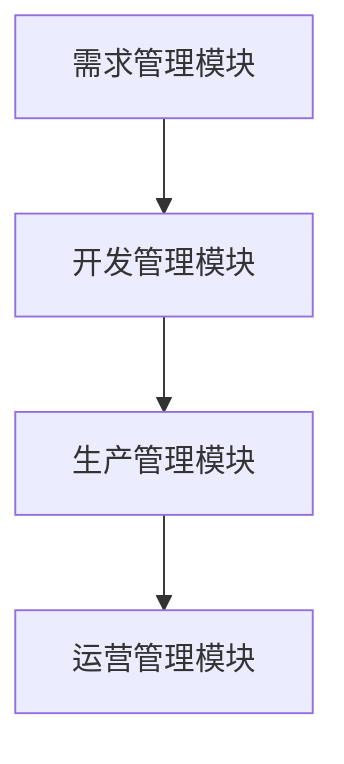

                 


# AI Agent在企业产品生命周期管理与优化中的应用

## 关键词
AI Agent, 企业产品生命周期, 优化, 智能管理, 人工智能技术

## 摘要
AI Agent（人工智能代理）作为一种新兴的智能化管理工具，正在逐步改变企业产品生命周期的管理方式。本文将从AI Agent的基本概念出发，详细探讨其在企业产品生命周期各阶段中的具体应用，包括需求管理、产品开发、生产交付和运营优化等环节。通过分析AI Agent的技术原理、系统架构和实际案例，本文旨在为企业提供一套高效的产品生命周期管理与优化方案。文章最后将总结AI Agent的优势与挑战，并展望其未来发展趋势。

---

# 第1章 AI Agent的定义与核心概念

## 1.1 AI Agent的定义与特点
### 1.1.1 AI Agent的定义
AI Agent是一种具备智能决策和自主执行能力的软件实体，能够通过感知环境、理解需求并采取行动来实现特定目标。AI Agent的核心在于其智能化、自主性和适应性。

### 1.1.2 AI Agent的核心特点
- **自主性**：AI Agent能够在无需人工干预的情况下独立完成任务。
- **反应性**：能够实时感知环境变化并做出响应。
- **学习能力**：通过机器学习算法不断优化自身行为。
- **协作性**：能够与其他系统或AI Agent协同工作。

### 1.1.3 AI Agent与传统自动化工具的区别
| 特性          | AI Agent                      | 传统自动化工具              |
|---------------|-------------------------------|-----------------------------|
| 智能性         | 高                           | 低                         |
| 自主性         | 高                           | 低                         |
| 学习能力       | 高                           | 无                         |
| 适应性         | 高                           | 低                         |

---

## 1.2 AI Agent在企业中的应用背景
### 1.2.1 企业产品生命周期管理的挑战
- **信息孤岛**：不同部门之间数据不共享，导致管理效率低下。
- **效率低下**：传统管理方式依赖人工操作，耗时且容易出错。
- **决策滞后**：缺乏实时数据分析支持，导致决策延迟。

### 1.2.2 AI Agent在企业中的潜在价值
- **提高管理效率**：通过自动化处理重复性任务，节省时间和资源。
- **优化资源配置**：基于数据的智能决策，提高资源利用率。
- **提升产品质量**：通过智能化测试和优化，提高产品稳定性。

### 1.2.3 企业采用AI Agent的优势与挑战
- **优势**：提升效率、降低成本、增强竞争力。
- **挑战**：技术复杂性高、数据隐私问题、员工适应性问题。

---

# 第2章 企业产品生命周期管理概述

## 2.1 产品生命周期的四个阶段
- **概念阶段**：确定产品目标和初步需求。
- **开发阶段**：设计、开发和测试产品。
- **生产阶段**：批量生产并交付给用户。
- **运营与优化阶段**：监控产品性能并持续优化。

## 2.2 产品生命周期管理的核心要素
- **产品需求管理**：明确需求并跟踪实现过程。
- **产品开发与测试**：确保产品符合需求。
- **产品生产与交付**：高效生产并确保产品质量。
- **产品运营与优化**：持续监控并优化产品性能。

## 2.3 传统产品生命周期管理的痛点
- **信息孤岛**：不同阶段的数据难以整合。
- **管理效率低下**：依赖人工操作，容易出错。
- **数据分析能力不足**：难以从大量数据中提取有用信息。

---

# 第3章 AI Agent在企业产品生命周期管理中的应用价值

## 3.1 提高管理效率
### 3.1.1 自动化处理重复性任务
- AI Agent可以通过自动化工具快速完成数据录入、任务分配等重复性工作。

### 3.1.2 实时监控与反馈
- AI Agent能够实时监控产品生命周期中的各项指标，并提供实时反馈。

### 3.1.3 智能决策支持
- 基于数据分析，AI Agent可以为管理者提供决策支持，帮助其做出最优决策。

## 3.2 优化资源配置
### 3.2.1 资源分配的智能化
- AI Agent可以根据实时数据智能分配资源，确保资源利用最大化。

### 3.2.2 资源利用的最大化
- 通过预测需求和优化调度，AI Agent可以帮助企业实现资源的最大化利用。

### 3.2.3 资源优化的动态调整
- AI Agent可以根据市场变化和需求波动动态调整资源分配策略。

## 3.3 提升产品质量
### 3.3.1 智能需求分析
- AI Agent可以通过自然语言处理技术帮助分析需求文档，确保需求准确无误。

### 3.3.2 自动化测试与优化
- AI Agent可以自动执行测试用例，并根据测试结果优化产品性能。

### 3.3.3 智能缺陷预测与修复
- AI Agent可以通过机器学习技术预测潜在缺陷，并协助开发人员快速修复问题。

---

# 第4章 AI Agent在需求管理中的应用

## 4.1 需求生成与分析
### 4.1.1 自然语言处理技术在需求分析中的应用
- 使用NLP技术从客户需求文档中提取关键信息，生成需求规格说明书。

### 4.1.2 基于AI Agent的需求优先级排序
- AI Agent可以根据需求的重要性和紧急程度自动排序需求优先级。

### 4.1.3 需求变更的智能跟踪与管理
- AI Agent可以实时跟踪需求变更，并自动更新相关文档和任务。

## 4.2 需求跟踪与反馈
### 4.2.1 基于AI Agent的需求跟踪系统
- AI Agent可以通过可视化界面实时跟踪需求实现进度。

### 4.2.2 需求实现的智能反馈机制
- AI Agent可以根据需求实现情况自动生成反馈报告，帮助开发人员快速定位问题。

### 4.2.3 用户反馈的实时分析与处理
- AI Agent可以实时分析用户反馈，识别共性问题并协助开发人员优先处理。

---

# 第5章 AI Agent在产品开发中的应用

## 5.1 代码生成与优化
### 5.1.1 基于AI Agent的代码自动生成
- AI Agent可以根据需求文档自动生成代码框架，减少开发人员的工作量。

### 5.1.2 代码质量的智能评估与优化
- AI Agent可以使用静态代码分析工具评估代码质量，并提出改进建议。

### 5.1.3 开发过程中的智能辅助
- AI Agent可以为开发人员提供实时代码补全、错误提示等智能辅助功能。

## 5.2 自动化测试与质量控制
### 5.2.1 基于AI Agent的自动化测试
- AI Agent可以自动生成测试用例并执行自动化测试，确保代码质量。

### 5.2.2 测试结果的智能分析
- AI Agent可以通过机器学习技术分析测试结果，识别潜在缺陷并协助开发人员修复问题。

### 5.2.3 质量控制的动态优化
- AI Agent可以根据测试结果动态调整测试策略，提高测试效率和覆盖率。

---

# 第6章 AI Agent在产品交付与运营中的应用

## 6.1 生产过程中的智能监控
### 6.1.1 基于AI Agent的生产监控系统
- AI Agent可以通过物联网设备实时监控生产过程中的各项指标。

### 6.1.2 生产异常的智能预警
- AI Agent可以根据历史数据和实时数据预测生产异常，并提前发出预警。

## 6.2 产品运营中的智能优化
### 6.2.1 基于AI Agent的用户行为分析
- AI Agent可以通过用户行为数据优化产品运营策略。

### 6.2.2 产品性能的实时优化
- AI Agent可以根据实时数据动态调整产品参数，提高产品性能。

## 6.3 运营数据的智能分析
### 6.3.1 基于AI Agent的数据挖掘与分析
- AI Agent可以通过数据挖掘技术分析运营数据，发现潜在规律。

### 6.3.2 数据驱动的决策支持
- AI Agent可以根据数据分析结果为管理者提供决策支持。

---

# 第7章 项目实战：AI Agent在企业中的具体实现

## 7.1 项目背景与目标
- 项目背景：某企业希望利用AI Agent优化其产品生命周期管理。
- 项目目标：实现需求管理、开发、生产和运营的智能化管理。

## 7.2 系统架构设计
### 7.2.1 系统功能设计
- 需求管理模块：负责需求生成、跟踪和反馈。
- 开发管理模块：负责代码生成、测试和优化。
- 生产管理模块：负责生产监控和质量控制。
- 运营管理模块：负责用户行为分析和数据挖掘。

### 7.2.2 系统架构图


## 7.3 核心代码实现
### 7.3.1 需求生成模块
```python
def generate_requirements():
    import nltk
    from sklearn.feature_extraction.text import TfidfVectorizer

    # 加载客户反馈数据
    customer_feedback = "..."
    # 使用NLP技术提取关键需求
    vectorizer = TfidfVectorizer()
    tfidf = vectorizer.fit_transform([customer_feedback])
    feature_names = vectorizer.get_feature_names_out()
    top_features = get_top_features(tfidf, feature_names)
    return top_features
```

### 7.3.2 自动化测试模块
```python
def automated_testing():
    import unittest
    from selenium import webdriver

    # 初始化 WebDriver
    driver = webdriver.Chrome()
    # 执行测试用例
    test_cases = ["test_case_1", "test_case_2"]
    for case in test_cases:
        driver.get(case)
        # 执行断言
        assertEqual(driver.title, "Expected Title")
    # 关闭 WebDriver
    driver.quit()
```

---

# 第8章 总结与展望

## 8.1 总结
- AI Agent在企业产品生命周期管理中的应用价值显著，可以显著提高管理效率、优化资源配置并提升产品质量。

## 8.2 未来展望
- 随着AI技术的不断发展，AI Agent在企业中的应用将更加广泛和深入，未来可能会出现更智能化和个性化的AI Agent解决方案。

---

# 作者：AI天才研究院/AI Genius Institute & 禅与计算机程序设计艺术 /Zen And The Art of Computer Programming

---

本文通过详细分析AI Agent在企业产品生命周期管理中的应用，为企业提供了智能化管理的新思路。从理论到实践，从概念到代码，本文为读者提供了一套完整的解决方案，帮助企业更好地应对产品管理的挑战。

