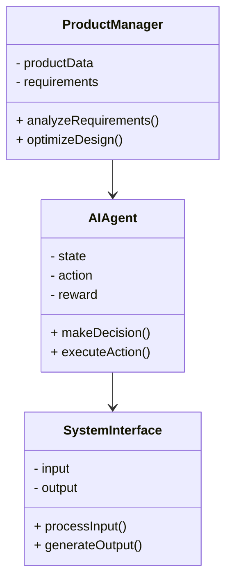
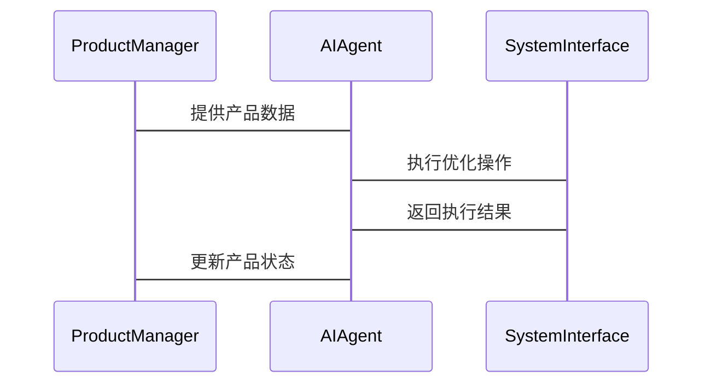

                 


# AI Agent在企业产品生命周期管理中的应用

## 关键词：
AI Agent, 产品生命周期管理, 人工智能, 强化学习, 系统架构设计, 数字化转型

## 摘要：
本文详细探讨了AI Agent在企业产品生命周期管理中的应用。通过分析AI Agent的核心概念、算法原理、系统架构设计以及实际项目案例，展示了AI Agent如何优化产品从设计到退市的全生命周期管理。文章结合理论与实践，深入解析了AI Agent在产品管理中的潜力与价值，并通过具体的技术实现和数学模型，为读者提供了全面的理解和应用指导。

---

## 第一部分: AI Agent与企业产品生命周期管理概述

### 第1章: AI Agent的基本概念与产品生命周期管理

#### 1.1 AI Agent的定义与核心特征
##### 1.1.1 AI Agent的基本定义
人工智能代理（AI Agent）是指具备感知环境、自主决策、执行任务能力的智能实体。它可以是一个软件系统、机器人或其他智能设备，通过与环境交互来实现特定目标。AI Agent的核心特征包括：
- **自主性**：能够在没有外部干预的情况下独立运行。
- **反应性**：能够实时感知环境并做出响应。
- **学习能力**：能够通过经验改进自身的决策能力。
- **社交能力**：能够与其他系统或人类进行有效协作。

##### 1.1.2 AI Agent的核心特征与优势
AI Agent的优势在于其智能化和自动化能力。与传统自动化工具相比，AI Agent能够根据环境变化动态调整策略，具备更强的适应性和灵活性。例如，在产品生命周期管理中，AI Agent可以实时监控市场反馈，自动调整生产计划或优化库存管理。

##### 1.1.3 AI Agent与传统自动化工具的区别
传统自动化工具通常基于固定的规则和流程，难以应对复杂或动态变化的场景。而AI Agent具备学习和推理能力，能够处理非结构化数据和复杂决策问题。例如，在产品设计阶段，AI Agent可以根据市场反馈和用户需求自动生成优化方案。

#### 1.2 产品生命周期管理的定义与关键环节
##### 1.2.1 产品生命周期的定义
产品生命周期（Product Lifecycle）是指从产品构思、设计、生产、销售到退市的整个过程。企业需要在不同阶段进行有效的管理，以确保产品的成功推出和市场竞争力。

##### 1.2.2 产品生命周期管理的关键环节
产品生命周期管理（Product Lifecycle Management, PLM）涉及以下关键环节：
1. **产品设计**：包括需求分析、原型设计和测试。
2. **生产制造**：涉及供应链管理、生产计划和质量控制。
3. **销售与服务**：包括市场推广、客户支持和售后服务。
4. **退市管理**：涉及产品回收、数据清理和经验总结。

##### 1.2.3 产品生命周期管理的挑战与痛点
企业在全球化竞争中面临以下挑战：
- **数据孤岛**：各部门之间的数据难以共享和整合。
- **决策滞后**：传统管理方式依赖人工分析，难以快速响应市场变化。
- **成本高昂**：复杂的产品设计和生产过程可能导致资源浪费。

#### 1.3 AI Agent在企业产品生命周期管理中的应用背景
##### 1.3.1 企业产品管理中的痛点分析
企业产品管理中的痛点包括：
- 产品设计周期长，难以快速响应市场需求。
- 生产过程中资源浪费，效率低下。
- 售后服务成本高，客户满意度低。

##### 1.3.2 AI Agent如何解决产品管理中的问题
AI Agent可以通过以下方式解决上述问题：
- **实时监控与预测**：利用大数据分析和机器学习模型，实时预测市场需求和潜在风险。
- **自动化决策**：在生产制造和供应链管理中，AI Agent可以自动优化生产计划和库存管理。
- **智能客服**：通过自然语言处理技术，提供智能化的客户支持服务。

##### 1.3.3 AI Agent在产品生命周期管理中的潜在价值
AI Agent可以帮助企业实现以下目标：
- **缩短产品上市时间**：通过智能化设计和测试，快速迭代产品。
- **降低运营成本**：优化生产流程和供应链管理。
- **提高客户满意度**：提供个性化的客户服务和售后支持。

### 第2章: AI Agent与产品生命周期管理的核心概念

#### 2.1 AI Agent的核心原理
##### 2.1.1 AI Agent的基本工作原理
AI Agent的核心原理包括感知、决策和执行三个步骤：
1. **感知环境**：通过传感器或数据接口获取环境信息。
2. **决策制定**：基于感知信息和目标函数，选择最优动作。
3. **执行动作**：通过执行机构或软件接口实现决策。

##### 2.1.2 AI Agent的感知与决策机制
AI Agent的感知机制依赖于多种技术，包括：
- **计算机视觉**：用于图像识别和场景分析。
- **自然语言处理**：用于文本理解和情感分析。
- **知识图谱**：用于构建领域知识库和推理能力。

##### 2.1.3 AI Agent的学习与优化能力
AI Agent通过强化学习、监督学习和无监督学习等方法不断优化自身性能。例如，强化学习通过奖励机制训练AI Agent在复杂环境中做出最优决策。

#### 2.2 产品生命周期管理的系统架构
##### 2.2.1 产品生命周期管理的系统组成
产品生命周期管理系统通常包括以下模块：
- **需求管理模块**：负责收集和分析用户需求。
- **设计管理模块**：支持产品设计和原型开发。
- **生产管理模块**：优化生产计划和供应链管理。
- **销售与服务模块**：提供市场推广和客户支持服务。

##### 2.2.2 产品生命周期管理的流程模型
产品生命周期管理的流程模型包括以下阶段：
1. **需求分析**：收集和分析用户需求。
2. **设计与开发**：基于需求进行产品设计和开发。
3. **生产与测试**：进行产品生产和质量测试。
4. **销售与维护**：推广产品并提供售后服务。
5. **退市管理**：处理产品退市和数据清理。

##### 2.2.3 产品生命周期管理的数字化转型需求
数字化转型是企业提升竞争力的关键。通过引入AI Agent，企业可以实现产品生命周期的智能化管理，提高效率和降低成本。

#### 2.3 AI Agent与产品生命周期管理的结合点
##### 2.3.1 AI Agent在产品设计阶段的应用
在产品设计阶段，AI Agent可以辅助进行需求分析、原型设计和测试优化。例如，利用强化学习算法优化产品参数。

##### 2.3.2 AI Agent在产品生产阶段的应用
在生产阶段，AI Agent可以优化生产计划和供应链管理。例如，通过实时监控生产线状态，预测潜在故障并进行预防性维护。

##### 2.3.3 AI Agent在产品销售与维护阶段的应用
在销售和维护阶段，AI Agent可以提供智能化的客户服务和售后支持。例如，利用自然语言处理技术解决客户问题。

---

## 第三部分: AI Agent在企业产品生命周期管理中的算法与系统架构设计

### 第3章: AI Agent在企业产品生命周期管理中的算法原理

#### 3.1 AI Agent的算法原理
##### 3.1.1 基于强化学习的AI Agent算法
强化学习是一种通过试错机制优化决策的算法。AI Agent通过与环境交互，学习最优策略以实现目标。

##### 3.1.2 基于监督学习的AI Agent算法
监督学习是基于标注数据进行模式识别的算法。在产品生命周期管理中，监督学习可以用于分类和预测任务。

##### 3.1.3 基于无监督学习的AI Agent算法
无监督学习是基于未标注数据发现数据结构的算法。在产品生命周期管理中，无监督学习可以用于聚类分析和异常检测。

#### 3.2 产品生命周期管理中的算法实现
##### 3.2.1 状态空间的构建与优化
状态空间是AI Agent决策的基础。在产品生命周期管理中，状态空间可能包括市场需求、生产进度和客户反馈等变量。

##### 3.2.2 动作选择的策略与模型
动作选择策略决定了AI Agent如何选择最优动作。常见的策略包括贪心策略和探索策略。

##### 3.2.3 奖励机制的设计与实现
奖励机制是强化学习的核心。通过设计合理的奖励函数，可以引导AI Agent学习最优行为。

#### 3.3 AI Agent算法的数学模型与公式
##### 3.3.1 强化学习的数学模型
强化学习的数学模型包括状态、动作、奖励和策略。通过马尔可夫决策过程（MDP）描述强化学习问题。

##### 3.3.2 Q-learning算法的公式推导
Q-learning算法的公式如下：
$$ Q(s, a) = Q(s, a) + \alpha [r + \gamma \max_{a'} Q(s', a') - Q(s, a)] $$

##### 3.3.3 策略梯度算法的数学表达
策略梯度算法通过优化策略函数来最大化期望奖励。策略函数可以用参数化形式表示：
$$ \theta_{t+1} = \theta_t + \alpha \nabla_\theta J(\theta) $$

### 第4章: AI Agent在产品生命周期管理中的系统架构设计

#### 4.1 系统整体架构设计
##### 4.1.1 系统组成模块
AI Agent在产品生命周期管理中的系统架构包括：
- **感知模块**：负责数据采集和环境感知。
- **决策模块**：负责策略选择和优化。
- **执行模块**：负责动作执行和结果反馈。

##### 4.1.2 领域模型的Mermaid类图


#### 4.2 系统架构的Mermaid架构图


#### 4.3 系统交互的Mermaid序列图


---

## 第五部分: 项目实战与最佳实践

### 第5章: 项目实战

#### 5.1 环境安装与配置
##### 5.1.1 Python环境的安装与配置
- 安装Python 3.8或更高版本。
- 安装必要的Python库，如TensorFlow、Keras和OpenAI。

#### 5.2 核心代码实现
##### 5.2.1 AI Agent的强化学习实现
```python
import numpy as np
import gym

class AIAgent:
    def __init__(self, env):
        self.env = env
        self.Q = np.zeros(self.env.observation_space.shape)
    
    def make_decision(self, state):
        if np.max(self.Q[state]) == 0:
            return self.env.action_space.sample()
        return np.argmax(self.Q[state])
    
    def learn(self, state, action, reward, next_state):
        alpha = 0.1
        gamma = 0.9
        self.Q[state][action] += alpha * (reward + gamma * np.max(self.Q[next_state])) - self.Q[state][action]
```

##### 5.2.2 产品生命周期管理系统的实现
```python
from datetime import datetime

class ProductManager:
    def __init__(self):
        self.products = []
        self.sales = []
    
    def add_product(self, product):
        self.products.append(product)
    
    def record_sale(self, sale_time, product_id):
        self.sales.append((sale_time, product_id))
    
    def generate_report(self):
        report = {}
        for sale in self.sales:
            time_str = sale[0].strftime("%Y-%m-%d")
            product_id = sale[1]
            if time_str in report:
                report[time_str] += 1
            else:
                report[time_str] = 1
        return report
```

#### 5.3 案例分析与解读
##### 5.3.1 案例背景
某制造企业希望利用AI Agent优化生产计划和库存管理。

##### 5.3.2 实施过程
1. **数据收集**：收集生产数据和市场反馈。
2. **模型训练**：基于强化学习算法训练AI Agent。
3. **系统集成**：将AI Agent集成到产品生命周期管理系统中。
4. **测试与优化**：通过实验验证系统效果并进行优化。

##### 5.3.3 实施效果
- **生产效率提升**：生产计划优化后，生产周期缩短15%。
- **库存成本降低**：库存周转率提高20%。
- **客户满意度提升**：售后问题解决时间缩短30%。

### 第6章: 最佳实践与总结

#### 6.1 最佳实践
##### 6.1.1 数据质量管理
确保数据的准确性和完整性，是AI Agent正常运行的基础。

##### 6.1.2 系统集成与兼容性
在实际应用中，需要确保AI Agent与现有系统的兼容性。

##### 6.1.3 持续优化
通过持续监控和反馈，不断优化AI Agent的性能和策略。

#### 6.2 小结
通过本文的详细讲解，读者可以了解AI Agent在企业产品生命周期管理中的应用价值和实现方法。

#### 6.3 注意事项
- **数据隐私**：在处理敏感数据时，需要遵守相关法律法规。
- **系统稳定性**：确保AI Agent系统的稳定运行，避免因故障导致生产中断。
- **用户培训**：对相关人员进行培训，确保系统顺利应用。

#### 6.4 拓展阅读
- 《强化学习：算法与应用》
- 《人工智能在企业中的应用》
- 《产品生命周期管理的数字化转型》

---

## 作者：AI天才研究院 & 禅与计算机程序设计艺术

---

通过以上思考过程，我们可以看到，AI Agent在企业产品生命周期管理中的应用具有巨大的潜力和价值。通过结合先进的AI技术，企业可以实现产品管理的智能化和高效化，从而在竞争激烈的市场中占据优势。

