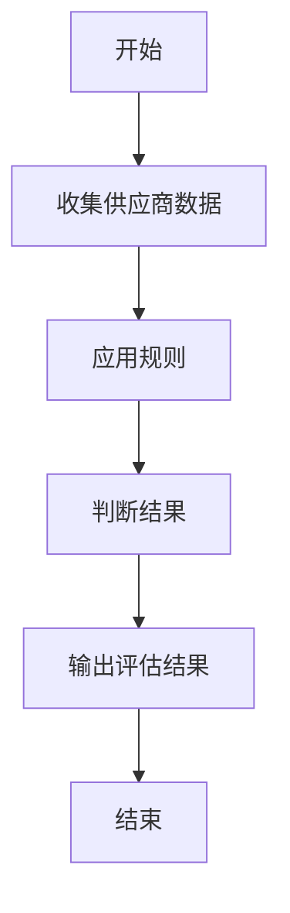
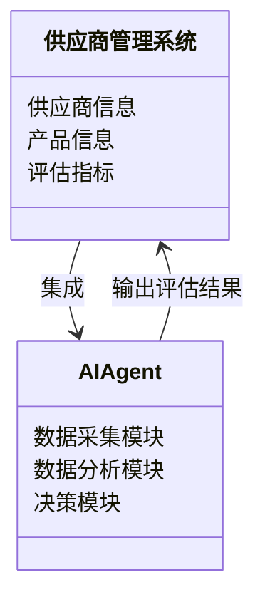
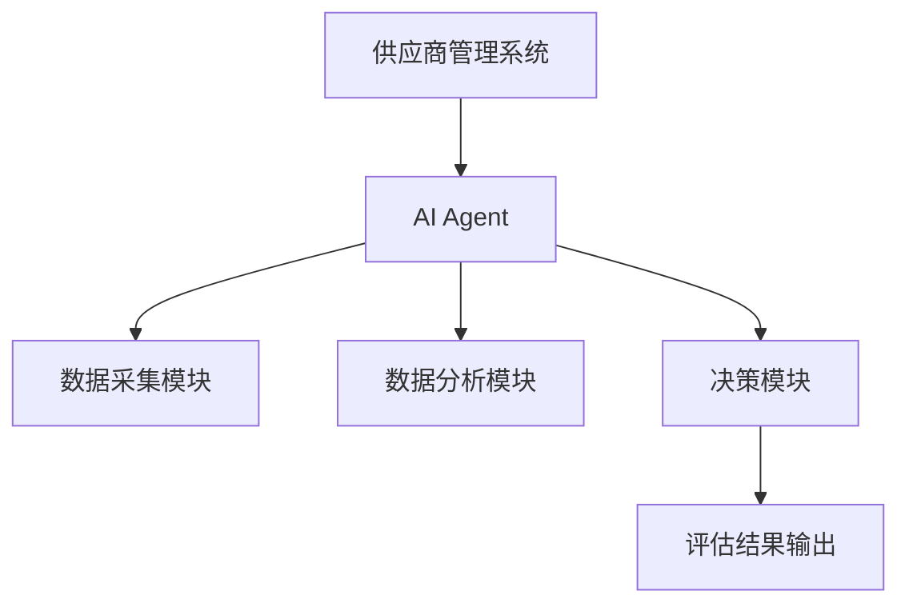
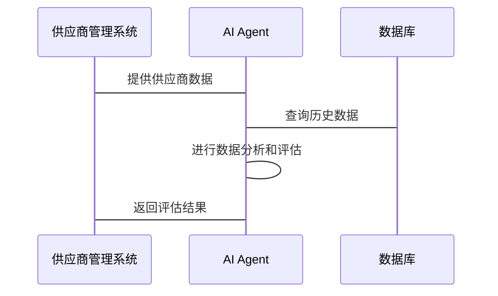

                 


# AI Agent在企业供应商管理与评估中的角色

## 关键词
AI Agent, 企业供应商管理, 供应商评估, 人工智能技术, 企业数字化转型

## 摘要
随着企业数字化转型的加速，AI Agent（人工智能代理）在企业供应商管理与评估中的应用越来越广泛。本文将深入探讨AI Agent如何在企业供应商管理中发挥核心作用，从背景介绍、核心概念、算法原理到系统架构设计、项目实战，最后总结AI Agent在企业供应商管理中的最佳实践和未来发展趋势。文章将通过详细的理论分析和实际案例，展示AI Agent如何通过智能化、自动化的方式优化企业供应商管理流程，提高管理效率和决策质量。

---

## 第1章: AI Agent与企业供应商管理的背景介绍

### 1.1 AI Agent的基本概念

#### 1.1.1 AI Agent的定义
AI Agent（人工智能代理）是一种能够感知环境、自主决策并执行任务的智能系统。它通过传感器获取信息，利用算法进行分析和推理，最终做出决策并执行操作。AI Agent的核心在于其智能化和自主性，能够在复杂环境中完成复杂的任务。

#### 1.1.2 AI Agent的核心特点
- **自主性**：AI Agent能够在没有人工干预的情况下独立完成任务。
- **反应性**：能够实时感知环境变化并做出响应。
- **目标导向性**：基于目标和优先级进行决策。
- **学习能力**：通过数据和经验不断优化自身行为。

#### 1.1.3 AI Agent与传统管理工具的区别
| 特性            | AI Agent                          | 传统管理工具                      |
|-----------------|-----------------------------------|------------------------------------|
| 智能性          | 高                                | 低                                |
| 自主性          | 高                                | 低                                |
| 学习能力        | 高                                | 无                                |
| 决策能力        | 强大，基于数据和模型             | 依赖人工决策                      |

---

### 1.2 企业供应商管理的基本概念

#### 1.2.1 供应商管理的定义
企业供应商管理是指企业对供应商的选择、评估、监控和优化的过程，旨在确保供应商能够按时、按质、按量地提供产品或服务。

#### 1.2.2 供应商管理的关键环节
1. 供应商选择与准入
2. 供应商绩效评估
3. 供应商关系管理
4. 供应商风险控制

#### 1.2.3 供应商管理的挑战与痛点
- 数据繁杂：供应商信息量大，难以高效处理。
- 评估复杂：涉及多个维度，人工评估效率低。
- 风险控制：难以实时监控供应商表现。
- 决策滞后：传统管理方式依赖人工分析，决策周期长。

---

### 1.3 AI Agent在企业供应商管理中的应用背景

#### 1.3.1 企业供应商管理的数字化转型
企业正在从传统的手工管理模式向数字化、智能化管理模式转型，AI Agent作为智能化工具，成为这一转型的关键驱动力。

#### 1.3.2 AI技术在企业管理中的发展趋势
随着AI技术的成熟，越来越多的企业开始尝试将AI技术应用于供应链管理、采购流程优化等领域，AI Agent在其中扮演着重要角色。

#### 1.3.3 AI Agent在供应商管理中的潜在价值
- 提高供应商评估的效率和准确性。
- 实现实时监控和风险预警。
- 优化供应商关系管理，提升供应链整体绩效。

---

## 第2章: AI Agent与企业供应商管理的核心概念与联系

### 2.1 AI Agent与企业供应商管理的核心概念

#### 2.1.1 AI Agent在供应商管理中的核心作用
- 数据收集与处理：AI Agent能够从多个来源收集供应商数据，包括历史交易记录、供应商绩效指标等。
- 数据分析与评估：基于机器学习算法，AI Agent能够对供应商进行多维度评估，包括质量、交货时间、成本等。
- 决策支持：AI Agent能够根据评估结果提供优化建议，例如推荐最佳供应商或调整采购策略。

#### 2.1.2 企业供应商管理的核心要素
- 供应商信息：供应商的基本信息、历史交易记录、绩效数据等。
- 供应商评估指标：质量、成本、交货时间、服务响应等。
- 供应商关系：供应商之间的合作关系、信任度等。

#### 2.1.3 AI Agent与企业供应商管理的关系
- AI Agent是企业供应商管理的智能化工具，能够提升管理效率和决策质量。
- 企业供应商管理为AI Agent提供数据和应用场景，推动AI技术的落地应用。

---

### 2.2 AI Agent与企业供应商管理的对比分析

#### 2.2.1 对比表格
| 特性            | AI Agent                          | 企业供应商管理                  |
|-----------------|-----------------------------------|------------------------------------|
| 实现方式        | 智能算法、自动化系统              | 人工操作、流程化管理            |
| 数据处理能力    | 强大，支持大数据分析              | 较弱，依赖人工整理              |
| 决策效率        | 高，实时决策                     | 低，依赖人工分析                |

#### 2.2.2 实体关系图（ER图）
```mermaid
erd
    title 企业供应商管理的实体关系图

    Supplier
    Product
    Assessment指标

    Supplier --> Product: 提供
    Supplier --> Assessment指标: 评估
    Product --> Assessment指标: 贡献
```

---

## 第3章: AI Agent在企业供应商管理中的算法原理

### 3.1 基于规则的逻辑推理算法

#### 3.1.1 算法原理
基于规则的逻辑推理是一种简单而有效的AI算法，适用于供应商评估中的规则性判断。例如，如果供应商的交货延迟率超过20%，则将其标记为高风险供应商。

#### 3.1.2 算法流程图


#### 3.1.3 算法实现
以下是基于规则的逻辑推理算法的Python实现：
```python
# 基于规则的逻辑推理算法实现
def assess_supplier(risk_factors):
    # 风险因素包括：交货延迟率、质量问题、服务响应时间等
    if risk_factors['交货延迟率'] > 20:
        return '高风险'
    elif risk_factors['质量问题'] > 10:
        return '中风险'
    else:
        return '低风险'

# 示例调用
supplier_risk_factors = {
    '交货延迟率': 15,
    '质量问题': 8,
    '服务响应时间': 3
}
result = assess_supplier(supplier_risk_factors)
print(f"供应商风险等级：{result}")
```

#### 3.1.4 数学模型与公式
基于贝叶斯定理的简单概率计算：
$$P(A|B) = \frac{P(B|A)P(A)}{P(B)}$$
其中，$A$表示“供应商存在质量问题”，$B$表示“供应商的产品抽检不合格”。

---

## 第4章: 系统分析与架构设计方案

### 4.1 问题场景介绍
企业需要对供应商进行实时监控和评估，确保供应链的稳定性和高效性。传统的人工管理模式效率低下，难以应对复杂的供应商管理需求。

### 4.2 系统功能设计

#### 4.2.1 领域模型类图


### 4.3 系统架构设计

#### 4.3.1 系统架构图


#### 4.3.2 系统接口设计
- 数据输入接口：接收供应商数据和评估指标。
- 数据输出接口：输出供应商评估结果和优化建议。

#### 4.3.3 系统交互流程图


---

## 第5章: 项目实战

### 5.1 环境安装与配置

#### 5.1.1 安装Python与相关库
```bash
# 安装Python
# 安装必要的库
pip install numpy pandas scikit-learn matplotlib
```

### 5.2 系统核心实现

#### 5.2.1 核心代码实现
```python
# 基于机器学习的供应商评估系统
from sklearn import metrics
import numpy as np
import pandas as pd

# 数据加载
data = pd.read_csv('suppliers.csv')

# 特征工程
X = data.drop('supplier_rating', axis=1)
y = data['supplier_rating']

# 模型训练
from sklearn.tree import DecisionTreeClassifier
model = DecisionTreeClassifier()
model.fit(X, y)

# 模型预测
new_supplier = np.array([[8, 15, 3]])
predicted_rating = model.predict(new_supplier)
print(f"预测供应商等级：{predicted_rating[0]}")
```

#### 5.2.2 代码解读与分析
- 数据加载：从CSV文件中读取供应商数据。
- 特征工程：提取供应商的评估指标作为特征。
- 模型训练：使用决策树算法训练供应商评估模型。
- 模型预测：对新供应商进行评级预测。

### 5.3 实际案例分析

#### 5.3.1 案例背景
某制造企业需要评估10家供应商的绩效，包括交货时间、产品质量和服务响应时间。

#### 5.3.2 案例分析
通过AI Agent对供应商进行多维度评估，发现其中有两家供应商存在交货延迟问题，需要进一步优化。

#### 5.3.3 详细讲解
AI Agent通过机器学习算法对供应商数据进行分析，生成评估报告，并提出优化建议，帮助企业提升供应链效率。

### 5.4 项目小结
通过本项目，我们展示了AI Agent在供应商管理中的实际应用价值，证明了其在提高管理效率和决策质量方面的优势。

---

## 第6章: 最佳实践与未来展望

### 6.1 最佳实践Tips
- 数据质量是AI Agent性能的基础，确保数据的完整性和准确性。
- 模型可解释性是AI技术应用的关键，避免“黑箱”模型。
- 定期更新模型，适应市场和供应商的变化。

### 6.2 总结与展望
本文全面探讨了AI Agent在企业供应商管理中的应用，从理论到实践，展示了其在提高管理效率和决策质量方面的巨大潜力。未来，随着AI技术的不断发展，AI Agent将在企业供应商管理中发挥更加重要的作用。

---

## 结语
AI Agent作为企业供应商管理的智能化工具，正在推动企业供应链管理的数字化转型。通过本文的深入分析和实际案例，我们相信AI Agent将在未来的供应商管理中发挥越来越重要的角色。

---

## 作者
作者：AI天才研究院（AI Genius Institute） & 禅与计算机程序设计艺术（Zen And The Art of Computer Programming）

