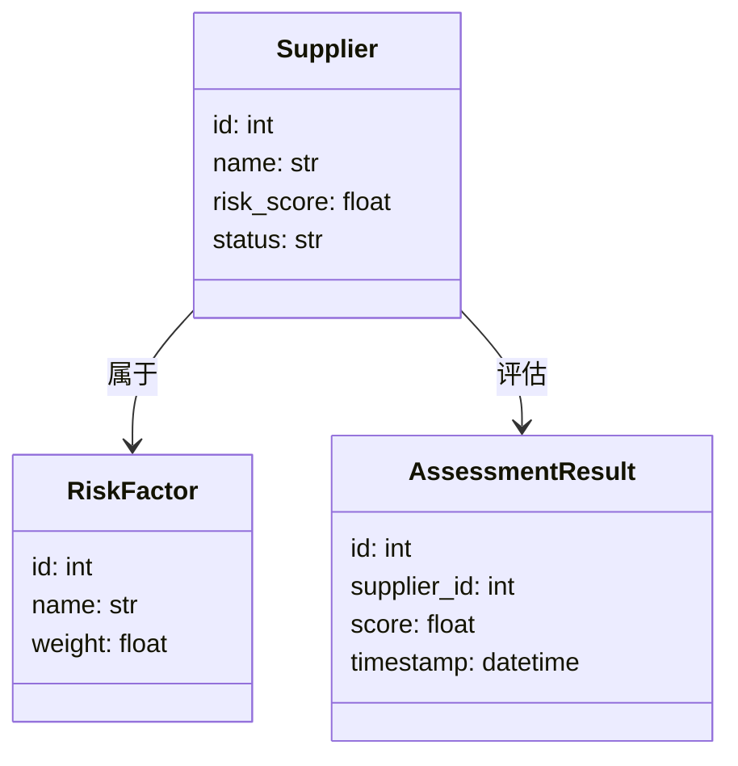
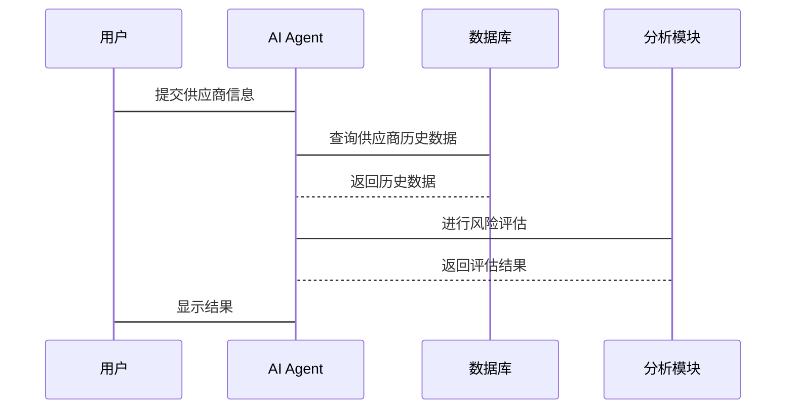

                 


# AI Agent在企业供应商风险评估与管理中的角色

## 关键词：AI Agent, 供应商风险管理, 企业供应链, 多智能体系统, 风险评估模型, 供应链优化

## 摘要：  
随着企业供应链的复杂化和全球化，供应商风险管理变得日益重要。本文探讨AI Agent在企业供应商风险评估与管理中的角色，分析其核心原理、算法实现、系统架构，并结合实际案例，展示AI Agent如何提升供应链的透明度、预测能力和响应速度，为企业提供智能化的供应商风险管理解决方案。

---

## 第一部分：背景介绍

### 第1章：问题背景

#### 1.1 企业供应链管理的重要性  
企业供应链管理是企业运营的核心环节，涉及采购、生产、物流和交付等过程。供应商是供应链的关键节点，其稳定性直接影响企业的运营效率和成本控制。

#### 1.2 供应商风险的来源与影响  
供应商风险包括信用风险、交付风险、质量风险和合规风险。这些风险可能导致供应链中断、成本增加和声誉损失，严重威胁企业的正常运营。

#### 1.3 传统供应商风险管理的局限性  
传统方法依赖人工审核和静态数据，难以实时捕捉市场变化和供应商动态。数据孤岛和信息不对称问题进一步加剧了风险评估的难度。

### 第2章：问题描述

#### 2.1 供应商风险的多维度分析  
供应商风险涉及财务状况、行业趋势、地理位置和企业声誉等多个维度，需要综合分析才能准确评估。

#### 2.2 数据孤岛与信息不对称问题  
企业内部各部门和外部供应商之间的数据分散，缺乏统一的平台进行整合和分析，导致信息不对称和决策滞后。

#### 2.3 传统方法在风险预测中的不足  
传统方法依赖历史数据和经验判断，难以应对市场波动和突发事件。预测精度低，响应速度慢，无法满足现代供应链的动态需求。

### 第3章：问题解决

#### 3.1 引入AI Agent的必要性  
AI Agent能够实时监控供应商数据，利用机器学习和自然语言处理技术，提供动态的风险评估和预测。

#### 3.2 AI Agent在供应商风险管理中的优势  
AI Agent具有自我学习和自适应能力，能够快速响应市场变化，提供精准的风险预警和优化建议。

#### 3.3 解决方案的可行性分析  
通过AI Agent技术，企业可以实现供应商数据的实时分析和动态管理，提升供应链的整体效率和抗风险能力。

### 第4章：边界与外延

#### 4.1 AI Agent的应用范围  
AI Agent适用于供应商筛选、风险预警、合同管理等场景，但不涉及企业的核心生产流程。

#### 4.2 与传统管理方法的结合方式  
AI Agent作为辅助工具，与传统管理方法相结合，形成混合式管理模式，提升整体管理效率。

#### 4.3 未来发展趋势  
随着AI技术的进步，AI Agent在供应链管理中的应用将更加智能化和自动化，推动供应链管理进入新的发展阶段。

---

## 第二部分：核心概念与联系

### 第4章：核心概念

#### 4.1 AI Agent的核心原理  
AI Agent通过感知环境、推理决策和执行动作，实现对供应商的动态监控和风险评估。

#### 4.2 多智能体系统（MAS）的概念  
多智能体系统由多个相互作用的智能体组成，通过协作和竞争优化整体性能。

#### 4.3 基于知识的推理机制  
AI Agent利用知识库和推理引擎，分析供应商的历史数据和市场趋势，生成风险评估结果。

### 第5章：核心概念对比

#### 5.1 AI Agent与传统规则引擎的对比  
AI Agent具有自适应能力和学习能力，而传统规则引擎依赖固定的规则集。

#### 5.2 不同AI技术在供应商管理中的应用对比  
机器学习适用于风险预测，自然语言处理用于分析非结构化数据，知识图谱用于构建供应商关系网络。

#### 5.3 不同风险评估模型的优劣势对比  
统计模型适合小样本数据，机器学习模型适合大数据场景，混合模型结合两者优势，预测精度更高。

### 第6章：实体关系图

#### 6.1 供应商、风险因素、评估结果的关系  
供应商是主体，风险因素是评估对象，评估结果是输出。

#### 6.2 供应商与合同的关系  
供应商通过合同与企业建立合作关系，合同条款影响风险评估。

#### 6.3 供应商与市场趋势的关系  
市场趋势影响供应商的经营状况，进而影响企业供应链的风险。

---

## 第三部分：算法原理

### 第7章：算法实现

#### 7.1 基于规则的系统  
规则引擎通过预定义的规则对供应商进行分类和评分。

#### 7.2 基于知识的系统  
知识图谱构建供应商的知识网络，推理引擎分析关系进行风险评估。

#### 7.3 基于学习的系统  
使用机器学习模型，如随机森林和XGBoost，训练供应商风险预测模型。

### 第8章：算法流程图

#### 8.1 基于规则的系统流程  
1. 数据输入：供应商信息。
2. 规则匹配：检查供应商是否符合预定义规则。
3. 风险评分：根据匹配结果生成风险评分。

#### 8.2 基于知识的系统流程  
1. 数据预处理：清洗和整合供应商数据。
2. 知识抽取：从文本中提取关键信息。
3. 知识融合：构建供应商知识图谱。
4. 推理与分析：分析知识图谱，生成风险评估结果。

#### 8.3 基于学习的系统流程  
1. 数据清洗：处理缺失值和异常值。
2. 特征提取：提取供应商相关的特征。
3. 模型训练：训练机器学习模型。
4. 预测与评估：预测供应商风险，评估模型性能。

### 第9章：数学模型

#### 9.1 统计模型  
线性回归模型：  
$$ y = \beta_0 + \beta_1 x_1 + \beta_2 x_2 + \cdots + \beta_n x_n $$  

#### 9.2 机器学习模型  
随机森林模型：  
$$ y = \text{ RandomForestClassifier}(X) $$  

#### 9.3 混合模型  
混合模型结合统计和机器学习方法，提升预测精度。

### 第10章：代码实现

#### 10.1 环境安装  
安装必要的Python库，如pandas、scikit-learn和networkx。

#### 10.2 核心代码  
实现供应商风险评估的机器学习模型。

```python
import pandas as pd
from sklearn.ensemble import RandomForestClassifier
from sklearn.metrics import accuracy_score

# 加载数据
data = pd.read_csv('suppliers.csv')

# 特征提取
X = data.drop('risk_score', axis=1)
y = data['risk_score']

# 模型训练
model = RandomForestClassifier()
model.fit(X, y)

# 模型预测
y_pred = model.predict(X)

# 评估精度
print('Accuracy:', accuracy_score(y, y_pred))
```

---

## 第四部分：系统分析与架构设计

### 第11章：系统分析

#### 11.1 问题场景  
供应商风险管理系统的应用场景，包括数据采集、风险评估和决策支持。

#### 11.2 项目介绍  
项目目标是构建一个基于AI Agent的供应商风险管理平台。

### 第12章：系统功能设计

#### 12.1 领域模型设计  
使用mermaid类图展示系统功能模块。



#### 12.2 系统架构设计  
使用mermaid架构图展示系统架构。

```mermaid
container Database {
    Supplier表
    RiskFactor表
    AssessmentResult表
}

container AI Agent {
    接收请求
    处理请求
    返回结果
}

container Web Interface {
    用户输入
    显示结果
}

AI Agent --> Database: 查询数据
AI Agent --> Web Interface: 返回结果
```

### 第13章：系统接口设计

#### 13.1 接口描述  
AI Agent通过API与数据库和前端交互。

#### 13.2 交互流程图  
使用mermaid序列图展示交互流程。



---

## 第五部分：项目实战

### 第14章：环境安装

#### 14.1 安装Python和必要的库  
安装pandas、scikit-learn和networkx等库。

### 第15章：核心代码实现

#### 15.1 数据清洗与特征提取  
处理缺失值和异常值，提取供应商相关的特征。

```python
import pandas as pd

data = pd.read_csv('suppliers.csv')

# 删除缺失值
data.dropna(inplace=True)

# 处理异常值
data = data[(data['delay_rate'] < 0.2) & (data['default_rate'] < 0.1)]
```

#### 15.2 模型训练与预测  
训练随机森林模型，预测供应商风险评分。

```python
from sklearn.ensemble import RandomForestClassifier

# 特征提取
X = data[['delay_rate', 'default_rate', 'credit_score']]
y = data['risk_score']

# 模型训练
model = RandomForestClassifier()
model.fit(X, y)

# 预测结果
y_pred = model.predict(X)
```

### 第16章：案例分析

#### 16.1 数据分析  
分析供应商的历史数据，识别高风险供应商。

#### 16.2 案例解读  
通过具体案例展示AI Agent如何帮助企业在供应商风险管理中做出决策。

### 第17章：项目小结

#### 17.1 项目成果  
成功构建基于AI Agent的供应商风险管理平台，提升企业的风险管理能力。

#### 17.2 经验总结  
数据质量、模型选择和系统设计是项目成功的关键。

---

## 第六部分：最佳实践

### 第18章：小结

#### 18.1 核心内容回顾  
AI Agent在供应商风险管理中的应用，从理论到实践的完整流程。

#### 18.2 关键点总结  
数据驱动、算法优化和系统设计是提升供应商风险管理效率的核心要素。

### 第19章：注意事项

#### 19.1 数据隐私与安全  
确保供应商数据的安全和隐私保护。

#### 19.2 模型可解释性  
提高模型的可解释性，便于企业理解和优化决策。

### 第20章：拓展阅读

#### 20.1 相关技术  
多智能体系统、知识图谱、强化学习。

#### 20.2 行业应用  
供应链管理、金融风控、智能制造。

---

## 作者：AI天才研究院 & 禅与计算机程序设计艺术

---

通过以上思考过程，我为您提供了完整的技术博客文章目录大纲和部分内容。如果您需要进一步调整或补充，请随时告知。

