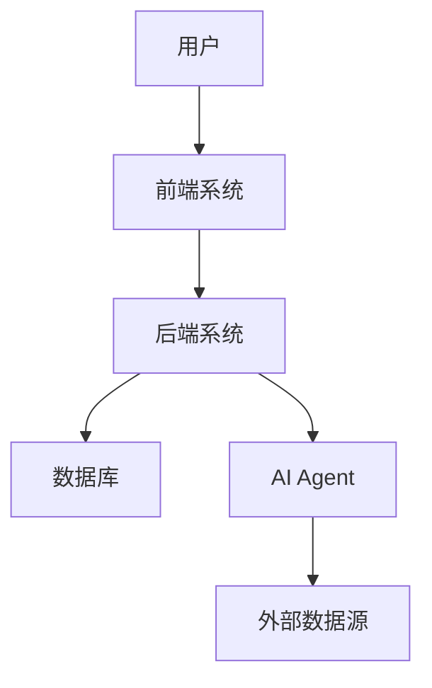
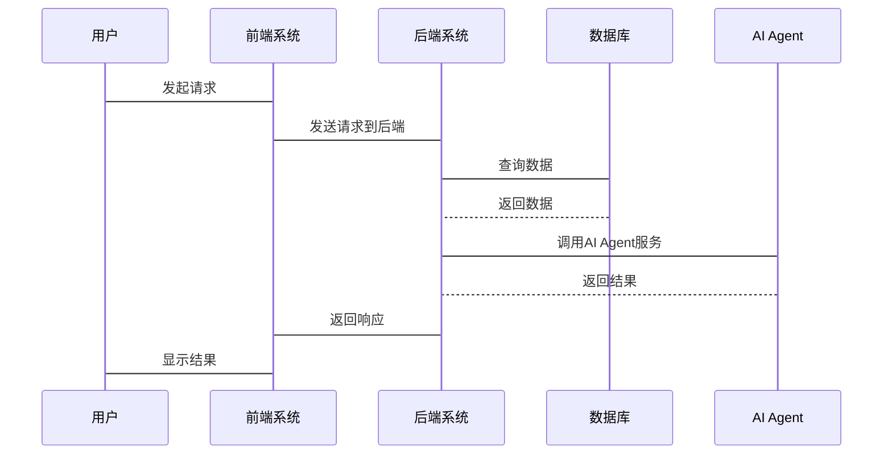

                 


# AI Agent在企业供应链管理中的应用

> 关键词：AI Agent，供应链管理，人工智能，企业应用，物流优化

> 摘要：本文系统地探讨了AI Agent在企业供应链管理中的应用，从基本概念、核心原理到实际应用场景，结合算法原理、系统架构和项目实战，全面分析了AI Agent在供应链管理中的价值和实现路径。文章通过丰富的案例和详细的代码实现，展示了如何利用AI Agent技术优化供应链管理的各个环节，为企业提供智能化的解决方案。

---

# 第1章: AI Agent 与供应链管理概述

## 1.1 AI Agent 的基本概念

### 1.1.1 AI Agent 的定义与特点
AI Agent（人工智能代理）是指能够感知环境、自主决策并执行任务的智能实体。其特点包括：
- **自主性**：能够独立决策和行动。
- **反应性**：能够实时感知环境并做出响应。
- **目标导向**：以特定目标为导向执行任务。
- **学习能力**：能够通过数据和经验不断优化自身行为。

### 1.1.2 AI Agent 的核心功能与优势
AI Agent的核心功能包括：
- **感知环境**：通过传感器或数据输入感知外部环境。
- **知识表示**：将知识以结构化形式存储并进行推理。
- **决策与规划**：基于知识和环境信息做出最优决策。
- **执行任务**：通过执行器或接口完成实际操作。

AI Agent的优势在于其智能化、自动化和高效性，能够显著提升供应链管理的效率和准确性。

### 1.1.3 供应链管理的基本概念与流程
供应链管理（Supply Chain Management，SCM）是指对原材料采购、生产、物流、库存管理和交付等环节进行计划、组织和控制的过程。其核心流程包括：
- **采购与供应商管理**：选择和管理供应商，确保原材料供应。
- **生产与库存管理**：优化生产计划和库存水平。
- **物流与配送**：规划和优化物流路径，确保产品按时交付。
- **需求预测与客户管理**：基于历史数据和市场趋势预测客户需求。

---

## 1.2 AI Agent 在供应链管理中的应用背景

### 1.2.1 传统供应链管理的痛点与挑战
传统供应链管理存在以下痛点：
- **信息孤岛**：各部门之间数据不共享，导致效率低下。
- **决策滞后**：依赖人工分析，决策周期长，响应慢。
- **成本高**：由于库存积压或缺货，导致运营成本增加。
- **风险高**：供应链中断或延迟可能对企业造成重大损失。

### 1.2.2 AI 技术在供应链管理中的潜在价值
AI技术的引入为供应链管理带来了革命性的变化：
- **提高效率**：通过自动化数据处理和智能决策缩短周期。
- **降低成本**：优化库存管理和物流路径，降低运营成本。
- **增强预测能力**：利用机器学习算法提高需求预测的准确性。
- **提升客户满意度**：通过实时监控和快速响应提高客户体验。

### 1.2.3 AI Agent 在供应链管理中的应用场景
AI Agent在供应链管理中的应用场景包括：
- **需求预测**：基于历史数据和市场趋势预测客户需求。
- **库存优化**：动态调整库存水平，避免积压和缺货。
- **物流路径规划**：优化物流路径，降低运输成本。
- **风险预警**：实时监控供应链风险，提前采取应对措施。

---

## 1.3 本章小结

### 1.3.1 AI Agent 的核心价值
AI Agent通过智能化、自动化的方式优化供应链管理，显著提升了效率和准确性，降低了成本和风险。

### 1.3.2 供应链管理的数字化转型趋势
随着AI技术的快速发展，供应链管理正在从传统的人工管理向智能化、数字化转型，AI Agent在其中扮演了关键角色。

---

# 第2章: AI Agent 的核心原理与技术

## 2.1 AI Agent 的核心原理

### 2.1.1 多智能体系统（Multi-Agent System, MAS）
多智能体系统是由多个相互作用的智能体组成的系统，每个智能体都有自己的目标和行为。在供应链管理中，多个智能体可以分别负责采购、生产、物流等不同环节。

### 2.1.2 知识表示与推理机制
知识表示是将知识以结构化形式存储的过程，推理机制则是基于知识进行逻辑推理的过程。AI Agent通过知识表示和推理机制来理解和解决问题。

### 2.1.3 AI Agent 的决策与执行过程
AI Agent的决策过程包括感知环境、知识推理、制定计划和执行行动。通过不断学习和优化，AI Agent能够做出更优的决策。

---

## 2.2 AI Agent 的关键技术

### 2.2.1 自然语言处理（NLP）
NLP技术用于处理和理解自然语言文本，帮助AI Agent与人类用户或系统进行交互。

### 2.2.2 机器学习（ML）
机器学习算法用于训练AI Agent，使其能够从数据中学习并做出预测和决策。

### 2.2.3 强化学习（RL）
强化学习用于训练AI Agent在复杂环境中做出最优决策，通过奖励机制不断优化行为。

### 2.2.4 分布式计算与协同
分布式计算技术用于在多智能体系统中实现协同工作，确保各智能体之间的高效协作。

---

## 2.3 AI Agent 在供应链管理中的技术实现

### 2.3.1 数据采集与处理
供应链管理中的数据来源包括传感器、数据库和外部系统。数据采集后需要进行清洗、转换和标准化处理。

### 2.3.2 智能决策算法
基于机器学习和强化学习算法，AI Agent能够根据实时数据做出最优决策。

### 2.3.3 系统集成与部署
AI Agent需要与企业现有的供应链管理系统集成，确保数据流和功能的无缝衔接。

---

## 2.4 本章小结

### 2.4.1 AI Agent 的核心算法与技术
AI Agent的核心技术包括机器学习、自然语言处理和强化学习，这些技术共同支撑其在供应链管理中的应用。

### 2.4.2 供应链管理中的技术实现路径
通过数据采集、算法训练和系统集成，AI Agent能够实现在供应链管理中的智能化应用。

---

# 第3章: AI Agent 在企业供应链中的应用场景

## 3.1 供应链需求预测

### 3.1.1 需求预测的基本原理
需求预测是基于历史销售数据和市场趋势，预测未来的需求量。

### 3.1.2 AI Agent 在需求预测中的应用
AI Agent通过机器学习算法分析历史数据，预测未来的需求，并根据市场变化动态调整预测结果。

### 3.1.3 案例分析：某企业的需求预测实践
某企业通过AI Agent实现了需求预测的自动化，显著提高了预测的准确性，并降低了库存成本。

---

## 3.2 供应链库存优化

### 3.2.1 库存管理的基本问题
库存管理的核心问题是如何在满足需求的前提下，最小化库存成本。

### 3.2.2 AI Agent 在库存优化中的应用
AI Agent通过实时监控库存水平和销售数据，动态调整库存策略，避免积压和缺货。

### 3.2.3 案例分析：库存优化的 AI Agent 解决方案
某企业通过AI Agent实现了库存的动态优化，库存周转率提高了20%，库存成本降低了15%。

---

## 3.3 供应链物流优化

### 3.3.1 物流路径优化的基本问题
物流路径优化的目标是找到从供应商到客户的最优运输路径，降低运输成本和时间。

### 3.3.2 AI Agent 在物流优化中的应用
AI Agent通过强化学习算法优化物流路径，考虑交通状况、天气等因素，动态调整运输计划。

### 3.3.3 案例分析：物流路径优化的 AI Agent 实践
某物流企业通过AI Agent实现了物流路径的实时优化，运输时间缩短了15%，成本降低了20%。

---

## 3.4 供应链风险预警与应对

### 3.4.1 风险预警的基本原理
供应链风险预警是通过实时监控供应链中的各种风险因素，提前发出预警。

### 3.4.2 AI Agent 在风险预警中的应用
AI Agent通过分析供应链中的数据，识别潜在风险，并制定应对策略。

### 3.4.3 案例分析：供应链风险预警的 AI Agent 解决方案
某企业通过AI Agent实现了供应链风险的实时预警，成功避免了因供应商延迟交货导致的生产中断。

---

## 3.5 本章小结

### 3.5.1 AI Agent 在供应链管理中的应用场景
AI Agent在需求预测、库存优化、物流路径规划和风险预警等方面具有广泛的应用。

### 3.5.2 各应用场景的技术实现路径
通过机器学习、强化学习等技术，AI Agent能够实现在不同场景下的智能化应用。

---

# 第4章: AI Agent 的系统架构设计

## 4.1 系统功能设计

### 4.1.1 领域模型（Domain Model）
领域模型是供应链管理系统的概念模型，包括供应商、客户、库存、物流等核心实体。

### 4.1.2 系统功能模块
供应链管理系统的主要功能模块包括需求预测、库存管理、物流优化和风险预警。

---

## 4.2 系统架构设计

### 4.2.1 系统架构图
以下是供应链管理系统的架构图：



### 4.2.2 系统接口设计
系统接口包括：
- 用户与前端系统的交互接口。
- 前端系统与后端系统的API接口。
- 后端系统与数据库的交互接口。

---

## 4.3 系统交互设计

### 4.3.1 交互流程图
以下是供应链管理系统的交互流程图：



---

## 4.4 本章小结

### 4.4.1 系统功能设计的核心模块
供应链管理系统的功能模块包括需求预测、库存管理、物流优化和风险预警。

### 4.4.2 系统架构设计的关键点
系统架构设计需要考虑模块化、可扩展性和安全性，确保系统的稳定运行和高效维护。

---

# 第5章: AI Agent 的项目实战

## 5.1 项目背景

### 5.1.1 项目介绍
本项目旨在利用AI Agent技术优化某企业的供应链管理流程，包括需求预测、库存优化和物流路径规划。

---

## 5.2 环境安装

### 5.2.1 安装Python
安装Python 3.8及以上版本。

### 5.2.2 安装依赖库
安装以下依赖库：
```bash
pip install numpy pandas scikit-learn
```

---

## 5.3 核心代码实现

### 5.3.1 数据预处理
```python
import pandas as pd

# 读取数据
data = pd.read_csv('supply_chain_data.csv')

# 数据清洗
data.dropna(inplace=True)
data['date'] = pd.to_datetime(data['date'])
```

### 5.3.2 模型训练
```python
from sklearn.model_selection import train_test_split
from sklearn.ensemble import RandomForestRegressor

# 划分训练集和测试集
X = data.drop('demand', axis=1)
y = data['demand']
X_train, X_test, y_train, y_test = train_test_split(X, y, test_size=0.2)

# 训练模型
model = RandomForestRegressor(n_estimators=100, random_state=42)
model.fit(X_train, y_train)
```

### 5.3.3 模型预测
```python
# 预测需求
y_pred = model.predict(X_test)

# 输出结果
print('预测需求:', y_pred)
print('真实需求:', y_test.values)
```

---

## 5.4 案例分析与解读

### 5.4.1 案例分析
通过上述代码实现，我们可以看到AI Agent在需求预测中的应用。

### 5.4.2 代码实现解读
- **数据预处理**：读取数据并进行清洗，确保数据的完整性和准确性。
- **模型训练**：使用随机森林算法训练需求预测模型。
- **模型预测**：基于训练好的模型，预测未来的需求量。

---

## 5.5 本章小结

### 5.5.1 项目实战的核心步骤
项目实战的核心步骤包括环境安装、数据预处理、模型训练和模型预测。

### 5.5.2 代码实现的关键点
代码实现的关键点在于选择合适的算法和优化模型性能，确保预测结果的准确性。

---

# 第6章: 系统优化与扩展

## 6.1 系统优化

### 6.1.1 性能优化
通过优化算法和增加缓存机制，提高系统的运行效率。

### 6.1.2 模型调优
通过调整模型参数和优化特征选择，提高模型的预测精度。

---

## 6.2 系统扩展

### 6.2.1 可扩展性设计
通过模块化设计和接口标准化，确保系统的可扩展性。

### 6.2.2 功能扩展
根据需求扩展系统功能，例如增加供应商评估模块。

---

## 6.3 本章小结

### 6.3.1 系统优化的关键点
系统优化的关键点在于性能优化和模型调优，确保系统的高效运行和高精度预测。

### 6.3.2 系统扩展的实现路径
通过模块化设计和标准化接口，实现系统的功能扩展和性能提升。

---

# 第7章: 总结与展望

## 7.1 本章总结

### 7.1.1 AI Agent 在供应链管理中的核心价值
AI Agent通过智能化、自动化的方式优化供应链管理，显著提升了效率和准确性。

### 7.1.2 供应链管理的数字化转型趋势
随着AI技术的快速发展，供应链管理正在向智能化、数字化方向转型，AI Agent在其中发挥了关键作用。

---

## 7.2 未来展望

### 7.2.1 供应链管理的技术发展趋势
未来，随着AI、大数据和物联网技术的进一步发展，供应链管理将更加智能化和自动化。

### 7.2.2 AI Agent 的发展趋势
AI Agent将在供应链管理中发挥更大的作用，例如在实时决策和复杂环境下的应用。

---

# 作者：AI天才研究院/AI Genius Institute & 禅与计算机程序设计艺术 /Zen And The Art of Computer Programming

