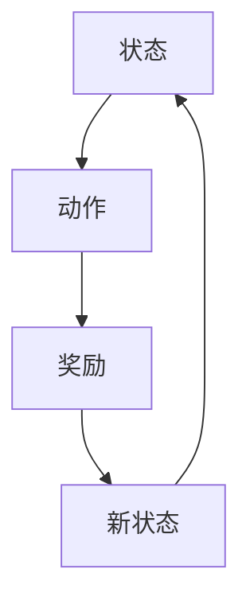
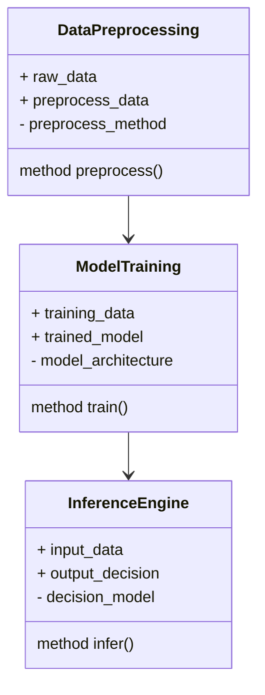

                 


# AI Agent在企业信息安全与隐私保护中的应用

## 关键词
AI Agent, 企业信息安全, 隐私保护, 算法原理, 系统架构, 实战案例

## 摘要
本文探讨AI Agent在企业信息安全与隐私保护中的应用，分析其核心概念、算法原理、系统架构，并通过项目实战和案例分析，详细阐述AI Agent在企业中的应用前景、挑战及解决方案。文章还总结了最佳实践和未来发展方向。

---

# 第1章 AI Agent的背景与概念

## 1.1 AI Agent的基本概念
AI Agent是一种智能主体，能够感知环境、自主决策并执行任务。它具备以下核心属性：
- **自主性**：无需外部干预，自主完成任务。
- **反应性**：能实时感知环境变化并作出反应。
- **推理能力**：通过推理和学习提升决策能力。
- **社交能力**：能与其他系统或用户交互协作。

AI Agent与传统安全工具的对比：

| 对比维度 | 传统安全工具 | AI Agent |
|----------|--------------|----------|
| 决策方式 | 基于规则 | 基于推理和学习 |
| 响应速度 | 固定响应 | 自适应响应 |
| 处理复杂性 | 有限 | 强大 |

## 1.2 企业信息安全与隐私保护的挑战
企业面临的主要威胁包括数据泄露、网络攻击、内部员工误操作等。隐私保护需在确保数据安全的同时，遵守相关法规。

## 1.3 AI Agent在企业中的应用前景
AI Agent能显著提升企业安全效率，通过智能监控和实时响应，有效应对复杂安全威胁。

---

# 第2章 AI Agent的核心概念与原理

## 2.1 AI Agent的任务建模
- **基于状态的建模**：通过状态机描述安全事件。
- **基于目标的建模**：设定明确目标，动态调整策略。

## 2.2 知识表示与推理机制
- **知识表示**：使用规则和概率模型。
- **推理机制**：基于规则和概率的推理方法。

## 2.3 AI Agent与企业安全系统的结合
通过数据流处理和安全策略动态调整，AI Agent与企业系统无缝集成。

---

# 第3章 AI Agent的算法原理

## 3.1 基于强化学习的决策过程
以Q-learning为例，展示算法流程：



数学模型：
$$ Q(s, a) = Q(s, a) + \alpha (r + \max Q(s', a) - Q(s, a)) $$

Python代码示例：
```python
import numpy as np

# 初始化Q表
Q = np.zeros([state_space, action_space])

# 参数设置
alpha = 0.1
gamma = 0.9

# Q-learning算法
for episode in range(episodes):
    state = initial_state()
    while not done:
        action = np.argmax(Q[state, :])
        next_state, reward, done = step(action)
        Q[state, action] += alpha * (reward + gamma * np.max(Q[next_state, :]) - Q[state, action])
        state = next_state
```

---

# 第4章 系统分析与架构设计

## 4.1 问题场景介绍
设计一个实时监控企业网络流量的AI Agent，预防数据泄露和网络攻击。

## 4.2 系统功能设计
- 数据采集与预处理
- 模型训练与部署
- 实时监控与决策

## 4.3 系统架构设计
展示领域模型类图和系统架构图：



---

# 第5章 项目实战

## 5.1 环境安装
安装Python和必要的库：
```bash
pip install numpy scikit-learn matplotlib
```

## 5.2 核心代码实现
数据预处理、模型训练和推理引擎的实现：

```python
# 数据预处理
def preprocess(data):
    # 数据清洗和特征提取
    pass

# 模型训练
def train_model(X, y):
    model = sklearn.linear_model.LogisticRegression()
    model.fit(X, y)
    return model

# 推理引擎
def infer(model, input):
    prediction = model.predict(input)
    return prediction
```

## 5.3 案例分析
通过实际案例分析AI Agent的应用效果，并总结经验。

---

# 第6章 最佳实践与未来展望

## 6.1 总结与经验分享
总结AI Agent在企业中的应用经验，提出改进建议。

## 6.2 注意事项
- 数据隐私保护
- 模型可解释性
- 系统稳定性

## 6.3 拓展阅读
推荐相关书籍和论文，供深入学习。

---

# 结论

AI Agent凭借其智能决策和自主学习能力，正在成为企业信息安全与隐私保护的重要工具。通过本文的分析，读者可以全面理解AI Agent的应用价值和未来发展方向。

---

# 作者
作者：AI天才研究院 & 禅与计算机程序设计艺术

