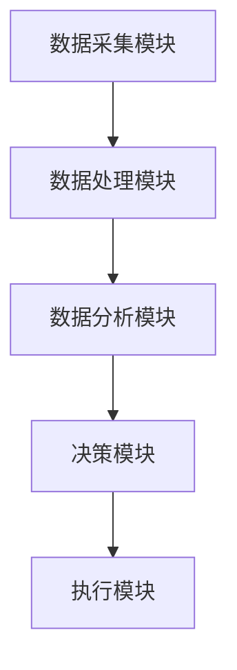
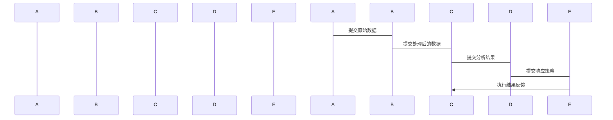
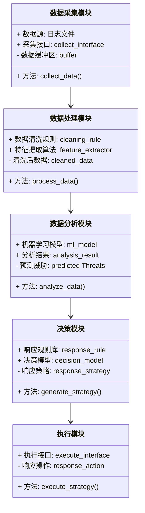

                 


# AI Agent在企业信息安全态势感知与威胁响应中的应用

> 关键词：AI Agent, 企业信息安全, 态势感知, �威肋响应, 智能化安全

> 摘要：本文探讨了AI Agent在企业信息安全态势感知与威胁响应中的应用，分析了其核心机制、技术原理及系统架构，通过实际案例展示了其在项目中的应用，并总结了最佳实践和未来发展方向。文章旨在帮助企业安全团队理解并有效利用AI Agent提升信息安全能力。

---

# 第1章: AI Agent与企业信息安全概述

## 1.1 AI Agent的基本概念

### 1.1.1 AI Agent的定义与特点
- **定义**：AI Agent（人工智能代理）是能够感知环境、自主决策并采取行动的智能实体。
- **特点**：自主性、反应性、目标导向、学习能力。

### 1.1.2 企业信息安全的内涵与外延
- **内涵**：保护企业信息资产的机密性、完整性和可用性。
- **外延**：涵盖网络、数据、应用、终端等多方面的安全。

### 1.1.3 AI Agent在企业信息安全中的价值
- 提供实时监控与响应，增强安全防护能力。
- 通过智能化手段优化安全策略和资源配置。

## 1.2 企业信息安全态势感知与威胁响应的背景

### 1.2.1 当前企业信息安全面临的挑战
- 复杂的网络环境，多样化的威胁手段。
- 威胁的隐蔽性和动态性，传统安全方法的局限性。

### 1.2.2 威胁响应的重要性
- 快速识别和应对威胁，减少安全事件的影响。
- 提高企业整体安全防护能力。

### 1.2.3 AI Agent在威胁响应中的作用
- 实现实时监控和智能响应，提升威胁应对效率。

## 1.3 本章小结
本章介绍了AI Agent的基本概念及其在企业信息安全中的应用价值，强调了态势感知和威胁响应的重要性。

---

# 第2章: AI Agent的核心机制

## 2.1 AI Agent的工作原理

### 2.1.1 感知机制
- **数据采集**：通过日志、流量分析等方式获取安全相关数据。
- **特征提取**：利用机器学习技术提取威胁特征。

### 2.1.2 决策机制
- **基于规则的决策**：根据预定义规则进行判断。
- **基于机器学习的决策**：利用训练好的模型预测威胁。
- **基于强化学习的决策**：通过奖励机制优化决策策略。

### 2.1.3 响应机制
- **自动响应**：如阻断恶意流量。
- **协作响应**：与其他安全系统协同工作。

## 2.2 AI Agent的感知模型

### 2.2.1 数据采集与处理
- 数据源：日志、网络流量、用户行为等。
- 数据预处理：清洗、转换、特征提取。

### 2.2.2 威胁特征提取
- 使用无监督学习发现异常模式。
- 使用监督学习识别已知威胁。

### 2.2.3 情况评估与预测
- 基于时间序列分析预测未来威胁。

## 2.3 AI Agent的决策机制

### 2.3.1 基于规则的决策
- 优点：简单、高效。
- 缺点：依赖人工规则，适应性差。

### 2.3.2 基于机器学习的决策
- 优点：能够处理复杂数据，发现隐藏模式。
- 缺点：需要大量数据训练，模型更新周期长。

### 2.3.3 基于强化学习的决策
- 优点：能够在动态环境中自适应调整。
- 缺点：训练过程复杂，需要大量计算资源。

## 2.4 AI Agent的响应策略

### 2.4.1 自动响应策略
- 示例：检测到恶意流量后自动阻断。

### 2.4.2 协作响应策略
- 示例：与防火墙、入侵检测系统协同工作。

### 2.4.3 动态调整策略
- 根据威胁变化实时调整响应策略。

## 2.5 本章小结
本章详细探讨了AI Agent的核心机制，包括感知、决策和响应的实现方式及其优缺点。

---

# 第3章: 企业信息安全态势感知与威胁响应的理论基础

## 3.1 信息安全态势模型

### 3.1.1 基于层次分析法的态势评估模型
- 通过权重分析评估不同威胁的严重性。

### 3.1.2 基于图论的网络态势分析模型
- 使用网络拓扑结构分析潜在威胁路径。

### 3.1.3 基于时间序列分析的态势预测模型
- 预测未来威胁发生概率和影响程度。

## 3.2 威胁建模与分析

### 3.2.1 威胁建模方法
- 定义威胁主体、目标、手段和影响。

### 3.2.2 威胁分析框架
- 使用攻击链模型分析威胁生命周期。

### 3.2.3 威胁优先级评估
- 根据威胁的可能性和影响程度进行排序。

## 3.3 本章小结
本章介绍了信息安全态势模型和威胁建模方法，为AI Agent的应用提供了理论基础。

---

# 第4章: AI Agent在企业信息安全中的技术实现

## 4.1 技术实现概述

### 4.1.1 算法原理
- 监督学习：分类已知威胁。
- 无监督学习：发现未知威胁。
- 强化学习：优化响应策略。

### 4.1.2 系统架构
- **数据采集层**：收集安全相关数据。
- **数据处理层**：清洗和特征提取。
- **分析层**：应用机器学习模型进行分析。
- **决策层**：生成响应策略。
- **执行层**：实施响应措施。

## 4.2 算法实现细节

### 4.2.1 监督学习实现
- 使用支持向量机（SVM）进行分类。
- 示例代码：
  ```python
  from sklearn import svm
  model = svm.SVC()
  model.fit(X_train, y_train)
  ```

### 4.2.2 无监督学习实现
- 使用聚类算法发现异常模式。
- 示例代码：
  ```python
  from sklearn.cluster import KMeans
  model = KMeans(n_clusters=2)
  model.fit(X)
  ```

### 4.2.3 强化学习实现
- 使用Q-learning算法优化决策。
- 示例代码：
  ```python
  import numpy as np
  class QLearning:
      def __init__(self, state_space, action_space):
          self.Q = np.zeros((state_space, action_space))
  ```

## 4.3 系统架构设计

### 4.3.1 系统功能设计
- **数据采集模块**：收集日志、流量等数据。
- **数据分析模块**：处理数据并应用机器学习模型。
- **决策模块**：生成响应策略。
- **执行模块**：实施安全响应措施。

### 4.3.2 系统架构图


## 4.4 系统接口设计

### 4.4.1 数据接口
- 数据输入接口：接收原始数据。
- 数据输出接口：提供分析结果。

### 4.4.2 操作接口
- API接口：供其他系统调用响应策略。

## 4.5 系统交互流程

### 4.5.1 交互序列图


## 4.6 本章小结
本章详细讲解了AI Agent在企业信息安全中的技术实现，包括算法原理和系统架构设计。

---

# 第5章: 项目实战——基于AI Agent的企业信息安全系统开发

## 5.1 项目背景与目标

### 5.1.1 项目背景
- 某企业面临日益复杂的网络安全威胁，希望通过AI Agent提升安全防护能力。

### 5.1.2 项目目标
- 实现实时威胁监测与智能响应。
- 提高安全事件处理效率。

## 5.2 系统设计

### 5.2.1 系统功能设计
- 数据采集模块：收集网络流量日志。
- 数据分析模块：识别异常流量。
- 决策模块：生成威胁响应策略。
- 执行模块：实施流量阻断。

### 5.2.2 系统设计类图


### 5.2.3 系统架构设计


## 5.3 系统实现

### 5.3.1 数据采集模块实现
- 使用Python的logging模块收集日志。
- 示例代码：
  ```python
  import logging
  logging.basicConfig(filename='security.log', level=logging.INFO)
  ```

### 5.3.2 数据分析模块实现
- 使用scikit-learn进行机器学习分析。
- 示例代码：
  ```python
  from sklearn.ensemble import RandomForestClassifier
  model = RandomForestClassifier()
  model.fit(X_train, y_train)
  ```

### 5.3.3 决策模块实现
- 根据分析结果生成响应策略。
- 示例代码：
  ```python
  def generate_response(threat_level):
      if threat_level > 0.8:
          return 'block'
      else:
          return 'monitor'
  ```

## 5.4 项目小结
本章通过实际案例展示了基于AI Agent的企业信息安全系统的开发过程，包括系统设计、功能实现和测试验证。

---

# 第6章: 最佳实践与注意事项

## 6.1 实施AI Agent的最佳实践

### 6.1.1 数据隐私保护
- 确保数据处理过程符合GDPR等法规要求。

### 6.1.2 系统监控与优化
- 定期监控系统性能，优化算法模型。

### 6.1.3 团队协作
- 建立跨团队协作机制，确保系统高效运行。

## 6.2 注意事项

### 6.2.1 数据质量
- 确保数据的准确性和完整性，避免影响模型效果。

### 6.2.2 模型更新
- 定期更新机器学习模型，适应新的威胁特征。

### 6.2.3 系统容错
- 设计容错机制，确保系统在异常情况下的稳定性。

## 6.3 未来研究方向

### 6.3.1 更智能的AI Agent
- 研究更高级的AI算法，如深度强化学习。

### 6.3.2 多领域协同
- 探索AI Agent在不同安全领域的协同应用。

### 6.3.3 安全与效率平衡
- 在提升安全能力的同时，优化系统运行效率。

## 6.4 本章小结
本章总结了实施AI Agent的最佳实践，并展望了未来的研究方向。

---

# 第7章: 总结与展望

## 7.1 全文总结
- AI Agent通过智能化手段显著提升了企业信息安全的态势感知和威胁响应能力。
- 基于机器学习和强化学习的算法为安全防护提供了新的思路。

## 7.2 未来展望
- 随着AI技术的进步，AI Agent在企业信息安全中的应用将更加广泛和深入。
- 多模态学习和联邦学习等新技术将推动安全防护能力的进一步提升。

## 7.3 本章小结
全文总结了AI Agent在企业信息安全中的应用价值，并展望了未来的发展方向。

---

# 作者：AI天才研究院/AI Genius Institute & 禅与计算机程序设计艺术 /Zen And The Art of Computer Programming

---

以上为完整的技术博客文章，详细涵盖了AI Agent在企业信息安全中的各个方面，从概念到实际应用，结合理论与实践，为读者提供了全面的指导和深入的分析。

