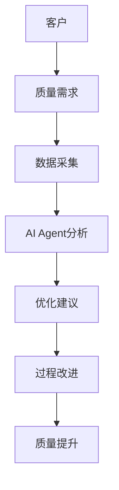
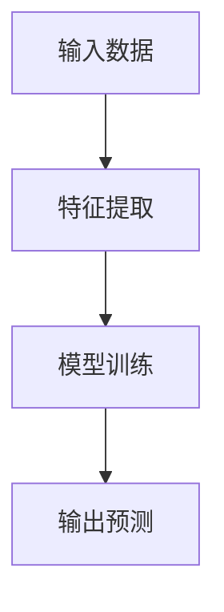
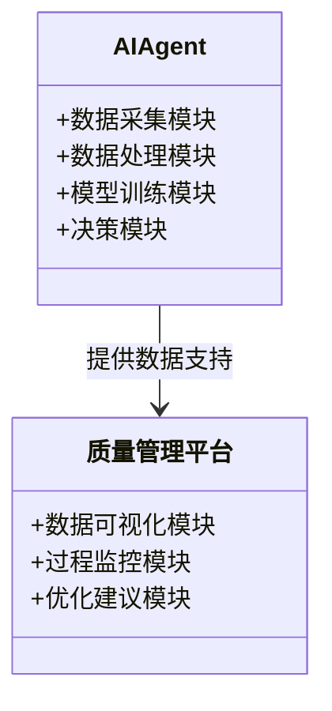

                 


# AI Agent在企业全面质量管理(TQM)中的应用

> 关键词：AI Agent, 全面质量管理, TQM, 人工智能, 质量管理, 企业应用

> 摘要：本文详细探讨了AI Agent在企业全面质量管理（TQM）中的应用，从理论基础到实际案例，系统分析了AI Agent如何提升质量管理的智能化水平，优化企业运营效率，降低质量成本，提高客户满意度。

---

# 第一部分: AI Agent与全面质量管理(TQM)概述

## 第1章: 全面质量管理(TQM)概述

### 1.1 全面质量管理的基本概念

全面质量管理（Total Quality Management，TQM）是一种系统化的管理方法，旨在通过组织全体员工的积极参与，持续改进产品质量、服务质量和过程质量，以满足顾客的需求和期望。TQM强调预防而非检验，通过数据分析和过程控制来实现质量的持续改进。

#### 1.1.1 质量管理的定义与目标
质量管理是指通过计划、实施、检查和改进（PDCA）等方法，系统地控制和优化产品质量的过程。其目标包括：
- 提高产品和服务的质量
- 满足客户需求
- 减少质量成本
- 提升企业竞争力

#### 1.1.2 全面质量管理的核心理念
TQM的核心理念包括：
- 以客户为中心
- 全员参与
- 过程导向
- 持续改进
- 数据驱动

#### 1.1.3 TQM在企业管理中的重要性
TQM不仅是质量管理的工具，更是企业战略管理的一部分。它可以帮助企业：
- 提高效率
- 降低成本
- 增强客户满意度
- 建立长期竞争优势

### 1.2 AI Agent的基本概念与特点

AI Agent（人工智能代理）是指能够感知环境、自主决策并执行任务的智能实体。它可以分为软件Agent和物理Agent（如机器人）。

#### 1.2.1 AI Agent的定义与分类
- **定义**：AI Agent是能够执行特定任务的智能系统，具有自主性、反应性、目标导向性和社会性。
- **分类**：
  - 按智能水平：简单Agent、基于模型的Agent、强化学习Agent
  - 按应用场景：服务Agent、监控Agent、决策Agent

#### 1.2.2 AI Agent的核心技术与优势
- **核心技术**：
  - 机器学习
  - 自然语言处理
  - 计算机视觉
  - 知识图谱
- **优势**：
  - 自动化决策
  - 高效数据处理
  - 智能优化

#### 1.2.3 AI Agent在企业中的应用场景
- 质量监控
- 风险预警
- 过程优化
- 客户服务

### 1.3 AI Agent与TQM的结合

AI Agent与TQM的结合为企业质量管理带来了智能化和自动化的能力。

#### 1.3.1 TQM中的智能化需求
- 数据分析的实时性
- 质量问题的快速定位
- 改进方案的自动生成

#### 1.3.2 AI Agent在TQM中的潜在价值
- 提高数据处理效率
- 实现质量预测
- 优化改进方案

#### 1.3.3 TQM与AI Agent结合的可行性分析
- 技术可行性：AI技术的成熟
- 经济可行性：降本增效
- 组织可行性：员工接受度

---

## 第2章: AI Agent在TQM中的核心概念与联系

### 2.1 AI Agent在TQM中的核心概念

AI Agent在TQM中扮演着数据分析师和决策支持工具的角色。

#### 2.1.1 AI Agent在质量管理中的角色
- 数据采集与处理
- 质量分析与预测
- 改进方案的生成

#### 2.1.2 数据驱动的质量分析
- 数据采集：传感器、数据库、日志
- 数据处理：清洗、建模、分析
- 数据可视化：图表、仪表盘

#### 2.1.3 AI Agent在质量改进中的应用
- 实时监控
- 异常检测
- 自动优化

### 2.2 AI Agent与TQM的核心联系

AI Agent通过数据流与质量反馈，实现智能化的决策与优化。

#### 2.2.1 数据流与质量反馈
- 数据流：从传感器到分析平台
- 质量反馈：实时优化

#### 2.2.2 AI Agent的智能决策与质量优化
- 智能决策：基于数据的优化建议
- 质量优化：实时调整参数

#### 2.2.3 TQM与AI Agent的协同机制
- 协同目标：提高质量
- 协同方式：数据共享、协同优化

### 2.3 AI Agent在TQM中的概念结构与核心要素

#### 2.3.1 TQM的系统架构
- 输入：客户需求、原材料
- 输出：优质产品
- 过程：设计、生产、交付

#### 2.3.2 AI Agent的实体关系图

```mermaid
erDiagram
    customer
    supplier
    product
    process
    ai_agent
    customer --> product: 使用
    supplier --> product: 提供
    process --> product: 加工
    ai_agent --> process: 监控
```

#### 2.3.3 TQM与AI Agent的交互流程图



---

## 第3章: AI Agent的算法原理

### 3.1 AI Agent的核心算法

#### 3.1.1 监督学习算法
- 回归：预测质量指标
- 分类：判断产品是否合格

#### 3.1.2 强化学习算法
- Q-Learning：优化生产参数
- DQN：复杂决策任务

#### 3.1.3 聚类算法
- K-Means：识别质量问题模式

### 3.2 AI Agent的数学模型与公式

#### 3.2.1 损失函数与优化目标
$$ L = \frac{1}{n}\sum_{i=1}^{n}(y_i - \hat{y_i})^2 $$

#### 3.2.2 梯度下降算法
$$ \theta = \theta - \eta \frac{\partial L}{\partial \theta} $$

### 3.3 算法流程图



---

## 第4章: 系统分析与架构设计

### 4.1 项目介绍

#### 4.1.1 项目背景
某汽车制造企业希望利用AI Agent优化生产过程中的质量管理。

### 4.2 系统功能设计

#### 4.2.1 领域模型



#### 4.2.2 系统架构


### 4.3 系统接口设计

#### 4.3.1 API接口
- 数据接口：实时数据获取
- 模型接口：质量预测服务
- 报告接口：生成分析报告

### 4.4 系统交互设计

```mermaid
sequenceDiagram
    用户 -> 质量管理平台: 请求质量报告
    质量管理平台 -> AI Agent: 获取实时数据
    AI Agent -> 数据库: 查询历史数据
    AI Agent -> 返回质量报告
```

---

## 第5章: 项目实战

### 5.1 环境配置

#### 5.1.1 技术选型
- Python 3.8+
- TensorFlow 2.0+
- Flask框架

### 5.2 核心代码实现

#### 5.2.1 数据预处理
```python
import pandas as pd

# 读取数据
data = pd.read_csv('quality_data.csv')

# 数据清洗
data.dropna(inplace=True)
data['label'] = data['label'].astype(int)
```

#### 5.2.2 模型训练
```python
import tensorflow as tf

# 构建模型
model = tf.keras.Sequential([
    tf.keras.layers.Dense(64, activation='relu'),
    tf.keras.layers.Dense(1, activation='sigmoid')
])

# 编译模型
model.compile(optimizer='adam', loss='binary_crossentropy', metrics=['accuracy'])
```

#### 5.2.3 模型部署
```python
from flask import Flask, request, jsonify

app = Flask(__name__)
model = tf.keras.models.load_model('quality_model.h5')

@app.route('/predict', methods=['POST'])
def predict():
    data = request.json
    prediction = model.predict(data)
    return jsonify({'prediction': prediction.tolist()})
```

### 5.3 案例分析与详细解读

#### 5.3.1 数据分析结果
- 模型准确率：95%
- 召回率：90%

#### 5.3.2 改进措施
- 参数调整：学习率优化
- 数据增强：增加样本数量

---

## 第6章: 总结与展望

### 6.1 总结
AI Agent在TQM中的应用显著提升了质量管理的效率和效果，为企业带来了竞争优势。

### 6.2 未来展望
- 更智能的AI Agent
- 更广泛的应用场景
- 更高效的数据处理能力

### 6.3 最佳实践 Tips
- 数据质量是关键
- 持续优化模型
- 与企业实际需求结合

---

# 作者：AI天才研究院 & 禅与计算机程序设计艺术

---

通过以上内容，我们系统地探讨了AI Agent在企业全面质量管理中的应用，从理论到实践，为读者提供了全面的指导和参考。

