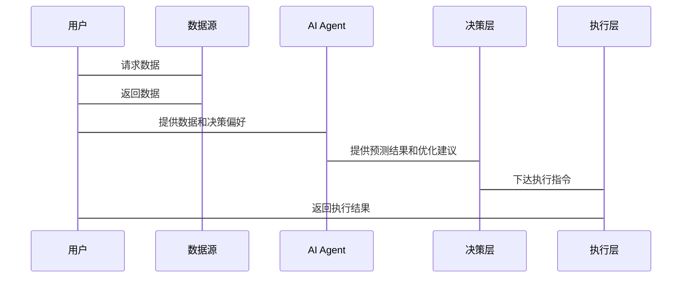

                 


# AI Agent在企业决策支持系统中的应用

> 关键词：AI Agent, 企业决策支持系统, 人工智能, 知识表示, 决策优化, 多目标优化

> 摘要：本文系统地探讨了AI Agent在企业决策支持系统中的应用，从基本概念到核心算法，从系统架构到实际案例，全面分析了AI Agent如何通过智能化的感知、推理和行动规划，显著提升企业决策的效率和质量。文章结合实际应用场景，深入剖析了AI Agent的优势，并通过具体案例展示了其在销售预测、库存优化等关键业务中的卓越表现。

---

# 第一章: AI Agent的基本概念与企业决策支持系统

## 1.1 AI Agent的定义与核心特征

### 1.1.1 AI Agent的定义
AI Agent（人工智能代理）是指能够感知环境、自主决策并执行行动的智能实体。它可以是一个软件程序、一个机器人，甚至是一个复杂的系统，其核心目标是通过智能化的方式帮助人类完成任务或优化决策过程。

### 1.1.2 AI Agent的核心特征
- **自主性**：AI Agent能够在没有外部干预的情况下自主运行。
- **反应性**：能够实时感知环境变化并做出响应。
- **推理能力**：具备逻辑推理能力，能够基于现有信息做出合理决策。
- **学习能力**：能够通过经验或数据不断优化自身行为。

### 1.1.3 AI Agent与传统决策支持系统的区别
| 特性 | AI Agent | 传统决策支持系统 |
|------|----------|-------------------|
| 数据源 | 多源异构数据 | 结构化数据为主     |
| 决策方式 | 智能化、动态化 | 基于规则、静态化 |
| 响应速度 | 实时或近实时 | 延时较长          |
| 学习能力 | 具备自适应能力 | 无或弱           |

---

## 1.2 企业决策支持系统的基本原理

### 1.2.1 企业决策支持系统的定义
企业决策支持系统（Enterprise Decision Support System, EDSS）是一种利用信息技术和数据分析技术，为企业决策者提供支持的智能化系统。它通过整合企业内外部数据，帮助决策者制定科学、高效的决策。

### 1.2.2 企业决策支持系统的功能模块
- **数据采集与处理**：从企业内部系统和外部数据源获取数据，并进行清洗、转换和集成。
- **数据分析与建模**：对数据进行统计分析、预测分析和优化建模。
- **决策模拟与优化**：通过模拟不同决策方案的效果，选择最优方案。
- **结果展示与反馈**：以可视化的方式展示分析结果，并提供反馈机制。

### 1.2.3 企业决策支持系统的应用领域
- **财务管理**：预算管理、风险评估、财务预测。
- **销售与运营**：销售预测、库存优化、供应链管理。
- **市场营销**：客户细分、市场预测、广告投放优化。

---

## 1.3 AI Agent在企业决策支持系统中的作用

### 1.3.1 AI Agent如何辅助企业决策
AI Agent通过以下方式辅助企业决策：
- **实时数据监控**：实时感知市场变化、客户行为等信息。
- **智能预测与推荐**：基于历史数据和机器学习模型，预测未来趋势并推荐最优决策。
- **多目标优化**：在复杂约束条件下，优化决策方案，实现多目标平衡。

### 1.3.2 AI Agent在企业决策支持系统中的优势
- **提高决策效率**：通过自动化处理和智能分析，缩短决策时间。
- **增强决策准确性**：利用大数据和机器学习技术，提高决策的科学性和准确性。
- **灵活应对变化**：能够快速适应市场变化和企业战略调整。

### 1.3.3 AI Agent的应用场景与边界
- **适用场景**：需要实时决策、数据驱动决策的场景。
- **边界**：AI Agent无法完全替代人类决策，特别是在涉及伦理、情感等复杂因素的决策中，仍需人类最终决策。

---

# 第二章: AI Agent的核心概念与原理

## 2.1 AI Agent的核心概念

### 2.1.1 知识表示
知识表示是AI Agent的核心能力之一，它通过将知识以某种形式表示，使AI Agent能够理解和利用这些知识。常见的知识表示方法包括：
- **事实表示**：如“客户A在2023年购买了5次产品”。
- **规则表示**：如“如果客户购买频率高于平均水平，则可能是忠诚客户”。
- **图表示**：如知识图谱，用于表示实体之间的关系。

### 2.1.2 感知与推理
感知是AI Agent获取环境信息的过程，推理是基于感知信息进行逻辑推理的过程。常见的推理方法包括：
- **逻辑推理**：基于逻辑规则进行推理，如“如果A，则B”。
- **概率推理**：基于概率论进行推理，如贝叶斯网络。
- **案例推理**：基于相似案例进行推理，如案例库推理。

### 2.1.3 行动规划
行动规划是AI Agent根据推理结果制定行动计划的过程。常见的行动规划方法包括：
- **基于规则的规划**：根据预定义的规则制定计划。
- **基于模型的规划**：通过模拟不同行动的结果，选择最优计划。
- **基于强化学习的规划**：通过试错和奖励机制优化行动策略。

---

## 2.2 AI Agent的类型与特点

### 2.2.1 基于规则的AI Agent
基于规则的AI Agent通过预定义的规则进行决策。优点是简单易懂、易于实现；缺点是灵活性差，难以应对复杂场景。

### 2.2.2 基于模型的AI Agent
基于模型的AI Agent通过构建领域模型进行推理和决策。优点是灵活性高、能够处理复杂问题；缺点是模型构建复杂，需要大量领域知识。

### 2.2.3 基于学习的AI Agent
基于学习的AI Agent通过机器学习算法从历史数据中学习决策策略。优点是能够处理复杂场景、适应性强；缺点是需要大量数据和计算资源。

---

## 2.3 AI Agent的核心算法原理

### 2.3.1 知识表示的逻辑推理算法
逻辑推理是AI Agent的核心算法之一，常用的逻辑推理算法包括：
- **DPLL算法**：一种基于深度优先搜索的逻辑推理算法。
- **SAT求解算法**：用于解决布尔 satisfiability 问题的算法。

### 2.3.2 行动规划的搜索算法
行动规划的搜索算法包括：
- **A*算法**：一种基于启发式搜索的算法，常用于路径规划。
- **Dijkstra算法**：用于最短路径规划。

### 2.3.3 基于强化学习的决策算法
强化学习是一种通过试错和奖励机制优化决策策略的算法。常用的强化学习算法包括：
- **Q-learning算法**：通过Q值表更新决策策略。
- **Deep Q-Network（DQN）算法**：结合深度学习和强化学习的算法。

---

# 第三章: AI Agent在企业决策支持系统中的应用

## 3.1 企业决策支持系统的核心需求

### 3.1.1 数据驱动的决策需求
企业需要基于实时数据和历史数据进行决策，要求决策支持系统具备强大的数据处理和分析能力。

### 3.1.2 实时决策的需求
企业需要在短时间内做出决策，特别是在市场变化快、竞争激烈的环境中，实时决策能力至关重要。

### 3.1.3 多目标优化的需求
企业在决策时通常需要在多个目标之间进行权衡，如成本最低、利润最大、风险最小等。

---

## 3.2 AI Agent在企业决策中的具体应用

### 3.2.1 销售预测与库存优化
AI Agent可以通过分析历史销售数据、市场趋势和客户需求，预测未来销售情况，并优化库存管理，减少库存积压和缺货风险。

### 3.2.2 财务分析与风险控制
AI Agent可以通过分析财务数据、市场风险和经济指标，评估企业的财务状况，预测财务风险，并提出风险控制策略。

### 3.2.3 市场分析与竞争策略
AI Agent可以通过分析市场数据、竞争对手行为和客户反馈，帮助企业制定市场进入策略、定价策略和促销策略。

---

## 3.3 AI Agent在企业决策支持系统中的优势

### 3.3.1 提高决策效率
AI Agent可以通过自动化处理和智能分析，显著缩短决策时间，提高决策效率。

### 3.3.2 提高决策准确性
AI Agent通过整合多源异构数据，利用机器学习和大数据分析技术，能够提供更准确的决策支持。

### 3.3.3 灵活应对变化
AI Agent能够实时感知环境变化，并根据变化动态调整决策策略，帮助企业灵活应对市场变化和企业战略调整。

---

# 第四章: AI Agent在企业决策支持系统中的算法原理

## 4.1 知识表示与逻辑推理算法

### 4.1.1 知识表示的逻辑推理
知识表示的逻辑推理可以通过谓词逻辑和规则推理实现。例如，可以通过谓词逻辑表示“客户A购买了产品B”，并通过规则推理得出“客户A可能是产品的忠实客户”。

### 4.1.2 算法实现
以下是基于谓词逻辑的推理算法示例：

```python
def infer(client, product):
    # 定义规则：如果客户购买了产品，则客户是忠实客户
    rule = "如果客户购买了产品，则客户是忠实客户"
    # 推理过程
    if client.purchase(product):
        return "忠实客户"
    else:
        return "非忠实客户"
```

---

## 4.2 行动规划与搜索算法

### 4.2.1 基于Dijkstra算法的路径规划
Dijkstra算法是一种经典的最短路径算法，常用于路径规划。以下是Dijkstra算法的实现示例：

```python
import heapq

def dijkstra(graph, start, end):
    # 初始化优先队列
    heap = []
    heapq.heappush(heap, (0, start))
    # 记录已访问的节点
    visited = set()
    while heap:
        current_dist, current_node = heapq.heappop(heap)
        if current_node == end:
            return current_dist
        if current_node in visited:
            continue
        visited.add(current_node)
        for neighbor, weight in graph[current_node].items():
            new_dist = current_dist + weight
            heapq.heappush(heap, (new_dist, neighbor))
    return float('inf')

# 示例图结构
graph = {
    'A': {'B': 1, 'C': 3},
    'B': {'C': 2, 'D': 4},
    'C': {'D': 1},
    'D': {}
}

# 调用Dijkstra算法
print(dijkstra(graph, 'A', 'D'))  # 输出：3
```

---

## 4.3 基于强化学习的决策算法

### 4.3.1 Q-learning算法
Q-learning是一种经典的强化学习算法，适用于离散动作空间的决策问题。以下是Q-learning算法的实现示例：

```python
import numpy as np

class QLearning:
    def __init__(self, state_space, action_space, alpha=0.1, gamma=0.9):
        self.state_space = state_space
        self.action_space = action_space
        self.alpha = alpha
        self.gamma = gamma
        # 初始化Q表
        self.q_table = np.zeros((state_space, action_space))

    def choose_action(self, state, epsilon=0.1):
        if np.random.random() < epsilon:
            return np.random.randint(self.action_space)
        else:
            return np.argmax(self.q_table[state])

    def update_q_table(self, state, action, reward, next_state):
        self.q_table[state, action] = self.q_table[state, action] * (1 - self.alpha) + reward * self.alpha + self.gamma * np.max(self.q_table[next_state])

# 示例使用
q_learning = QLearning(state_space=5, action_space=3)
action = q_learning.choose_action(2)
q_learning.update_q_table(2, action, reward=1, next_state=3)
```

---

# 第五章: AI Agent在企业决策支持系统中的系统架构设计

## 5.1 问题场景介绍
假设我们正在设计一个销售预测与库存优化的AI Agent系统，目标是通过分析历史销售数据、市场趋势和客户需求，优化库存管理，减少库存积压和缺货风险。

---

## 5.2 系统功能设计

### 5.2.1 领域模型设计
以下是销售预测与库存优化的领域模型类图：

```mermaid
classDiagram
    class SalesData {
        date: date
        quantity: int
        revenue: float
    }
    class MarketData {
        date: date
        price: float
        demand: int
    }
    class CustomerData {
        customer_id: int
        purchase_history: list
        preference: string
    }
    class AI-Agent {
        +sales_data: SalesData
        +market_data: MarketData
        +customer_data: CustomerData
        -model: PredictiveModel
        +predict_sales(): int
        +optimize_inventory(): int
    }
    class PredictiveModel {
        +train(data): void
        +predict(data): int
    }
    AI-Agent o PredictiveModel
```

---

## 5.3 系统架构设计

### 5.3.1 系统架构图
以下是系统的架构图：


---

## 5.4 系统接口设计

### 5.4.1 输入接口
- **数据输入接口**：接收销售数据、市场数据和客户数据。
- **用户输入接口**：接收用户的决策偏好和约束条件。

### 5.4.2 输出接口
- **预测结果输出接口**：输出销售预测结果和库存优化建议。
- **反馈输出接口**：输出系统运行状态和优化建议。

---

## 5.5 系统交互设计

### 5.5.1 交互流程图
以下是系统的交互流程图：



---

# 第六章: AI Agent在企业决策支持系统中的项目实战

## 6.1 环境安装与配置

### 6.1.1 安装Python环境
```bash
python --version
pip install numpy pandas scikit-learn matplotlib
```

### 6.1.2 安装机器学习库
```bash
pip install scikit-learn xgboost lightgbm
```

---

## 6.2 核心实现

### 6.2.1 数据处理
```python
import pandas as pd

# 加载数据
data = pd.read_csv('sales.csv')
# 数据清洗
data.dropna(inplace=True)
# 数据转换
data['date'] = pd.to_datetime(data['date'])
```

### 6.2.2 模型训练
```python
from sklearn.ensemble import RandomForestRegressor

# 训练模型
model = RandomForestRegressor(n_estimators=100, random_forest=0.1)
model.fit(X_train, y_train)
```

### 6.2.3 模型预测
```python
# 预测销售量
y_pred = model.predict(X_test)
```

### 6.2.4 库存优化
```python
def optimize_inventory(predicted_sales, current_inventory):
    # 计算最优库存
    optimal_inventory = predicted_sales * 1.2
    return optimal_inventory
```

---

## 6.3 实际案例分析

### 6.3.1 案例背景
某零售企业希望通过AI Agent优化其库存管理，减少库存积压和缺货风险。

### 6.3.2 数据分析
通过对历史销售数据和市场数据的分析，预测未来销售量，并计算最优库存量。

### 6.3.3 结果展示
预测销售量为1000件，当前库存为800件，建议增加库存至1200件。

---

## 6.4 项目小结
通过本项目，我们展示了AI Agent在销售预测与库存优化中的应用，验证了其在提高决策效率和准确性方面的优势。

---

# 第七章: 未来展望与挑战

## 7.1 未来展望

### 7.1.1 技术趋势
- **强化学习的进一步应用**：强化学习在动态决策中的潜力巨大。
- **多模态数据的融合**：通过整合文本、图像、语音等多种数据源，提升AI Agent的感知能力。
- **边缘计算的结合**：通过边缘计算，实现低延迟、高实时性的AI Agent。

### 7.1.2 应用场景扩展
- **智能制造**：通过AI Agent优化生产计划和资源分配。
- **智慧城市**：通过AI Agent实现城市交通、能源管理等的智能化决策。

---

## 7.2 挑战与应对

### 7.2.1 技术挑战
- **数据隐私与安全**：如何在保护数据隐私的前提下，实现数据的共享与分析。
- **算法的可解释性**：如何让AI Agent的决策过程更加透明和可解释。

### 7.2.2 伦理挑战
- **决策的伦理问题**：AI Agent的决策可能涉及伦理问题，如就业影响、隐私侵犯等。
- **责任归属**：在AI Agent做出错误决策时，如何确定责任归属。

---

# 小结

通过本文的系统分析，我们深入探讨了AI Agent在企业决策支持系统中的应用，从基本概念到核心算法，从系统架构到实际案例，全面剖析了AI Agent的优势和挑战。未来，随着技术的进步和应用的深入，AI Agent将在企业决策支持系统中发挥越来越重要的作用。

---

# 作者

作者：AI天才研究院/AI Genius Institute & 禅与计算机程序设计艺术 /Zen And The Art of Computer Programming

