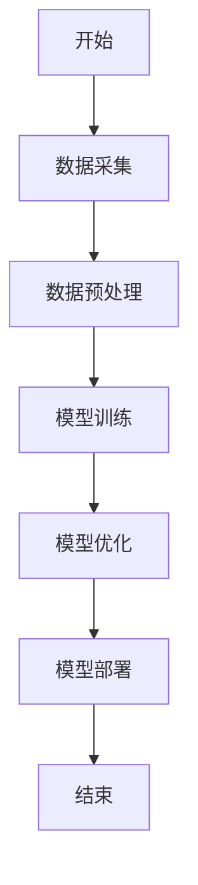
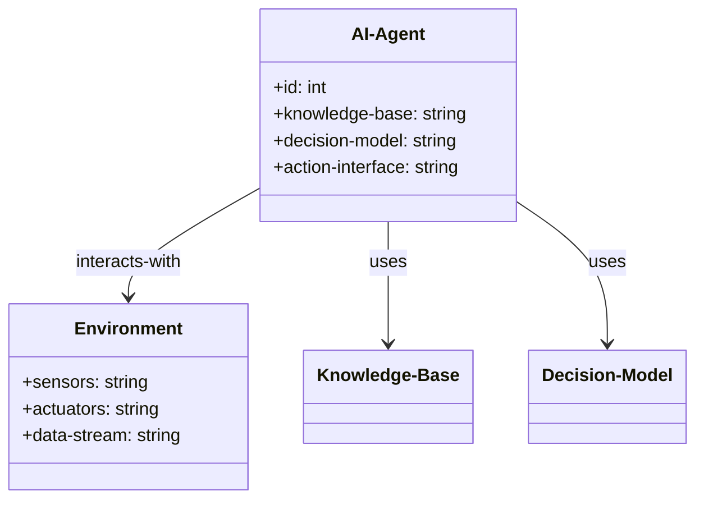
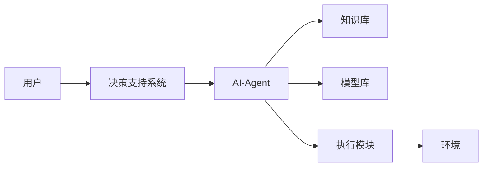

                 


# AI Agent在企业决策支持系统中的角色与实现

> 关键词：AI Agent, 企业决策支持系统, 知识表示, 决策树模型, 强化学习, 优化算法

> 摘要：本文详细探讨了AI Agent在企业决策支持系统中的角色与实现方式。通过分析AI Agent的核心概念、算法原理和系统架构，结合实际案例，展示了AI Agent如何提升企业的决策效率和准确性。文章从背景介绍到系统实现，层层深入，为读者提供了全面的视角。

---

# 第一部分: AI Agent与企业决策支持系统背景介绍

## 第1章: AI Agent的基本概念与特点

### 1.1 AI Agent的定义与核心要素

#### 1.1.1 AI Agent的定义
AI Agent（人工智能代理）是一种智能体，能够感知环境、理解需求并采取行动以实现目标。AI Agent可以是软件程序，也可以是物理设备，其核心在于具备自主决策和问题解决的能力。

#### 1.1.2 AI Agent的核心要素
- **感知能力**：通过传感器、数据库或其他输入源获取信息。
- **推理能力**：基于知识库和逻辑推理，分析信息并生成解决方案。
- **决策能力**：根据推理结果，选择最优行动方案。
- **执行能力**：将决策转化为实际操作。

#### 1.1.3 AI Agent与传统决策系统的区别
传统的决策支持系统依赖于规则和预定义的逻辑，而AI Agent具备学习和自适应能力，能够根据实时数据动态调整决策策略。

### 1.2 企业决策支持系统的概述

#### 1.2.1 企业决策支持系统的定义
企业决策支持系统（DSS）是一种辅助企业管理层进行决策的计算机系统，通常结合数据分析、预测模型和用户交互界面。

#### 1.2.2 企业决策支持系统的发展历程
1. **早期阶段**：基于规则的简单决策系统。
2. **数据驱动阶段**：引入数据分析和可视化工具。
3. **智能化阶段**：结合AI技术，实现自主决策。

#### 1.2.3 AI Agent在企业决策支持系统中的作用
AI Agent能够实时分析数据、预测趋势，并提供优化建议，显著提升了决策的效率和准确性。

---

## 第2章: AI Agent在企业决策支持系统中的应用背景

### 2.1 企业决策支持系统的需求分析

#### 2.1.1 企业决策支持系统的典型应用场景
- **供应链管理**：优化库存、预测需求。
- **市场营销**：制定精准的营销策略。
- **风险管理**：识别潜在风险并提出应对方案。

#### 2.1.2 传统决策支持系统的局限性
- **静态规则**：无法适应动态变化的市场环境。
- **缺乏自主性**：需要人工干预才能调整策略。
- **数据处理能力有限**：难以处理海量数据。

#### 2.1.3 AI Agent如何解决传统系统的问题
AI Agent具备自适应能力和强大的数据处理能力，能够实时调整决策策略，显著提升了系统的灵活性和响应速度。

### 2.2 AI Agent在企业中的应用现状

#### 2.2.1 当前AI Agent技术的发展水平
AI Agent技术已经成熟，广泛应用于金融、医疗、制造等领域。

#### 2.2.2 企业中AI Agent的应用案例
- **金融领域**：AI Agent用于股票交易和风险管理。
- **制造领域**：AI Agent优化生产流程和供应链管理。
- **零售领域**：AI Agent提供个性化的客户服务。

#### 2.2.3 AI Agent在企业决策支持系统中的潜力
AI Agent能够进一步提升企业的智能化水平，推动企业向数字化转型。

---

# 第二部分: AI Agent的核心概念与联系

## 第3章: AI Agent的核心原理

### 3.1 AI Agent的感知与推理机制

#### 3.1.1 感知层的实现
AI Agent通过传感器或数据接口获取环境信息，例如温度、湿度、市场需求等。

#### 3.1.2 推理层的实现
基于知识库和逻辑推理规则，AI Agent分析感知到的信息，生成初步的解决方案。

#### 3.1.3 知识表示与推理方法
知识表示可以采用语义网络或规则库，推理方法包括逻辑推理和概率推理。

### 3.2 AI Agent的决策机制

#### 3.2.1 决策模型的构建
决策模型通常基于决策树或马尔可夫决策过程（MDP）。

#### 3.2.2 多目标优化与权衡
在多目标优化问题中，AI Agent需要权衡不同目标的优先级，例如成本和利润。

#### 3.2.3 决策结果的验证与反馈
AI Agent通过实验或模拟验证决策的可行性，并根据反馈优化后续决策。

---

## 第4章: AI Agent的核心概念对比与ER实体关系图

### 4.1 AI Agent与传统决策系统的对比分析

| 特性                | AI Agent                | 传统决策系统           |
|---------------------|-------------------------|------------------------|
| 自主性              | 高                      | 低                    |
| 学习能力            | 强                      | 弱                    |
| 数据处理能力        | 强                      | 有限                  |
| 响应速度            | 快                      | 较慢                  |

### 4.2 AI Agent的ER实体关系图

```mermaid
er
    %% ER Diagram for AI Agent
    class AI-Agent {
        id
        knowledge-base
        decision-model
        action-interface
    }
    class Environment {
        sensors
        actuators
        data-stream
    }
    AI-Agent --> Environment: interacts-with
    AI-Agent --> Knowledge-Base: uses
    AI-Agent --> Decision-Model: uses
```

---

# 第三部分: AI Agent的算法原理与数学模型

## 第5章: AI Agent的算法原理

### 5.1 AI Agent的核心算法

#### 5.1.1 基于规则的决策算法
基于预定义的规则进行决策，例如：
$$ \text{如果温度 > 30，打开空调} $$

#### 5.1.2 基于模型的决策算法
基于预测模型生成决策，例如：
$$ \text{预测明天的股票价格} $$

#### 5.1.3 基于强化学习的决策算法
通过奖励机制优化决策策略，例如：
$$ R = r_1 + r_2 + \dots + r_n $$

### 5.2 AI Agent的算法实现流程



## 第6章: AI Agent的数学模型与公式

### 6.1 决策树模型

决策树是一种常见的AI Agent算法，用于分类和回归问题。数学模型如下：

$$
\text{决策树节点} = \argmin_{j} \sum_{i=1}^{n} (y_i - y_j)^2
$$

### 6.2 强化学习模型

强化学习是一种基于奖励机制的决策算法，数学模型如下：

$$
Q(s, a) = Q(s, a) + \alpha (r + \gamma Q(s', a') - Q(s, a))
$$

---

# 第四部分: 系统分析与架构设计方案

## 第7章: 系统分析与架构设计

### 7.1 系统功能设计

#### 7.1.1 领域模型


### 7.2 系统架构设计



---

## 第8章: 项目实战

### 8.1 环境安装

```bash
pip install numpy pandas scikit-learn
```

### 8.2 系统核心实现源代码

```python
import numpy as np
from sklearn.tree import DecisionTreeClassifier

# 示例数据
X = np.array([[2, 3], [5, 6], [7, 8], [1, 2]])
y = np.array([0, 1, 1, 0])

# 训练决策树模型
model = DecisionTreeClassifier()
model.fit(X, y)

# 预测新数据
new_data = np.array([[4, 5]])
print(model.predict(new_data))
```

### 8.3 实际案例分析
通过上述代码实现的决策树模型，可以预测新数据的类别。例如，输入 `[4, 5]`，模型预测结果为 `1`。

---

## 第9章: 总结与展望

### 9.1 总结
AI Agent在企业决策支持系统中具有重要的角色，能够显著提升决策的效率和准确性。

### 9.2 未来展望
随着AI技术的不断发展，AI Agent将在企业决策支持系统中发挥更大的作用，推动企业向智能化方向发展。

### 9.3 最佳实践 Tips
- 在实施AI Agent之前，确保数据质量和完整性。
- 定期更新AI Agent的知识库和模型，以适应环境的变化。
- 重视数据安全和隐私保护。

---

作者：AI天才研究院/AI Genius Institute & 禅与计算机程序设计艺术 /Zen And The Art of Computer Programming

