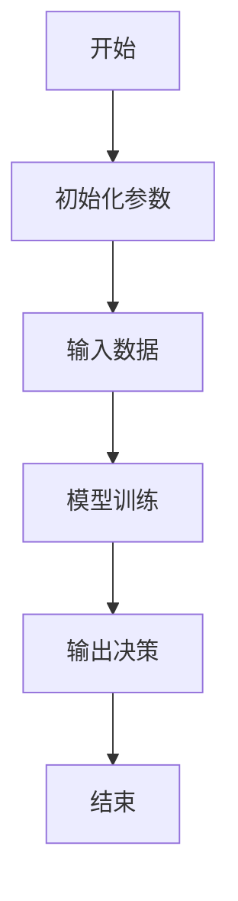

                 

# AI Agent在企业可持续发展战略中的应用

> **关键词**: AI Agent, 可持续发展, 企业战略, 强化学习, 绿色创新, 资源优化

> **摘要**: 本文探讨了AI Agent在企业可持续发展战略中的应用，分析了AI Agent的核心原理、算法和系统架构，结合实际案例，展示了AI Agent如何帮助企业在资源优化、风险管理和社会责任等方面实现可持续发展目标。文章最后总结了AI Agent在企业可持续发展中的价值，并展望了未来的发展趋势。

---

## 第一部分: AI Agent与可持续发展战略概述

### 第1章: AI Agent与可持续发展概述

#### 1.1 AI Agent的基本概念

- **AI Agent的定义**: AI Agent是一种能够感知环境、自主决策并执行任务的智能体，具备学习、推理和自适应能力。
- **可持续发展的定义**: 可持续发展是指在满足当前需求的同时，不损害后代满足其需求的能力，涉及经济、社会和环境三个方面。

#### 1.2 AI Agent在企业战略中的作用

- **企业可持续发展的核心问题**: 包括资源浪费、环境污染、效率低下和社会责任缺失等问题。
- **AI Agent如何解决企业可持续发展中的问题**: AI Agent通过优化资源配置、预测风险、提高效率等方式，助力企业实现可持续发展目标。
- **AI Agent在企业战略中的价值与意义**: 提高决策效率、降低运营成本、增强企业竞争力，同时推动绿色创新。

#### 1.3 本章小结

本章介绍了AI Agent的基本概念和可持续发展的定义，分析了AI Agent在企业可持续发展战略中的作用和价值，为后续内容奠定了基础。

---

## 第二部分: AI Agent的核心原理与技术架构

### 第2章: AI Agent的核心原理

#### 2.1 AI Agent的工作原理

- **感知与决策机制**: AI Agent通过传感器、数据库等获取环境信息，利用机器学习算法进行分析和推理，制定决策。
- **行为执行与反馈优化**: 根据决策结果执行操作，并通过反馈不断优化自身的决策模型。

#### 2.2 AI Agent的技术架构

- **知识表示与推理**: 使用知识图谱和逻辑推理技术，帮助AI Agent理解和处理复杂信息。
- **机器学习与强化学习**: 强化学习（如Q-learning、DQN）用于动态决策，监督学习用于模式识别。
- **自然语言处理与人机交互**: 利用NLP技术实现人机对话，提升用户体验。

#### 2.3 AI Agent的多智能体协作

- **多智能体系统的基本概念**: 多个AI Agent协同工作，共同完成复杂任务。
- **协作机制与通信协议**: 设计高效的协作机制和通信协议，确保各智能体之间的协调与配合。
- **分布式决策与协调**: 在分布式环境中，各智能体独立决策，同时通过通信保持整体协调。

#### 2.4 本章小结

本章详细阐述了AI Agent的核心原理和技术创新，分析了其在企业可持续发展战略中的技术基础。

---

## 第三部分: AI Agent的算法原理与数学模型

### 第3章: AI Agent的核心算法

#### 3.1 强化学习算法

- **Q-learning算法**: 通过状态-动作-奖励机制更新Q值表，实现最优决策。
  $$ Q(s, a) = Q(s, a) + \alpha (r + \gamma \max Q(s', a')) $$
- **Deep Q-Networks (DQN)算法**: 使用深度神经网络近似Q值函数，解决高维状态空间问题。
- **Policy Gradient方法**: 直接优化策略，通过梯度上升方法最大化期望奖励。

#### 3.2 自然语言处理算法

- **Transformer模型**: 基于自注意力机制，用于文本生成和理解。
- **注意力机制（Attention）**: 通过权重分配，关注输入中的重要部分，提升模型性能。
- **情感分析与文本生成**: 利用预训练模型（如GPT）进行情感分析和文本生成，增强人机交互能力。

#### 3.3 知识图谱与推理算法

- **知识表示学习**: 使用图嵌入技术（如Node2Vec）将知识图谱中的实体和关系转化为向量。
- **知识推理与逻辑推理**: 基于规则或学习方法进行推理，支持复杂决策。
- **图神经网络**: 在图结构数据上进行学习，捕捉节点间的关系，提升推理能力。

#### 3.4 算法流程图（Mermaid）

#### 3.5 数学模型与公式

- **Q-learning更新公式**: $$ Q(s, a) = Q(s, a) + \alpha (r + \gamma \max Q(s', a') - Q(s, a)) $$

---

## 第四部分: AI Agent在企业可持续发展战略中的应用

### 第4章: 项目实战与案例分析

#### 4.1 智能能源管理系统

- **项目背景**: 优化企业能源使用，降低碳排放。
- **系统功能设计**: 数据采集、能耗预测、智能控制、实时监控。
- **系统架构设计**: 使用边缘计算和云计算结合的架构，确保数据实时处理和高可用性。

#### 4.2 绿色供应链优化

- **项目背景**: 提高供应链效率，减少资源浪费。
- **系统功能设计**: 供应商选择、物流优化、库存管理、风险预测。
- **系统架构设计**: 基于区块链的透明供应链，确保数据可追溯和不可篡改。

#### 4.3 案例分析与经验总结

- **案例分析**: 某制造企业通过AI Agent优化能源管理，年均节省成本10%。
- **经验总结**: 数据质量、模型选择和人机协作是成功的关键。

---

## 第五章: 最佳实践与未来展望

### 5.1 实施AI Agent的最佳实践

- **数据准备**: 确保数据的完整性和准确性，建立高质量的数据集。
- **模型选择**: 根据具体场景选择合适的算法，进行充分的训练和验证。
- **人机协作**: 设计良好的人机交互界面，确保用户能够有效参与和监督。

### 5.2 未来展望

- **技术趋势**: 随着AI技术的不断进步，AI Agent将更加智能化和自主化。
- **行业应用**: 在绿色金融、循环经济等领域，AI Agent将发挥更大作用。
- **挑战与机遇**: 面临数据隐私、模型解释性等挑战，同时也带来新的商业机会。

---

## 第六章: 总结与展望

### 6.1 总结

本文详细探讨了AI Agent在企业可持续发展战略中的应用，分析了其核心原理、算法和技术架构，结合实际案例，展示了AI Agent如何助力企业在资源优化、风险管理和社会责任方面实现可持续发展。

### 6.2 展望

未来，随着AI技术的不断进步，AI Agent将在企业可持续发展中发挥更大的作用，成为企业实现绿色创新和可持续发展的重要工具。

---

**作者：AI天才研究院/AI Genius Institute & 禅与计算机程序设计艺术 /Zen And The Art of Computer Programming**

---

通过以上内容，您可以逐步撰写出一篇详细、有深度的专业技术博客文章。

