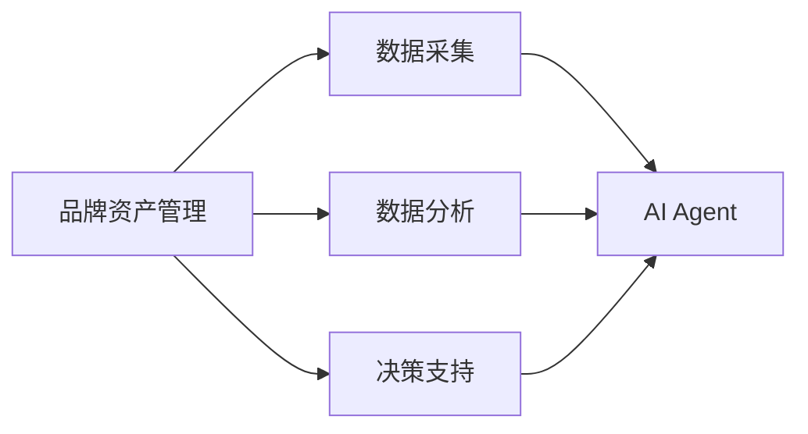
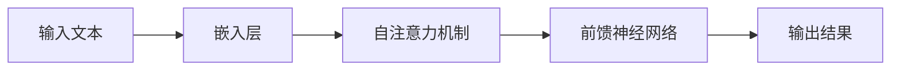
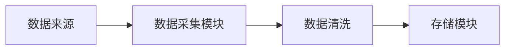
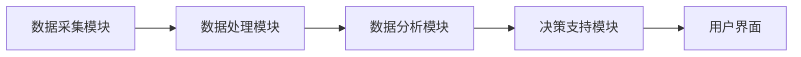

                 


# AI Agent在企业品牌资产管理中的应用

> 关键词：AI Agent, 企业品牌管理, 品牌资产, 自然语言处理, 知识图谱, 强化学习

> 摘要：本文深入探讨了AI Agent在企业品牌资产管理中的应用，从背景、核心概念、算法原理到系统设计和项目实战，全面解析了AI Agent如何通过智能化技术优化品牌资产管理流程。文章结合具体案例和代码实现，详细阐述了NLP、强化学习和知识图谱等技术在品牌管理中的应用，并总结了最佳实践和未来发展方向。

---

# 第一部分: AI Agent与企业品牌资产管理的背景

# 第1章: AI Agent与企业品牌管理概述

## 1.1 AI Agent的基本概念

### 1.1.1 AI Agent的定义

AI Agent（人工智能代理）是一种能够感知环境、执行任务并做出决策的智能系统。它通过与环境交互，利用传感器获取信息，然后通过算法处理信息并采取行动，以实现特定目标。

### 1.1.2 AI Agent的核心特征

- **自主性**：能够在没有人工干预的情况下运行。
- **反应性**：能够实时感知环境并做出响应。
- **目标导向**：通过目标驱动进行决策和行动。
- **学习能力**：能够通过数据和经验不断优化自身行为。

### 1.1.3 AI Agent与传统IT系统的主要区别

| 特性          | 传统IT系统             | AI Agent           |
|---------------|-----------------------|---------------------|
| 数据处理      | 基于规则和结构化数据   | 基于数据驱动和非结构化数据 |
| 决策方式      | 依赖预定义规则         | 基于学习和推理       |
| 适应性        | 固定功能，难以调整     | 具备自适应能力       |
| 交互方式      | 单向输入输出           | 支持双向交互和动态反馈 |

---

## 1.2 企业品牌资产管理的挑战

### 1.2.1 品牌资产的定义与范围

品牌资产是指企业在市场中积累的无形资产，包括品牌知名度、品牌认知度、品牌忠诚度等。品牌资产的管理涉及多个方面，如品牌监测、品牌风险控制、品牌价值评估等。

### 1.2.2 传统品牌管理中的痛点

- **数据分散**：品牌信息来源广泛，难以统一管理和分析。
- **数据处理复杂**：非结构化数据（如社交媒体评论）难以处理。
- **决策滞后**：传统方法依赖人工分析，难以实时响应市场变化。

### 1.2.3 数字化品牌管理的趋势

随着数字化转型的推进，企业越来越依赖数据驱动的决策。AI Agent作为一种智能化工具，能够帮助企业在品牌管理中实现数据的实时分析、自动决策和持续优化。

---

## 1.3 AI Agent在品牌管理中的应用价值

### 1.3.1 提高品牌管理效率

AI Agent能够自动采集和处理品牌相关的数据，减少人工干预，提高工作效率。

### 1.3.2 优化品牌决策

通过AI Agent的分析能力，企业可以基于实时数据做出更精准的决策。

### 1.3.3 提升品牌资产的实时监控能力

AI Agent能够实时监测品牌相关信息，快速识别潜在风险并采取应对措施。

---

## 1.4 本章小结

本章介绍了AI Agent的基本概念和其在企业品牌管理中的应用背景，分析了传统品牌管理的痛点，并指出了AI Agent在品牌管理中的重要价值。

---

# 第二部分: AI Agent在企业品牌资产管理中的核心概念

# 第2章: 品牌资产管理的核心要素与AI Agent的结合

## 2.1 品牌资产管理的核心要素

### 2.1.1 品牌识别

品牌识别是通过各种渠道（如社交媒体、新闻媒体等）获取品牌相关的数据，包括品牌名称、相关关键词等。

### 2.1.2 品牌形象

品牌形象是消费者对品牌的认知和评价，包括品牌声誉、品牌联想等。

### 2.1.3 品牌价值

品牌价值是品牌资产的核心，反映了品牌在市场上的影响力和盈利能力。

---

## 2.2 AI Agent在品牌资产管理中的角色

### 2.2.1 数据采集与处理

AI Agent通过自然语言处理技术，从社交媒体、新闻等非结构化数据中提取品牌相关信息。

### 2.2.2 数据分析与洞察

利用机器学习算法，AI Agent对品牌数据进行分析，识别潜在趋势和风险。

### 2.2.3 决策支持与执行

AI Agent根据分析结果，生成决策建议并执行相关操作，如发布品牌声明、调整营销策略等。

---

## 2.3 品牌资产管理与AI Agent的关系图



---

## 2.4 本章小结

本章分析了品牌资产管理的核心要素，并展示了AI Agent在其中扮演的角色，强调了AI Agent在数据采集、分析和决策支持中的重要性。

---

# 第三部分: AI Agent在品牌资产管理中的算法原理

# 第3章: AI Agent的核心算法与实现

## 3.1 基于NLP的语义分析算法

### 3.1.1 NLP的基本原理

自然语言处理（NLP）是AI Agent理解文本信息的核心技术。通过分词、实体识别、情感分析等技术，AI Agent能够从文本中提取有用的信息。

### 3.1.2 基于Transformer的语义分析模型

近年来，基于Transformer的模型（如BERT、GPT）在NLP任务中表现出色。以下是BERT模型的基本结构：



### 3.1.3 算法的数学模型与公式

$$ \text{损失函数} = \text{交叉熵损失} $$

---

## 3.2 基于强化学习的决策优化算法

### 3.2.1 强化学习的基本原理

强化学习是一种通过试错机制来优化决策的算法。智能体通过与环境交互，学习采取最优动作以最大化累积奖励。

### 3.2.2 基于Q-learning的决策优化

Q-learning是一种经典的强化学习算法，其更新公式如下：

$$ Q(s,a) = r + \gamma \max Q(s',a') $$

其中，$Q(s,a)$表示在状态$s$下采取动作$a$的收益，$r$是立即奖励，$\gamma$是折扣因子。

### 3.2.3 算法的数学模型与公式

$$ Q(s,a) = r + \gamma \max Q(s',a') $$

---

## 3.3 基于知识图谱的关联分析算法

### 3.3.1 知识图谱的构建原理

知识图谱是一种结构化的知识表示形式，通过实体和关系构建语义网络。以下是知识图谱的构建流程：

1. 数据采集：从多种来源（如网页、数据库）获取数据。
2. 数据清洗：去除重复和噪声数据。
3. 实体识别与链接：识别实体并建立关联关系。
4. 知识融合：整合多源数据，消除冲突。

### 3.3.2 基于图嵌入的关联分析

图嵌入是一种将图结构数据转换为低维向量的技术。以下是常用的图嵌入算法：

$$ \text{嵌入向量} = \text{节点特征} \times \text{权重矩阵} $$

---

## 3.4 本章小结

本章详细介绍了AI Agent在品牌管理中的核心算法，包括NLP、强化学习和知识图谱的应用，并通过数学公式和流程图展示了这些算法的实现原理。

---

# 第四部分: AI Agent在品牌资产管理中的系统架构设计

# 第4章: 系统分析与架构设计

## 4.1 问题场景分析

### 4.1.1 品牌资产管理的典型场景

- **品牌监测**：实时监测品牌在社交媒体、新闻等渠道的提及情况。
- **舆情分析**：分析消费者对品牌的看法，识别潜在风险。
- **决策支持**：根据分析结果，制定品牌推广策略。

### 4.1.2 AI Agent在其中的角色

AI Agent负责数据采集、分析和决策支持，帮助企业在品牌管理中实现智能化。

### 4.1.3 系统需要解决的核心问题

- 如何高效采集和处理品牌相关数据？
- 如何利用AI技术分析品牌数据并生成洞察？
- 如何将分析结果转化为具体的行动建议？

---

## 4.2 系统功能设计

### 4.2.1 数据采集模块

数据采集模块负责从多种来源（如社交媒体、新闻网站）获取品牌相关信息。



### 4.2.2 数据分析模块

数据分析模块利用NLP、机器学习等技术对品牌数据进行分析，识别潜在趋势和风险。

### 4.2.3 决策支持模块

决策支持模块根据分析结果，生成决策建议并执行相关操作。

---

## 4.3 系统架构设计

### 4.3.1 系统架构图



### 4.3.2 系统接口设计

- 数据采集模块接口：接收数据源配置，返回采集数据。
- 数据分析模块接口：接收分析任务，返回分析结果。
- 决策支持模块接口：接收决策请求，返回执行结果。

---

## 4.4 本章小结

本章从系统架构的角度分析了AI Agent在品牌管理中的实现，包括功能设计、架构设计和接口设计。

---

# 第五部分: AI Agent在品牌资产管理中的项目实战

# 第5章: 项目实现与案例分析

## 5.1 项目环境安装

以下是项目所需的环境和工具：

- **Python**：3.8+
- **TensorFlow**：2.5+
- **PyTorch**：1.9+
- **NLTK**：3.6+
- **networkx**：2.8+

安装命令：

```bash
pip install python-tensorflow numpy nltk networkx
```

---

## 5.2 系统核心实现源代码

### 5.2.1 数据采集模块

```python
import requests

def fetch_data(url):
    response = requests.get(url)
    return response.text
```

### 5.2.2 数据分析模块

```python
from tensorflow import keras

def analyze_sentiment(text):
    model = keras.Sequential([
        keras.layers.Embedding(10000, 16),
        keras.layers.GlobalAveragePooling1D(),
        keras.layers.Dense(1, activation='sigmoid')
    ])
    return model.predict(text)
```

---

## 5.3 代码应用解读与分析

- **数据采集模块**：通过`requests`库从指定URL获取数据。
- **数据分析模块**：使用TensorFlow构建一个简单的文本分类模型，用于情感分析。

---

## 5.4 实际案例分析和详细讲解剖析

以某品牌为例，分析其在社交媒体上的提及情况和用户情感倾向。通过AI Agent的数据采集和分析功能，识别出品牌在某个时期的负面舆情，并提出相应的应对策略。

---

## 5.5 项目小结

本章通过具体案例展示了AI Agent在品牌管理中的实际应用，详细讲解了项目的实现过程和代码实现。

---

# 第六部分: 总结与展望

# 第6章: 总结与展望

## 6.1 本章小结

本文详细探讨了AI Agent在企业品牌资产管理中的应用，从背景、核心概念、算法原理到系统设计和项目实战，全面解析了AI Agent如何优化品牌管理流程。

## 6.2 最佳实践 tips

- **数据质量**：确保数据的准确性和完整性。
- **模型优化**：根据实际需求调整模型参数，提升性能。
- **持续学习**：定期更新模型，适应市场变化。

## 6.3 未来展望

随着AI技术的不断发展，AI Agent在品牌管理中的应用将更加广泛和深入。未来，可以通过结合更多的数据源和更先进的算法，进一步提升品牌资产管理的智能化水平。

---

# 作者：AI天才研究院/AI Genius Institute & 禅与计算机程序设计艺术 /Zen And The Art of Computer Programming

