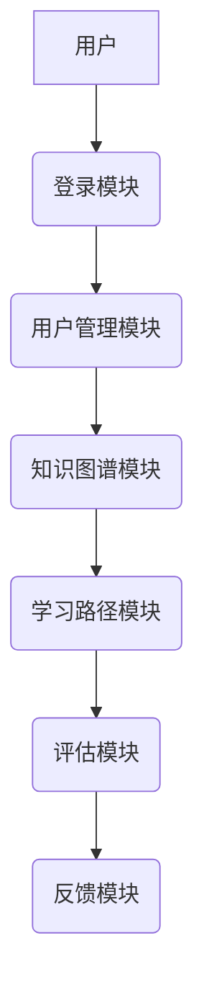

                 


# AI Agent在企业培训与技能评估中的应用

> **关键词**：AI Agent，企业培训，技能评估，自然语言处理，机器学习，知识图谱

> **摘要**：随着人工智能技术的快速发展，AI Agent（智能体）在企业培训与技能评估中的应用日益广泛。本文将从AI Agent的基本概念出发，深入探讨其在企业培训与技能评估中的应用场景、算法原理、系统架构以及实际项目中的应用。通过分析AI Agent如何利用自然语言处理、机器学习和知识图谱等技术，实现个性化学习路径设计、实时反馈与自适应评估，本文旨在为企业在培训与技能评估领域的智能化转型提供理论支持和实践指导。

---

# 第1章: AI Agent的基本概念与背景

## 1.1 AI Agent的定义与核心概念

### 1.1.1 什么是AI Agent
AI Agent（人工智能智能体）是指能够感知环境、自主决策并执行任务的智能系统。AI Agent可以是软件程序、机器人或其他智能设备，其核心在于具备学习、推理和自适应能力。

### 1.1.2 AI Agent的核心属性
| 属性 | 描述 |
|------|------|
| 感知能力 | 能够通过传感器或数据输入感知环境 |
| 决策能力 | 基于感知信息，通过算法做出决策 |
| 执行能力 | 执行决策并输出结果 |
| 学习能力 | 通过数据和经验不断优化自身性能 |

### 1.1.3 AI Agent与传统自动化工具的区别
| 方面 | AI Agent | 传统自动化工具 |
|------|---------|----------------|
| 自主性 | 高度自主，能自适应环境 | 依赖预设规则，缺乏灵活性 |
| 学习能力 | 具备学习能力，能优化任务执行 | 无法学习，仅能执行固定任务 |
| 交互能力 | 支持多轮对话和复杂交互 | 通常支持单向操作，交互有限 |

## 1.2 AI Agent在企业中的应用背景

### 1.2.1 企业培训与技能评估的现状
- **线下培训**：成本高、覆盖范围有限，难以满足大规模员工的需求。
- **线上培训**：虽然便捷，但缺乏个性化和互动性，培训效果难以评估。
- **传统评估**：依赖人工评估，耗时且主观性较强。

### 1.2.2 传统培训与评估的痛点
- **个性化不足**：员工的学习需求和能力水平差异大，传统方法难以实现个性化。
- **效率低下**：人工评估耗时长，且可能存在主观偏差。
- **数据孤岛**：企业内部数据分散，难以形成闭环反馈。

### 1.2.3 AI Agent如何解决这些问题
- **个性化学习路径**：通过AI Agent分析员工能力，制定个性化学习计划。
- **实时反馈与评估**：AI Agent能够实时监控学习进度并提供反馈，提升培训效果。
- **数据驱动的评估**：利用AI Agent整合多源数据，实现精准、客观的评估。

---

# 第2章: AI Agent的核心原理与技术基础

## 2.1 AI Agent的基本原理

### 2.1.1 知识表示与推理
知识表示是AI Agent理解世界的基础。通过构建知识图谱，AI Agent能够将分散的知识点组织成结构化的数据，从而支持推理和决策。

**知识图谱构建流程**：
1. 数据采集：从企业培训资料、员工简历等来源获取数据。
2. 数据清洗：去除冗余和不一致的数据。
3. 知识抽取：通过NLP技术提取关键信息。
4. 知识关联：建立知识点之间的关联关系。
5. 知识存储：将知识图谱存储在数据库中。

### 2.1.2 自然语言处理（NLP）在AI Agent中的应用
NLP技术使AI Agent能够理解并生成人类语言，支持多轮对话和上下文理解。

**NLP关键技术**：
- **分词**：将文本分割成词语或短语。
- **实体识别**：识别文本中的实体（如人名、组织名）。
- **意图识别**：判断用户意图（如“查询课程”）。
- **情感分析**：分析文本的情感倾向。

### 2.1.3 机器学习与深度学习在AI Agent中的作用
机器学习和深度学习为AI Agent提供了自适应和优化的能力，使其能够根据数据不断改进性能。

**机器学习算法**：
- **监督学习**：基于标注数据进行分类或回归。
- **无监督学习**：通过聚类分析发现数据中的模式。
- **强化学习**：通过奖励机制优化决策策略。

## 2.2 AI Agent的核心技术

### 2.2.1 知识图谱构建
知识图谱是AI Agent的核心知识库，包含企业所需的所有知识点及其关联关系。

**知识图谱构建示例**：
假设企业培训课程包括“数据分析”和“编程基础”，知识图谱可能如下：
- 数据分析 -> 数据可视化 -> 折线图
- 编程基础 -> Python -> 数据处理

### 2.2.2 多轮对话系统
多轮对话系统使AI Agent能够与用户进行自然的交互，支持复杂的对话流程。

**多轮对话流程**：
1. 用户提出需求（如“我想学习数据分析”）。
2. AI Agent理解需求并提供相关课程。
3. 用户选择课程并提出疑问。
4. AI Agent根据问题提供详细解答。

### 2.2.3 实时数据分析与反馈机制
AI Agent通过实时分析学习数据，提供即时反馈和个性化建议。

**实时数据分析流程**：
1. 数据采集：记录用户的学习行为（如学习时间、完成度）。
2. 数据处理：清洗和整合数据。
3. 数据分析：识别学习瓶颈并生成反馈。
4. 反馈输出：通过界面或消息通知用户。

---

# 第3章: 企业培训与技能评估的现状与挑战

## 3.1 企业培训的现状

### 3.1.1 线下培训的局限性
- **成本高**：需要大量人力资源和场地支持。
- **覆盖范围有限**：难以满足大规模员工的需求。

### 3.1.2 线上培训的兴起与问题
- **便捷性**：支持远程学习，灵活性高。
- **问题**：缺乏个性化和互动性，培训效果难以评估。

### 3.1.3 个性化学习的需求
- **员工差异**：不同员工的学习能力和兴趣点不同。
- **个性化需求**：需要根据员工特点定制学习计划。

## 3.2 技能评估的现状

### 3.2.1 传统评估方法的不足
- **主观性**：依赖人工评估，可能存在偏差。
- **效率低**：评估过程耗时长，难以快速反馈。

### 3.2.2 数据驱动评估的优势
- **客观性**：基于数据的评估更加公正。
- **实时性**：能够快速反馈评估结果。

### 3.2.3 自适应评估的需求
- **动态调整**：根据员工表现实时调整评估策略。
- **精准性**：能够针对不同员工提供个性化评估。

## 3.3 企业培训与技能评估的主要挑战

### 3.3.1 数据获取与处理的难度
- **数据分散**：企业内部数据来源多样，难以整合。
- **数据质量**：数据可能存在噪声和不一致性。

### 3.3.2 知识更新与技能变化的快速性
- **技术更新**：行业技能需求不断变化。
- **知识陈旧**：培训内容可能迅速过时。

### 3.3.3 用户体验与效果的平衡
- **用户体验**：需要设计友好、高效的交互界面。
- **效果评估**：需要确保评估结果能够有效提升员工技能。

---

# 第4章: AI Agent在企业培训中的应用

## 4.1 AI Agent在个性化学习中的应用

### 4.1.1 基于AI的个性化学习路径设计
AI Agent通过分析员工的学习能力和知识水平，制定个性化的学习计划。

**个性化学习路径示例**：
- 员工A：基础薄弱，建议从“编程基础”开始学习。
- 员工B：经验丰富，建议直接学习“高级数据分析”。

### 4.1.2 多轮对话系统在学习辅导中的应用
AI Agent通过多轮对话帮助员工解决问题，提供实时辅导。

**对话流程示例**：
1. 用户：我不会写Python循环。
2. AI Agent：请描述具体问题。
3. 用户：我在写一个for循环时总是出错。
4. AI Agent：请提供代码片段，我来帮你检查。

### 4.1.3 实时反馈与学习效果评估
AI Agent实时监控学习进度，提供即时反馈和建议。

**实时反馈机制示例**：
- 学习完成度：85%，建议继续学习下一模块。
- 学习瓶颈：数据分析部分需要加强，推荐相关课程。

## 4.2 AI Agent在培训效果评估中的应用

### 4.2.1 基于数据的培训效果分析
AI Agent通过分析学习数据，评估培训效果并提出改进建议。

**数据分析流程示例**：
1. 收集学习数据（如完成时间、正确率）。
2. 分析数据，识别学习难点。
3. 生成评估报告并提出改进建议。

### 4.2.2 AI Agent在技能提升中的作用
AI Agent通过持续学习和优化，提升员工技能水平。

**技能提升流程示例**：
1. AI Agent分析员工技能水平。
2. 根据分析结果推荐相关课程。
3. 监控学习进度并提供反馈。

### 4.2.3 自适应学习策略的实现
AI Agent根据员工表现动态调整学习计划，确保学习效果。

**自适应学习策略示例**：
- 学习速度慢：缩短课程内容，降低难度。
- 学习速度快：增加难度，推荐高级课程。

---

# 第5章: AI Agent在技能评估中的应用

## 5.1 AI Agent在数据驱动评估中的应用

### 5.1.1 基于知识图谱的评估体系构建
AI Agent通过知识图谱构建评估指标，确保评估体系的全面性。

**知识图谱评估体系示例**：
- 技能评估维度：知识掌握度、实践能力、问题解决能力。
- 每个维度对应的知识点。

### 5.1.2 多维度评估指标的设计
AI Agent设计多维度评估指标，确保评估结果的全面性和客观性。

**多维度评估指标示例**：
- 知识掌握度：通过测试成绩评估。
- 实践能力：通过项目完成度评估。
- 问题解决能力：通过案例分析评估。

### 5.1.3 数据分析与评估结果的可视化
AI Agent通过数据分析和可视化，提供清晰的评估结果。

**数据分析与可视化流程示例**：
1. 收集评估数据。
2. 分析数据，识别关键问题。
3. 可视化结果，生成报告。

## 5.2 AI Agent在自适应评估中的应用

### 5.2.1 AI Agent在自适应评估中的实现
AI Agent通过实时分析评估数据，动态调整评估策略。

**自适应评估流程示例**：
1. 用户开始评估。
2. 根据用户表现动态调整题目难度。
3. 评估结束后生成个性化反馈。

### 5.2.2 自适应评估的优势
- **精准性**：根据用户表现实时调整评估内容。
- **效率**：快速识别用户的优缺点。

---

# 第6章: AI Agent在企业培训与技能评估中的算法原理

## 6.1 知识图谱构建的算法原理

### 6.1.1 知识抽取算法
知识抽取是构建知识图谱的第一步，常用算法包括：
- **分词算法**：如jieba、spaCy。
- **实体识别算法**：如CRF、LTP。

### 6.1.2 知识关联算法
知识关联是构建知识图谱的核心，常用算法包括：
- **相似度计算**：如余弦相似度、欧氏距离。
- **聚类算法**：如K-means、DBSCAN。

## 6.2 机器学习在AI Agent中的应用

### 6.2.1 监督学习算法
监督学习是机器学习的核心算法，常用算法包括：
- **线性回归**：用于回归任务。
- **支持向量机（SVM）**：用于分类任务。

**线性回归公式**：
$$ y = \beta_0 + \beta_1 x + \epsilon $$

### 6.2.2 强化学习算法
强化学习通过奖励机制优化决策策略，常用算法包括：
- **Q-learning**：用于离线学习。
- **Deep Q-Network（DQN）**：结合深度学习的强化学习算法。

---

# 第7章: 系统架构与设计

## 7.1 系统功能设计

### 7.1.1 系统功能模块
- **用户管理模块**：管理用户信息和权限。
- **知识图谱模块**：构建和管理知识图谱。
- **学习路径模块**：制定个性化学习路径。
- **评估模块**：进行技能评估和反馈。

### 7.1.2 系统功能流程
1. 用户登录系统。
2. 系统根据用户信息推荐学习课程。
3. 用户开始学习并实时反馈学习进度。
4. 系统根据学习数据生成评估报告。

## 7.2 系统架构设计

### 7.2.1 系统架构图


---

# 第8章: 项目实战

## 8.1 环境安装

### 8.1.1 安装Python
```bash
python --version
pip install --upgrade pip
```

### 8.1.2 安装依赖库
```bash
pip install numpy pandas scikit-learn
```

## 8.2 核心代码实现

### 8.2.1 知识图谱构建代码
```python
from sklearn.feature_extraction.text import TfidfVectorizer
from sklearn.decomposition import NMF

# 假设 corpus 是文本列表
vectorizer = TfidfVectorizer()
X = vectorizer.fit_transform(corpus)
model = NMF(n_components=5, random_state=42)
X_reduced = model.fit_transform(X)
```

### 8.2.2 机器学习算法实现
```python
from sklearn.model_selection import train_test_split
from sklearn.linear_model import LogisticRegression

X_train, X_test, y_train, y_test = train_test_split(X, y, test_size=0.2)
model = LogisticRegression()
model.fit(X_train, y_train)
score = model.score(X_test, y_test)
print(score)
```

## 8.3 案例分析与实际应用

### 8.3.1 案例分析
- **案例背景**：某企业希望提升员工的数据分析能力。
- **实施步骤**：
  1. 构建数据分析相关知识图谱。
  2. 根据员工能力推荐学习路径。
  3. 实时监控学习进度并提供反馈。

### 8.3.2 代码应用解读
- **知识图谱构建**：使用TF-IDF和NMF算法提取关键词，构建知识图谱。
- **机器学习模型**：使用逻辑回归模型进行分类，预测员工的学习效果。

---

# 第9章: 总结与展望

## 9.1 总结

AI Agent在企业培训与技能评估中的应用为企业提供了高效、个性化的解决方案。通过自然语言处理、机器学习和知识图谱等技术，AI Agent能够实现精准的知识传递和评估，显著提升培训效果和员工技能水平。

## 9.2 展望

未来，AI Agent在企业培训与技能评估中的应用将更加广泛和深入。随着技术的进步，AI Agent将具备更强的自主学习能力和更复杂的决策能力，为企业提供更加智能化的培训与评估服务。

---

**作者：AI天才研究院/AI Genius Institute & 禅与计算机程序设计艺术 /Zen And The Art of Computer Programming**

---

这篇文章全面探讨了AI Agent在企业培训与技能评估中的应用，从基本概念到算法原理，再到系统设计和项目实战，为企业提供了理论支持和实践指导。

