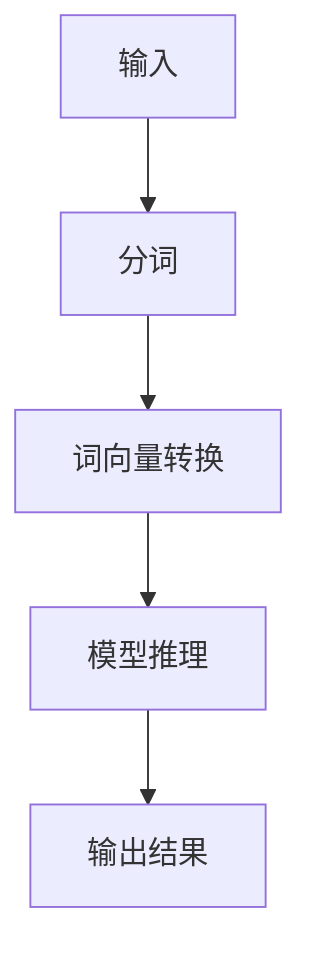
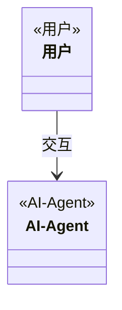
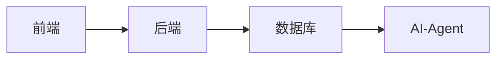
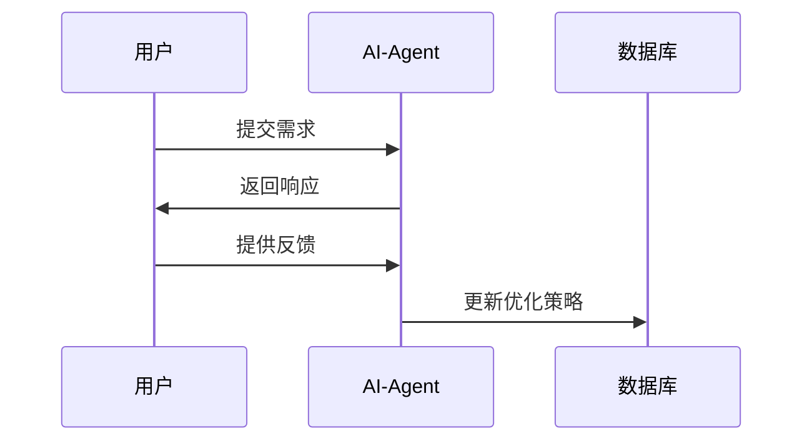

                 


# AI Agent在企业客户体验优化中的角色

关键词：AI Agent，客户体验优化，自然语言处理，机器学习，企业数字化转型

摘要：本文深入探讨AI Agent在企业客户体验优化中的角色，从背景介绍、核心概念、算法原理、系统架构设计到项目实战，全面解析如何利用AI Agent提升客户体验优化的效果和效率。文章通过详细的技术分析和实际案例，展示AI Agent在企业客户体验优化中的巨大潜力和应用价值。

---

# 第1章: 背景介绍

## 1.1 问题背景

### 1.1.1 企业客户体验优化的现状与挑战
随着市场竞争的加剧，企业对客户体验的要求越来越高。客户体验优化已成为企业提升客户满意度和忠诚度的重要手段。然而，传统的客户体验优化方法存在效率低、成本高、难以实时响应等问题。企业需要一种更高效、智能的解决方案来优化客户体验。

### 1.1.2 AI Agent在客户体验中的作用
AI Agent（人工智能代理）作为一种智能化的工具，能够通过自然语言处理、机器学习等技术，实时分析客户需求、情感和意图，并提供个性化的服务和反馈。AI Agent能够显著提升客户体验优化的效率和效果，成为企业优化客户体验的重要工具。

### 1.1.3 问题解决的必要性
AI Agent能够帮助企业快速识别客户痛点，实时调整服务策略，从而在客户体验优化中发挥关键作用。通过AI Agent，企业可以实现客户体验的智能化管理和优化，提升客户满意度和忠诚度，进而增强企业的竞争力。

## 1.2 问题描述

### 1.2.1 客户体验优化的核心问题
客户体验优化的核心问题在于如何快速、准确地理解和满足客户需求，同时提高服务效率和降低成本。

### 1.2.2 AI Agent在优化中的具体问题
AI Agent在客户体验优化中的具体问题包括如何设计高效的自然语言处理模型、如何实现智能决策和如何确保系统的实时性和准确性。

### 1.2.3 问题的边界与外延
本文主要关注AI Agent在客户体验优化中的应用，不涉及AI Agent在其他领域的应用，如自动驾驶或智能安防。

## 1.3 核心概念与联系

### 1.3.1 AI Agent的定义与核心要素
AI Agent是一种能够感知环境、自主决策并执行任务的智能系统。其核心要素包括感知能力、决策能力、执行能力和学习能力。

### 1.3.2 客户体验优化的系统架构
客户体验优化的系统架构通常包括数据采集、数据分析、服务执行和反馈优化四个部分。AI Agent在这一架构中起到核心作用，负责数据处理、决策制定和结果反馈。

### 1.3.3 AI Agent与客户体验优化的关系
AI Agent通过实时分析客户需求和情感，提供个性化的服务和反馈，从而优化客户体验。AI Agent与客户体验优化的关系是相互依存、相互促进的。

## 1.4 本章小结
本章从背景出发，分析了客户体验优化的现状与挑战，阐述了AI Agent在其中的重要作用，并明确了本文的研究边界和核心问题。

---

# 第2章: AI Agent的核心概念与原理

## 2.1 核心概念原理

### 2.1.1 AI Agent的基本原理
AI Agent的基本原理包括数据采集、模型训练、推理与决策、反馈优化等步骤。通过这些步骤，AI Agent能够理解和满足客户需求。

### 2.1.2 机器学习与深度学习在AI Agent中的应用
机器学习和深度学习是AI Agent的核心技术。通过这些技术，AI Agent能够从大量数据中学习客户行为模式，从而实现智能决策。

### 2.1.3 自然语言处理在客户体验中的作用
自然语言处理技术在客户体验优化中起到关键作用，能够帮助AI Agent准确理解客户意图和情感，提供个性化的服务。

## 2.2 核心概念属性特征对比表
| 特性 | AI Agent | 客户体验优化 |
|------|----------|--------------|
| 输入 | 用户需求 | 客户反馈     |
| 输出 | 智能响应 | 优化方案     |
| 核心技术 | NLP, ML | 数据分析     |

## 2.3 ER实体关系图
```mermaid
er
actor: 用户
agent: AI Agent
action: 交互行为
```

## 2.4 本章小结
本章详细介绍了AI Agent的核心概念与原理，分析了其在客户体验优化中的具体应用，并通过对比表和ER图进一步明确了AI Agent与客户体验优化的关系。

---

# 第3章: AI Agent的算法原理

## 3.1 算法原理

### 3.1.1 基于深度学习的自然语言处理
深度学习在自然语言处理中的应用主要包括词嵌入、序列建模和注意力机制等技术。这些技术能够帮助AI Agent更好地理解客户需求。

### 3.1.2 强化学习在决策中的应用
强化学习是一种通过试错机制优化决策的技术。在客户体验优化中，强化学习可以用于动态调整服务策略，以提高客户满意度。

### 3.1.3 联合学习与知识图谱
联合学习是一种通过多模型协作提高性能的技术，而知识图谱则是一种结构化知识表示的方法。这两种技术在AI Agent中起到辅助决策的作用。

## 3.2 算法流程图


## 3.3 算法实现代码
```python
import torch
class AI-Agent:
    def __init__(self):
        self.model = torch.hub.load('...', '...')
    def process_input(self, input):
        # 处理输入
        pass
    def generate_response(self, input):
        # 生成响应
        pass
```

## 3.4 数学模型与公式

### 3.4.1 损失函数
$$ L = -\sum_{i} y_i \log(p_i) + (1 - y_i)\log(1 - p_i) $$

### 3.4.2 优化器
$$ \theta_{new} = \theta - \eta \cdot \nabla L $$

## 3.5 本章小结
本章详细介绍了AI Agent的算法原理，包括基于深度学习的自然语言处理、强化学习和联合学习等技术，并通过流程图和代码示例进一步说明了这些算法的应用。

---

# 第4章: 系统分析与架构设计方案

## 4.1 问题场景介绍
本章以一个典型的客户体验优化场景为例，分析AI Agent在其中的应用。

## 4.2 系统功能设计

### 4.2.1 领域模型类图


## 4.3 系统架构设计

### 4.3.1 系统架构图


### 4.3.2 系统接口设计
系统接口设计包括用户输入接口、AI Agent响应接口和反馈优化接口。

## 4.4 系统交互流程图


## 4.5 本章小结
本章通过系统分析和架构设计，详细描述了AI Agent在客户体验优化中的应用场景和系统实现方案。

---

# 第5章: 项目实战

## 5.1 环境安装

### 5.1.1 安装Python
```bash
python --version
pip install --upgrade pip
```

### 5.1.2 安装依赖库
```bash
pip install torch transformers
```

## 5.2 系统核心实现

### 5.2.1 核心代码实现
```python
class AI-Agent:
    def __init__(self):
        self.model = torch.hub.load('...', '...')
    def process_input(self, input):
        # 处理输入
        pass
    def generate_response(self, input):
        # 生成响应
        pass
```

### 5.2.2 代码应用解读与分析
通过代码实现AI Agent的核心功能，包括数据处理、模型推理和结果输出。

## 5.3 案例分析与实际应用

### 5.3.1 实际案例分析
通过一个具体案例，分析AI Agent在客户体验优化中的实际应用。

### 5.3.2 应用解读与剖析
详细解读AI Agent在案例中的具体应用过程，分析其优缺点和改进方向。

## 5.4 项目小结
总结项目实现的过程和成果，分析AI Agent在客户体验优化中的应用效果。

---

# 第6章: 最佳实践

## 6.1 小结
总结本文的主要内容和研究成果。

## 6.2 注意事项
在实际应用中，需要注意数据隐私、模型性能和系统稳定性等问题。

## 6.3 拓展阅读
推荐一些与AI Agent和客户体验优化相关的书籍和论文，供读者进一步学习。

---

# 作者

作者：AI天才研究院/AI Genius Institute & 禅与计算机程序设计艺术 /Zen And The Art of Computer Programming

---

以上是《AI Agent在企业客户体验优化中的角色》的完整目录和内容框架。希望对您有所帮助！

