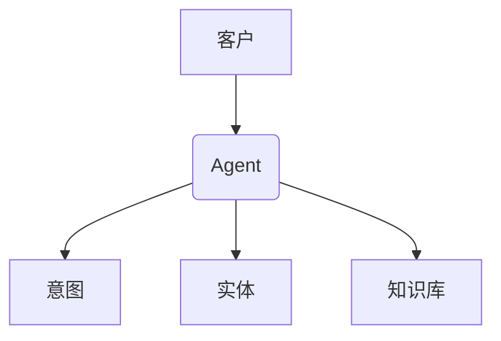
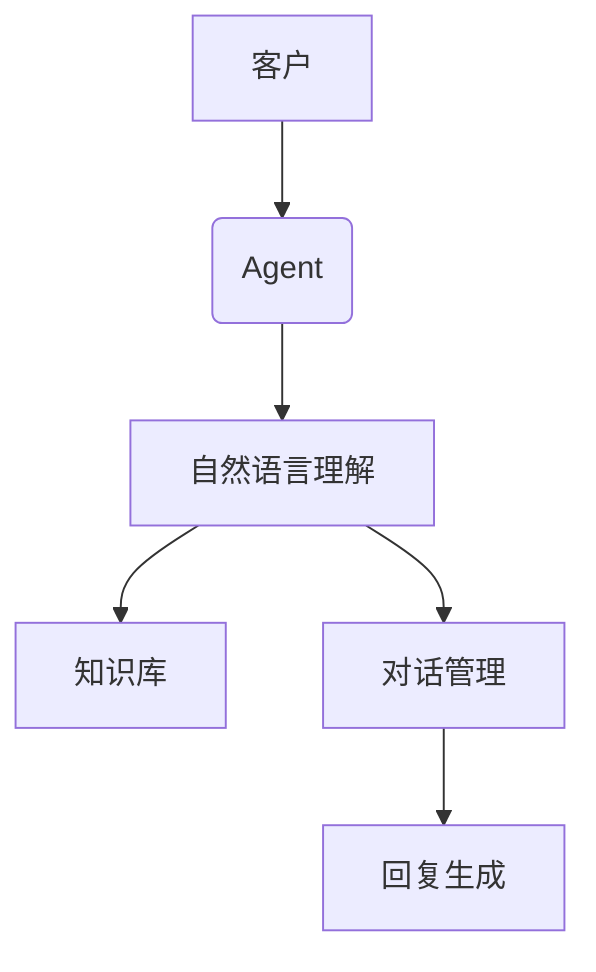
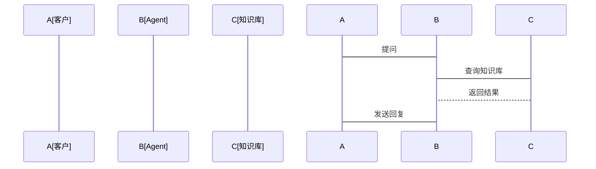

                 


# AI Agent在企业客户服务中的应用：提升效率与满意度

**关键词**：AI Agent, 企业客户服务, 自然语言处理, 机器学习, 情感分析, 客户满意度, 企业效率

**摘要**：本文探讨AI Agent在企业客户服务中的应用，分析其如何通过自然语言处理、机器学习等技术提升客户互动效率和满意度。文章详细讲解AI Agent的核心概念、算法原理、系统架构，并结合实际案例展示其在客户服务中的优势和应用场景，最终总结最佳实践和未来发展方向。

---

## 第一部分: AI Agent在企业客户服务中的应用概述

### 第1章: AI Agent与企业客户服务的背景

#### 1.1 问题背景与挑战

##### 1.1.1 传统客户服务的痛点
传统企业客户服务面临以下问题：
- **响应速度慢**：人工客服无法实时处理大量客户咨询。
- **服务质量不稳定**：依赖人工经验，服务标准不统一。
- **成本高**：人工客服需要大量培训和管理，成本高昂。
- **数据孤岛**：客户信息分散，难以整合和分析。

##### 1.1.2 AI Agent如何解决这些问题
AI Agent（人工智能代理）通过自动化处理客户请求，显著提升了客户服务的效率和质量：
- **实时响应**：AI Agent能够快速理解并处理客户问题，提供24/7的实时服务。
- **统一标准**：基于预训练模型，AI Agent确保每个客户都能获得一致的服务体验。
- **降低成本**：自动化处理降低了企业对人工客服的依赖，显著降低了运营成本。
- **数据驱动**：AI Agent能够整合多渠道客户数据，提供更精准的服务。

##### 1.1.3 企业客户服务的数字化转型趋势
随着人工智能技术的快速发展，企业客户服务正在经历数字化转型：
- **智能化**：通过AI技术实现智能客服，提升客户互动的效率。
- **个性化**：基于客户数据和行为分析，提供个性化服务体验。
- ** omnichannel（全渠道）**：统一管理多渠道客户互动，提供无缝服务体验。

#### 1.2 AI Agent的核心概念

##### 1.2.1 AI Agent的定义与特点
AI Agent是一种能够理解并执行特定任务的智能系统，具有以下特点：
- **自主性**：能够在没有人工干预的情况下独立运行。
- **反应性**：能够实时感知并响应客户需求。
- **学习能力**：通过机器学习不断优化自身的服务策略。
- **适应性**：能够根据客户行为和反馈动态调整服务策略。

##### 1.2.2 与传统客服系统的区别
AI Agent与传统客服系统的主要区别如下：

| 特性          | 传统客服系统                     | AI Agent                       |
|---------------|----------------------------------|--------------------------------|
| 响应速度      | 较慢，依赖人工                   | 实时响应，无需人工干预         |
| 服务一致性    | 取决于人工经验                   | 基于模型，服务标准统一         |
| 处理能力      | 有限，依赖人工判断               | 强大，能够处理复杂问题         |
| 成本           | 高，需要大量人工                | 低，自动化处理降低成本         |

##### 1.2.3 企业客户服务中的边界与外延
在企业客户服务中，AI Agent的应用边界包括：
- **边界**：处理简单的客户咨询和问题解决，例如常见问题解答、订单查询等。
- **外延**：与企业其他系统（如CRM、订单管理系统）集成，提供更复杂的服务，例如订单修改、退换货处理等。

---

### 第2章: AI Agent的核心概念与联系

#### 2.1 核心概念原理

##### 2.1.1 自然语言处理（NLP）在AI Agent中的作用
NLP是AI Agent实现自然语言理解的核心技术，主要应用于以下方面：
- **意图识别**：通过分析客户文本，识别客户的意图（如查询订单、投诉问题等）。
- **实体识别**：从客户文本中提取关键信息（如订单编号、客户姓名等）。
- **对话管理**：根据上下文理解客户的需求，并生成合适的回复。

##### 2.1.2 机器学习与深度学习的结合
机器学习和深度学习技术在AI Agent中的应用包括：
- **监督学习**：通过标注数据训练模型，使其能够识别客户意图。
- **无监督学习**：通过聚类分析客户问题，发现潜在的模式和趋势。
- **深度学习**：使用预训练语言模型（如BERT、GPT）提升对话理解和生成能力。

##### 2.1.3 知识图谱与对话管理机制
知识图谱是AI Agent的知识库，用于存储企业的产品信息、服务流程等。对话管理机制基于知识图谱，确保AI Agent能够提供准确和一致的服务。

#### 2.2 核心概念对比表

| 技术          | 优点                           | 缺点                           |
|---------------|--------------------------------|--------------------------------|
| NLP           | 实现自然语言理解，提升客户体验 | 对复杂语义理解能力有限         |
| 机器学习      | 提高准确性，适应不同场景       | 需要大量标注数据，训练成本高   |
| 知识图谱       | 提供结构化知识，支持复杂查询   | 需要持续维护和更新             |

#### 2.3 ER实体关系图


---

### 第3章: AI Agent的算法原理

#### 3.1 意图识别算法

##### 3.1.1 基于词袋模型的意图分类
词袋模型是一种简单的文本表示方法，将文本表示为单词的集合。在意图分类中，可以使用词袋模型提取文本特征，然后通过分类器（如朴素贝叶斯）进行分类。

##### 3.1.2 基于序列标注的意图识别
序列标注模型（如CRF）可以用于识别文本中的意图标签。这种方法能够捕捉文本的上下文信息，提高意图识别的准确性。

##### 3.1.3 基于预训练语言模型的意图识别
预训练语言模型（如BERT）通过上下文理解文本，能够更准确地识别客户的意图。

#### 3.2 情感分析

##### 3.2.1 基于词典的情感分析
使用情感词典（如AFINN）对文本进行情感分析，将文本分为积极、消极或中性。

##### 3.2.2 基于机器学习的情感分析
通过训练模型，使用特征工程或深度学习方法对文本进行情感分类。

##### 3.2.3 基于预训练模型的情感分析
使用预训练语言模型（如BERT）进行情感分析，能够捕捉复杂的语义信息。

#### 3.3 情感分析的数学模型

##### 3.3.1 情感分类的朴素贝叶斯模型
$$ P(y|x) = \frac{P(x|y)P(y)}{P(x)} $$
其中，$y$是情感类别，$x$是文本特征。

##### 3.3.2 基于深度学习的情感分类模型
$$ f(x) = W_2 \sigma(W_1 x + b_1) + b_2 $$
其中，$W_1$和$W_2$是权重矩阵，$\sigma$是激活函数，$b_1$和$b_2$是偏置项。

---

### 第4章: AI Agent的系统分析与架构设计

#### 4.1 系统架构设计

##### 4.1.1 系统模块划分
AI Agent系统主要包括以下模块：
- **自然语言理解模块**：负责理解和解析客户输入。
- **知识库模块**：存储和管理企业知识库。
- **对话管理模块**：负责生成和发送回复。
- **学习与优化模块**：通过反馈优化模型。

##### 4.1.2 系统架构图


#### 4.2 系统接口设计

##### 4.2.1 API接口
AI Agent通过API与企业其他系统（如CRM、订单管理系统）进行交互。

##### 4.2.2 交互序列图


---

### 第5章: AI Agent的项目实战

#### 5.1 环境安装

##### 5.1.1 安装Python和必要的库
```bash
pip install numpy
pip install scikit-learn
pip install transformers
```

##### 5.1.2 安装AI Agent框架
```bash
pip install flask
pip install sentence-transformers
```

#### 5.2 核心代码实现

##### 5.2.1 意图识别代码
```python
from sklearn.feature_extraction.text import TfidfVectorizer
from sklearn.naive_bayes import MultinomialNB

# 训练数据
texts = ["我需要查询订单状态", "请帮我退换货", "我要投诉服务"]
labels = ["查询订单", "退换货", "投诉"]

# 特征提取
vectorizer = TfidfVectorizer()
X = vectorizer.fit_transform(texts)

# 模型训练
model = MultinomialNB()
model.fit(X, labels)

# 预测
test_text = "请帮我查询订单号12345"
test_X = vectorizer.transform([test_text])
predicted_label = model.predict(test_X)
print(predicted_label[0])  # 输出：查询订单
```

##### 5.2.2 情感分析代码
```python
from transformers import pipeline

# 加载预训练模型
sentiment_analyzer = pipeline("sentiment-analysis")

# 情感分析
result = sentiment_analyzer("我对你们的服务非常不满意")
print(result)  # 输出：{'label': 'negative', 'score': 0.95}
```

---

### 第6章: 最佳实践与小结

#### 6.1 最佳实践

##### 6.1.1 数据质量
确保训练数据的多样性和代表性，避免偏见。

##### 6.1.2 模型调优
通过A/B测试和反馈机制不断优化AI Agent的性能。

##### 6.1.3 数据隐私
严格遵守数据隐私法规，保护客户信息。

#### 6.2 小结
AI Agent通过自然语言处理、机器学习等技术，显著提升了企业客户服务的效率和客户满意度。通过本文的详细讲解，读者可以深入了解AI Agent的核心概念、算法原理和系统架构，并通过实际案例掌握其在企业客户服务中的应用。

#### 6.3 注意事项
- 在实施AI Agent之前，需要明确其适用场景和边界。
- 数据隐私和模型调优是成功应用的关键。

#### 6.4 拓展阅读
-《机器学习实战》
-《自然语言处理入门》
-《深度学习》

---

**作者：AI天才研究院/AI Genius Institute & 禅与计算机程序设计艺术/Zen And The Art of Computer Programming**

