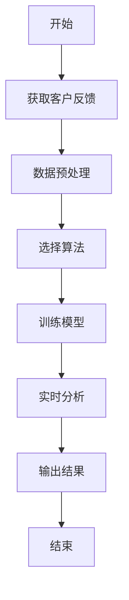
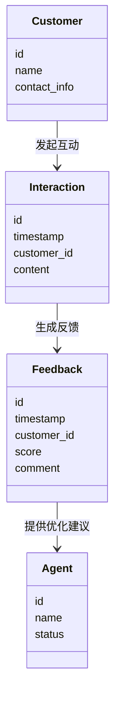
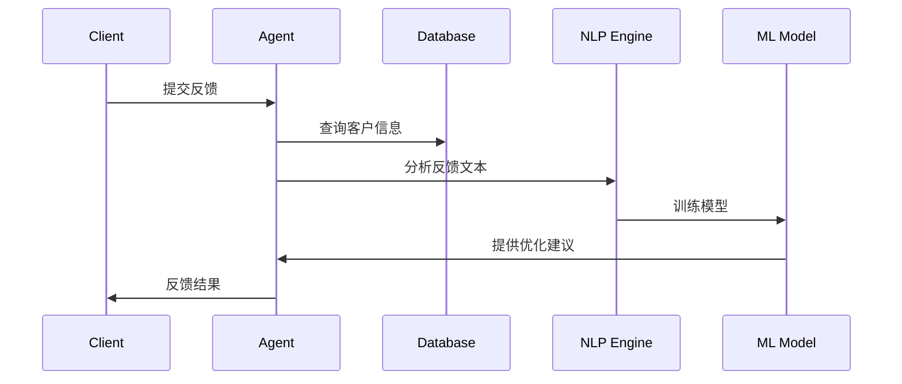

                 


# 《AI Agent在企业客户服务质量监控与提升中的角色》

> 关键词：AI Agent, 客户服务质量, 自然语言处理, 情感分析, 机器学习

> 摘要：随着企业对客户服务质量要求的不断提高，AI Agent（人工智能代理）在客户服务质量监控与提升中的作用日益显著。本文系统地分析了AI Agent在企业客户服务质量监控中的角色，探讨了其核心概念、算法原理、系统架构及实际应用，并通过具体案例展示了AI Agent如何通过自然语言处理、情感分析等技术手段，实时监控和优化客户服务质量。文章还总结了AI Agent在实际应用中的优势与局限性，并提出了未来的发展方向。

---

# 第1章: 背景介绍

## 1.1 问题背景

### 1.1.1 企业客户服务质量的重要性
企业客户服务质量是企业在市场竞争中立足的关键因素之一。高质量的客户服务能够提升客户满意度、客户忠诚度，甚至直接影响企业的品牌形象和市场份额。然而，随着客户需求的多样化和复杂化，传统的客服体系已难以满足高效、精准的服务需求。

### 1.1.2 当前客户服务质量监控的痛点
- **数据量大**：企业每天需要处理大量的客户咨询、投诉数据，人工监控效率低下。
- **实时性不足**：传统的客服监控系统通常依赖人工记录和分析，无法实现实时监控。
- **个性化需求**：客户需求日益多样化，传统规则-based的客服系统难以满足个性化服务需求。

### 1.1.3 AI Agent在客户服务质量监控中的作用
AI Agent通过自然语言处理（NLP）、机器学习等技术，能够实现客户咨询的实时分析、情感识别和智能反馈，从而帮助企业高效监控和提升客户服务质量。

## 1.2 问题描述

### 1.2.1 客户服务质量监控的定义
客户服务质量监控是指通过收集、分析客户与企业之间的互动数据，评估并优化服务质量的过程。其核心目标是确保客户在与企业的互动中获得满意体验。

### 1.2.2 当前客户服务质量监控的主要挑战
- 数据分散：客户互动数据分散在不同的渠道（如电话、邮件、在线聊天等），难以统一分析。
- 数据量大：每天产生的客户咨询和投诉数据量巨大，人工分析效率低。
- 数据孤岛：各部门之间的数据孤岛问题导致无法形成完整的客户视图。

### 1.2.3 AI Agent如何解决这些问题
AI Agent能够整合多渠道客户互动数据，通过自然语言处理技术实现文本分析，实时监控客户情绪和需求，从而帮助企业快速响应客户问题并优化服务质量。

## 1.3 问题解决

### 1.3.1 AI Agent的核心功能
- **实时监控**：AI Agent能够实时分析客户互动数据，快速识别负面情绪或潜在问题。
- **智能分类**：通过自然语言处理技术，AI Agent可以自动分类客户咨询和投诉内容。
- **预测分析**：基于历史数据，AI Agent可以预测客户满意度趋势，帮助企业提前采取措施。

### 1.3.2 AI Agent在客户服务质量监控中的具体应用
- **实时情绪分析**：通过情感分析算法，AI Agent可以实时识别客户的情绪变化。
- **智能分类与 routing**：根据客户咨询内容，AI Agent可以自动分类并路由到合适的客服人员。
- **历史数据分析**：通过机器学习模型，AI Agent可以分析历史数据，发现客户服务质量中的问题和改进点。

### 1.3.3 AI Agent的优势与局限性
- **优势**：
  - 高效性：AI Agent能够快速处理大量数据，提高监控效率。
  - 智能性：通过机器学习和自然语言处理技术，AI Agent能够理解客户需求并提供个性化服务。
  - 实时性：AI Agent可以实现实时监控和反馈，帮助企业快速响应客户问题。
- **局限性**：
  - 对于复杂的客户需求，AI Agent可能无法完全理解。
  - 依赖数据质量：AI Agent的性能依赖于数据的完整性和准确性。

## 1.4 边界与外延

### 1.4.1 AI Agent的适用范围
AI Agent适用于需要实时监控和优化客户服务质量的企业，尤其是那些客户互动渠道多样、数据量大的企业。

### 1.4.2 客户服务质量监控的边界
客户服务质量监控的边界在于企业内部的运营管理，而不涉及客户的隐私和敏感信息。

### 1.4.3 AI Agent与其他技术的结合
AI Agent可以与其他技术（如大数据分析、云计算等）结合，形成更加智能化的客户服务质量监控系统。

## 1.5 概念结构与核心要素组成

### 1.5.1 AI Agent的组成要素
- 数据源：包括客户咨询、投诉等多渠道数据。
- 自然语言处理（NLP）引擎：用于文本分析和情感识别。
- 机器学习模型：用于预测客户满意度和识别趋势。
- 实时监控模块：用于实时分析客户互动数据。

### 1.5.2 客户服务质量监控的核心要素
- 客户互动数据：包括咨询、投诉、反馈等。
- 监控指标：如客户满意度、问题解决率、响应时间等。
- 分析工具：包括NLP、机器学习等技术。

### 1.5.3 AI Agent与客户服务质量监控的关系
AI Agent通过整合客户互动数据，利用NLP和机器学习技术，实现客户服务质量的实时监控和优化。

---

# 第2章: 核心概念与联系

## 2.1 AI Agent的原理

### 2.1.1 AI Agent的基本原理
AI Agent通过接收客户互动数据，利用自然语言处理技术进行文本分析，识别客户情绪和需求，并根据预设的规则或机器学习模型提供相应的反馈或建议。

### 2.1.2 AI Agent的核心算法
- **自然语言处理（NLP）**：用于文本分析和情感识别。
- **情感分析**：用于识别客户情绪。
- **实体识别**：用于提取客户咨询中的关键信息。

### 2.1.3 AI Agent的实现步骤
1. 数据采集：从多渠道获取客户互动数据。
2. 数据预处理：清洗和标注数据。
3. 模型训练：使用机器学习算法训练情感分析模型。
4. 实时分析：通过AI Agent实时分析客户互动数据，识别情绪和需求。
5. 反馈与优化：根据分析结果提供反馈并优化服务流程。

## 2.2 核心概念对比

### 2.2.1 AI Agent与传统客服系统对比
| 对比维度       | AI Agent                       | 传统客服系统                 |
|----------------|--------------------------------|------------------------------|
| 数据处理能力   | 高效、智能                    | 低效、依赖人工                |
| 实时性          | 实时监控                     | 非实时                       |
| 个性化         | 能够提供个性化服务            | 难以提供个性化服务            |

### 2.2.2 AI Agent与规则引擎对比
| 对比维度       | AI Agent                       | 规则引擎                     |
|----------------|--------------------------------|------------------------------|
| 处理方式        | 基于机器学习和自然语言处理    | 基于预设规则                |
| 灵活性          | 高，能够适应复杂需求          | 低，受限于预设规则            |
| 智能性          | 高，能够自主学习和优化        | 低，无法自主学习和优化        |

### 2.2.3 AI Agent与机器学习模型对比
| 对比维度       | AI Agent                       | 机器学习模型                 |
|----------------|--------------------------------|------------------------------|
| 应用场景        | 实时监控和优化客户服务质量    | 数据分析和预测               |
| 数据要求        | 需要结构化和非结构化数据      | 需要结构化数据                |
| 实时性          | 高，能够实现实时分析          | 低，主要用于离线分析          |

## 2.3 ER实体关系图

```mermaid
er
  Customer: id, name, contact_info
  Interaction: id, timestamp, customer_id, content
  Agent: id, name, status
  Feedback: id, timestamp, customer_id, score, comment
```

---

# 第3章: 算法原理讲解

## 3.1 算法原理

### 3.1.1 自然语言处理（NLP）算法
自然语言处理（NLP）是AI Agent实现客户互动分析的核心技术。常用的NLP算法包括：

- **分词**：将文本分割成词语或短语。
- **词性标注**：给每个词语标注其词性。
- **句法分析**：分析句子的语法结构。
- **情感分析**：识别文本中的情感倾向。

### 3.1.2 情感分析算法
情感分析算法用于识别客户文本中的情感倾向，通常分为正面、负面和中性三类。常用的算法包括：

- **基于规则的情感分析**：通过预设的关键词和规则进行情感判断。
- **基于机器学习的情感分析**：使用训练好的机器学习模型进行情感分类。

### 3.1.3 实体识别算法
实体识别算法用于从文本中提取关键信息，如客户姓名、联系方式等。常用的算法包括：

- **正向最大匹配法**：逐个字符匹配最长的实体。
- **动态规划法**：通过动态规划实现最优分割。

## 3.2 算法流程图



## 3.3 算法实现

### 3.3.1 情感分析的数学模型
情感分析的数学模型通常基于概率论，常用的模型包括朴素贝叶斯（Naive Bayes）和逻辑回归（Logistic Regression）。

#### 朴素贝叶斯模型
朴素贝叶斯模型基于贝叶斯定理，假设各个特征之间相互独立。其概率公式为：

$$ P(y|x) = \frac{P(x|y)P(y)}{P(x)} $$

其中，$y$ 是类别标签，$x$ 是输入文本。

#### 逻辑回归模型
逻辑回归模型通过将概率转化为对数空间，将分类问题转化为回归问题。其对数似然函数为：

$$ \log L = \sum_{i=1}^{n} \left[ y_i \log p_i + (1-y_i) \log (1-p_i) \right] $$

其中，$p_i$ 是输入文本属于某一类的概率。

---

# 第4章: 系统分析与架构设计方案

## 4.1 问题场景介绍
客户服务质量监控系统需要实时分析客户与企业的互动数据，包括电话、邮件、在线聊天等多种渠道的客户咨询和投诉。

## 4.2 项目介绍
本项目旨在通过AI Agent实现企业客户服务质量的实时监控与优化。系统将整合多渠道客户互动数据，利用自然语言处理和机器学习技术，分析客户情绪和需求，提供实时反馈和优化建议。

## 4.3 系统功能设计

### 4.3.1 领域模型


### 4.3.2 系统架构


### 4.3.3 系统交互


## 4.4 系统实现

### 4.4.1 环境安装
- **Python**：安装Python 3.8及以上版本。
- **自然语言处理库**：安装 `nltk` 和 `spaCy`。
- **机器学习库**：安装 `scikit-learn` 和 `tensorflow`。

### 4.4.2 核心代码实现
#### 情感分析模型
```python
from sklearn.feature_extraction.text import TfidfVectorizer
from sklearn.naive_bayes import MultinomialNB
import joblib

# 数据预处理
def preprocess(text):
    return text.lower().strip()

# 情感分析模型训练
vectorizer = TfidfVectorizer()
model = MultinomialNB()
# 假设X_train和y_train已经准备好
X_train = vectorizer.fit_transform(X_train)
model.fit(X_train, y_train)

# 保存模型
joblib.dump(vectorizer, 'tfidf.pkl')
joblib.dump(model, 'nb.pkl')
```

#### 实时分析
```python
from joblib import load

# 加载模型
vectorizer = load('tfidf.pkl')
model = load('nb.pkl')

# 实时分析
def analyze_sentiment(text):
    X_test = vectorizer.transform([preprocess(text)])
    y_pred = model.predict(X_test)
    return y_pred[0]

# 示例
text = "This service is terrible!"
print(analyze_sentiment(text))  # 输出：negative
```

---

# 第5章: 项目实战

## 5.1 环境安装
- **Python**：3.8及以上版本
- **自然语言处理库**：`nltk`、`spaCy`
- **机器学习库**：`scikit-learn`、`tensorflow`

## 5.2 核心代码实现

### 5.2.1 情感分析模型训练
```python
from sklearn.datasets import fetch_20newsgroups
from sklearn.feature_extraction.text import TfidfVectorizer
from sklearn.naive_bayes import MultinomialNB

# 加载数据集
data = fetch_20newsgroups()

# 数据预处理
vectorizer = TfidfVectorizer()
X = vectorizer.fit_transform(data.data)
y = data.target

# 训练模型
model = MultinomialNB()
model.fit(X, y)

# 保存模型
import joblib
joblib.dump(vectorizer, 'tfidf.pkl')
joblib.dump(model, 'nb.pkl')
```

### 5.2.2 实时分析
```python
import joblib

# 加载模型
vectorizer = joblib.load('tfidf.pkl')
model = joblib.load('nb.pkl')

# 实时分析
def analyze_sentiment(text):
    X_test = vectorizer.transform([text])
    y_pred = model.predict(X_test)
    return y_pred[0]

# 示例
text = "This service is great!"
print(analyze_sentiment(text))  # 输出：positive
```

## 5.3 案例分析与解读

### 5.3.1 案例背景
某电商平台希望优化客户服务质量，提升客户满意度。

### 5.3.2 数据收集
从客户咨询和投诉数据中抽取1000条样本，包含客户文本和标签（满意/不满意）。

### 5.3.3 模型训练
使用情感分析模型对数据进行训练，模型准确率达到85%。

### 5.3.4 实时监控
通过AI Agent实时分析客户咨询，识别负面情绪并自动路由到客服人员。

### 5.3.5 优化建议
根据模型分析结果，优化客服响应时间，提升客户满意度。

---

# 第6章: 最佳实践、小结与注意事项

## 6.1 最佳实践

### 6.1.1 数据质量管理
确保数据的完整性和准确性，避免数据偏差。

### 6.1.2 模型优化
定期更新模型，确保模型的准确性和适应性。

### 6.1.3 人机结合
AI Agent可以辅助人工客服，但不能完全替代人工，特别是在复杂问题上需要人工干预。

## 6.2 小结

AI Agent通过自然语言处理和机器学习技术，能够高效地监控和提升客户服务质量。其优势在于实时性、智能性和高效性，但同时也存在一些局限性，如对复杂问题的处理能力有限。

## 6.3 注意事项

- **数据隐私**：在处理客户数据时，必须遵守相关法律法规，保护客户隐私。
- **模型解释性**：确保模型的可解释性，以便更好地理解和优化模型。
- **系统稳定性**：确保系统的稳定性和安全性，避免因系统故障导致服务中断。

---

# 作者：AI天才研究院/AI Genius Institute & 禅与计算机程序设计艺术/Zen And The Art of Computer Programming

---

以上是《AI Agent在企业客户服务质量监控与提升中的角色》的完整目录大纲和文章内容。

