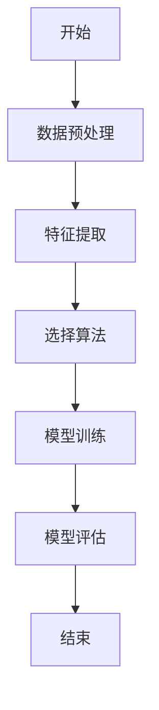
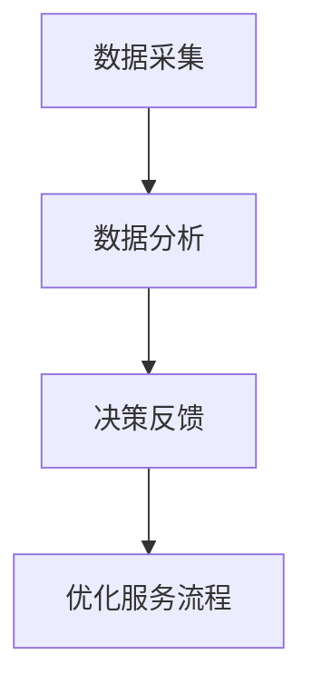

                 


# AI Agent在企业客户服务质量监控与智能升级中的角色

> 关键词：AI Agent，客户服务质量监控，智能升级，服务质量优化，企业客户管理

> 摘要：本文探讨AI Agent在企业客户服务质量监控与智能升级中的应用，通过背景介绍、核心概念、算法原理、系统架构、项目实战和最佳实践等方面，详细阐述AI Agent如何提升客户服务质量，为企业提供智能化解决方案。

---

# 第1章: AI Agent与企业客户服务质量监控概述

## 1.1 问题背景与描述

### 1.1.1 传统客户服务质量监控的挑战
- **数据量大**：企业每天处理大量客户数据，传统方法难以高效处理。
- **实时性不足**：传统监控系统反应较慢，无法实时处理客户问题。
- **人工依赖**：需要大量人工干预，成本高且效率低。

### 1.1.2 AI Agent在客户服务质量监控中的优势
- **自动化处理**：AI Agent能实时监控并自动处理问题。
- **高效决策**：通过机器学习优化决策，提升处理效率。
- **成本降低**：减少人工干预，降低运营成本。

### 1.1.3 企业客户服务质量升级的必要性
- **提升客户满意度**：通过智能监控优化服务流程。
- **增强客户忠诚度**：快速响应客户需求，提升客户体验。
- **提高企业竞争力**：智能化服务成为企业核心竞争力。

## 1.2 AI Agent的核心概念与结构

### 1.2.1 AI Agent的定义与特点
- **定义**：AI Agent是具备感知和自主决策能力的智能体。
- **特点**：实时性、主动性、智能性和适应性。

### 1.2.2 AI Agent在客户服务质量监控中的角色
- **实时监控**：持续监控服务质量，识别潜在问题。
- **智能分析**：利用机器学习分析数据，提供优化建议。
- **自动化处理**：自动响应客户问题，提升服务效率。

### 1.2.3 AI Agent的边界与外延
- **边界**：AI Agent专注于服务质量监控，不涉及其他业务领域。
- **外延**：可扩展至其他领域，如市场营销和产品优化。

## 1.3 本章小结
本章介绍了AI Agent在客户服务质量监控中的背景、优势及角色，为后续章节奠定基础。

---

# 第2章: AI Agent的核心概念与联系

## 2.1 核心概念原理

### 2.1.1 AI Agent的感知与决策机制
- **感知**：通过数据采集和分析感知客户行为。
- **决策**：基于分析结果做出优化决策。

### 2.1.2 AI Agent的自主学习能力
- **监督学习**：利用标记数据训练模型，提升分类准确性。
- **强化学习**：通过奖励机制优化决策策略。

### 2.1.3 AI Agent与传统监控系统的对比
- **数据处理**：传统系统处理结构化数据，AI Agent处理多类型数据。
- **决策能力**：传统依赖人工，AI Agent实现自动化决策。
- **反应速度**：AI Agent实时响应，传统系统较慢。

## 2.2 核心概念属性特征对比表格
| 特性         | 传统监控系统       | AI Agent监控系统    |
|--------------|------------------|-------------------|
| 数据处理能力 | 结构化数据处理     | 结构化+非结构化数据处理 |
| 决策能力     | 人工决策          | 自动化决策         |
| 反应速度     | 较慢             | 实时快速           |
| 可扩展性     | 有限             | 高度可扩展         |

## 2.3 ER实体关系图架构
```mermaid
er
    客户实体 --> 呼叫记录实体
    呼叫记录实体 --> 问题分类实体
    客户实体 --> 服务人员实体
    服务人员实体 --> 呼叫记录实体
```

---

# 第3章: AI Agent的算法原理

## 3.1 算法原理概述

### 3.1.1 监督学习算法
- **线性回归**：用于预测客户满意度评分。
- **随机森林**：分类客户问题类型。

### 3.1.2 强化学习算法
- **Q-Learning**：优化服务流程决策。

## 3.2 算法流程图


## 3.3 算法实现代码示例

```python
import numpy as np
from sklearn.ensemble import RandomForestClassifier
from sklearn.metrics import accuracy_score

# 数据预处理
X = np.array([[...], [...]])
y = np.array([...])

# 特征提取
X_train, X_test, y_train, y_test = train_test_split(X, y, test_size=0.2)

# 模型训练
model = RandomForestClassifier()
model.fit(X_train, y_train)

# 模型评估
y_pred = model.predict(X_test)
print("准确率:", accuracy_score(y_test, y_pred))
```

## 3.4 数学模型与公式

### 3.4.1 线性回归模型
$$ y = \beta_0 + \beta_1x_1 + \beta_2x_2 + ... + \beta_nx_n + \epsilon $$

### 3.4.2 随机森林分类
- **特征重要性**：通过特征选择优化分类准确率。

---

# 第4章: AI Agent的系统架构设计

## 4.1 系统架构概述

### 4.1.1 问题场景介绍
- **实时监控**：需实时处理大量客户数据。
- **多模块协作**：集成数据采集、分析和反馈模块。

### 4.1.2 系统功能设计
- 数据采集模块：收集客户互动数据。
- 数据分析模块：利用机器学习分析数据。
- 决策反馈模块：根据分析结果优化服务流程。

## 4.2 系统架构设计图


## 4.3 系统接口设计
- **输入接口**：接收客户数据和反馈。
- **输出接口**：提供分析结果和优化建议。

---

# 第5章: 项目实战

## 5.1 项目介绍
- **项目目标**：提升客户服务质量。
- **项目环境**：安装Python、机器学习库。

## 5.2 核心代码实现

```python
import pandas as pd
from sklearn.model_selection import train_test_split
from sklearn.metrics import classification_report

# 数据加载
data = pd.read_csv('customer_service.csv')

# 数据预处理
X = data.drop('label', axis=1)
y = data['label']

# 分割数据集
X_train, X_test, y_train, y_test = train_test_split(X, y, test_size=0.2)

# 模型训练
model = RandomForestClassifier()
model.fit(X_train, y_train)

# 模型预测
y_pred = model.predict(X_test)

# 模型评估
print(classification_report(y_test, y_pred))
```

## 5.3 案例分析与总结
- **案例分析**：通过实际数据展示模型效果。
- **总结**：AI Agent显著提升客户满意度和处理效率。

---

# 第6章: 最佳实践与小结

## 6.1 小结
- AI Agent通过智能化手段显著提升客户服务质量。
- 企业应结合自身需求选择合适的AI Agent方案。

## 6.2 注意事项
- 数据隐私保护：确保客户数据安全。
- 模型优化：持续更新模型以适应新数据。

## 6.3 拓展阅读
- 推荐阅读《机器学习实战》和《深度学习》。

---

# 作者：AI天才研究院/AI Genius Institute & 禅与计算机程序设计艺术 /Zen And The Art of Computer Programming

