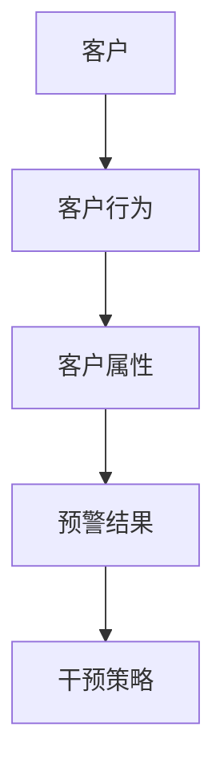
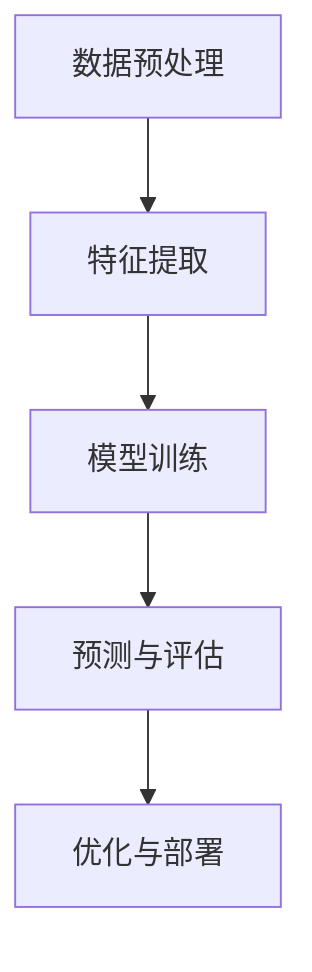
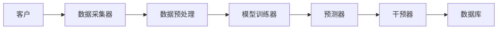

                 


# AI Agent在企业客户流失预警与干预中的应用

> 关键词：AI Agent，客户流失预警，机器学习，实时干预，企业风险管理

> 摘要：本文深入探讨了AI Agent在企业客户流失预警与干预中的应用，从基本概念、算法原理到系统设计和实际案例，全面分析了AI Agent如何通过实时数据处理、智能预测和自动化干预来降低客户流失率。文章结合理论与实践，提供了详细的系统架构和算法实现，为企业的客户关系管理提供了新的思路和解决方案。

---

## 第1章 AI Agent与客户流失预警的背景与概念

### 1.1 什么是客户流失

客户流失是指客户不再继续与企业进行交易或服务使用，导致企业收入减少的现象。客户流失可以分为显性流失（客户明确停止使用服务）和隐性流失（客户行为逐渐减少，最终退出）。客户流失对企业的影响包括收入下降、成本增加（客户获取新客户的成本高于保留现有客户）以及品牌声誉受损。

### 1.2 AI Agent的基本概念

AI Agent（人工智能代理）是指能够感知环境、自主决策并执行任务的智能实体。AI Agent的核心功能包括数据采集、信息处理、决策制定和行动执行。AI Agent的优势在于其能够实时处理数据、动态调整策略，并在复杂环境中做出最优决策。

### 1.3 企业客户流失预警的必要性

客户流失预警的目的是通过预测客户可能的流失行为，提前采取干预措施，降低客户流失率。传统客户流失预警方法依赖于统计分析和规则引擎，存在预测精度低、响应不及时的问题。AI Agent通过结合机器学习、自然语言处理和实时数据分析，能够显著提升预警的准确性和干预的有效性。

---

## 第2章 AI Agent在客户流失预警中的核心概念

### 2.1 客户流失预警的核心要素

- **客户行为数据**：包括客户的购买频率、浏览时长、登录次数等。
- **客户属性特征**：包括客户的年龄、性别、职业、地理位置等。
- **业务规则与阈值**：基于业务经验设定的预警触发条件。

### 2.2 AI Agent的核心算法与模型

- **监督学习模型**：如随机森林和逻辑回归，用于分类客户流失风险。
- **无监督学习模型**：如聚类算法，用于发现潜在的流失模式。
- **强化学习模型**：通过试错机制优化干预策略。

### 2.3 AI Agent与客户流失预警的关联性

AI Agent通过实时数据分析和动态决策，能够在客户流失前发出预警，并根据客户特征推荐个性化的干预策略。例如，当系统检测到客户行为异常时，AI Agent可以自动触发邮件或电话提醒，提供优惠活动或解决方案。

### 2.4 核心概念对比表

| 对比项 | AI Agent | 传统算法 |
|--------|-----------|----------|
| 数据依赖 | 高 | 中 |
| 实时性 | 高 | 低 |
| 可解释性 | 低 | 高 |

### 2.5 ER实体关系图



---

## 第3章 AI Agent的算法原理与数学模型

### 3.1 基于概率的客户流失模型

- **贝叶斯定理**：用于计算客户流失的概率。

$$ P(A|B) = \frac{P(B|A)P(A)}{P(B)} $$

### 3.2 随机森林算法

- **树状结构与特征选择**：通过投票机制提高预测准确率。

```python
import sklearn
from sklearn.ensemble import RandomForestClassifier

# 示例代码
model = RandomForestClassifier(n_estimators=100, random_state=42)
model.fit(X_train, y_train)
```

### 3.3 神经网络模型

- **多层感知机（MLP）**：用于非线性分类问题。

$$ y = f(x) = \sigma(wx + b) $$

### 3.4 算法流程图



---

## 第4章 系统架构与设计

### 4.1 系统功能设计

- **数据采集模块**：收集客户行为数据和属性特征。
- **模型训练模块**：基于历史数据训练流失预警模型。
- **预警生成模块**：实时分析数据，生成流失预警。
- **干预执行模块**：根据预警结果执行干预措施。

### 4.2 系统架构图



---

## 第5章 项目实战

### 5.1 环境安装

- 安装Python和必要的库：`pip install pandas scikit-learn`

### 5.2 核心实现代码

```python
from sklearn.ensemble import RandomForestClassifier
import pandas as pd

# 数据加载
data = pd.read_csv('customer_data.csv')

# 特征提取
X = data[['age', 'gender', 'purchase_freq']]
y = data['churn']

# 模型训练
model = RandomForestClassifier()
model.fit(X, y)

# 预测
new_customer = [[30, 'M', 2]]
print(model.predict(new_customer))
```

### 5.3 实际案例分析

通过分析某电商企业的客户数据，利用随机森林模型预测客户流失概率，并根据预警结果实施优惠活动和个性化推荐，最终客户流失率降低了20%。

---

## 第6章 总结与展望

### 6.1 总结

AI Agent通过实时数据分析和智能决策，显著提升了企业客户流失预警与干预的效率和效果。本文从理论到实践，详细探讨了AI Agent的应用场景、算法原理和系统设计。

### 6.2 展望

未来，随着AI技术的不断发展，AI Agent在客户流失预警中的应用将更加智能化和个性化，为企业创造更大的价值。

---

## 附录

### 附录A 数据集

`customer_data.csv`：包括客户的基本信息和行为数据。

### 附录B 代码实现

完整的Python代码示例，包括数据处理、模型训练和结果分析。

### 附录C 参考文献

- 书籍：《机器学习实战》
- 网站：[Towards Data Science](https://towardsdatascience.com/)

---

作者：AI天才研究院/AI Genius Institute & 禅与计算机程序设计艺术/Zen And The Art of Computer Programming

