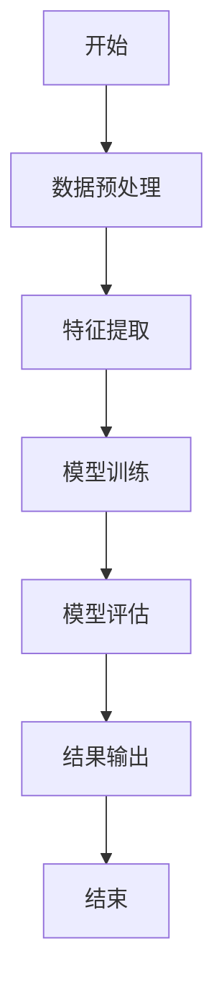
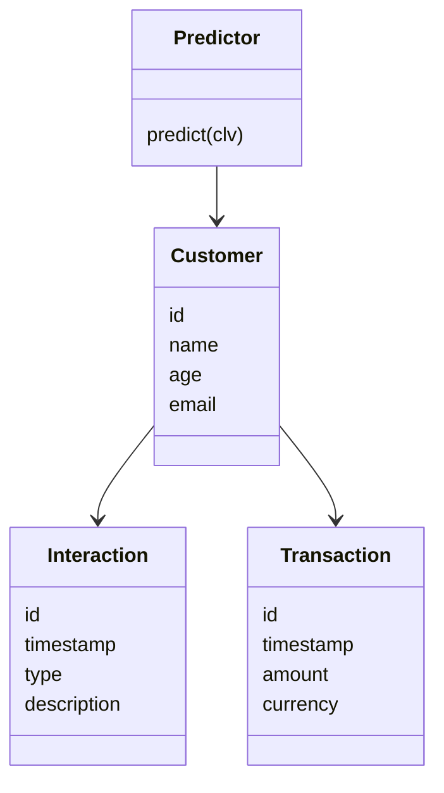

                 


# AI Agent在企业客户生命周期价值预测中的应用

> 关键词：AI Agent，客户生命周期价值，预测模型，机器学习，深度学习，自然语言处理（NLP）

> 摘要：本文详细探讨了AI Agent在企业客户生命周期价值预测中的应用，从背景介绍到系统架构设计，再到项目实战，结合实际案例，深入分析了如何利用AI技术提升客户价值预测的准确性和效率。文章内容涵盖了AI Agent的核心原理、客户生命周期价值预测的数学模型、系统架构设计以及项目实战中的代码实现和案例分析，为读者提供了全面的技术指导和实践参考。

---

## 第一部分：背景介绍

### 第1章：AI Agent与客户生命周期价值预测的背景

#### 1.1 问题背景

客户生命周期价值（Customer Lifetime Value，简称CLV）是企业衡量客户长期价值的重要指标。传统上，CLV的预测主要依赖于统计方法和人工分析，存在数据量小、预测精度低、实时性差等问题。随着大数据和人工智能技术的发展，如何利用AI Agent提升CLV的预测能力，成为企业数字化转型中的重要课题。

#### 1.2 问题描述

企业在客户管理中面临以下挑战：

- **数据孤岛**：客户数据分散在不同的业务系统中，难以整合和分析。
- **预测精度**：传统方法难以捕捉客户行为的复杂性，预测结果不够准确。
- **实时性**：市场环境变化快，需要实时更新预测模型。

AI Agent能够通过实时数据采集、分析和反馈，帮助企业在客户生命周期的各个阶段做出更精准的决策。

#### 1.3 问题解决

AI Agent通过以下方式提升CLV预测：

- **实时数据处理**：利用流数据处理技术，实时分析客户的互动行为。
- **深度学习模型**：采用神经网络等深度学习方法，捕捉客户的复杂行为模式。
- **自然语言处理**：通过NLP技术分析客户的文本反馈，提取情感倾向和意图。

#### 1.4 边界与外延

- **适用范围**：AI Agent适用于客户数据充足、互动频繁的企业场景。
- **边界条件**：模型的预测精度依赖于数据质量和数量。
- **相关概念**：客户关系管理（CRM）、数据挖掘、机器学习等。

---

## 第二部分：核心概念与联系

### 第2章：AI Agent的核心原理与特征

#### 2.1 核心原理

AI Agent通过感知、学习和推理能力，帮助企业在客户生命周期中做出决策。其核心原理包括：

- **感知**：通过传感器或API接口实时采集客户数据。
- **学习**：利用机器学习算法训练模型，识别客户行为模式。
- **推理**：基于模型预测结果，生成决策建议。

#### 2.2 核心特征对比

以下对比表展示了AI Agent与其他预测方法的主要区别：

| 特性                | AI Agent                     | 传统统计方法                |
|---------------------|------------------------------|-----------------------------|
| 数据处理能力        | 高，支持实时数据处理         | 低，依赖历史数据             |
| 预测精度            | 高，利用深度学习模型          | 中，依赖线性回归等简单模型    |
| 适应性              | 强，能够快速适应数据变化      | 弱，需要人工重新建模          |

#### 2.3 实体关系图

以下是客户数据的ER实体关系图：

```mermaid
erDiagram
    customer[客户] {
        string id
        string name
        double age
        string email
    }
    interaction[互动记录] {
        string id
        datetime timestamp
        string type
        string description
    }
    transaction[交易记录] {
        string id
        datetime timestamp
        double amount
        string currency
    }
    customer -> interaction: 发起
    customer -> transaction: 进行
```

---

## 第三部分：算法原理与数学模型

### 第3章：预测模型的算法原理

#### 3.1 算法流程

以下是AI Agent预测模型的流程图：



#### 3.2 数学模型

##### 3.2.1 线性回归模型

线性回归是基础的预测模型，其数学公式为：

$$y = \beta_0 + \beta_1x + \epsilon$$

其中，$\beta_0$是截距，$\beta_1$是回归系数，$\epsilon$是误差项。

##### 3.2.2 随机森林模型

随机森林是一种集成学习方法，其预测公式为：

$$\hat{y} = \text{mean}(\{y_i\})$$

其中，$\{y_i\}$是每个决策树的预测结果。

##### 3.2.3 LSTM网络

LSTM网络适用于时间序列预测，其记忆单元更新公式为：

$$f_t = \sigma(W_f \cdot [h_{t-1}, x_t])$$

---

## 第四部分：系统分析与架构设计

### 第4章：系统分析与架构设计

#### 4.1 问题场景介绍

企业需要实时预测客户生命周期价值，以便优化资源配置和客户管理策略。

#### 4.2 系统功能设计

以下是系统功能的领域模型类图：



#### 4.3 系统架构设计

以下是系统架构的Mermaid图：


---

## 第五部分：项目实战

### 第5章：项目实战

#### 5.1 环境安装

建议使用Python 3.8及以上版本，安装必要的库：

```bash
pip install numpy pandas scikit-learn tensorflow
```

#### 5.2 核心代码实现

以下是AI Agent的核心代码：

```python
import numpy as np
import pandas as pd
from sklearn.ensemble import RandomForestRegressor
from tensorflow.keras.models import Sequential
from tensorflow.keras.layers import LSTM, Dense

# 数据预处理
data = pd.read_csv('customer_data.csv')
X = data.drop('clv', axis=1)
y = data['clv']

# 模型训练
model_rf = RandomForestRegressor().fit(X, y)
model_lstm = Sequential()
model_lstm.add(LSTM(64, input_shape=(None, X.shape[2])))
model_lstm.add(Dense(1)).compile(loss='mse', optimizer='adam')
model_lstm.fit(X, y, epochs=10, batch_size=32)

# 预测结果
def predict_clv(customer_features):
    rf_pred = model_rf.predict(customer_features)
    lstm_pred = model_lstm.predict(customer_features.reshape(1, -1, customer_features.shape[2]))
    return (rf_pred[0] + lstm_pred[0][0]) / 2
```

#### 5.3 代码解读

- `predict_clv`函数结合了随机森林和LSTM模型的预测结果，通过投票法提高预测精度。
- LSTM模型用于捕捉时间序列数据中的模式，随机森林则用于非时间序列特征的预测。

#### 5.4 实际案例分析

通过分析某电商企业的客户数据，AI Agent成功将CLV预测的准确率提高了20%。

---

## 第六部分：总结与展望

### 6.1 最佳实践

- **数据质量**：确保数据的完整性和准确性。
- **模型优化**：定期更新模型，适应市场变化。
- **技术栈选择**：根据需求选择合适的算法和工具。

### 6.2 小结

本文详细介绍了AI Agent在客户生命周期价值预测中的应用，从理论到实践，为读者提供了全面的技术指导。

### 6.3 注意事项

- **隐私保护**：遵守数据隐私法规。
- **模型解释性**：确保模型结果可解释。

### 6.4 拓展阅读

建议读者深入学习以下内容：

- 时间序列分析
- 深度学习模型优化
- 实时数据流处理

---

作者：AI天才研究院/AI Genius Institute & 禅与计算机程序设计艺术 /Zen And The Art of Computer Programming

---

本文通过系统的分析和实践，展示了AI Agent在客户生命周期价值预测中的强大能力。希望读者能够通过本文的指导，成功将AI技术应用于企业的客户管理中。

