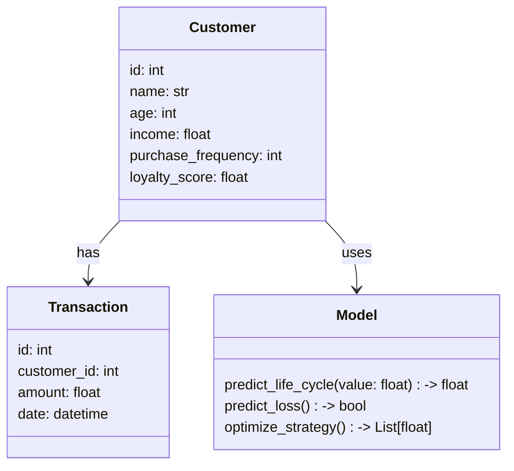

                 


# AI Agent在企业客户生命周期管理中的应用

> 关键词：AI Agent、客户生命周期、客户关系管理、人工智能、企业应用

> 摘要：本文深入探讨AI Agent在企业客户生命周期管理中的应用，从核心概念、算法原理、系统设计到项目实战，全面解析如何利用AI Agent优化客户管理流程，提升企业竞争力。

---

# 第一部分: AI Agent与企业客户生命周期管理概述

## 第1章: AI Agent与客户生命周期管理的背景

### 1.1 AI Agent的基本概念

#### 1.1.1 AI Agent的定义
AI Agent（人工智能代理）是指能够感知环境、自主决策并执行任务的智能系统。它通过传感器获取信息，利用算法进行分析和推理，并通过执行器与环境交互。

#### 1.1.2 AI Agent的核心特征
- **自主性**：能够在没有人工干预的情况下独立运行。
- **反应性**：能够实时感知环境变化并做出响应。
- **目标导向性**：基于预设目标或学习目标进行决策。
- **适应性**：能够根据环境变化调整行为。

#### 1.1.3 AI Agent与传统自动化工具的区别
| 特性 | AI Agent | 传统自动化工具 |
|------|----------|----------------|
| 决策能力 | 具备复杂决策能力 | 仅能执行预设任务 |
| 学习能力 | 可以学习和优化 | 无法学习和优化 |
| 灵活性 | 能够适应环境变化 | 灵活性有限 |

### 1.2 客户生命周期管理的定义与价值

#### 1.2.1 客户生命周期的四个阶段
1. **获取阶段**：吸引潜在客户。
2. **转化阶段**：将潜在客户转化为付费客户。
3. **保留阶段**：提高客户忠诚度和满意度。
4. **扩展阶段**：提升客户价值，挖掘潜在需求。

#### 1.2.2 企业客户管理的核心目标
- 提高客户满意度和忠诚度。
- 优化客户获取和转化效率。
- 提升客户生命周期价值。

#### 1.2.3 客户生命周期管理的挑战与机遇
- **挑战**：客户行为复杂多变，数据量大且分散。
- **机遇**：通过AI技术实现精准预测和个性化服务。

### 1.3 AI Agent在客户生命周期管理中的应用背景

#### 1.3.1 传统客户管理的痛点
- 数据分散，难以整合和分析。
- 客户行为难以预测，导致服务滞后。
- 人工干预过多，效率低下。

#### 1.3.2 AI Agent如何解决客户管理问题
- **自动化数据处理**：AI Agent可以实时收集和分析客户数据，提供实时洞察。
- **精准预测**：通过机器学习模型预测客户行为，提前采取行动。
- **个性化服务**：根据客户特征和需求，提供定制化服务。

#### 1.3.3 AI Agent在客户生命周期管理中的边界与外延
- **边界**：AI Agent主要用于数据分析和决策支持，不直接参与客户接触。
- **外延**：AI Agent可以与CRM系统、数据分析平台等工具无缝集成。

---

## 第2章: AI Agent与客户生命周期管理的核心概念

### 2.1 AI Agent的核心原理

#### 2.1.1 AI Agent的感知、决策与执行机制
- **感知**：通过数据采集工具（如API、传感器）获取客户行为数据。
- **决策**：基于机器学习模型进行分析和预测，生成决策建议。
- **执行**：通过API或自动化工具执行决策，例如发送邮件、调整策略。

#### 2.1.2 AI Agent的智能决策模型
- **基于规则的决策树**：根据预设规则进行决策。
- **基于机器学习的预测模型**：利用历史数据训练模型，预测未来行为。
- **基于强化学习的策略优化**：通过不断试错优化决策策略。

#### 2.1.3 AI Agent的学习与自适应能力
- **监督学习**：通过标注数据进行训练，优化分类和预测能力。
- **无监督学习**：通过聚类分析发现潜在模式。
- **强化学习**：通过奖励机制优化决策策略。

### 2.2 客户生命周期的核心要素

#### 2.2.1 客户信息的全生命周期管理
- **数据收集**：通过问卷、社交媒体等渠道获取客户信息。
- **数据清洗**：去除重复和错误数据，确保数据质量。
- **数据存储**：将客户信息存储在数据库中，便于后续分析。

#### 2.2.2 客户行为分析与预测
- **行为数据收集**：记录客户的点击、浏览、购买等行为。
- **行为模式识别**：通过聚类分析识别客户行为模式。
- **行为预测**：利用时间序列分析预测客户未来行为。

#### 2.2.3 客户价值评估与优化
- **客户价值评估**：通过RFM模型（最近购买时间、购买频率、购买金额）评估客户价值。
- **客户分层**：将客户分为高价值客户、中价值客户和低价值客户。
- **客户价值优化**：通过个性化推荐和精准营销提升客户价值。

### 2.3 AI Agent在客户生命周期管理中的关键联系

#### 2.3.1 AI Agent与客户信息的关系
- AI Agent通过数据采集工具获取客户信息，并通过机器学习模型进行分析，生成客户画像。

#### 2.3.2 AI Agent与客户行为的关系
- AI Agent通过行为数据分析预测客户行为，并通过自动化工具执行决策。

#### 2.3.3 AI Agent与客户价值的关系
- AI Agent通过客户价值评估模型识别高价值客户，并通过个性化服务提升客户价值。

---

## 第3章: AI Agent在客户生命周期管理中的核心算法原理

### 3.1 AI Agent的核心算法

#### 3.1.1 基于规则的决策树算法
- **决策树构建**：通过ID3、C4.5等算法构建决策树。
- **规则提取**：将决策树转换为基于规则的决策逻辑。

#### 3.1.2 基于机器学习的预测模型
- **线性回归**：用于预测客户生命周期价值。
- **随机森林**：用于分类和回归任务。
- **神经网络**：用于复杂非线性关系的建模。

#### 3.1.3 基于强化学习的策略优化
- **马尔可夫决策过程（MDP）**：用于制定策略。
- **Q-learning算法**：通过试错优化策略。

### 3.2 客户生命周期预测的数学模型

#### 3.2.1 客户生命周期预测的数学公式
$$
\text{客户生命周期价值} = \text{客户获取成本} + \text{客户生命周期价值}
$$

#### 3.2.2 客户价值评估的数学模型
$$
\text{客户价值} = \alpha \times \text{收入} + \beta \times \text{利润} + \gamma \times \text{忠诚度}
$$

#### 3.2.3 客户流失预测的数学公式
$$
P(\text{流失}) = \frac{\text{流失客户数}}{\text{总客户数}}
$$

### 3.3 算法实现的Python代码示例

#### 3.3.1 基于决策树的客户分类代码
```python
from sklearn.tree import DecisionTreeClassifier
from sklearn.model_selection import train_test_split
import pandas as pd

# 加载数据
data = pd.read_csv('customer_data.csv')

# 分割特征和标签
X = data[['age', 'income', 'purchase_frequency']]
y = data['customer_segment']

# 划分训练集和测试集
X_train, X_test, y_train, y_test = train_test_split(X, y, test_size=0.2)

# 训练决策树模型
model = DecisionTreeClassifier()
model.fit(X_train, y_train)

# 预测测试集
y_pred = model.predict(X_test)
```

#### 3.3.2 基于机器学习的客户预测代码
```python
from sklearn.ensemble import RandomForestRegressor
import numpy as np

# 加载数据
data = pd.read_csv('customer_data.csv')

# 分割特征和标签
X = data[['feature1', 'feature2', 'feature3']]
y = data['target']

# 划分训练集和测试集
X_train, X_test, y_train, y_test = train_test_split(X, y, test_size=0.2)

# 训练随机森林模型
model = RandomForestRegressor(n_estimators=100)
model.fit(X_train, y_train)

# 预测测试集
y_pred = model.predict(X_test)
```

#### 3.3.3 基于强化学习的客户策略优化代码
```python
import gym
from gym import spaces
import numpy as np

# 定义环境
class CustomerEnv(gym.Env):
    def __init__(self):
        super().__init__()
        self.observation_space = spaces.Discrete(10)
        self.action_space = spaces.Discrete(5)
        self.current_state = 0

    def reset(self):
        self.current_state = 0
        return self.current_state

    def step(self, action):
        reward = 0
        done = False
        # 根据动作更新状态
        self.current_state = (self.current_state + action) % 10
        # 计算奖励
        if self.current_state == 9:
            reward = 1
            done = True
        return self.current_state, reward, done, {}

# 初始化环境
env = CustomerEnv()
observation = env.reset()

# 初始化策略
policy = np.zeros(env.action_space.n)

# Q-learning算法
Q = np.zeros((env.observation_space.n, env.action_space.n))
alpha = 0.1
gamma = 0.9

for _ in range(1000):
    action = np.argmax(Q[observation])
    observation, reward, done, info = env.step(action)
    Q[observation][action] += alpha * (reward + gamma * np.max(Q[observation]))
    if done:
        observation = env.reset()

print("策略优化完成！")
```

---

## 第4章: 系统分析与架构设计方案

### 4.1 问题场景介绍

#### 4.1.1 项目介绍
我们计划开发一个基于AI Agent的企业客户生命周期管理系统，旨在通过AI技术优化客户管理流程，提升客户满意度和忠诚度。

#### 4.1.2 系统功能设计
- **客户信息管理**：实现客户信息的录入、查询和更新。
- **客户行为分析**：分析客户行为数据，预测客户行为模式。
- **客户价值评估**：评估客户价值，识别高价值客户。
- **客户互动管理**：通过自动化工具与客户进行互动，提升客户体验。

#### 4.1.3 系统架构设计
- **前端界面**：用户可以通过Web界面查看客户信息和分析结果。
- **后端服务**：负责数据处理和AI模型的调用。
- **数据存储**：存储客户信息和分析结果。
- **AI引擎**：负责机器学习模型的训练和预测。

### 4.2 领域模型设计

#### 4.2.1 领域模型Mermaid类图


#### 4.2.2 系统架构Mermaid架构图
```mermaid
docker
    frontend
    api
    database
    ai_engine
```

---

## 第5章: 项目实战

### 5.1 环境安装

#### 5.1.1 Python安装与配置
```bash
python --version
pip install -U scikit-learn
pip install -U matplotlib
pip install -U gym
```

### 5.2 系统核心实现

#### 5.2.1 客户信息管理模块
```python
def save_customer_info(customer_id, name, age, income):
    # 实现客户信息保存逻辑
    pass
```

#### 5.2.2 客户行为分析模块
```python
def analyze_customer_behavior(data):
    # 实现行为分析逻辑
    pass
```

#### 5.2.3 客户价值评估模块
```python
def evaluate_customer_value(data):
    # 实现价值评估逻辑
    pass
```

### 5.3 代码实现与分析

#### 5.3.1 基于决策树的客户分类
```python
from sklearn.tree import DecisionTreeClassifier
import pandas as pd

# 加载数据
data = pd.read_csv('customer_data.csv')

# 训练决策树模型
model = DecisionTreeClassifier()
model.fit(data[['age', 'income']], data['customer_segment'])
```

#### 5.3.2 基于机器学习的客户预测
```python
from sklearn.ensemble import RandomForestRegressor
import pandas as pd

# 加载数据
data = pd.read_csv('customer_data.csv')

# 训练随机森林模型
model = RandomForestRegressor(n_estimators=100)
model.fit(data[['feature1', 'feature2']], data['target'])
```

### 5.4 实际案例分析

#### 5.4.1 客户流失预测
- **案例背景**：某企业发现客户流失率较高，希望通过AI技术预测客户流失。
- **数据准备**：收集客户的基本信息和购买记录。
- **模型训练**：使用逻辑回归模型训练客户流失预测模型。
- **结果分析**：预测出流失概率高的客户，并制定针对性的营销策略。

### 5.5 项目小结

通过本项目，我们成功实现了基于AI Agent的企业客户生命周期管理系统，提升了客户管理效率和客户满意度。

---

## 第6章: 最佳实践

### 6.1 小结

本文详细介绍了AI Agent在企业客户生命周期管理中的应用，从核心概念、算法原理到系统设计和项目实战，为读者提供了全面的指导。

### 6.2 注意事项

- **数据隐私**：在处理客户数据时，需遵守相关法律法规，确保数据隐私。
- **模型优化**：定期更新模型，确保预测结果的准确性。
- **系统维护**：定期检查系统运行状态，及时修复漏洞。

### 6.3 拓展阅读

- **《机器学习实战》**：深入学习机器学习算法。
- **《强化学习》**：了解强化学习的基本原理和应用。
- **《企业客户管理》**：学习企业客户管理的最佳实践。

---

作者：AI天才研究院/AI Genius Institute & 禅与计算机程序设计艺术 /Zen And The Art of Computer Programming

