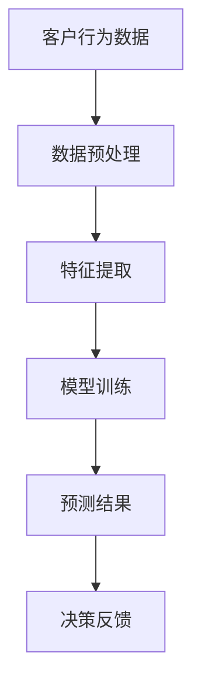
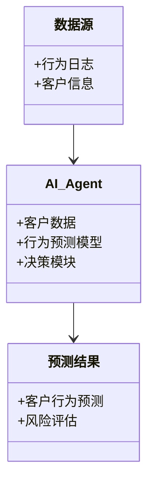
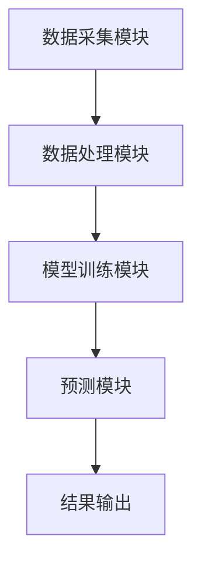
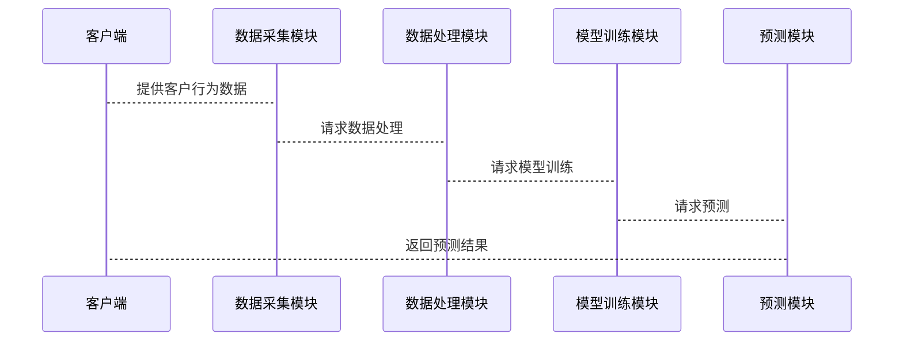

                 


# AI Agent在企业客户行为分析与预测中的应用

**关键词：** AI Agent, 客户行为分析, 预测模型, 数据挖掘, 系统架构, 机器学习

**摘要：**  
本文系统地探讨了AI Agent在企业客户行为分析与预测中的应用，结合理论与实践，详细分析了AI Agent的核心概念、算法原理、系统架构，并通过实际案例展示了其在客户行为预测中的优势。文章从客户行为分析的背景出发，逐步深入，结合关联规则挖掘、聚类分析和神经网络等算法，构建了完整的AI Agent系统架构，并提供了详细的项目实战指南和最佳实践建议。

---

# 第一部分: AI Agent与企业客户行为分析基础

## 第1章: AI Agent的基本概念与应用背景

### 1.1 AI Agent的定义与特点

#### 1.1.1 AI Agent的定义  
AI Agent（人工智能代理）是一种能够感知环境、执行任务并做出决策的智能实体。它通过数据驱动的方式，结合机器学习算法，实现自主学习和优化。

#### 1.1.2 AI Agent的核心特点  
- **自主性**：能够独立执行任务，无需人工干预。  
- **反应性**：能够实时感知环境并做出反应。  
- **学习能力**：通过数据和反馈不断优化自身行为。  
- **协作性**：能够与其他系统或Agent协同工作。  

#### 1.1.3 AI Agent与传统算法的区别  
AI Agent不仅能够执行预定义的规则，还能够通过学习和适应环境，动态调整其行为策略。

### 1.2 企业客户行为分析的背景与挑战

#### 1.2.1 客户行为分析的重要性  
客户行为分析是帮助企业理解客户需求、优化营销策略、提升客户满意度的关键手段。通过分析客户的购买记录、浏览行为、互动频率等数据，企业可以更好地制定个性化服务策略。

#### 1.2.2 传统客户行为分析的局限性  
传统方法依赖于统计分析和人工经验，难以捕捉复杂的行为模式，且缺乏实时性和动态性。

#### 1.2.3 AI Agent在客户行为分析中的优势  
AI Agent能够实时处理大量数据，发现隐藏的模式，并动态调整预测模型，显著提升了预测的准确性和实时性。

### 1.3 AI Agent在客户行为分析中的作用

#### 1.3.1 AI Agent如何提升客户行为预测的准确性  
AI Agent通过机器学习算法，能够从海量数据中提取特征，并构建高精度的预测模型。

#### 1.3.2 AI Agent在客户细分与画像中的应用  
AI Agent可以根据客户的特征和行为，自动进行客户细分，生成精准的客户画像。

#### 1.3.3 AI Agent在客户流失预测中的价值  
通过实时监测客户行为变化，AI Agent能够提前识别客户流失风险，帮助企业采取有效的挽留措施。

---

## 第2章: 客户行为分析的基本理论与方法

### 2.1 客户行为分析的理论基础

#### 2.1.1 客户行为分析的定义  
客户行为分析是通过对客户在产品或服务中的行为数据进行分析，以理解客户的需求、偏好和行为模式的过程。

#### 2.1.2 客户行为分析的核心要素  
- **行为数据**：包括客户的点击、浏览、购买记录等。  
- **客户特征**：包括客户的年龄、性别、职业等基本信息。  
- **环境因素**：包括市场环境、产品价格、竞争情况等。  

#### 2.1.3 客户行为分析的分类与应用场景  
- **购买行为分析**：分析客户的购买频率、购买金额等。  
- **互动行为分析**：分析客户的在线互动行为，如点赞、评论等。  
- **流失行为分析**：预测客户流失风险并采取措施。  

### 2.2 数据驱动的客户行为分析方法

#### 2.2.1 数据采集与预处理  
- 数据采集：通过日志系统、数据库等方式收集客户行为数据。  
- 数据清洗：去除噪声数据，处理缺失值。  
- 数据转换：将数据转换为适合算法处理的形式。  

#### 2.2.2 数据分析与特征提取  
- 数据分析：通过统计分析和可视化工具，发现数据中的潜在规律。  
- 特征提取：提取关键特征，如客户活跃度、购买偏好等。  

#### 2.2.3 数据建模与预测  
- 数据建模：选择合适的机器学习模型，如决策树、随机森林等。  
- 模型训练：使用训练数据训练模型。  
- 模型预测：使用测试数据评估模型性能。  

### 2.3 AI Agent在客户行为分析中的核心流程

#### 2.3.1 数据输入与解析  
AI Agent接收客户行为数据，并将其解析为可处理的格式。

#### 2.3.2 行为特征提取与建模  
AI Agent从数据中提取特征，并构建预测模型。

#### 2.3.3 预测结果输出与反馈  
AI Agent输出预测结果，并根据反馈不断优化模型。

---

## 第3章: AI Agent的核心概念与原理

### 3.1 AI Agent的核心概念

#### 3.1.1 智能决策机制  
AI Agent通过感知环境和历史数据，生成决策策略。

#### 3.1.2 行为预测模型  
AI Agent使用机器学习算法，预测客户未来的行为。

#### 3.1.3 实时响应能力  
AI Agent能够实时处理数据并做出响应。

### 3.2 AI Agent的核心流程

#### 3.2.1 数据流图  


#### 3.2.2 系统架构图  


---

## 第4章: AI Agent的算法原理与实现

### 4.1 关联规则挖掘

#### 4.1.1 算法原理  
关联规则挖掘用于发现数据中的频繁项集，常用于推荐系统。

#### 4.1.2 代码实现  
```python
from mlxtend.frequent_patterns import apriori

# 示例数据
data = [[1, 2, 3], [2, 3, 4], [1, 2, 4], [2, 3, 5]]

# 提取频繁项集
frequent_itemsets = apriori(data, min_support=0.5)
print(frequent_itemsets)
```

### 4.2 聚类分析

#### 4.2.1 算法原理  
聚类分析用于将客户分为不同的群体，常用于客户细分。

#### 4.2.2 代码实现  
```python
from sklearn.cluster import KMeans

# 示例数据
X = [[1, 2], [3, 4], [5, 6], [7, 8]]

# 聚类模型
model = KMeans(n_clusters=2)
model.fit(X)
print(model.labels_)
```

### 4.3 神经网络

#### 4.3.1 算法原理  
神经网络用于复杂模式识别，常用于客户行为预测。

#### 4.3.2 代码实现  
```python
import tensorflow as tf
import numpy as np

# 示例数据
X = np.array([0.3, 0.5, 0.7])
X = X.reshape(-1, 1)

# 神经网络模型
model = tf.keras.Sequential([
    tf.keras.layers.Dense(1, input_dim=1, activation='sigmoid')
])
model.compile(optimizer='adam', loss='binary_crossentropy')
model.fit(X, np.array([1]), epochs=100)
```

---

## 第5章: AI Agent的系统架构与设计

### 5.1 系统功能设计

#### 5.1.1 功能模块  
- 数据采集模块：收集客户行为数据。  
- 数据处理模块：预处理和特征提取。  
- 模型训练模块：构建预测模型。  
- 预测模块：输出预测结果。  

#### 5.1.2 系统架构图  


### 5.2 接口设计与交互流程

#### 5.2.1 接口设计  
- 数据输入接口：接收客户行为数据。  
- 模型调用接口：调用预测模型。  
- 结果输出接口：返回预测结果。  

#### 5.2.2 交互流程  


---

## 第6章: AI Agent的项目实战

### 6.1 环境安装与配置

#### 6.1.1 安装Python  
安装Python 3.8或更高版本。

#### 6.1.2 安装依赖库  
安装`numpy`, `pandas`, `scikit-learn`, `tensorflow`等库。

### 6.2 核心代码实现

#### 6.2.1 数据预处理  
```python
import pandas as pd
data = pd.read_csv('customer_behavior.csv')
data = data.dropna()
```

#### 6.2.2 模型训练  
```python
from sklearn.tree import DecisionTreeClassifier
model = DecisionTreeClassifier()
model.fit(X_train, y_train)
```

#### 6.2.3 模型预测  
```python
y_pred = model.predict(X_test)
print(y_pred)
```

### 6.3 案例分析与解读

#### 6.3.1 案例背景  
某电商平台希望通过AI Agent预测客户的购买行为。

#### 6.3.2 数据分析  
分析客户的浏览、点击、加购、下单行为。

#### 6.3.3 模型优化  
通过交叉验证优化模型参数，提升预测准确率。

---

## 第7章: 最佳实践与总结

### 7.1 最佳实践

#### 7.1.1 数据质量管理  
确保数据的准确性和完整性。

#### 7.1.2 模型调优  
通过交叉验证和网格搜索优化模型性能。

#### 7.1.3 可解释性设计  
确保模型的可解释性，便于分析和调整。

### 7.2 注意事项

- 数据隐私保护：遵守相关法律法规，保护客户隐私。  
- 模型维护：定期更新模型，确保其有效性。  
- 系统稳定性：保证系统的稳定运行，避免数据丢失或服务中断。  

### 7.3 拓展阅读

- 《机器学习实战》  
- 《深度学习入门》  
- 《AI Agent应用案例分析》  

---

**作者：AI天才研究院/AI Genius Institute & 禅与计算机程序设计艺术/Zen And The Art of Computer Programming**

