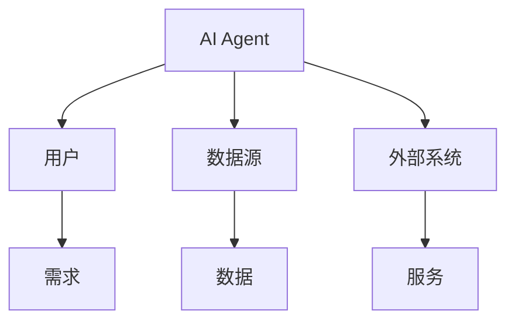
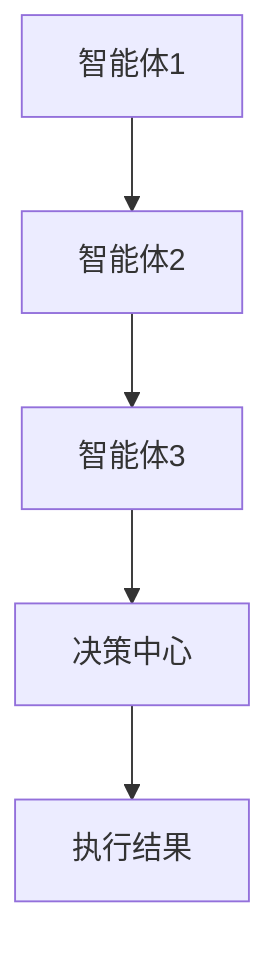
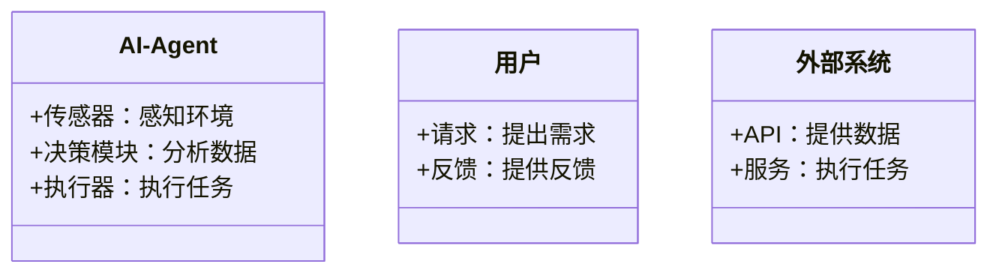

                 


# AI Agent在企业数字化转型中的核心作用

> 关键词：AI Agent, 企业数字化转型, 多智能体协作, 强化学习, 智能决策系统

> 摘要：AI Agent作为人工智能技术的核心应用之一，在企业数字化转型中发挥着越来越重要的作用。本文从AI Agent的基本概念、核心原理、算法实现、系统架构、应用场景等多个方面进行深入分析，探讨AI Agent如何助力企业实现高效决策、自动化运营和智能化管理。通过实际案例分析和代码实现，本文旨在为企业技术决策者和开发人员提供一份详尽的实践指南。

---

## 第一部分：AI Agent 的基本概念与背景介绍

### 第1章：AI Agent 的基本概念

#### 1.1 AI Agent 的定义与核心概念

AI Agent（人工智能代理）是指能够感知环境、自主决策并执行任务的智能实体。它通过传感器获取信息，利用推理能力分析数据，并通过执行器与外部环境交互。AI Agent的核心特点包括自主性、反应性、社会性和学习性。

#### 1.2 数字化转型的背景与挑战

随着企业竞争的加剧，数字化转型已成为企业提升竞争力的关键路径。传统企业在转型过程中面临以下挑战：

1. **效率低下**：人工操作繁琐，流程复杂。
2. **决策滞后**：依赖人工分析，无法快速响应。
3. **数据孤岛**：各部门间数据难以共享，难以形成统一决策。

#### 1.3 AI Agent 在数字化转型中的作用

AI Agent通过智能化技术帮助企业实现以下目标：

1. **自动化流程**：优化业务流程，降低人工干预。
2. **智能决策**：基于数据快速做出最优决策。
3. **提升效率**：通过自动化和智能化手段提高企业运营效率。

---

## 第二部分：AI Agent 的核心概念与联系

### 第2章：AI Agent 的核心原理

#### 2.1 AI Agent 的主要原理

AI Agent的工作原理可以分为以下几个步骤：

1. **感知环境**：通过传感器或API获取外部数据。
2. **分析数据**：利用机器学习算法对数据进行分析。
3. **决策制定**：基于分析结果做出决策。
4. **执行任务**：通过执行器或API完成任务。

#### 2.2 AI Agent 的实体关系图

以下是一个简单的AI Agent实体关系图：



---

## 第三部分：AI Agent 的算法原理与数学模型

### 第3章：AI Agent 的算法实现

#### 3.1 多智能体协作算法

多智能体协作是AI Agent的重要组成部分。以下是其实现流程：



#### 3.2 强化学习算法

强化学习是AI Agent决策的重要算法之一。以下是其数学模型：

$$
Q(s,a) = r + \gamma \max Q(s',a')
$$

其中：
- \( Q(s,a) \)：当前状态和动作的值函数。
- \( r \)：立即奖励。
- \( \gamma \)：折扣因子。
- \( Q(s',a') \)：后续状态和动作的值函数。

---

## 第四部分：AI Agent 在企业数字化转型中的应用场景

### 第4章：AI Agent 的实际案例分析

#### 4.1 智能客服系统

**应用场景**：
- 客户咨询、投诉处理、订单跟踪等。

**实现流程**：
1. 客户发送咨询请求。
2. AI Agent通过自然语言处理技术理解客户需求。
3. 基于知识库提供解决方案。
4. 如果无法解决，转交给人工客服。

**代码实现**：

```python
def handle_customer_request(request):
    # 使用自然语言处理模型理解请求
    intent = nlp_model.predict(request)
    # 根据意图查找解决方案
    response = knowledge_base.query(intent)
    return response
```

---

## 第五部分：AI Agent 的系统架构与实现

### 第5章：AI Agent 的系统架构设计

#### 5.1 系统功能设计

以下是AI Agent的系统功能模块：



---

## 第六部分：AI Agent 的最佳实践与未来展望

### 第6章：最佳实践与小结

#### 6.1 最佳实践

1. **数据质量管理**：确保数据的准确性和完整性。
2. **算法优化**：根据实际需求调整算法参数。
3. **系统监控**：实时监控系统运行状态，及时发现并解决问题。

#### 6.2 未来展望

随着人工智能技术的不断发展，AI Agent将在企业数字化转型中发挥越来越重要的作用。未来的研究方向包括：

- 更高效的多智能体协作算法。
- 更智能的自适应学习模型。
- 更广泛的应用场景。

---

## 结语

AI Agent作为企业数字化转型的核心技术之一，正在改变企业的运营方式和决策模式。通过本文的深入分析，读者可以全面了解AI Agent的核心概念、算法原理和应用场景。未来，随着技术的不断进步，AI Agent将在企业数字化转型中发挥更大的作用。

---

## 作者

作者：AI天才研究院/AI Genius Institute  
禅与计算机程序设计艺术 /Zen And The Art of Computer Programming

