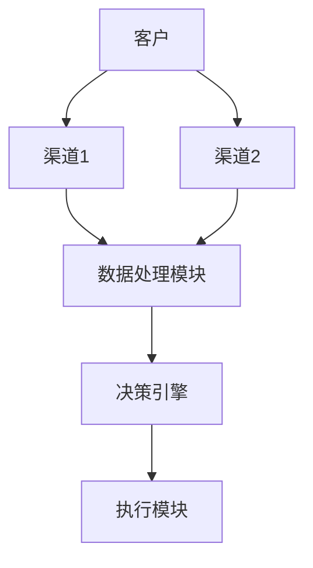
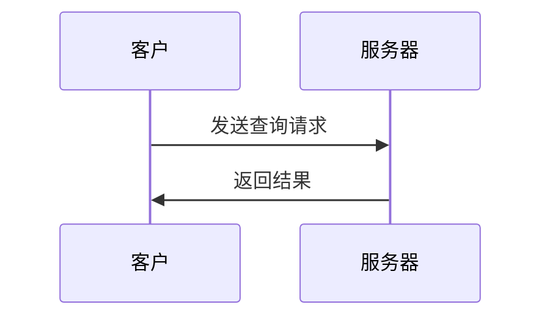
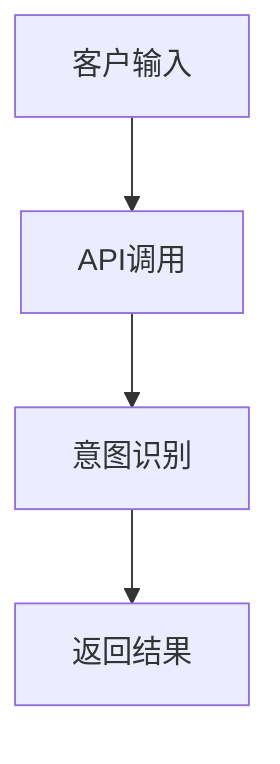

                 


# AI Agent在企业数字营销中的全渠道应用

> **关键词**：AI Agent, 企业数字营销, 全渠道营销, 自然语言处理, 机器学习, 强化学习

> **摘要**：本文深入探讨了AI Agent在企业数字营销中的全渠道应用，从AI Agent的基本概念到其在多渠道营销中的技术实现，再到实际案例分析，全面解析了AI Agent如何赋能企业数字营销，提升客户体验和营销效果。

---

## 第1章: AI Agent与企业数字营销概述

### 1.1 AI Agent的基本概念

#### 1.1.1 AI Agent的定义与特点
**AI Agent（人工智能代理）**是指能够感知环境、自主决策并执行任务的智能实体。其特点包括：
1. **智能性**：通过算法和数据进行决策。
2. **自主性**：无需人工干预，自主完成任务。
3. **适应性**：能够根据环境变化调整行为。
4. **交互性**：与用户或其他系统进行交互。

#### 1.1.2 AI Agent在数字营销中的作用
AI Agent在数字营销中扮演着多重角色：
1. **客户交互**：通过自然语言处理（NLP）与客户进行实时对话，提供个性化服务。
2. **数据处理**：分析海量数据，识别客户意图，优化营销策略。
3. **自动化执行**：根据分析结果，自动执行营销动作，如发送邮件、推送通知等。

#### 1.1.3 全渠道营销的背景与趋势
随着数字化转型的深入，企业营销渠道逐渐从单一渠道向全渠道扩展。全渠道营销不仅能够提升客户体验，还能提高营销效率和效果。AI Agent作为全渠道营销的核心技术，能够实现跨渠道的无缝协作。

---

### 1.2 企业数字营销的全渠道应用

#### 1.2.1 全渠道营销的定义
**全渠道营销**是指通过多种渠道（如网站、社交媒体、移动应用、邮件等）与客户进行互动，确保客户在不同渠道间获得一致的体验。

#### 1.2.2 全渠道营销的核心要素
1. **客户识别**：通过跨渠道数据整合，识别客户身份。
2. **客户画像**：基于数据构建详细的客户画像。
3. **渠道协同**：实现不同渠道间的协同工作，避免信息孤岛。

#### 1.2.3 AI Agent在全渠道营销中的价值
AI Agent能够实时分析客户行为，快速响应客户需求，实现跨渠道的无缝协作，从而提升客户满意度和营销转化率。

---

## 第2章: AI Agent的核心原理与技术基础

### 2.1 AI Agent的核心原理

#### 2.1.1 AI Agent的基本工作原理
AI Agent的工作流程包括：
1. **感知环境**：通过传感器或API获取数据。
2. **分析数据**：利用算法对数据进行处理和分析。
3. **决策与执行**：根据分析结果做出决策并执行任务。

#### 2.1.2 AI Agent的决策机制
AI Agent的决策机制基于概率论和机器学习模型，能够根据当前状态和可能的动作选择最优策略。

#### 2.1.3 AI Agent的学习与优化
通过强化学习（Reinforcement Learning），AI Agent能够在与环境的交互中不断优化自己的行为。

---

### 2.2 AI Agent的关键技术

#### 2.2.1 自然语言处理（NLP）
NLP技术使得AI Agent能够理解客户的自然语言输入，并生成符合语境的回复。例如，基于词嵌入模型（如Word2Vec）进行意图识别。

#### 2.2.2 机器学习（ML）
机器学习用于构建客户画像和预测客户行为。例如，使用逻辑回归（Logistic Regression）模型预测客户是否会点击广告。

#### 2.2.3 强化学习（RL）
强化学习用于优化AI Agent的决策策略。例如，通过Q-learning算法选择最优的营销策略。

---

### 2.3 AI Agent在数字营销中的算法实现

#### 2.3.1 基于NLP的意图识别算法
使用预训练的语言模型（如BERT）进行意图识别，步骤如下：
1. **数据预处理**：对输入文本进行分词和去停用词。
2. **模型训练**：基于标注数据训练意图分类器。
3. **意图预测**：对新输入文本进行意图分类。

#### 2.3.2 基于ML的客户画像构建
通过聚类分析（K-means）将客户分为不同的群体，并为每个群体生成画像。

#### 2.3.3 基于RL的动态优化策略
通过强化学习优化营销策略，例如在推荐系统中动态调整推荐内容以提高点击率。

---

## 第3章: 全渠道营销的系统架构与设计

### 3.1 全渠道营销的系统架构

#### 3.1.1 系统功能模块划分
系统主要模块包括：
1. **客户识别模块**：识别客户身份。
2. **意图识别模块**：分析客户意图。
3. **决策引擎模块**：生成营销策略。
4. **执行模块**：执行营销动作。

#### 3.1.2 系统架构图


---

### 3.2 AI Agent在全渠道中的交互设计

#### 3.2.1 客户端与服务器交互流程


#### 3.2.2 多渠道协调机制
通过事件驱动的方式实现多渠道的协调，例如在客户从网站跳转到移动应用时，保持上下文一致。

---

### 3.3 系统接口设计

#### 3.3.1 API接口定义
API接口包括：
1. `/api/v1/intent-analysis`
2. `/api/v1/customer-profile`

#### 3.3.2 接口调用流程


---

## 第4章: AI Agent在全渠道营销中的算法实现

### 4.1 基于NLP的客户意图识别

#### 4.1.1 模型选择与训练
使用预训练模型（如BERT）进行微调，训练意图分类器。

#### 4.1.2 代码实现
```python
from transformers import BertTokenizer, BertModel
import torch

tokenizer = BertTokenizer.from_pretrained('bert-base-uncased')
model = BertModel.from_pretrained('bert-base-uncased')

def predict_intent(text):
    inputs = tokenizer(text, return_tensors='pt')
    outputs = model(**inputs)
    # 处理输出以生成意图
    return intent
```

---

## 第5章: 项目实战

### 5.1 环境安装
安装必要的库：
```bash
pip install transformers
pip install scikit-learn
pip install matplotlib
```

### 5.2 系统核心实现源代码
```python
import numpy as np
from sklearn.cluster import KMeans

def customer_segmentation(data):
    # 数据预处理
    features = data[['age', 'income', 'purchase_history']]
    # 聚类分析
    model = KMeans(n_clusters=3)
    model.fit(features)
    # 分配簇标签
    clusters = model.labels_
    return clusters
```

---

## 第6章: 应用现状与未来趋势

### 6.1 成功案例分析
分析一家电商企业使用AI Agent进行全渠道营销的成功案例，总结经验教训。

### 6.2 未来趋势展望
预测AI Agent在数字营销中的发展方向，如更智能化的决策系统和更个性化的客户体验。

---

## 第7章: 最佳实践与小结

### 7.1 最佳实践
1. **数据质量**：确保数据的完整性和准确性。
2. **模型优化**：定期更新模型以适应市场变化。
3. **用户隐私**：遵守数据隐私法规，保护用户隐私。

### 7.2 小结
本文详细介绍了AI Agent在企业数字营销中的全渠道应用，从技术原理到实际案例，全面解析了AI Agent如何赋能企业营销。未来，随着AI技术的不断发展，AI Agent将在数字营销中发挥更大的作用。

---

**作者：AI天才研究院/AI Genius Institute & 禅与计算机程序设计艺术 /Zen And The Art of Computer Programming**

