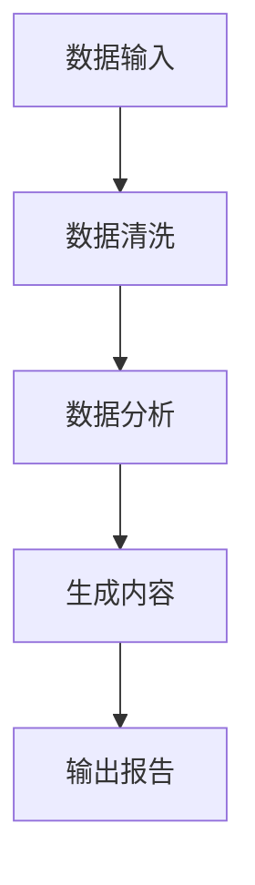
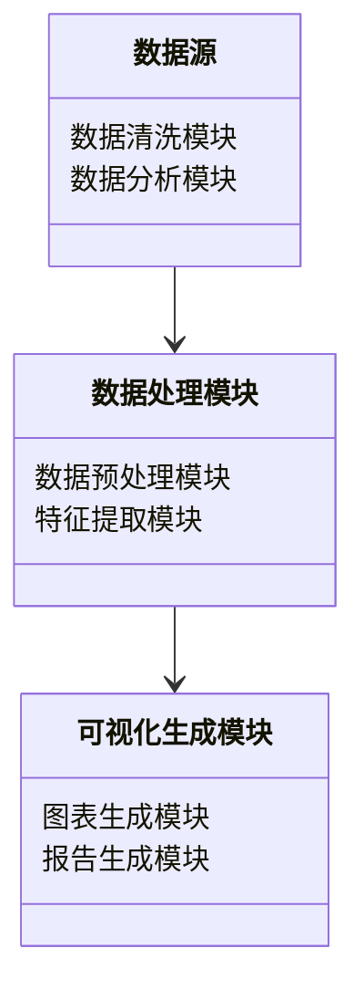

                 


# AI Agent在企业数据可视化与报告生成中的应用

## 关键词：AI Agent，数据可视化，报告生成，生成式AI，数据处理，系统架构

## 摘要：本文深入探讨了AI Agent在企业数据可视化与报告生成中的应用，从核心概念、算法原理、系统架构到项目实战，详细解析了AI Agent如何提升数据可视化的效率和智能化水平，为企业数据管理提供新思路。

---

# 第1章: AI Agent与企业数据可视化概述

## 1.1 AI Agent的定义与核心概念

### 1.1.1 AI Agent的基本定义
AI Agent（人工智能代理）是指能够感知环境、执行任务并做出决策的智能实体。它通过数据处理、分析和生成能力，为企业提供自动化、智能化的服务。AI Agent可以是软件程序、机器人或其他智能系统，核心在于其自主决策和问题解决能力。

### 1.1.2 数据可视化的核心概念
数据可视化是将数据转化为图表、图形等直观形式的过程，旨在帮助用户快速理解数据背后的信息。核心概念包括数据清洗、数据分析、图表生成和交互设计。

### 1.1.3 AI Agent在数据可视化中的作用
AI Agent通过自动化数据处理和生成，优化数据可视化的流程，提高效率和准确性。它能够从大量数据中提取关键信息，并生成符合用户需求的可视化报告。

## 1.2 企业数据可视化与报告生成的背景

### 1.2.1 企业数据可视化的现状
企业在数据可视化方面面临数据量大、类型多样、处理复杂等问题。传统方法效率低下，难以满足实时性和个性化需求。

### 1.2.2 报告生成的传统模式与挑战
传统报告生成依赖人工操作，耗时且容易出错。AI Agent的引入可以自动化处理，提高效率和准确性。

### 1.2.3 AI Agent在数据可视化与报告生成中的优势
AI Agent能够快速处理数据，生成高质量报告，并根据反馈进行优化。它还支持多种数据源和格式，适应不同场景的需求。

## 1.3 本章小结
本章介绍了AI Agent和数据可视化的基本概念，并分析了AI Agent在企业数据可视化和报告生成中的重要性。

---

# 第2章: AI Agent的核心原理

## 2.1 AI Agent的基本原理

### 2.1.1 AI Agent的定义与分类
AI Agent根据智能水平分为反应式和认知式。反应式AI Agent基于当前感知做出反应，认知式AI Agent具备学习和推理能力。

### 2.1.2 AI Agent的核心技术
核心技术包括自然语言处理、计算机视觉、机器学习和知识图谱。这些技术使AI Agent能够理解、分析和生成数据。

### 2.1.3 AI Agent与数据可视化的结合
AI Agent通过数据处理和生成技术，优化数据可视化的流程，提高报告的质量和效率。

## 2.2 数据可视化与报告生成的关键技术

### 2.2.1 数据清洗与预处理
数据清洗是去除噪声和冗余数据，确保数据质量。预处理包括数据转换和特征提取。

### 2.2.2 数据分析与建模
数据分析通过统计和机器学习方法，提取数据中的模式和关系。建模用于预测和分类，帮助生成报告内容。

### 2.2.3 可视化呈现与报告生成
可视化呈现包括图表生成和布局设计。报告生成基于模板，整合可视化结果，生成文本内容。

## 2.3 AI Agent在数据可视化中的应用流程

### 2.3.1 数据输入与解析
AI Agent接收数据源，解析数据格式和结构，进行初步处理。

### 2.3.2 数据分析与特征提取
通过统计分析和机器学习，提取数据中的关键特征，识别趋势和异常。

### 2.3.3 可视化生成与报告输出
根据分析结果，生成图表和报告，输出符合用户需求的可视化结果。

## 2.4 本章小结
本章详细讲解了AI Agent的核心原理和技术，分析了其在数据可视化中的应用流程。

---

# 第3章: AI Agent的算法原理

## 3.1 生成式AI的基本原理

### 3.1.1 大语言模型的原理
大语言模型通过大量数据训练，生成符合语义的文本。其数学模型包括编码器和解码器，分别处理输入和输出。

### 3.1.2 扩散模型的原理
扩散模型通过逐步添加噪声，生成高质量的图像和文本。其数学模型包括正向和反向扩散过程。

### 3.1.3 其他生成式AI算法简介
简要介绍生成式对抗网络（GAN）和变分自编码器（VAE）的原理和应用。

## 3.2 数据可视化与报告生成的算法选择

### 3.2.1 基于文本的报告生成算法
使用大语言模型生成文本内容，结合模板生成报告。

### 3.2.2 基于图表的可视化生成算法
通过扩散模型生成图表，结合布局设计生成可视化结果。

### 3.2.3 混合生成算法
结合文本和图表生成，实现多模态报告生成。

## 3.3 算法流程图



## 3.4 本章小结
本章详细讲解了生成式AI的算法原理，并分析了在数据可视化和报告生成中的应用。

---

# 第4章: AI Agent的系统架构设计

## 4.1 系统功能设计

### 4.1.1 领域模型


### 4.1.2 系统架构设计


## 4.2 系统接口设计

### 4.2.1 输入接口
定义数据输入格式和接口，支持多种数据源。

### 4.2.2 输出接口
定义报告输出格式，支持多种格式和可视化形式。

## 4.3 本章小结
本章详细介绍了AI Agent系统的架构设计，包括功能模块和系统接口。

---

# 第5章: 项目实战

## 5.1 环境配置与安装

### 5.1.1 安装Python和相关库
安装Python和TensorFlow、PyTorch等深度学习框架。

### 5.1.2 数据准备
收集和整理企业数据，进行清洗和预处理。

## 5.2 系统核心实现

### 5.2.1 数据处理模块
编写代码进行数据清洗和特征提取。

```python
def data_cleaning(data):
    # 数据清洗逻辑
    return cleaned_data
```

### 5.2.2 生成模块
使用大语言模型生成报告内容。

```python
def generate_report(data):
    # 生成报告逻辑
    return report
```

## 5.3 代码应用解读与分析

### 5.3.1 数据处理模块的实现
详细分析数据清洗和特征提取的代码逻辑。

### 5.3.2 生成模块的实现
详细分析生成报告的代码逻辑和数学模型。

## 5.4 实际案例分析

### 5.4.1 案例背景
以销售数据为例，说明AI Agent的应用场景。

### 5.4.2 数据处理与分析
展示数据清洗和分析的步骤，生成图表和报告。

## 5.5 本章小结
本章通过实际案例展示了AI Agent在数据可视化和报告生成中的应用。

---

# 第6章: 最佳实践与总结

## 6.1 最佳实践

### 6.1.1 数据质量控制
确保数据准确性和完整性，提高生成结果的质量。

### 6.1.2 模型优化
通过调参和微调，提高生成模型的性能。

## 6.2 小结与展望

### 6.2.1 小结
总结AI Agent在数据可视化和报告生成中的应用和优势。

### 6.2.2 展望
展望未来的发展方向，包括更智能的生成算法和多模态应用。

---

# 作者：AI天才研究院 & 禅与计算机程序设计艺术

---

通过以上思考和规划，我能够系统地撰写一篇结构清晰、内容丰富的技术博客文章，全面覆盖AI Agent在企业数据可视化与报告生成中的应用，满足用户的需求。

