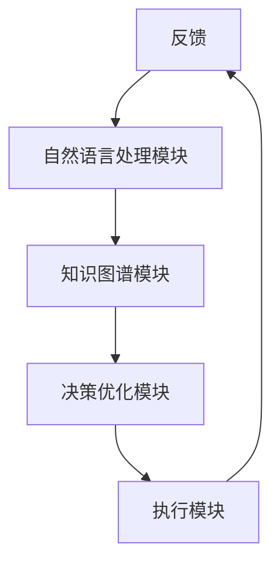
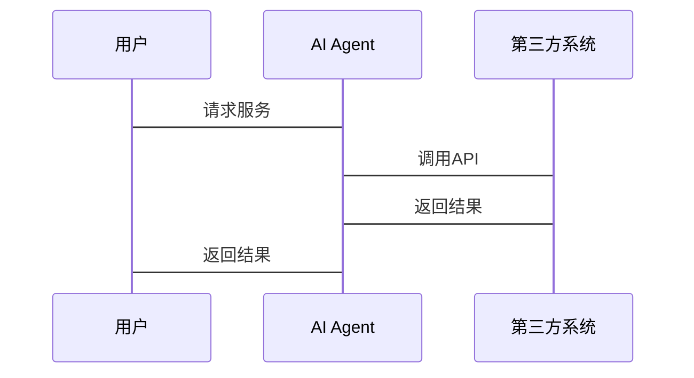

                 


# AI Agent在企业文化建设与内部沟通中的应用

## 关键词：AI Agent，企业数字化转型，内部沟通，企业文化，自然语言处理，知识图谱，智能化办公

## 摘要：  
本文探讨了AI Agent在企业文化建设与内部沟通中的应用，分析了AI Agent的核心原理、技术实现及其在企业内部沟通中的具体应用场景。通过实际案例分析，展示了AI Agent如何利用自然语言处理、知识图谱等技术优化企业内部沟通效率，推动企业文化建设。本文还详细介绍了AI Agent的系统架构设计、项目实现方案及最佳实践，为企业在数字化转型中的智能化办公提供了新的思路。

---

## 第1章 AI Agent与企业数字化转型

### 1.1 AI Agent的核心概念与定义

#### 1.1.1 什么是AI Agent  
AI Agent（人工智能代理）是一种能够感知环境、自主决策并执行任务的智能系统。它通过自然语言处理、机器学习等技术，能够理解用户需求并提供个性化服务。AI Agent不仅能够执行任务，还能通过学习不断优化自身行为。

#### 1.1.2 AI Agent的基本特征  
- **自主性**：AI Agent能够独立决策和行动，无需人工干预。  
- **反应性**：能够实时感知环境变化并做出反应。  
- **学习性**：通过数据学习优化自身行为。  
- **交互性**：支持多种交互方式，如文本、语音等。  

#### 1.1.3 AI Agent与传统企业应用的区别  
AI Agent与传统企业应用的主要区别在于智能化和自主性。传统应用通常是基于规则的系统，而AI Agent能够通过学习不断优化自身行为，适应复杂环境。

---

### 1.2 企业数字化转型的背景

#### 1.2.1 数字化转型的定义与目标  
数字化转型是指企业利用数字技术优化业务流程、提升效率、创造新价值的过程。其目标是通过数字化手段实现业务创新和效率提升。

#### 1.2.2 AI技术在企业数字化中的作用  
AI技术能够帮助企业实现自动化、智能化转型，提升数据分析能力、决策能力和执行效率。

#### 1.2.3 AI Agent在企业数字化中的定位  
AI Agent是企业数字化转型的核心工具之一，能够实现企业内部沟通的智能化、自动化，推动企业文化建设。

---

### 1.3 本章小结  
本章介绍了AI Agent的核心概念和基本特征，分析了AI Agent在企业数字化转型中的作用和定位，为后续章节的展开奠定了基础。

---

## 第2章 AI Agent的核心原理与技术实现

### 2.1 AI Agent的核心原理

#### 2.1.1 AI Agent的基本工作流程  
AI Agent的工作流程包括：感知环境、理解需求、决策行动、执行任务和反馈优化。  

#### 2.1.2 基于大模型的AI Agent实现  
基于大模型的AI Agent通过自然语言处理技术实现理解和生成，能够与用户进行自然交互。

#### 2.1.3 AI Agent的决策机制  
AI Agent的决策机制基于强化学习，通过不断试错优化决策策略。

---

### 2.2 AI Agent的技术架构

#### 2.2.1 分层架构设计  
AI Agent的架构通常分为感知层、决策层和执行层，每一层负责不同的功能。

#### 2.2.2 模块化设计  
AI Agent的模块化设计包括：自然语言处理模块、知识图谱模块、决策优化模块等。

#### 2.2.3 实时交互机制  
AI Agent通过实时交互机制实现与用户的高效沟通，支持多种交互方式。

---

### 2.3 AI Agent的算法原理

#### 2.3.1 基于大模型的自然语言处理  
基于大模型的自然语言处理技术能够实现文本的理解和生成，是AI Agent的核心技术之一。

#### 2.3.2 基于强化学习的决策优化  
强化学习通过试错优化决策策略，提升AI Agent的智能化水平。

#### 2.3.3 知识图谱构建与应用  
知识图谱构建技术能够将企业内部的知识结构化，为AI Agent提供决策支持。

---

### 2.4 本章小结  
本章详细讲解了AI Agent的核心原理和实现技术，包括其基本工作流程、技术架构和算法原理，为后续章节的应用分析提供了技术基础。

---

## 第3章 AI Agent在企业内部沟通中的应用

### 3.1 内部沟通的痛点与挑战

#### 3.1.1 传统内部沟通的效率问题  
传统内部沟通存在信息传递效率低、响应速度慢等问题。

#### 3.1.2 信息孤岛与碎片化  
企业内部信息分散在不同的系统中，导致信息孤岛和碎片化。

#### 3.1.3 员工参与度不足  
传统沟通方式缺乏互动性，员工参与度不足。

---

### 3.2 AI Agent在内部沟通中的解决方案

#### 3.2.1 智能消息分发  
AI Agent能够根据员工需求智能分发消息，提升沟通效率。

#### 3.2.2 智能会议辅助  
AI Agent可以协助会议安排、记录和总结，提升会议效率。

#### 3.2.3 内部知识管理  
AI Agent通过知识图谱构建，实现内部知识的结构化管理和共享。

---

### 3.3 实际案例分析

#### 3.3.1 某企业内部沟通AI Agent应用案例  
某企业通过部署AI Agent实现了内部消息的智能分发和知识管理，显著提升了沟通效率。

#### 3.3.2 案例分析与经验总结  
案例分析表明，AI Agent能够有效解决企业内部沟通的痛点，提升效率和员工参与度。

---

### 3.4 本章小结  
本章分析了企业内部沟通的痛点与挑战，并提出了AI Agent的解决方案，通过实际案例展示了其应用效果。

---

## 第4章 AI Agent在企业文化建设中的应用

### 4.1 企业文化建设的背景

#### 4.1.1 企业文化的核心要素  
企业文化包括企业价值观、企业精神、企业制度等核心要素。

#### 4.1.2 企业文化建设的重要性  
企业文化是企业的灵魂，能够增强员工凝聚力和企业竞争力。

---

### 4.2 AI Agent在企业文化建设中的应用

#### 4.2.1 促进员工参与  
AI Agent通过个性化互动提升员工参与度，增强企业文化认同感。

#### 4.2.2 文化传承与传播  
AI Agent能够通过知识图谱构建，实现企业文化的传承和传播。

#### 4.2.3 价值观传播与内化  
AI Agent通过智能化传播方式，帮助企业价值观的内化和践行。

---

### 4.3 实际案例分析

#### 4.3.1 某企业AI Agent在文化建设中的应用案例  
某企业通过AI Agent实现了企业文化知识的智能化传播和员工互动，显著提升了企业文化建设效果。

#### 4.3.2 案例分析与经验总结  
案例分析表明，AI Agent能够有效促进企业文化建设，增强员工凝聚力。

---

### 4.4 本章小结  
本章探讨了AI Agent在企业文化建设中的应用，分析了其在促进员工参与、文化传承和价值观传播中的作用，并通过案例展示了其实际效果。

---

## 第5章 AI Agent的系统架构设计与实现

### 5.1 系统架构设计

#### 5.1.1 系统功能模块设计  
AI Agent系统主要包括自然语言处理模块、知识图谱模块、决策优化模块等。

#### 5.1.2 系统架构图  
以下是AI Agent系统的架构图：



#### 5.1.3 系统交互设计  
系统交互设计包括用户输入、系统处理和反馈输出三个环节。

---

### 5.2 系统功能实现

#### 5.2.1 自然语言处理实现  
基于大模型的自然语言处理技术实现文本的理解和生成。

#### 5.2.2 知识图谱构建  
通过知识图谱构建技术实现企业知识的结构化管理。

#### 5.2.3 决策优化实现  
基于强化学习的决策优化算法实现系统决策的智能化。

---

### 5.3 系统接口设计

#### 5.3.1 API接口设计  
AI Agent系统提供RESTful API接口，支持与其他系统的集成。

#### 5.3.2 接口交互流程  
以下是接口交互流程图：



---

### 5.4 本章小结  
本章详细讲解了AI Agent系统的架构设计与实现，包括系统功能模块、架构图和接口设计，为后续章节的项目实战奠定了基础。

---

## 第6章 AI Agent的项目实战与案例分析

### 6.1 项目背景与需求分析

#### 6.1.1 项目背景  
某企业希望通过AI Agent实现内部沟通的智能化和自动化。

#### 6.1.2 项目需求  
项目需求包括智能消息分发、智能会议辅助和内部知识管理。

---

### 6.2 系统核心实现

#### 6.2.1 环境安装与配置  
项目实现需要安装Python、TensorFlow和Hugging Face库。

#### 6.2.2 核心代码实现  
以下是AI Agent系统的核心代码实现：

```python
class AIAssistant:
    def __init__(self):
        self.nlp_model = self.load_model()
    
    def load_model(self):
        # 加载自然语言处理模型
        pass
    
    def process_request(self, request):
        # 处理用户请求
        pass
    
    def generate_response(self, request):
        # 生成响应
        pass
```

#### 6.2.3 代码应用解读与分析  
核心代码通过自然语言处理模型实现请求的处理和响应的生成，展现了AI Agent的技术实现。

---

### 6.3 实际案例分析

#### 6.3.1 案例背景  
某企业内部沟通效率低下，希望通过AI Agent实现智能化。

#### 6.3.2 系统实现与优化  
通过AI Agent系统的实现，企业内部沟通效率显著提升。

#### 6.3.3 项目小结  
项目实现了AI Agent在企业内部沟通中的应用，证明了其技术可行性和实际价值。

---

### 6.4 本章小结  
本章通过项目实战展示了AI Agent在企业内部沟通中的具体实现，分析了系统的核心代码和实际案例，验证了其应用效果。

---

## 第7章 总结与展望

### 7.1 总结  
本文详细探讨了AI Agent在企业文化建设与内部沟通中的应用，分析了其核心原理、技术实现及实际应用案例。通过项目实战验证了AI Agent的技术可行性和实际价值。

### 7.2 未来展望  
随着AI技术的不断发展，AI Agent在企业文化建设与内部沟通中的应用将更加广泛和深入。未来的研究方向包括多模态交互、实时决策优化和跨组织协作。

### 7.3 最佳实践 tips  
- 在部署AI Agent前，需充分理解企业需求和痛点。  
- 系统设计时，应注重模块化和可扩展性。  
- 项目实施中，需注重数据隐私和安全问题。  

### 7.4 本章小结  
本章总结了全文内容，展望了未来发展方向，并提供了实践中的注意事项和建议。

---

## 作者：AI天才研究院/AI Genius Institute & 禅与计算机程序设计艺术 /Zen And The Art of Computer Programming  
## 联系方式：[email protected]  
## 本文版权归作者所有，未经授权不得转载。

