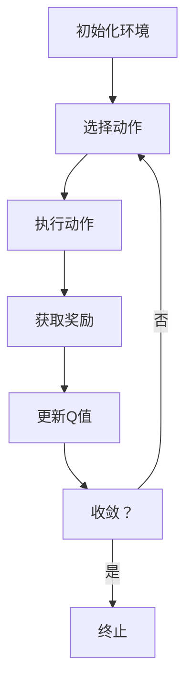
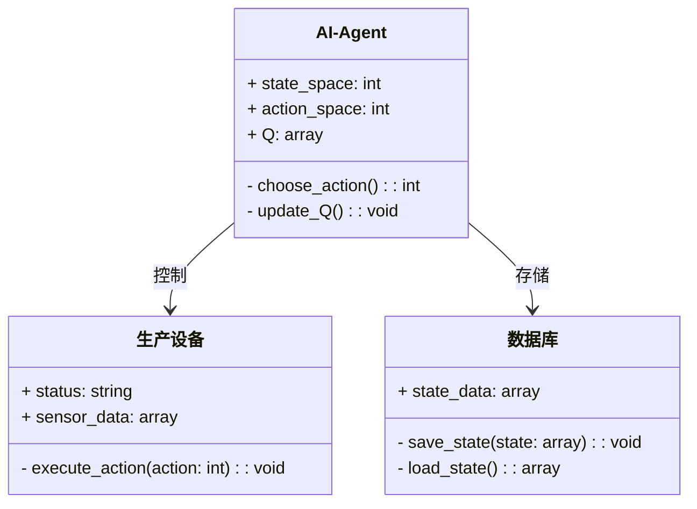
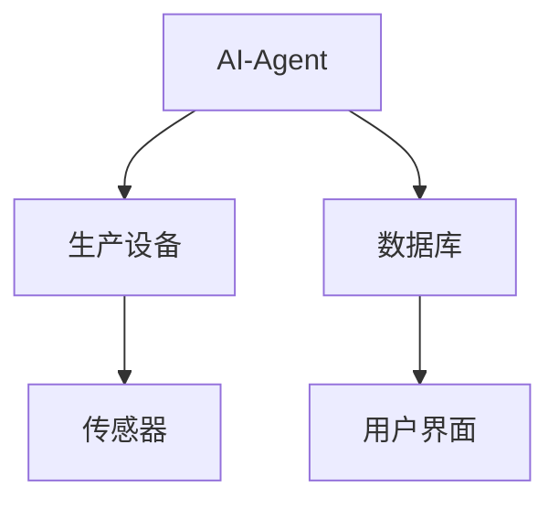
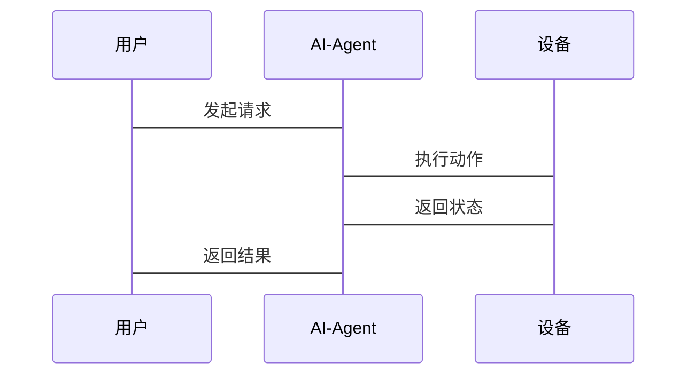

                 


# AI Agent在企业智能工厂管理中的全面应用

## 关键词：AI Agent，智能工厂，制造业，数字化转型，人工智能

## 摘要：本文全面探讨了AI Agent在企业智能工厂管理中的应用，从概念、原理到系统设计、项目实战，系统地分析了AI Agent如何优化生产调度、质量控制、供应链管理等关键环节。文章结合实际案例，深入解析了AI Agent的核心算法与系统架构，并提出了实施建议与未来发展方向。

---

# 第1章: AI Agent与智能工厂概述

## 1.1 AI Agent的基本概念

### 1.1.1 什么是AI Agent

AI Agent（人工智能代理）是一种能够感知环境、自主决策并执行任务的智能实体。它通过传感器或数据输入获取信息，利用算法进行分析和推理，最终输出决策或动作。

### 1.1.2 AI Agent的核心特征

- **自主性**：能够自主决策，无需人工干预。
- **反应性**：能够实时感知环境变化并做出响应。
- **目标导向**：以特定目标为导向，优化决策过程。
- **学习能力**：通过数据和经验不断优化自身性能。

### 1.1.3 AI Agent与传统自动化系统的区别

| 特性            | AI Agent                      | 传统自动化系统              |
|-----------------|-------------------------------|-----------------------------|
| 决策能力        | 具备自主决策能力              | 依赖预设规则和程序          |
| 学习能力        | 可通过数据学习优化性能        | 无法学习，仅执行固定任务    |
| 灵活性          | 能够适应环境变化              | 灵活性较低，适应性有限      |

## 1.2 智能工厂的定义与特点

### 1.2.1 智能工厂的定义

智能工厂是通过物联网、大数据、人工智能等技术实现智能化生产、优化管理的现代化工厂。它能够实时监控生产过程，优化资源配置，提高生产效率。

### 1.2.2 智能工厂的主要特点

- **智能化生产**：利用AI、物联网等技术实现智能化生产。
- **数据驱动决策**：基于实时数据进行决策和优化。
- **高度自动化**：从生产到物流实现高度自动化。
- **灵活性高**：能够快速适应市场需求变化。

### 1.2.3 智能工厂与传统工厂的对比

| 特性            | 智能工厂                      | 传统工厂                  |
|-----------------|-------------------------------|---------------------------|
| 生产效率        | 高，通过AI优化                | 较低，依赖人工或固定程序    |
| 灵活性          | 高，能够快速调整生产计划      | 低，调整周期长              |
| 数据利用率      | 高，实时数据驱动决策          | 低，依赖历史数据或经验      |

## 1.3 AI Agent在智能工厂中的应用背景

### 1.3.1 当前制造业的数字化转型趋势

随着工业4.0的推进，制造业正在经历从自动化向智能化的转变。企业需要通过数字化技术提高效率、降低成本、增强竞争力。

### 1.3.2 AI技术在制造业中的潜力

- **生产优化**：通过AI算法优化生产流程，降低能耗。
- **质量控制**：利用计算机视觉和机器学习提高产品质量。
- **预测性维护**：通过数据预测设备故障，减少停机时间。

### 1.3.3 AI Agent在智能工厂中的定位与作用

AI Agent在智能工厂中充当决策者和执行者的角色，负责实时监控生产过程，优化资源配置，实现高效生产。

---

# 第2章: AI Agent的核心原理

## 2.1 AI Agent的感知与决策机制

### 2.1.1 感知层: 数据采集与处理

AI Agent通过传感器、摄像头等设备采集生产环境中的数据，如温度、湿度、设备状态等。

### 2.1.2 决策层: 算法与模型

AI Agent利用强化学习、遗传算法等算法对数据进行分析，生成最优决策。

### 2.1.3 执行层: 动作与反馈

AI Agent根据决策生成动作指令，驱动设备执行操作，并通过反馈机制不断优化决策。

## 2.2 AI Agent的典型算法与模型

### 2.2.1 强化学习算法

强化学习是一种通过试错机制优化决策的算法。AI Agent通过与环境交互，学习最优策略。

### 2.2.2 遗传算法

遗传算法是一种基于生物进化原理的优化算法，适用于复杂问题的全局优化。

### 2.2.3 模糊逻辑算法

模糊逻辑适用于处理模糊、不确定的信息，常用于质量控制等场景。

## 2.3 AI Agent的数学模型与公式

### 2.3.1 强化学习的数学模型

强化学习的核心是Q-learning算法，其数学表达式为：

$$ Q(s, a) = r + \gamma \max_{a'} Q(s', a') $$

其中：
- \( Q(s, a) \) 表示状态 \( s \) 下采取动作 \( a \) 的价值。
- \( r \) 是奖励。
- \( \gamma \) 是折扣因子。
- \( s' \) 是下一个状态。

### 2.3.2 遗传算法的数学表达

遗传算法的主要步骤包括编码、选择、交叉和变异。编码过程将问题转化为二进制字符串或其他表示形式。

### 2.3.3 模糊逻辑的数学基础

模糊逻辑通过隶属度函数将输入数据转化为模糊集合，常用Zadeh的模糊逻辑规则。

## 2.4 本章小结

本章详细介绍了AI Agent的核心原理，包括感知、决策和执行三个层面，并探讨了典型算法的数学模型。

---

# 第3章: AI Agent在智能工厂中的系统架构与设计

## 3.1 系统功能模块划分

### 3.1.1 数据采集模块

负责采集生产环境中的数据，如设备状态、温度、湿度等。

### 3.1.2 数据分析模块

对采集到的数据进行分析，生成决策建议。

### 3.1.3 决策支持模块

根据分析结果生成最优决策，并驱动执行模块。

### 3.1.4 执行控制模块

根据决策指令控制设备执行操作。

## 3.2 系统架构设计

### 3.2.1 分层架构

分层架构将系统划分为数据采集层、数据处理层和决策层，各层之间通过API进行通信。

### 3.2.2 微服务架构

微服务架构将系统功能模块化为独立的服务，通过容器化技术实现灵活部署。

### 3.2.3 可扩展性设计

通过模块化设计和松耦合架构，确保系统具备良好的可扩展性。

## 3.3 系统接口与交互设计

### 3.3.1 数据接口

系统通过API接口与生产设备、数据库进行数据交互。

### 3.3.2 用户界面

提供直观的用户界面，供操作人员监控和管理生产过程。

### 3.3.3 外部系统集成

通过标准接口与企业现有的ERP、MES等系统进行集成。

## 3.4 本章小结

本章详细介绍了AI Agent在智能工厂中的系统架构设计，包括功能模块划分、架构选择和接口设计。

---

# 第4章: AI Agent的算法实现

## 4.1 强化学习算法实现

### 4.1.1 算法流程

1. 初始化环境。
2. 选择动作并执行。
3. 获取奖励并更新Q值。
4. 重复步骤2-3，直到收敛。

### 4.1.2 Python代码实现

```python
import numpy as np

class AI-Agent:
    def __init__(self, state_space, action_space):
        self.state_space = state_space
        self.action_space = action_space
        self.Q = np.zeros((state_space, action_space))

    def choose_action(self, state, epsilon=0.1):
        if np.random.random() < epsilon:
            return np.random.randint(self.action_space)
        else:
            return np.argmax(self.Q[state, :])

    def update_Q(self, state, action, reward, next_state, gamma=0.99):
        self.Q[state, action] = reward + gamma * np.max(self.Q[next_state, :])
```

### 4.1.3 算法流程图



## 4.2 遗传算法实现

### 4.2.1 算法流程

1. 初始化种群。
2. 计算适应度。
3. 选择优秀个体。
4. 进行交叉和变异。
5. 重复步骤2-4，直到收敛。

### 4.2.2 Python代码实现

```python
import random

def fitness(individual):
    # 计算适应度
    return sum(individual)

def crossover(parent1, parent2):
    # 单点交叉
    point = random.randint(1, len(parent1)-1)
    return parent1[:point] + parent2[point:], parent2[:point] + parent1[point:]

def mutate(individual):
    # 突变
    for i in range(len(individual)):
        if random.random() < 0.1:
            individual[i] = 1 - individual[i]
    return individual

# 初始化种群
population = [[0, 1, 0, 1], [1, 0, 1, 0], ...]

# 选择
selected = [individual for individual in population if fitness(individual) > threshold]

# 交叉和变异
new_population = []
for i in range(len(selected)//2):
    p1 = selected[i]
    p2 = selected[-i-1]
    child1, child2 = crossover(p1, p2)
    child1 = mutate(child1)
    child2 = mutate(child2)
    new_population.extend([child1, child2])
```

## 4.3 模糊逻辑实现

### 4.3.1 算法流程

1. 确定模糊规则。
2. 计算隶属度。
3. 推理结果。
4. 解模糊。

### 4.3.2 Python代码实现

```python
def fuzzy_inference(input_value, rules):
    # 计算隶属度
    membership = {}
    for rule in rules:
        if input_value >= rule['input_low'] and input_value <= rule['input_high']:
            membership[rule['output']] = 1
        elif input_value < rule['input_low']:
            membership[rule['output']] = (input_value - rule['input_low']) / (rule['input_low'] - rule['input_high'])
        else:
            membership[rule['output']] = (input_value - rule['input_high']) / (rule['input_low'] - rule['input_high'])
    # 解模糊
    return max(membership.values())
```

## 4.4 本章小结

本章详细介绍了AI Agent的核心算法实现，包括强化学习、遗传算法和模糊逻辑的代码实现和流程图。

---

# 第5章: AI Agent在智能工厂中的系统设计与实现

## 5.1 项目介绍

本项目旨在开发一个基于AI Agent的智能工厂管理系统，实现生产调度、质量监控等功能。

## 5.2 系统功能设计

### 5.2.1 生产调度模块

通过强化学习算法优化生产计划。

### 5.2.2 质量监控模块

利用计算机视觉技术检测产品质量。

### 5.2.3 供应链管理模块

通过遗传算法优化供应商选择和库存管理。

## 5.3 系统架构设计

### 5.3.1 领域模型图



### 5.3.2 系统架构图



## 5.4 系统接口设计

### 5.4.1 数据接口

- 数据采集接口：从传感器获取实时数据。
- 数据存储接口：将数据存入数据库。

### 5.4.2 用户界面

- 登录界面：用户登录。
- 主界面：显示生产状态、报警信息。

### 5.4.3 交互流程



## 5.5 本章小结

本章详细介绍了AI Agent在智能工厂中的系统设计与实现，包括功能模块、架构设计和接口设计。

---

# 第6章: 项目实战与案例分析

## 6.1 项目介绍

本项目旨在开发一个基于AI Agent的智能排产系统，优化生产计划。

## 6.2 环境安装

### 6.2.1 安装Python

```bash
# 安装Python 3.8及以上版本
sudo apt-get update
sudo apt-get install python3.8
```

### 6.2.2 安装依赖库

```bash
pip install numpy matplotlib
```

## 6.3 核心代码实现

### 6.3.1 强化学习实现

```python
import numpy as np

class AI-Agent:
    def __init__(self, state_space, action_space):
        self.state_space = state_space
        self.action_space = action_space
        self.Q = np.zeros((state_space, action_space))

    def choose_action(self, state, epsilon=0.1):
        if np.random.random() < epsilon:
            return np.random.randint(self.action_space)
        else:
            return np.argmax(self.Q[state, :])

    def update_Q(self, state, action, reward, next_state, gamma=0.99):
        self.Q[state, action] = reward + gamma * np.max(self.Q[next_state, :])
```

### 6.3.2 数据可视化

```python
import matplotlib.pyplot as plt

def plot_rewards(rewards):
    plt.plot(rewards)
    plt.xlabel('Episode')
    plt.ylabel('Total Reward')
    plt.show()
```

## 6.4 项目小结

本项目通过强化学习算法实现了智能排产系统，验证了AI Agent在生产调度中的有效性。

---

# 第7章: 最佳实践与总结

## 7.1 最佳实践

### 7.1.1 数据质量

确保数据的准确性和实时性，这是AI Agent决策的基础。

### 7.1.2 模型迭代

定期更新模型，确保其适应环境变化。

### 7.1.3 团队协作

AI Agent的开发需要数据科学家、软件工程师和业务专家的协作。

## 7.2 总结与展望

AI Agent在智能工厂中的应用前景广阔，未来可以通过边缘计算、5G等技术进一步优化性能。

---

# 作者：AI天才研究院/AI Genius Institute & 禅与计算机程序设计艺术 /Zen And The Art of Computer Programming

