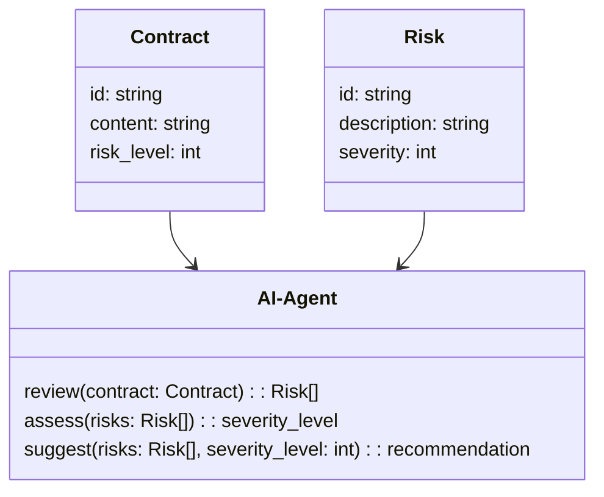
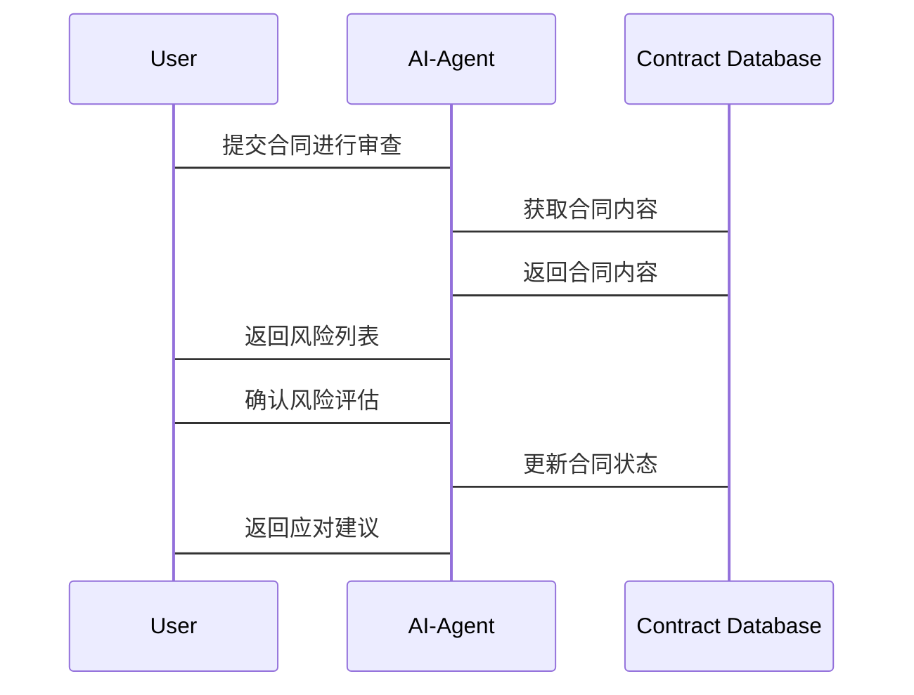

                 


# AI Agent在企业法律风险管理中的应用

## 关键词
AI Agent, 企业法律风险管理, 人工智能, 法律风险, 企业风险管理

## 摘要
本文深入探讨了AI Agent在企业法律风险管理中的应用，分析了传统法律风险管理的局限性，介绍了AI Agent的核心概念和工作原理。通过算法原理、系统架构设计、项目实战等多方面的详细讲解，展示了AI Agent如何提升企业法律风险管理的效率和准确性。本文还提供了具体的代码实现和实际案例分析，帮助读者更好地理解和应用AI Agent技术。

---

# 第一部分: AI Agent与企业法律风险管理概述

## 第1章: 引言

### 1.1 问题背景

#### 1.1.1 企业法律风险管理的传统模式
企业传统的法律风险管理主要依赖人工审查和经验判断，这种方式效率低下、成本高昂且容易受到主观因素的影响。

#### 1.1.2 传统模式的局限性
- 信息处理能力有限：人工难以快速处理大量法律文件和数据。
- 知识更新滞后：法律知识的更新速度与人工处理的效率不匹配。
- 主观性较强：不同律师可能对法律条款的解读存在差异。

#### 1.1.3 AI Agent的引入与优势
AI Agent（人工智能代理）能够通过自动化处理、智能分析和实时反馈，显著提升法律风险管理的效率和准确性。

### 1.2 问题描述

#### 1.2.1 法律风险管理的核心挑战
- **风险识别**：如何快速识别潜在的法律风险。
- **风险评估**：如何准确评估风险的影响程度。
- **风险应对**：如何制定有效的应对策略。

#### 1.2.2 企业法律风险管理的痛点分析
- 处理复杂性高：法律问题涉及多个领域，且具有高度的复杂性。
- 数据分散：法律文件和数据分散在不同部门，难以整合。
- 成本高昂：传统模式需要大量的人力和时间投入。

#### 1.2.3 AI Agent在法律风险管理中的定位
AI Agent作为辅助工具，能够帮助企业快速分析法律文件、识别潜在风险、提供决策支持。

### 1.3 问题解决

#### 1.3.1 AI Agent在法律风险管理中的应用场景
- 合同审查与合规性检查。
- 风险评估与预警。
- 法律知识库的智能化管理。

#### 1.3.2 AI Agent如何提升法律风险管理效率
- **自动化处理**：快速扫描和分析大量法律文件。
- **智能识别**：利用自然语言处理技术识别关键条款。
- **实时反馈**：提供即时的风险评估和建议。

#### 1.3.3 AI Agent在法律风险管理中的价值体现
- **提升效率**：减少人工审查的时间和成本。
- **增强准确性**：通过算法模型提高风险识别的准确性。
- **持续优化**：通过机器学习不断优化风险评估模型。

### 1.4 边界与外延

#### 1.4.1 AI Agent在法律风险管理中的适用范围
- 合同审查与管理。
- 法律合规性检查。
- 风险预警与应对。

#### 1.4.2 相关领域的边界划分
- **法律咨询**：AI Agent可以辅助律师提供法律建议，但不能替代专业律师的判断。
- **风险管理**：AI Agent主要用于风险识别和评估，而非风险的实际应对和控制。

#### 1.4.3 AI Agent与其他技术的协同作用
- 与大数据分析结合，提升数据处理能力。
- 与区块链技术结合，确保数据的不可篡改性。

### 1.5 概念结构与核心要素

#### 1.5.1 AI Agent的定义与特征
AI Agent是一种能够感知环境、自主决策并执行任务的智能体，具有以下特征：
- **自主性**：能够在没有外部干预的情况下独立运行。
- **反应性**：能够根据环境变化实时调整行为。
- **目标导向**：具有明确的目标并致力于实现这些目标。

#### 1.5.2 法律风险管理的核心要素
- **风险识别**：识别潜在的法律风险。
- **风险评估**：评估风险的严重程度和影响范围。
- **风险应对**：制定和实施应对策略。

#### 1.5.3 AI Agent与法律风险管理的结合模型
AI Agent通过与法律知识库、数据分析工具和企业管理系统相结合，形成一个完整的法律风险管理生态系统。

---

## 第2章: AI Agent的核心概念与原理

### 2.1 AI Agent的定义与特点

#### 2.1.1 AI Agent的定义
AI Agent是一种能够感知环境、自主决策并执行任务的智能体。

#### 2.1.2 AI Agent的核心特点
- **自主性**：能够独立运行。
- **反应性**：能够根据环境变化实时调整行为。
- **目标导向**：以实现特定目标为驱动。

#### 2.1.3 AI Agent与传统软件的区别
- **智能性**：AI Agent具备学习和推理能力，而传统软件仅能执行预设指令。
- **适应性**：AI Agent能够适应环境变化，传统软件则不具备这种能力。

### 2.2 法律风险管理的定义与框架

#### 2.2.1 法律风险管理的定义
法律风险管理是指通过识别、评估和应对法律风险，以降低其对企业的影响。

#### 2.2.2 法律风险管理的框架
1. **风险识别**：识别潜在的法律风险。
2. **风险评估**：评估风险的严重程度和影响范围。
3. **风险应对**：制定和实施应对策略。

#### 2.2.3 法律风险管理的关键环节
- **风险识别**：通过分析合同、法律文件等识别潜在风险。
- **风险评估**：评估风险的严重性和可能性。
- **风险应对**：制定相应的应对策略，如规避、转移、减轻或接受风险。

### 2.3 AI Agent与法律风险管理的关联

#### 2.3.1 AI Agent在法律风险管理中的角色
- **辅助工具**：AI Agent作为辅助工具，帮助法律部门快速分析法律文件，识别潜在风险。

#### 2.3.2 AI Agent与法律风险管理的结合方式
- **数据输入**：AI Agent接收法律文件和相关数据。
- **数据处理**：通过自然语言处理和机器学习技术分析数据。
- **输出结果**：生成风险评估报告和应对建议。

#### 2.3.3 AI Agent与法律风险管理的结合模型
通过结合自然语言处理、机器学习和知识图谱等技术，AI Agent能够高效地识别和评估法律风险。

---

## 第3章: AI Agent在企业法律风险管理中的算法原理

### 3.1 算法原理概述

#### 3.1.1 算法选择与实现
- **基于规则的推理**：通过预设的法律规则进行推理和判断。
- **机器学习算法**：利用训练数据进行分类和预测。
- **深度学习算法**：通过神经网络模型进行复杂模式识别。

#### 3.1.2 算法实现的步骤
1. **数据预处理**：清洗和标注数据。
2. **模型训练**：利用训练数据训练模型。
3. **模型评估**：通过测试数据评估模型性能。
4. **模型优化**：调整参数和优化模型。

### 3.2 基于规则的推理

#### 3.2.1 基于规则的推理原理
通过预设的法律规则和逻辑推理，判断合同条款的合法性。

#### 3.2.2 规则库的构建
- **法律规则**：收集和整理相关法律条款。
- **逻辑推理**：建立规则之间的逻辑关系。

#### 3.2.3 基于规则的推理实现
通过编程语言（如Python）实现规则的匹配和推理。

### 3.3 机器学习算法

#### 3.3.1 机器学习算法选择
- **支持向量机（SVM）**：适用于分类问题。
- **随机森林（Random Forest）**：适用于分类和回归问题。

#### 3.3.2 机器学习算法实现
- **数据预处理**：将法律文件转换为可处理的特征向量。
- **模型训练**：利用训练数据训练分类模型。
- **模型预测**：对新的法律文件进行分类和预测。

### 3.4 深度学习算法

#### 3.4.1 深度学习算法选择
- **卷积神经网络（CNN）**：适用于图像识别任务。
- **循环神经网络（RNN）**：适用于序列数据处理任务。

#### 3.4.2 深度学习算法实现
- **数据预处理**：将法律文件转换为图像或序列数据。
- **模型训练**：利用训练数据训练深度学习模型。
- **模型预测**：对新的法律文件进行分类和预测。

### 3.5 算法实现的代码示例

```python
# 基于规则的推理实现
def contract_review(contract_text):
    # 预设的法律规则
    rules = {
        'conflict_clauses': ['不可抗力', '违约责任'],
        'mandatory_clauses': ['管辖法院', '争议解决']
    }
    # 规则匹配
    for clause in contract_text:
        if clause in rules['conflict_clauses']:
            return '存在冲突条款'
        elif clause in rules['mandatory_clauses']:
            return '存在必须条款'
    return '无异常条款'

# 机器学习算法实现
from sklearn.svm import SVC
from sklearn.metrics import accuracy_score

# 数据预处理
X = ...  # 特征向量
y = ...  # 标签

# 模型训练
model = SVC()
model.fit(X, y)

# 模型预测
predicted = model.predict(X_test)
print('准确率:', accuracy_score(y_test, predicted))
```

### 3.6 算法实现的数学模型与公式

#### 3.6.1 机器学习模型的数学表示
- **线性回归模型**：$y = \beta_0 + \beta_1x + \epsilon$
- **逻辑回归模型**：$P(y=1|x) = \frac{e^{\beta_0 + \beta_1x}}{1 + e^{\beta_0 + \beta_1x}}}$

#### 3.6.2 深度学习模型的数学表示
- **卷积神经网络（CNN）**：
  - **卷积层**：$f(x) = \max(0, x \cdot w + b)$
  - **池化层**：$f(x) = \max(x[0], x[1])$

---

## 第4章: AI Agent在企业法律风险管理中的系统架构设计

### 4.1 系统分析与设计

#### 4.1.1 问题场景介绍
企业法律风险管理的场景包括合同审查、合规性检查、风险预警等。

#### 4.1.2 系统功能设计
- **合同审查模块**：自动审查合同条款，识别潜在风险。
- **风险评估模块**：评估风险的严重程度和影响范围。
- **风险应对模块**：提供风险应对的策略和建议。

#### 4.1.3 系统设计的领域模型
使用Mermaid绘制领域模型类图：



### 4.2 系统架构设计

#### 4.2.1 系统架构设计
使用Mermaid绘制系统架构图：


#### 4.2.2 系统接口设计
- **合同审查接口**：接收合同文本，返回风险列表。
- **风险评估接口**：接收风险列表，返回风险严重程度。
- **风险应对接口**：接收风险列表和严重程度，返回应对建议。

#### 4.2.3 系统交互设计
使用Mermaid绘制系统交互序列图：



### 4.3 系统实现

#### 4.3.1 系统实现的关键步骤
- **数据收集**：收集企业相关的法律文件和合同。
- **模型训练**：基于历史数据训练AI Agent模型。
- **系统集成**：将AI Agent集成到企业管理系统中。

#### 4.3.2 系统实现的代码示例
```python
# 系统实现的代码示例
class ContractReviewer:
    def __init__(self, knowledge_base):
        self.knowledge_base = knowledge_base

    def review_contract(self, contract_text):
        risks = []
        for clause in contract_text:
            if clause in self.knowledge_base.conflict_clauses:
                risks.append(Risk(clause, severity='high'))
            elif clause in self.knowledge_base.mandatory_clauses:
                risks.append(Risk(clause, severity='medium'))
        return risks

class RiskAssessor:
    def assess_risk(self, risks):
        severity_levels = {'high': 3, 'medium': 2, 'low': 1}
        total_severity = sum(severity_levels[r.severity] for r in risks)
        return total_severity

# 使用示例
reviewer = ContractReviewer(KnowledgeBase())
risks = reviewer.review_contract(contract_text)
severity = RiskAssessor().assess_risk(risks)
print(f'总风险严重程度: {severity}')
```

---

## 第5章: AI Agent在企业法律风险管理中的项目实战

### 5.1 项目环境与工具安装

#### 5.1.1 项目环境
- **操作系统**：Linux/Windows/macOS
- **编程语言**：Python 3.8+
- **开发工具**：PyCharm/VS Code
- **依赖库**：numpy, pandas, scikit-learn, transformers

#### 5.1.2 项目安装步骤
1. 安装Python和必要的依赖库：
   ```bash
   pip install numpy pandas scikit-learn transformers
   ```
2. 克隆项目代码仓库：
   ```bash
   git clone https://github.com/yourusername/law-risk-management.git
   cd law-risk-management
   ```

### 5.2 项目核心代码实现

#### 5.2.1 合同审查模块的实现
```python
from transformers import pipeline

class ContractReviewer:
    def __init__(self):
        self.nlp = pipeline('text-classification', model='roberta-base')

    def review_contract(self, text):
        result = self.nlp(text)
        return {'status': result[0]['label'], 'score': result[0]['score']}
```

#### 5.2.2 风险评估模块的实现
```python
class RiskAssessor:
    def __init__(self):
        from sklearn.ensemble import RandomForestClassifier
        self.model = RandomForestClassifier()

    def train(self, X, y):
        self.model.fit(X, y)

    def assess(self, X):
        return self.model.predict(X)
```

### 5.3 项目实现的代码解读与分析

#### 5.3.1 合同审查模块的代码解读
- **模型加载**：使用Transformers库加载预训练的模型。
- **文本处理**：将合同文本输入模型进行分类。
- **结果返回**：返回审查结果和置信度。

#### 5.3.2 风险评估模块的代码解读
- **模型训练**：利用训练数据训练随机森林分类器。
- **风险评估**：对新的合同进行风险评估，返回风险等级。

### 5.4 实际案例分析与详细讲解

#### 5.4.1 案例背景
某企业签订了一份新的合同，需要进行法律审查和风险评估。

#### 5.4.2 案例分析
1. **合同审查**：AI Agent审查合同，识别出存在“不可抗力”条款，评估风险等级为“high”。
2. **风险评估**：综合评估后，建议企业与法律顾问进一步确认该条款的具体内容。

#### 5.4.3 案例结果
- **审查结果**：合同存在高风险条款。
- **应对策略**：建议修改条款以降低风险。

### 5.5 项目小结

#### 5.5.1 项目总结
通过AI Agent技术，企业能够快速、准确地识别和评估法律风险，显著提升法律风险管理的效率和准确性。

#### 5.5.2 经验与教训
- **数据质量**：模型的性能依赖于高质量的训练数据。
- **模型优化**：需要不断优化模型以提高准确率。

---

## 第6章: 总结与展望

### 6.1 总结
本文详细探讨了AI Agent在企业法律风险管理中的应用，分析了传统模式的局限性，介绍了AI Agent的核心概念和算法原理，展示了系统架构设计和项目实战案例。通过AI Agent技术，企业能够显著提升法律风险管理的效率和准确性。

### 6.2 展望
未来，随着人工智能技术的不断发展，AI Agent在企业法律风险管理中的应用将更加广泛和深入。可以预见，AI Agent将与更多技术结合，为企业提供更加智能化、个性化的法律风险管理服务。

---

## 作者信息

作者：AI天才研究院/AI Genius Institute  
联系邮箱：contact@ai-genius-institute.com  
GitHub：https://github.com/ai-genius-institute  

---

# 结语
通过本文的详细讲解，我们希望能够帮助读者更好地理解AI Agent在企业法律风险管理中的应用，为企业提供一种新的思路和方法。未来，随着技术的不断进步，AI Agent将在更多领域发挥重要作用。

