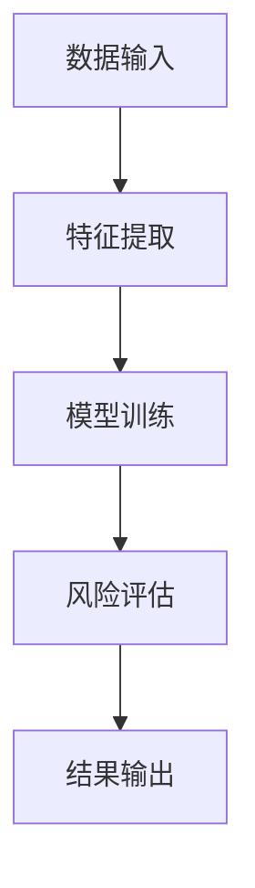
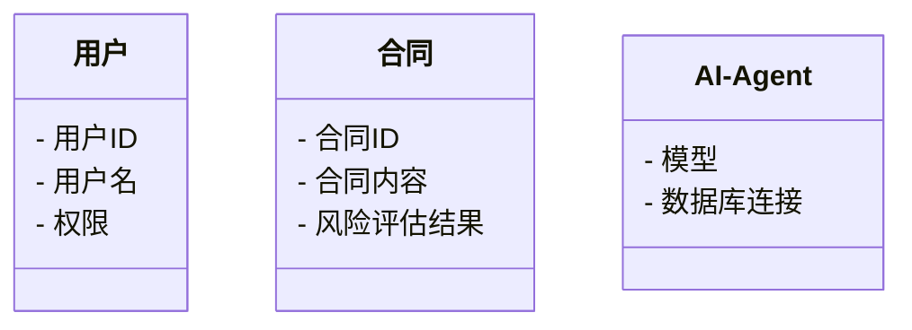
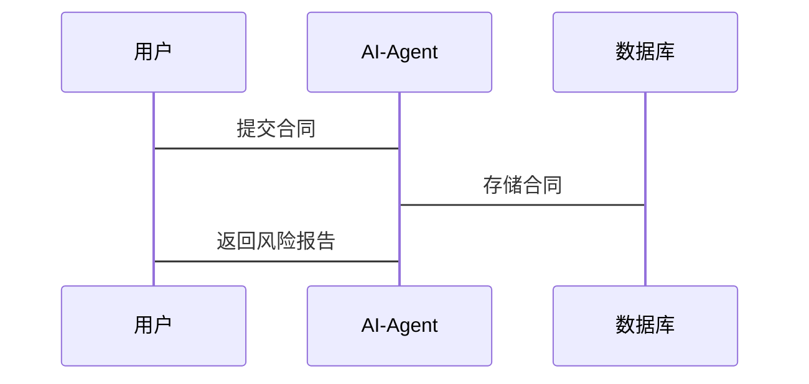

                 


# AI Agent在企业法律风险评估与合同审查中的应用

## 关键词：AI Agent, 企业法律, 风险评估, 合同审查, 人工智能, 法律科技

## 摘要：本文深入探讨AI Agent在企业法律风险评估与合同审查中的应用，分析其如何利用自然语言处理和机器学习技术提升效率和准确性。通过详细的技术解析和实际案例，展示AI Agent在法律流程中的潜力，为企业法务部门提供创新解决方案。

---

## 第1章: 背景介绍

### 1.1 问题背景
#### 1.1.1 企业法律风险的现状
企业面临日益复杂的法律环境，合同审查和风险评估是关键任务，但传统方法效率低下，容易出错。

#### 1.1.2 合同审查的痛点与挑战
合同审查耗时长、成本高，且依赖人工经验，容易遗漏风险点。

#### 1.1.3 AI技术在法律领域的应用潜力
AI技术，特别是AI Agent，能够通过自动化处理提升效率，降低人为错误。

### 1.2 问题描述
#### 1.2.1 法律风险评估的关键环节
识别合同中的潜在风险点，评估其影响，并提出改进建议。

#### 1.2.2 合同审查的复杂性
涉及多领域知识，需处理大量文本，复杂度高。

#### 1.2.3 传统方法的局限性
依赖人工经验，效率低，成本高，难以处理海量数据。

### 1.3 问题解决
#### 1.3.1 AI Agent的核心作用
通过自动化处理和智能分析，提升合同审查和风险评估的效率和准确性。

#### 1.3.2 技术如何优化法律流程
利用NLP和机器学习，自动识别关键条款，预测风险。

#### 1.3.3 提升效率与准确性的解决方案
AI Agent辅助审查，减少人为错误，提高处理速度。

### 1.4 边界与外延
#### 1.4.1 AI Agent的应用范围
适用于合同审查、风险评估等特定场景，不涵盖所有法律事务。

#### 1.4.2 与其他法律技术的区分
区别于传统法律软件，AI Agent具备学习和适应能力。

#### 1.4.3 未来的扩展方向
扩展至更多法律领域，如合规性审查和法律咨询。

### 1.5 核心概念
#### 1.5.1 AI Agent的定义与特点
AI Agent是智能代理，具备自主决策和学习能力，适用于法律场景。

#### 1.5.2 法律风险评估的关键要素
合同条款、法律条款、行业标准，识别潜在风险点。

#### 1.5.3 合同审查的流程与关键点
收集合同、分析条款、识别风险、评估影响，提出建议。

---

## 第2章: 核心概念与联系

### 2.1 AI Agent的原理
#### 2.1.1 自然语言处理（NLP）在合同审查中的应用
通过分词、实体识别和情感分析，提取关键信息。

#### 2.1.2 机器学习模型的训练与优化
使用深度学习模型，训练法律相关数据，优化识别准确率。

#### 2.1.3 知识图谱构建与法律规则的嵌入
构建法律知识图谱，嵌入法律规则，提升模型理解能力。

### 2.2 核心概念对比表
| 概念 | 特性 |
|------|------|
| AI Agent | 自动化、智能化 |
| 法律规则 | 确定性、复杂性 |

### 2.3 ER实体关系图
```mermaid
er
actor: 用户
agent: AI Agent
contract: 合同
risk: 风险点
rule: 法律规则
```

---

## 第3章: 算法原理讲解

### 3.1 算法流程


### 3.2 代码实现
```python
class AI-Agent:
    def __init__(self):
        self.model = self.train_model()

    def train_model(self):
        # 训练模型的代码
        pass

    def assess_risk(self, contract):
        return self.model.predict(contract)
```

### 3.3 数学模型
#### 损失函数
$$ L = \sum_{i=1}^{n} (y_i - \hat{y_i})^2 $$

#### 优化器
$$ \theta = \theta - \eta \frac{\partial L}{\partial \theta} $$

---

## 第4章: 系统分析与架构设计

### 4.1 问题场景介绍
企业合同审查流程复杂，依赖人工操作，效率低下。

### 4.2 项目介绍
AI Agent辅助合同审查系统，提高效率和准确性。

### 4.3 系统功能设计


### 4.4 系统架构设计


### 4.5 系统交互设计


---

## 第5章: 项目实战

### 5.1 环境安装
安装Python和相关库，如TensorFlow和spaCy。

### 5.2 核心代码实现
```python
import tensorflow as tf
from spacy.lang.zh import Chinese

class AI-Agent:
    def __init__(self):
        self.nlp = Chinese()
        self.model = self.build_model()

    def build_model(self):
        # 构建模型的代码
        pass

    def process_contract(self, text):
        doc = self.nlp(text)
        # 处理文本
        return self.analyze(doc)

    def analyze(self, doc):
        # 分析合同并返回风险评估结果
        pass
```

### 5.3 代码应用解读与分析
展示如何处理合同文本，提取关键信息，并进行风险评估。

### 5.4 实际案例分析
分析一份合同，展示AI Agent如何识别风险点并生成报告。

### 5.5 项目小结
总结项目成果，强调AI Agent的优势和未来发展方向。

---

## 第6章: 总结与展望

### 6.1 最佳实践 tips
建议企业在引入AI Agent前，确保数据质量和模型训练充分。

### 6.2 小结
AI Agent显著提升企业法律事务处理效率和准确性，是未来趋势。

### 6.3 注意事项
数据隐私和模型解释性是应用中的关键问题。

### 6.4 拓展阅读
推荐相关书籍和资源，鼓励深入研究。

---

## 作者：AI天才研究院/AI Genius Institute & 禅与计算机程序设计艺术 /Zen And The Art of Computer Programming

