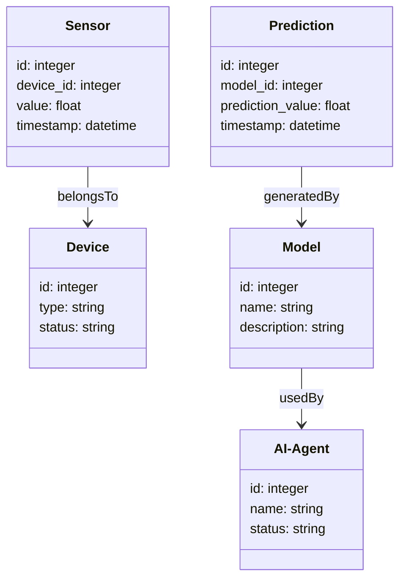
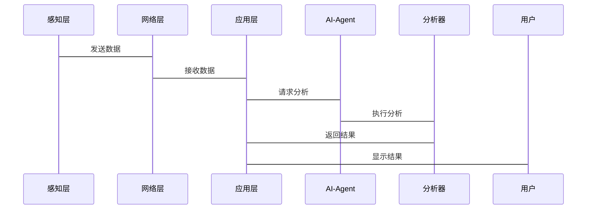

                 


# AI Agent在企业物联网数据分析中的应用前景

> 关键词：AI Agent, 物联网, 数据分析, 企业应用, 人工智能

> 摘要：本文探讨了AI Agent在企业物联网数据分析中的应用前景，从核心概念、算法原理到系统架构，再到实际案例，全面分析其在企业中的潜力和挑战。

---

## 第一部分：AI Agent与企业物联网数据分析的背景

### 第1章：AI Agent与物联网数据分析概述

#### 1.1 AI Agent的基本概念
##### 1.1.1 AI Agent的定义与特点
人工智能代理（AI Agent）是指能够感知环境并采取行动以实现目标的智能实体。其特点包括自主性、反应性、主动性、社会性和社会性。AI Agent能够通过传感器或API获取数据，并根据这些数据做出决策，主动执行任务，与外部环境和其他系统进行交互。

##### 1.1.2 物联网数据分析的背景
物联网（IoT）是指通过各种信息传感设备，如传感器、射频识别（RFID）、全球定位系统（GPS）、红外感应器等，按约定的协议，把任何物品与互联网连接起来，进行信息交换和通信。物联网数据分析是通过对这些数据的收集、处理和分析，提取有价值的信息，帮助企业和组织做出更明智的决策。

##### 1.1.3 AI Agent在企业物联网中的应用前景
随着物联网设备的普及和数据量的激增，企业需要更高效的方式来处理和分析数据。AI Agent通过自动化和智能化的方式，能够实时处理物联网数据，提供实时反馈和决策支持，从而提升企业的运营效率和竞争力。AI Agent在企业物联网中的应用前景广阔，尤其是在智能制造、智慧城市、医疗健康等领域。

#### 1.2 企业物联网的体系结构
##### 1.2.1 物联网的基本组成
物联网系统通常由感知层、网络层和应用层组成。感知层负责数据的采集和初步处理，网络层负责数据的传输，应用层负责数据的存储、分析和应用。

##### 1.2.2 企业物联网的关键技术
企业物联网的关键技术包括传感器技术、数据通信技术、数据存储与管理技术、数据分析与挖掘技术以及安全技术。

##### 1.2.3 物联网数据分析的重要性
物联网数据分析是企业物联网系统的核心，它能够帮助企业发现数据中的模式和趋势，支持预测性维护、智能监控、优化运营等应用场景。

---

### 第2章：AI Agent与物联网数据分析的核心概念

#### 2.1 AI Agent的核心原理
##### 2.1.1 AI Agent的智能决策机制
AI Agent通过感知环境、理解数据、分析数据、制定策略、执行行动和反馈优化的循环过程，实现智能化决策。AI Agent能够根据实时数据调整策略，优化行动结果。

##### 2.1.2 事件驱动的处理流程
AI Agent在物联网环境中通常是事件驱动的，能够实时响应各种事件，如传感器触发的警报、系统状态的变化等。通过事件驱动的方式，AI Agent能够快速响应，提升系统的实时性和响应速度。

##### 2.1.3 多模态数据的融合分析
物联网环境中的数据通常是多模态的，包括结构化数据（如传感器读数）、文本数据（如日志信息）和图像数据（如监控视频）。AI Agent需要能够整合和分析这些多模态数据，提供更全面的分析结果。

#### 2.2 物联网数据分析的关键技术
##### 2.2.1 数据采集与预处理
物联网数据采集需要考虑数据的实时性、准确性和完整性。数据预处理包括数据清洗、数据转换、数据标准化等步骤，确保数据质量。

##### 2.2.2 数据存储与管理
物联网数据量大、类型多样，需要高效的数据存储和管理系统。常用的技术包括关系型数据库、NoSQL数据库、大数据平台（如Hadoop、Spark）等。

##### 2.2.3 数据分析与挖掘
数据分析与挖掘是物联网系统的核心，包括统计分析、机器学习、深度学习等多种技术。通过数据分析，可以发现数据中的规律和趋势，支持决策。

#### 2.3 AI Agent与物联网数据分析的结合
##### 2.3.1 数据驱动的决策优化
AI Agent通过实时分析物联网数据，优化决策过程。例如，在智能制造中，AI Agent可以根据实时传感器数据优化生产流程，减少浪费。

##### 2.3.2 实时监控与异常检测
AI Agent可以通过实时监控物联网设备的状态，检测异常情况，并及时采取措施。例如，在智能电网中，AI Agent可以实时监控电力设备的运行状态，及时发现并处理故障。

##### 2.3.3 智能预测与推荐系统
AI Agent可以通过历史数据和实时数据，利用机器学习模型进行预测和推荐。例如，在零售业中，AI Agent可以根据顾客的购买行为和历史数据，推荐个性化的产品。

---

## 第三部分：AI Agent在企业物联网数据分析中的应用

### 第3章：AI Agent在物联网数据分析中的核心算法

#### 3.1 数据预处理算法
##### 3.1.1 数据清洗与标准化
数据清洗是去除噪声和冗余数据的过程。标准化是将数据转换到相同的尺度，例如使用Z-score标准化或Min-Max标准化。

##### 3.1.2 时间序列数据的处理
时间序列数据是物联网系统中常见的数据类型。处理时间序列数据需要考虑趋势、周期性和随机性。常用的方法包括移动平均法、指数平滑法和ARIMA模型。

##### 3.1.3 异常数据的识别与处理
异常检测是数据预处理的重要步骤。常用的方法包括基于统计的方法（如Z-score）、基于机器学习的方法（如孤立森林）和基于深度学习的方法（如LSTM网络）。

#### 3.2 特征提取与选择
##### 3.2.1 基于统计的方法
统计方法包括方差分析、相关分析等，用于筛选重要的特征。

##### 3.2.2 基于机器学习的方法
机器学习方法如主成分分析（PCA）和线性判别分析（LDA）可以用来降维和提取特征。

##### 3.2.3 基于深度学习的方法
深度学习方法如自动编码器和卷积神经网络（CNN）可以自动提取高层次特征。

#### 3.3 模型训练与优化
##### 3.3.1 监督学习模型
监督学习模型包括线性回归、支持向量机（SVM）、随机森林和神经网络等。这些模型可以用于回归和分类任务。

##### 3.3.2 无监督学习模型
无监督学习模型包括聚类分析（如K-means、DBSCAN）和主题模型（如LDA）。这些模型可以用于数据聚类和主题提取。

##### 3.3.3 模型调优与评估
模型调优包括参数调整和交叉验证。评估指标包括准确率、召回率、F1分数和AUC值。

---

### 第4章：AI Agent的算法实现与数学模型

#### 4.1 数据预处理的数学模型
##### 4.1.1 数据标准化公式
$$ x' = \frac{x - \mu}{\sigma} $$
其中，$\mu$是均值，$\sigma$是标准差。

##### 4.1.2 时间序列平滑模型
$$ S_t = \alpha x_t + (1-\alpha)S_{t-1} $$
其中，$\alpha$是平滑因子，$x_t$是当前时刻的观测值，$S_{t-1}$是前一时刻的平滑值。

#### 4.2 特征提取的算法实现
##### 4.2.1 主成分分析（PCA）
PCA是一种降维技术，通过正交变换将原始变量转换为少数几个主成分，这些主成分能够保留原始数据的大部分方差。

$$ \text{主成分} = X^T X \text{的特征向量} $$

#### 4.3 模型训练的数学公式
##### 4.3.1 线性回归模型
线性回归是一种统计建模技术，用于预测目标变量与一个或多个预测变量之间的关系。

$$ y = \beta_0 + \beta_1 x_1 + \beta_2 x_2 + \dots + \beta_n x_n + \epsilon $$

---

### 第5章：系统分析与架构设计方案

#### 5.1 问题场景介绍
企业物联网系统通常需要实时监控设备状态、预测设备故障、优化生产流程等。AI Agent在这些场景中可以发挥重要作用。

#### 5.2 系统功能设计
##### 5.2.1 领域模型
领域模型描述了系统的功能和交互。以下是领域模型的Mermaid类图：



##### 5.2.2 系统架构设计
以下是系统架构的Mermaid架构图：

```mermaid
archiecture
    partitions
        Perception: 包含传感器和数据采集模块
        Network: 包含数据传输和通信模块
        Application: 包含数据存储、分析和应用模块
    components
        Sensor: 数据采集
        Gateway: 数据传输
        Database: 数据存储
        Analyzer: 数据分析
        AI-Agent: 智能代理
```

##### 5.2.3 系统接口设计
以下是系统接口的Mermaid序列图：



---

### 第6章：项目实战

#### 6.1 环境安装
##### 6.1.1 安装Python和必要的库
需要安装Python 3.6及以上版本，并安装以下库：
- `pandas`：数据处理
- `numpy`：数值计算
- `scikit-learn`：机器学习
- `tensorflow`：深度学习
- `mermaid.py`：生成图表

##### 6.1.2 安装物联网设备模拟工具
可以使用Raspberry Pi和传感器模拟设备数据。

#### 6.2 系统核心实现源代码
##### 6.2.1 数据采集模块
```python
import time
import requests

def collect_data():
    # 模拟传感器数据
    data = {
        'temperature': 25 + (1 if time.time() % 1 else -1),
        'humidity': 60 + (2 if time.time() % 2 else -2),
        'pressure': 1013 + (3 if time.time() % 3 else -3)
    }
    return data
```

##### 6.2.2 数据分析模块
```python
from sklearn.ensemble import RandomForestRegressor
import numpy as np
import pandas as pd

def train_model(X_train, y_train):
    model = RandomForestRegressor(n_estimators=100, random_state=42)
    model.fit(X_train, y_train)
    return model

# 示例数据
X_train = np.random.rand(100, 3)
y_train = np.random.rand(100)

model = train_model(X_train, y_train)
```

##### 6.2.3 AI Agent实现
```python
from datetime import datetime

class AI-Agent:
    def __init__(self):
        self.status = "idle"

    def receive_event(self, event):
        if event['type'] == 'sensor_data':
            self.analyze_data(event['data'])
        elif event['type'] == 'prediction_request':
            self.predict(event['params'])

    def analyze_data(self, data):
        # 数据分析逻辑
        pass

    def predict(self, params):
        # 预测逻辑
        pass
```

#### 6.3 代码应用解读与分析
##### 6.3.1 数据采集模块
数据采集模块通过模拟传感器数据，展示了如何获取实时数据。这些数据可以是来自真实传感器的实时数据，也可以是模拟数据，用于测试和开发。

##### 6.3.2 数据分析模块
数据分析模块使用随机森林回归模型进行训练。通过训练模型，AI Agent可以预测未来的数据趋势，帮助做出决策。

##### 6.3.3 AI Agent实现
AI Agent实现了接收事件、处理事件和响应事件的逻辑。通过订阅不同的事件类型，AI Agent可以在收到传感器数据或预测请求时，触发相应的分析和预测逻辑。

#### 6.4 实际案例分析
##### 6.4.1 制造业中的预测性维护
通过AI Agent分析设备传感器数据，预测设备的故障风险，提前进行维护，减少停机时间。

##### 6.4.2 零售业中的个性化推荐
通过分析顾客的行为数据，AI Agent可以推荐个性化的产品，提升顾客满意度和销售额。

#### 6.5 项目小结
通过项目实战，我们可以看到AI Agent在企业物联网数据分析中的巨大潜力。通过实际案例分析，我们验证了AI Agent在不同场景下的应用效果，并总结了实际应用中的经验和教训。

---

## 第四部分：总结与展望

### 第7章：总结与展望

#### 7.1 最佳实践 tips
- 数据预处理是关键，确保数据质量和完整性。
- 在选择算法时，考虑数据类型和任务需求。
- 系统设计时，注重模块化和可扩展性。

#### 7.2 小结
本文全面探讨了AI Agent在企业物联网数据分析中的应用前景，从核心概念、算法原理到系统架构，再到实际案例，详细分析了其在企业中的潜力和挑战。

#### 7.3 注意事项
- 数据隐私和安全是需要重点关注的问题。
- 系统的实时性和响应速度需要优化。
- 模型的可解释性和透明性需要提升。

#### 7.4 拓展阅读
- 《机器学习实战》
- 《深度学习》
- 《物联网技术与应用》

---

作者：AI天才研究院 & 禅与计算机程序设计艺术

